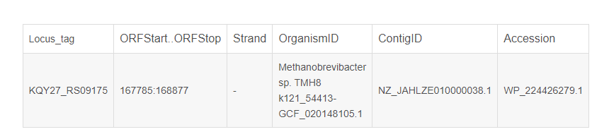

# FNA
xuruizhi@DESKTOP-HI65AUV:/mnt/d/plasmid/data/RefSeq$ gzip -d -c plasmid.1.1.genomic.fna.gz | head -n 20
>NZ_D13972.1 Synechococcus sp. PCC 7002 strain PR-6 plasmid Plasmid pAQ1, complete sequence
CCTTAACTCACTGTGATCGTATCAGATAATTTTACATCTAGCAGTAATACCGGGGCAGATTTAGCGAGTAGCGTCAGTGA
GAACCGTTCTCATTTTATCGCAGAATCTCACTATAGGGAATGGGTAGAGGGTTCCGGGGTCGCCCCTGAGATTGCCCGGT
TAAATGTTAGATCGTTGTCAGGGATGACGCCCTATGAATACCTGCTCTACAGTGATGAGCCAGCATTACGCCGCAATGAT
GGCAGGCTTCGGGATACTTGGCTTAAGCGATATGCCTTTGTCGAGCATGGCGGTTGGTGGTGCTCAGGCATCGATATTAA
GACCGGGAAAGATTCTCTTTGGGGTTGCTTCAAAGGCGATCGCCCCCGTAAAGATCGCGAAGATAAGAAACCGATCAAGT
ATGAGCACCCGCCACGGGTAGCCACCGAAATTTTCACTCTCAAGGTAGACCGGGGCACCTGGCGCAAGATTGCCAAGCGC
CACAAAGTCGAGCTACCAGAAACCGATCAAGGCTTCTGGGAATGGGTACTAGCCCATCCTGAGCTACCGATCATCATCAC
TGAGGGCGCGAAGAAGGCAGGGGCCCTCCTAACCGCTGGTTATTGCGCCATCGGTCTACCGGGGATTTACAACGGCTACA
GAACGCCAAAAAATGACCATGGCGAGCCAATGCGACAGCTACGGCACCTCATTCCAGAGCTTGACCTGTTGGCGAAAAAT
AACCGGGCGATCGCCTTCTGTTTTGACCAAGACAAGAAACCCAAGACGATCAAGGCAGTGAACGGGGCGATCCAAACTAC
CGGGGCACTCCTAGAGAAGGCCGGGGCGAAAGTATCGGTGATCACCTGGCACCAGGACGCGAAAGGTGTTGATGATCTGA
TCGTCGAGCACGGAGCGAAAGCACTCCATAACCGCTACAAGCACCGCAAGCCCTTAGCAGTCTGGGAGATGGATAATCTC
ACCGATATCACCACGCAAGTCGATCTAACGGTCGATCAGCGCTATCTCGACATCGATCCGCGTGCTATCCCCAAGGATGC
TCAGATTATTTTCATTAAATCTGCCAAGGGCACCGGGAAAACAGAATGGTTAGGGAAAATCGTTAAGCTCGCCCAAGATG
ATTGCGCTCGCGTACTGGTTTTGACTCACCGCATCCAATTAGCCAAGGAGCTCGCCCGCCGTCTCGATATCGATCACATT
AGCGAGCTCGACAGTAGCCCGACCGGGGGCGCTCTAGGGATGGCGATGTGTATCGATAGCCTACATCCCGATAGCCAAGC
TCATTTTAATTTCATGGAATGGCACGGCGCTCACATTGTCCTAGACGAAATCGAGCAAGTTTTAGGGCACGCTTTGGGTA
GCTCGACCTGTACCCAAGACCGGGCGAAAATCCTTGAAACGTTCTACAACCTAATCCTTTATGCCCTAAGGACAGGCGGA
AAACTCTACTGCTCTGATGCTGATTTATCTCCCATCTCCTATGAGCTAATCAAGTACATTCTTGACGGTTGTGAGTTCAA

# FAA
xuruizhi@DESKTOP-HI65AUV:/mnt/d/plasmid/data/RefSeq$ gzip -d -c plasmid.1.protein.faa.gz | head -n 20
>YP_008219070.1 Putative uncharacterized protein (plasmid) [Clostridium chauvoei]
MKNMANRERKIYTLSKKNVDYIEEIKEKRDLKYNSEAVDFIIREHKLIQIRLQKL
>YP_008219071.1 Putative uncharacterized protein (plasmid) [Clostridium chauvoei]
MDLTINKEVINLLTNQLKEKDIQLKEKDKQIAELHKLIENSQILLKEEQKKSDQQLYLADHFEEVDNKLQDLRDKMEQKR
NEKKD
>NP_052604.1 plasmid mobilization (plasmid) [Escherichia coli O157:H7 str. Sakai]
MTKRSGSNTRRRAISRPVRLTAEEDQEIRKRAAECGKTVSGFLRAAALGKKVNSLTDDRVLKEVMRLGALQKKLFIDGKR
VGDREYAEVLIAITEYHRALLSRLMAD
>NP_052605.1 hypothetical protein pOSAK1_02 (plasmid) [Escherichia coli O157:H7 str. Sakai]
MKKDKKYQIEAIKNKDKTLFIVYATDIYSPSEFFSKIESDLKKKKSKGDVFFDLIIPNGGKKDRYVYTSFNGEKFSSYTL
NKVTKTDEYNDLSELSASFFKKNFDKINVNLLSKATSFALKKGIPI
>NP_052606.1 hypothetical protein pOSAK1_03 (plasmid) [Escherichia coli O157:H7 str. Sakai]
MAQNPFKALNINIDKIESALTQNGVTNYSSNVKNERETHISGTYKGIDFLIKLMPSGGNTTIGRASGQNNTYFDEIALII
KENCLYSDTKNFEYTIPKFSDDDRANLFEFLSEEGITITEDNNNDPNCKHQYIMTTSNGDRVRAKIYKRGSIQFQGKYLQ
IASLINDFMCSILNMKEIVEQKNKEFNVDIKKETIESELHSKLPKSIDKIHEDIKKQLSCSLIMKKIDVEMEDYSTYCFS
ALRAIEGFIYQILNDVCNPSSSKNLGEYFTENKPKYIIREIHQETINGEIAEVLCECYTYWHENRHGLFHMKPGIADTKT
INKLESIAIIDTVCQLIDGGVARLKL
>NP_858134.1 IS2 ORF2 (plasmid) [Shigella flexneri 2a str. 301]
MVHATELMKHASSPGCWDFVEPKNTAVRSPESNRIAKSFVKTIKCDYISIMPKPDGLTAAKNLAEAFEHYNEWHPHSALD
YRSPREYLRQRANDNRCLEI


# GBFF

enomic.gbff内容：  

```
 cat genomic.gbff |  head -n 60
LOCUS       NZ_CP071010           337179 bp    DNA     circular CON 11-MAR-2022
DEFINITION  Enterobacter hormaechei strain RIVM_C034192 plasmid
            pRIVM_C034192_1, complete sequence.
ACCESSION   NZ_CP071010
VERSION     NZ_CP071010.1
DBLINK      BioProject: PRJNA224116
            BioSample: SAMN17615676
            Assembly: GCF_017161605.1
KEYWORDS    RefSeq.
SOURCE      Enterobacter hormaechei
  ORGANISM  Enterobacter hormaechei
            Bacteria; Proteobacteria; Gammaproteobacteria; Enterobacterales;
            Enterobacteriaceae; Enterobacter; Enterobacter cloacae complex.
REFERENCE   1  (bases 1 to 337179)
  AUTHORS   Hendrickx,A.P.A., Landman,F., de Haan,A., Witteveen,S., van
            Santen-Verheuvel,M. and Schouls,L.M.
  TITLE     A genetic cluster of multidrug-resistant Enterobacter cloacae
            complex ST78 harboring a plasmid containing blaVIM-1 and mcr-9 in
            the Netherlands
  JOURNAL   Unpublished
REFERENCE   2  (bases 1 to 337179)
  AUTHORS   Hendrickx,A.P.A., Landman,F., de Haan,A., Witteveen,S., van
            Santen-Verheuvel,M. and Schouls,L.M.
  TITLE     Direct Submission
  JOURNAL   Submitted (24-FEB-2021) Bacterial Surveillance and Response,
            National Institute for Public Health and the Environment, Antoni
            van Leeuwenhoeklaan 9, Bilthoven 3721 MA, Netherlands
COMMENT     REFSEQ INFORMATION: The reference sequence is identical to
            CP071010.1.
            The annotation was added by the NCBI Prokaryotic Genome Annotation
            Pipeline (PGAP). Information about PGAP can be found here:
            https://www.ncbi.nlm.nih.gov/genome/annotation_prok/

            ##Genome-Assembly-Data-START##
            Assembly Method        :: Unicycler v. 0.4.4
            Genome Representation  :: Full
            Expected Final Version :: Yes
            Genome Coverage        :: 30x
            Sequencing Technology  :: Oxford Nanopore MiniION
            ##Genome-Assembly-Data-END##

            ##Genome-Annotation-Data-START##
            Annotation Provider               :: NCBI RefSeq
            Annotation Date                   :: 03/11/2022 12:24:48
            Annotation Pipeline               :: NCBI Prokaryotic Genome
                                                 Annotation Pipeline (PGAP)
            Annotation Method                 :: Best-placed reference protein
                                                 set; GeneMarkS-2+
            Annotation Software revision      :: 6.0
            Features Annotated                :: Gene; CDS; rRNA; tRNA; ncRNA;
                                                 repeat_region
            Genes (total)                     :: 4,878
            CDSs (total)                      :: 4,756
            Genes (coding)                    :: 4,675
            CDSs (with protein)               :: 4,675
            Genes (RNA)                       :: 122
            rRNAs                             :: 9, 8, 8 (5S, 16S, 23S)
            complete rRNAs                    :: 9, 8, 8 (5S, 16S, 23S)
            tRNAs                             :: 91
            ncRNAs                            :: 6
```
[参考文章](https://blog.csdn.net/LSD_1943/article/details/125776832)
  
```
1、 LOCUS（代码）序列的功能、序列长度、类型、种属来源、录入日期

2、 DEFINITION（说明）所含的生物学意义的总结性描述

3、 ACCESSION（编号）具有唯一性和永久性
https://www.jianshu.com/p/f510c19ea0b2 介绍的很清楚

4、 VERSION（版本号）检索号、版本号

5、 KEYWORDS（关键词）描述序列，“ . ”表示没有任何描述内容

6、 SOURCE（数据来源）序列来源生物的简称，或分子类型
7、 REFERENCE （文献）与该数据有关的参考文献，按发表时间排名

8、 FEATURES（特性表）描述基因和基因的产物，以及与序列相关的生物学特性，其中包括
a. 特性关键词(Feature key) 简要说明功能组的关键词
b. 特性位置(Location) 指明在特性表中的什么地方找到相关特性
c. 限定词(Qualifiers) 相关特性的辅助信息

9、 ORIGIN（碱基排列顺序）类似于FASTA格式给出了所记录的序列
```
* ACCESSION（编号）:  
```
1）AC_***：genomic mixed，一些可供选择的注释的基因组序列，主要用来标记病毒和原核生物；

2）AP_***：protein mixed，AC_标记序列对应的蛋白产物；

3）NC_***：genomic mixed，完整的基因组分子序列，标记的类别包括基因组、染色体、细胞器、质粒；

4）NG_***：genomic mixed，不完整的基因组区域，提供NCBI基因组注释途径。比较有代表性有不转录的假基因或者哪些很难自行化注释的基因组簇；

5）NM_***：mRNA mixed，转录组产物序列；成熟mRNA转录本序列；

6）NP_***：protein mixed，蛋白产物；主要是全长转录氨基酸序列，但也有一些只有部分蛋白质的部分氨基酸序列；

7）NR_***：RNA mixed，非编码的转录子序列，包括结构RNAs，假基因转子等；

8）NT_***：genomic automated，BAC或者鸟枪测序法的还未完全注释的测序序列；

9）NW_***：genomic automated，BAC或者鸟枪法测序的还未完全注释的测序序列；

10）NZ_ABCD1234***：genomic automated，收集的各种利用鸟枪法测序的测序计划，ABCD​代表的是计划名称；

11）​XM_***：mRNA automated，转录产物；mRNA来自基因组注释，序列相当于基因组重叠群；

12）XP_***：protein automated，蛋白产物；序列相当于基因组重叠群；

13）XR：RNA automated，转录产物；非编码区来自基因组注释，序列相当于基因组重叠群；

14）YP_***：protein mixed，蛋白产物；不涉及到转录组，主要用来标记细菌、病毒和线粒体；

15）ZP_***：protein automated，蛋白产物​；主要是用电脑自动注释；

16）NS_***：genomic automated，未知生物分子基因组序列。

```


# GPFF
xuruizhi@DESKTOP-HI65AUV:/mnt/d/plasmid/data/RefSeq$ gzip -d -c plasmid.1.protein.gpff.gz | head -n 20
LOCUS       YP_008219070              55 aa            linear   CON 18-DEC-2014
DEFINITION  Putative uncharacterized protein (plasmid) [Clostridium chauvoei].推定的未表征蛋白质
ACCESSION   YP_008219070
VERSION     YP_008219070.1
DBLINK      BioProject: PRJNA212308
DBSOURCE    REFSEQ: accession NC_021737.1
KEYWORDS    RefSeq.
SOURCE      Clostridium chauvoei
  ORGANISM  Clostridium chauvoei
            Bacteria; Firmicutes; Clostridia; Clostridiales; Clostridiaceae;
            Clostridium.
REFERENCE   1
  AUTHORS   Falquet,L., Calderon-Copete,S.P. and Frey,J.
  TITLE     Draft genome sequence and toxins identification of the virulent
            Clostridium chauvoei reference strain JF4335
  JOURNAL   Unpublished
REFERENCE   2  (residues 1 to 55)
  CONSRTM   NCBI Genome Project
  TITLE     Direct Submission
  JOURNAL   Submitted (16-JUL-2013) National Center for Biotechnology
