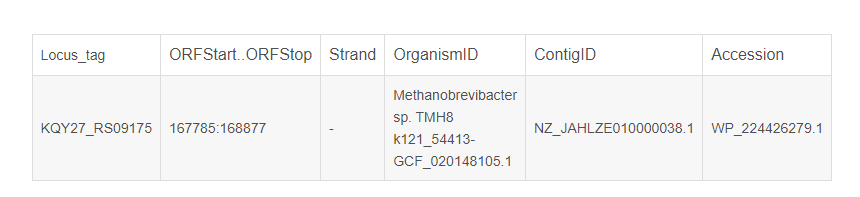

# Classifying Plasmids

[TOC levels=1-3]: # ""

- [Classifying Plasmids](#classifying-plasmids)
  - [NCBI RefSeq](#ncbi-refseq)
  - [MinHash to get non-redundant plasmids](#minhash-to-get-non-redundant-plasmids)
  - [Grouping by MinHash](#grouping-by-minhash)
  - [Plasmid: prepare](#plasmid-prepare)
  - [Plasmid: run](#plasmid-run)


# NCBI RefSeq
1. 下载raw数据  

```bash
mkdir -p /mnt/d/plasmid
cd /mnt/d/plasmid/data

rsync -avP ftp.ncbi.nlm.nih.gov::refseq/release/plasmid/ RefSeq/
# -a 这是归档模式，表示以递归方式传输文件，并保持所有属性，它等同于-r、-l、-p、-t、-g、-o、-D 选项。
# -a 选项后面可以跟一个 --no-OPTION，表示关闭 -r、-l、-p、-t、-g、-o、-D 中的某一个，比如-a --no-l 等同于 -r、-p、-t、-g、-o、-D 选项。   
# -v  表示打印一些信息，比如文件列表、文件数量等。
# -P  显示文件传输的进度信息。(实际上"-P"="--partial --progress"，其中的"--progress"才是显示进度信息的)。
# 使用 wget 下载，常常出现压缩包损坏的情况

```


RefSeq 是具有生物意义上的非冗余的基因和蛋白质序列。  
进程：
```bash
Welcome to the NCBI rsync server.


receiving incremental file list
created directory RefSeq
plasmid.10.genomic.gbff.gz
     80,758,532 100%    7.89MB/s    0:00:09 (xfr#1, to-chk=0/1)

sent 43 bytes  received 80,778,363 bytes  4,366,400.32 bytes/sec
total size is 80,758,532  speedup is 1.00
```
本`ftp.ncbi.nlm.nih.gov::refseq/release/plasmid/`页面内容:    

  

* FNA：具有FNA 文件扩展名的文件是FASTA格式DNA和蛋白质序列比对文件，其存储可被分子生物学软件使用的DNA信息。FNA文件具体可用于保存核酸信息，而其他FASTA格式包含其他DNA相关信息，如FASTA，FAS，FA，FFN，FAA，FRN，MPFA，SEQ，NET或AA文件扩展名。  
```bash
# FNA
xuruizhi@DESKTOP-HI65AUV:/mnt/d/plasmid/data/RefSeq$ gzip -d -c plasmid.11.1.genomic.fna.gz | head -n 20
>NZ_CP016831.1 Xanthomonas fragariae isolate Fap21 plasmid pFap21-1, complete sequence
GACCTGAAACACGACGCGGATACCTGTATTCGCAGGGCTGCGCGTGTTGCAAGTTATGGTCGCATGTCGCATAATACTTG
CGACATAACTTGCGACGTTACGGAGGCCTCATGCAGCAGTGCACCTATGAAATCGAGCCGCGCCCGATCGATCTGGGCGG
TGGCTGGCGATTGCGCCTTCTACAGGACGGCGAAGAGGTTGGCGGCGGCGTATTCCCTCTGGCCGAGGGCGCGGAGGATG

# FAA
xuruizhi@DESKTOP-HI65AUV:/mnt/d/plasmid/data/RefSeq$ gzip -d -c plasmid.11.protein.faa.gz | head -n 10
>YP_010316545.1 putative serine recombinase (chloroplast) [Haslea ostrearia]
MFEEIPKNCRYAYARVSSKSQEDNSSLEAQKDEFLRLGVPVKNIRVEVGSAANKIQDRPVFYNLIDDELKEKDLLLVTKI
DRCSRNTLEFLKLQERLHKKGVTFLSLDLPYSNDIAVNQLISTNLAAIATFENERRKDRQRQGIQAAKKNGKYLGRRTVI
DKKLISQVQDLKENKNLSITEIAKVTGRGRTTIYKVLKEELDYIPYNRLVKKVNQEAVNEGK
>YP_010316546.1 hypothetical protein MRV93_pgp2 (chloroplast) [Haslea ostrearia]
MKENKLTFQSEIFQIHYLTLNLQFNDLKRIKKIADYFSNTFDCNSVFIDCKNSTQNCTLVKKERSLSKAEFRVNSQKYWY
```
* gbff：GBFF是GenBank数据库的基本信息单位。GBFF序列文件由单个的序列条目组成。
序列条目由字段组成，每个字段由关键字起始，后面为该字段的具体说明。字段分若干次子字段，以次关键字或特性表说明符开始。每个序列条目以双斜杠“//*作结束标记
```bash

#gbff
$ gzip -d -c plasmid.11.genomic.gbff.gz | head -n 20
LOCUS       NZ_CP016831            29232 bp    DNA     circular CON 27-MAR-2022
DEFINITION  Xanthomonas fragariae isolate Fap21 plasmid pFap21-1, complete
            sequence.
ACCESSION   NZ_CP016831
VERSION     NZ_CP016831.1
DBLINK      BioProject: PRJNA224116
            BioSample: SAMN05505397
            Assembly: GCF_001705565.1
KEYWORDS    RefSeq.
SOURCE      Xanthomonas fragariae
  ORGANISM  Xanthomonas fragariae
            Bacteria; Proteobacteria; Gammaproteobacteria; Xanthomonadales;
            Xanthomonadaceae; Xanthomonas.
REFERENCE   1  (bases 1 to 29232)
  AUTHORS   Henry,P.M. and Leveau,J.H.J.
  TITLE     First Complete Genome of Xanthomonas fragariae, Cause of Angular
            Leaf Spot of Strawberry
  JOURNAL   Unpublished
REFERENCE   2  (bases 1 to 29232)
  AUTHORS   Henry,P.M. and Leveau,J.H.J.
  TITLE     Direct Submission
  JOURNAL   Submitted (04-AUG-2016) Plant Pathology, University of California
            at Davis, One Shields Ave., Davis, CA 95616, USA
COMMENT     REFSEQ INFORMATION: The reference sequence is identical to
            CP016831.1.
            Source DNA/bacteria can be obtained from Dr. Johan Leveau, UC Davis
            Dept. Plant Pathology, 1 Shields Ave. Davis, CA 95616.
            The annotation was added by the NCBI Prokaryotic Genome Annotation
            Pipeline (PGAP). Information about PGAP can be found here:
            https://www.ncbi.nlm.nih.gov/genome/annotation_prok/

            ##Genome-Assembly-Data-START##
            Assembly Method       :: smrtanalysis v. 2.2.0
            Genome Coverage       :: 120x
            Sequencing Technology :: PacBio RSII
            ##Genome-Assembly-Data-END##

            ##Genome-Annotation-Data-START##
            Annotation Provider               :: NCBI RefSeq
            Annotation Date                   :: 03/27/2022 15:08:41
            Annotation Pipeline               :: NCBI Prokaryotic Genome
                                                 Annotation Pipeline (PGAP)
            Annotation Method                 :: Best-placed reference protein
                                                 set; GeneMarkS-2+
            Annotation Software revision      :: 6.0
            Features Annotated                :: Gene; CDS; rRNA; tRNA; ncRNA;
                                                 repeat_region
            Genes (total)                     :: 4,036
            CDSs (total)                      :: 3,892
            Genes (coding)                    :: 3,227
# CONTIG      join(CP032615.1:1..26350)
# //
# LOCUS       NZ_KP289281           108845 bp    DNA     circular CON 17-JUL-2021

# bpff
$ gzip -d -c plasmid.11.protein.gpff.gz | head -n 50
LOCUS       YP_010316545             222 aa            linear   PLN 31-MAR-2022
DEFINITION  putative serine recombinase (chloroplast) [Haslea ostrearia].
ACCESSION   YP_010316545
VERSION     YP_010316545.1
DBLINK      BioProject: PRJNA819709
DBSOURCE    REFSEQ: accession NC_061749.1
KEYWORDS    RefSeq.
SOURCE      chloroplast Haslea ostrearia
  ORGANISM  Haslea ostrearia
            Eukaryota; Sar; Stramenopiles; Ochrophyta; Bacillariophyta;
            Bacillariophyceae; Bacillariophycidae; Naviculales; Naviculaceae;
            Haslea.
REFERENCE   1  (residues 1 to 222)
  AUTHORS   Dabek,P., Gastineau,R., Bornman,T.G. and Witkowski,A.
  TITLE     Organellar genomes of Haslea ostrearia from South Africa
  JOURNAL   Unpublished
REFERENCE   2  (residues 1 to 222)
  CONSRTM   NCBI Genome Project
  TITLE     Direct Submission
  JOURNAL   Submitted (31-MAR-2022) National Center for Biotechnology
            Information, NIH, Bethesda, MD 20894, USA
REFERENCE   3  (residues 1 to 222)
  AUTHORS   Dabek,P., Gastineau,R., Bornman,T.G. and Witkowski,A.
  TITLE     Direct Submission
  JOURNAL   Submitted (03-FEB-2021) Institute of Marine and Environmental
            Sciences, University of Szczecin, Ul. Mickiewicza, Szczecin, aucune
            70-383, Pologne
COMMENT     PROVISIONAL REFSEQ: This record has not yet been subject to final
            NCBI review. The reference sequence is identical to UKC63229.
            Method: conceptual translation.
FEATURES             Location/Qualifiers
     source          1..222
                     /organism="Haslea ostrearia"
                     /organelle="plastid:chloroplast"
                     /strain="SZCZP1883"
                     /isolation_source="Kei River Mouth"
                     /db_xref="taxon:67476"
                     /plasmid="pHOZA1"
                     /country="South Africa"
                     /lat_lon="32.684644 S 28.380611 E"
                     /collection_date="13-Nov-2018"
     Protein         1..222
                     /product="putative serine recombinase"
                     /calculated_mol_wt=25443
     CDS             1..222
                     /gene="serC"
                     /locus_tag="MRV93_pgp1"
                     /coded_by="NC_061749.1:1..669"
                     /transl_table=11
                     /db_xref="GeneID:71451240"
```


2. 处理gbff文件：注释文件    

```bash
cd /mnt/d/plasmid/data/
gzip -dcf RefSeq/*.genomic.gbff.gz > genomic.gbff
# 对genome内容解压，全部*.genomic.gbff.gz都解压到一个文件中  
# gzip -d 解开压缩文件； -c 把压缩后的文件输出到标准输出设备，不去更动原始文件; 
# -f 强行压缩文件。不理会文件名称或硬连接是否存在以及该文件是否为符号连接。


perl ~/Scripts/withncbi/taxon/gb_taxon_locus.pl genomic.gbff > refseq_id_seq.csv
# Locus (基因座)，又称座位。基因在染色体上所占的位置。在分子水平上，是有遗传效应的DNA序列。
# 一个基因座可以是一个基因，一个基因的一部分，或具有某种调控作用的DNA序列。
# 统计gbff共有多少个seq，和具有ncbi编号+taxon标识符共有多少个
rm genomic.gbff
```

3. genomic.fna 文件: FNA 文件是FASTA格式DNA和蛋白质序列比对文件，其存储可被分子生物学软件使用的DNA信息
```bash
gzip -dcf RefSeq/plasmid.1.1.genomic.fna.gz |
    grep "^>" |
    head -n 5
# 有时候网页文件更新不同步，gbff更新了而fna还没有，筛选出该文件中文件名称的前五行,refseq_id_seq.csv文件内容应该和FNA一致

#>NZ_D13972.1 Synechococcus sp. PCC 7002 strain PR-6 plasmid Plasmid pAQ1, complete sequence
>NZ_Y18549.1 Escherichia coli strain K5533 plasmid pColK-JA533, complete sequence
>NZ_U51470.1 Pasteurella multocida plasmid unnamed, complete sequence
>NZ_M10917.1 Bacillus thuringiensis plasmid unnamed, complete sequence
>NZ_U40997.1 Listeria monocytogenes strain BM4293 plasmid pIP823, complete sequence


#计算N50，统计fna的一些基础数据
faops n50 -S -C RefSeq/*.genomic.fna.gz
#N50     209488
#S       4158684992     -S 计算所有条目的大小总和
#C       43857          -C 计算条目数

#确保fna文件可用，将文件写入plasmid.fa
gzip -dcf RefSeq/*.genomic.fna.gz > RefSeq/plasmid.fa

```
#  补充： 

1. ~/Scripts/withncbi/taxon/gb_taxon_locus.pl 内容：  

```perl
#!/usr/bin/perl
use strict;
use warnings;
use autodie;  #可以将通常会在失败时返回false的函数替换为在失败时引发异常

use Path::Tiny;
#Slurping the content of a file means reading all the content into one scalar variable. If the file has multiple lines, as usually text files do, then that scalar variable will have new-line characters (represented by \n) in it. This is usually needed if we are looking for some pattern that can spread more than one lines. [将文件内容读取到标量变量中，并且每行都含有特征行]


my $file = shift;  #提取最左边的元素：将genomic.gbff文件一行一行的提取，并写入$file

if ( !$file ) {
    die "You should provide a .gb file.\n";   # 如果文件存在但是错误，输错后缀等
}
elsif ( !-e $file ) { 
    die "[$file] doesn't exist.\n";   #如果文件不存在
}

$file = path($file);      
my $content = $file->slurp;
#上面两行可以合并  my $content = path($file)->slurp;

my @gbs = grep {/\S+/} split( /^\/\//m, $content );
#/^/m表示每一行的开头的//，因为gbff每个序列条目以双斜杠“//*作结束标记
#以//为分隔符，将每一个LOCUS分隔开；并删除其中空白行，把匹配到的各段放入数组中成为元素
printf STDERR "There are [%d] sequences.\n", scalar @gbs;
#%d表示十进制整数
#向屏幕输出标准错误，计数一共有多少个序列


my $count;
for my $gb (@gbs) {
    my ( $locus, $taxon );

    if ( $gb =~ /LOCUS\s+(\w+)\s+/ ) {
        $locus = $1;
        #若该片段可以匹配到LOCUS+多个空白字符+多个“单词”+多个空白字符#不能只匹配LOCUS，因为old_locus_tag="ACOMICROBIO_LOCUS4181"也包含
        #locus=每片段首行的NCBI的ACCESSION编号
    }
    else {
        warn "Can't get locus\n";
        next;#找不到直接跳过该sequence
    }

    if ( $gb =~ /db_xref\=\"taxon\:(\d+)/ ) {  #/db_xref="taxon:552" 其实可以直接查找taxon
    #The qualifier serves as a vehicle for linking DNA sequence records to other external databases./db_xref
        $taxon = $1;   #匹配taxon后的数字编号
    }
    else {
        warn "Can't get taxon\n";
        next;
    }

    printf "%s,%s\n", $taxon, $locus;
    $count++;  #变量自加，计数taxon数目
}

printf STDERR "There are [%d] valid sequences.\n", $count;
#taxon数据库是NCBI的分类标识符

__END__

=head1 NAME

gb_taxon_locus.pl - scan a multi-sequence .gb file

=head1 SYNOPSIS

    wget -N ftp://ftp.ncbi.nlm.nih.gov/genomes/refseq/organelle/plastid/plastid.1.genomic.gbff.gz
    gzip -d plastid.1.genomic.gbff.gz

    perl gb_taxon_locus.pl plastid.1.genomic.gbff > refseq_id_seq.csv

=cut
```

2. 对比两个文件是否相同
```
diff file1.gbff.gff file2.gbff.gff  -q -y -W 50 > diff.txt
```
3.  taxon
在生物学中，分类单元taxon（从分类学中反向形成，复数分类群）是由一个或多个生物种群组成的群体，或分类学家看到的生物体形成一个单元。

4. refseq_id_seq.csv 内容：
```
158836	NZ_CP071010
158836	NZ_CP071022
158836	NZ_CP071016
158836	NZ_CP071018
158836	NZ_CP071026
488447	NZ_CP092854
1405	NZ_CP092834
1405	NZ_CP092835
1405	NZ_CP092836

```


4. genomic.gbff内容：  

```
 cat genomic.gbff |  head -n 60
LOCUS       NZ_CP071010           337179 bp    DNA     circular CON 11-MAR-2022
DEFINITION  Enterobacter hormaechei strain RIVM_C034192 plasmid
            pRIVM_C034192_1, complete sequence.
ACCESSION   NZ_CP071010
VERSION     NZ_CP071010.1
DBLINK      BioProject: PRJNA224116
            BioSample: SAMN17615676
            Assembly: GCF_017161605.1
KEYWORDS    RefSeq.
SOURCE      Enterobacter hormaechei
  ORGANISM  Enterobacter hormaechei
            Bacteria; Proteobacteria; Gammaproteobacteria; Enterobacterales;
            Enterobacteriaceae; Enterobacter; Enterobacter cloacae complex.
REFERENCE   1  (bases 1 to 337179)
  AUTHORS   Hendrickx,A.P.A., Landman,F., de Haan,A., Witteveen,S., van
            Santen-Verheuvel,M. and Schouls,L.M.
  TITLE     A genetic cluster of multidrug-resistant Enterobacter cloacae
            complex ST78 harboring a plasmid containing blaVIM-1 and mcr-9 in
            the Netherlands
  JOURNAL   Unpublished
REFERENCE   2  (bases 1 to 337179)
  AUTHORS   Hendrickx,A.P.A., Landman,F., de Haan,A., Witteveen,S., van
            Santen-Verheuvel,M. and Schouls,L.M.
  TITLE     Direct Submission
  JOURNAL   Submitted (24-FEB-2021) Bacterial Surveillance and Response,
            National Institute for Public Health and the Environment, Antoni
            van Leeuwenhoeklaan 9, Bilthoven 3721 MA, Netherlands
COMMENT     REFSEQ INFORMATION: The reference sequence is identical to
            CP071010.1.
            The annotation was added by the NCBI Prokaryotic Genome Annotation
            Pipeline (PGAP). Information about PGAP can be found here:
            https://www.ncbi.nlm.nih.gov/genome/annotation_prok/

            ##Genome-Assembly-Data-START##
            Assembly Method        :: Unicycler v. 0.4.4
            Genome Representation  :: Full
            Expected Final Version :: Yes
            Genome Coverage        :: 30x
            Sequencing Technology  :: Oxford Nanopore MiniION
            ##Genome-Assembly-Data-END##

            ##Genome-Annotation-Data-START##
            Annotation Provider               :: NCBI RefSeq
            Annotation Date                   :: 03/11/2022 12:24:48
            Annotation Pipeline               :: NCBI Prokaryotic Genome
                                                 Annotation Pipeline (PGAP)
            Annotation Method                 :: Best-placed reference protein
                                                 set; GeneMarkS-2+
            Annotation Software revision      :: 6.0
            Features Annotated                :: Gene; CDS; rRNA; tRNA; ncRNA;
                                                 repeat_region
            Genes (total)                     :: 4,878
            CDSs (total)                      :: 4,756
            Genes (coding)                    :: 4,675
            CDSs (with protein)               :: 4,675
            Genes (RNA)                       :: 122
            rRNAs                             :: 9, 8, 8 (5S, 16S, 23S)
            complete rRNAs                    :: 9, 8, 8 (5S, 16S, 23S)
            tRNAs                             :: 91
            ncRNAs                            :: 6
```
[参考文章](https://blog.csdn.net/LSD_1943/article/details/125776832)  


  
```
1、 LOCUS（代码）序列的功能、序列长度、类型、种属来源、录入日期

2、 DEFINITION（说明）所含的生物学意义的总结性描述

3、 ACCESSION（编号）具有唯一性和永久性
https://www.jianshu.com/p/f510c19ea0b2 介绍的很清楚

4、 VERSION（版本号）检索号、版本号

5、 KEYWORDS（关键词）描述序列，“ . ”表示没有任何描述内容

6、 SOURCE（数据来源）序列来源生物的简称，或分子类型
7、 REFERENCE （文献）与该数据有关的参考文献，按发表时间排名

8、 FEATURES（特性表）描述基因和基因的产物，以及与序列相关的生物学特性，其中包括
a. 特性关键词(Feature key) 简要说明功能组的关键词
b. 特性位置(Location) 指明在特性表中的什么地方找到相关特性
c. 限定词(Qualifiers) 相关特性的辅助信息

9、 ORIGIN（碱基排列顺序）类似于FASTA格式给出了所记录的序列
```
* ACCESSION（编号）:  
```
1）AC_***：genomic mixed，一些可供选择的注释的基因组序列，主要用来标记病毒和原核生物；

2）AP_***：protein mixed，AC_标记序列对应的蛋白产物；

3）NC_***：genomic mixed，完整的基因组分子序列，标记的类别包括基因组、染色体、细胞器、质粒；

4）NG_***：genomic mixed，不完整的基因组区域，提供NCBI基因组注释途径。比较有代表性有不转录的假基因或者哪些很难自行化注释的基因组簇；

5）NM_***：mRNA mixed，转录组产物序列；成熟mRNA转录本序列；

6）NP_***：protein mixed，蛋白产物；主要是全长转录氨基酸序列，但也有一些只有部分蛋白质的部分氨基酸序列；

7）NR_***：RNA mixed，非编码的转录子序列，包括结构RNAs，假基因转子等；

8）NT_***：genomic automated，BAC或者鸟枪测序法的还未完全注释的测序序列；

9）NW_***：genomic automated，BAC或者鸟枪法测序的还未完全注释的测序序列；

10）NZ_ABCD1234***：genomic automated，收集的各种利用鸟枪法测序的测序计划，ABCD​代表的是计划名称；

11）​XM_***：mRNA automated，转录产物；mRNA来自基因组注释，序列相当于基因组重叠群；

12）XP_***：protein automated，蛋白产物；序列相当于基因组重叠群；

13）XR：RNA automated，转录产物；非编码区来自基因组注释，序列相当于基因组重叠群；

14）YP_***：protein mixed，蛋白产物；不涉及到转录组，主要用来标记细菌、病毒和线粒体；

15）ZP_***：protein automated，蛋白产物​；主要是用电脑自动注释；

16）NS_***：genomic automated，未知生物分子基因组序列。

```


# MinHash to get non-redundant plasmids

```bash
mkdir /mnt/d/plasmid/data/nr
cd /mnt/d/plasmid/data/nr

# 计算每个序列的长度
faops size ../RefSeq/plasmid.fa > refseq.sizes 

# 在field2，即长度信息列，筛选出里面序列长度小于等于2000的序列，并输出行数
tsv-filter refseq.sizes --le 2:2000 | wc -l 
# 3180 （一共43857条）

# 将plasmid.fa中长度大于2000的序列提取到refseq.fa文件中
faops some ../RefSeq/plasmid.fa <(tsv-filter refseq.sizes --gt 2:2000) refseq.fa


#上面步骤就得到了序列长度大于2000的序列文件——refseq.fa


# 将reads打断成更小的k-mers
# 通过构建草图（sketching）节省运行时间
cat refseq.fa |
    mash sketch -k 21 -s 1000 -i -p 8 - -o refseq.plasmid.k21s1000.msh
# -k 21: K-mer 大小为21；-s 1000 每个sketch草图最多有1000个非冗余最小哈希； 
# -i 绘制单个序列而不是整个文件，即k-mer打断的时候以序列为单位，而不是把整个文件混在一起打断；
# -p 8 多线程处理;-o 设置名称前缀；# -: read from standard input
# k-mers是包含在生物序列中的长度为k的子序列, -k 21:序列中的长度为21的子序列
# 为什么要这么设定参数？RefSeq archive参考库中就是这么设置的：refseq.genomes.k21.s1000.msh，这一共两万条吗？


# split 将总dna序列分成40个小文件
mkdir -p job1
faops size refseq.fa |  # 序列名称及其size
    cut -f 1 |   # 指定显示第一个区域——序列名称
    split -l 1000 -a 3 -d - job1/    
#-l, --lines=NUMBER      put NUMBER lines/records per output file；
# -a, --suffix-length=N   generate suffixes of length N (default 2)生成长度为n的后缀;
# -d     use numeric suffixes starting at 0, not alphabetic;
# 每个输出文件1000行，生成长度为3[000]的后缀，(使用从 0 开始的数字后缀，而不是字母)
# 结果：产生40个为14k大小的文档(因为总共seq差不多4万条)，类型为“文件”，编号000-040


# 将原本大的总dna分成小文件排序并且分别划分成21-kmers
find job1 -maxdepth 1 -type f -name "[0-9]??" | sort |
    parallel -j 1 --line-buffer '
        echo >&2 "==> {}"  
        faops some refseq.fa {} stdout |
            mash sketch -k 21 -s 1000 -i -p 6 - -o {}.msh
    '
# -maxdepth 1： 指定遍历搜索的最大深度为job1当前目录；-f 寻找普通文档；-name "[0-9]??"：查找以0-9数字开头的文件
# find详解[https://cloud.tencent.com/developer/article/1798379]
# sort将文件的每一行作为一个单位，相互比较，比较原则是从首字符向后，依次按ASCII码值进行比较，最后将他们按升序输出。即，按照数字由小到大排序
# --line-buffer：Windows输出过程是处理完一部分一次性输出一大段，该语句使得处理了一部分就输出一点，运行过程一直有序输出
# >&2 也就是把结果输出到和标准错误一样；之前如果有定义标准错误重定向到某file文件，那么标准输出也重定向到这个file文件。
# {}为 job1/001等

# 结果: 产生40个大小为7930kb的MSH格式文件，编号为001-040


find job -maxdepth 1 -type f -name "[0-9]??" | sort |
    parallel -j 4 --line-buffer '
        echo >&2 "==> {}"
        mash dist -p 6 {}.msh refseq.plasmid.k21s1000.msh > {}.tsv
    '
# 看两基因组之间的距离
# j=0, 表示Jaccard指数为0，即二者没有相同的kmer，此时mash距离最大为1
# 当Jaccard指数在大于0< j ≤1时，j 越大也即二者相近kmer越多，最终得到的mash距离越小，两个基因组越相近
# Mash distance(D)，取值0-1，越小两个基因组序列越相近，越大则二者越远


# 总的太慢了，一个一个来
cd /mnt/d/plasmid/data/nr/job
mash dist -p 6 027.msh ../refseq.plasmid.k21s1000.msh > 027.tsv


# 筛选出distance < 0.01
cd /mnt/d/plasmid/data/nr
find job -maxdepth 1 -type f -name "[0-9]??" | sort |
    parallel -j 8 '
        cat {}.tsv |
            tsv-filter --ff-str-ne 1:2 --le 3:0.01
    ' \
    > redundant1.tsv
#  True if fields 1 and 2 are the same strings，比较第一个和第二个ID的内容，输出两个名字不相同的；第三列p值要小于等于0.010

cat redundant1.tsv | head -n 10 
#NZ_KX777254.1   NC_003277.2     0.000167546     0       993/1000
#NZ_KU761328.1   NZ_CP011983.1   0.00570819      0       797/1000
#NZ_CP080361.1   NZ_CP011983.1   0.00550978      0       803/1000
#NZ_CP031725.1   NZ_CP011983.1   0.00567497      0       798/1000
#NZ_KX777254.1   NZ_CP039586.1   0.000215742     0       991/1000
#NZ_CP071679.1   NZ_CP049731.1   0.00877107      0       712/1000
#NZ_KU761328.1   NZ_LC483179.1   0.00804257      0       731/1000
#NZ_CP080361.1   NZ_LC483179.1   0.00708822      0       757/1000


cat redundant.tsv | wc -l
# 950476


# 我的版本:
cat redundant1.tsv | head -n 10

NC_021815.1     NZ_CP031362.1   0.00781808      0       737/1000
NZ_CP035792.1   NZ_CP029475.1   0.000312573     0       987/1000
NZ_CP083462.1   NZ_CP034714.1   0.00997914      0       682/1000
NZ_CP046773.1   NZ_CP047345.1   0.00944662      0       695/1000
NZ_CP046773.1   NZ_CP047353.1   0.00936594      0       697/1000
NZ_CP007665.1   NZ_CP089994.1   0.000631368     0       974/1000
NZ_CP007703.1   NZ_CP089994.1   0.000508006     0       979/1000
NZ_CP007664.1   NZ_CP089995.1   0.000656154     0       973/1000
NZ_CP007702.1   NZ_CP089995.1   0.000656154     0       973/1000
NZ_CP091474.2   NZ_CP054130.1   0.000855821     0       965/1000

# cat redundant1.tsv | wc -l
# 876363


cat redundant1.tsv |
    perl -nla -F"\t" -MGraph::Undirected -e '
        BEGIN {
            our $g = Graph::Undirected->new;
        }

        $g->add_edge($F[0], $F[1]);

        END {
            for my $cc ( $g->connected_components ) {
                print join qq{\t}, sort @{$cc};
            }
        }
    ' \
    > connected_components.tsv

cat connected_components.tsv |
    perl -nla -F"\t" -e 'printf qq{%s\n}, $_ for @F' \
    > components.list

wc -l connected_components.tsv components.list
#  3835 connected_components.tsv
#  23918 components.list

faops some -i refseq.fa components.list stdout > refseq.nr.fa
faops some refseq.fa <(cut -f 1 connected_components.tsv) stdout >> refseq.nr.fa

rm -fr job

```
## 补充：
1. refseq.plasmid.k21s1000.msh内容：  
```
mash info  refseq.plasmid.k21s1000.msh | head -n 30
Header:
  Hash function (seed):          MurmurHash3_x64_128 (42)
  K-mer size:                    21 (64-bit hashes)  #构建sketch数据库kmer大小
  Alphabet:                      ACGT (canonical)  #核酸序列
  Target min-hashes per sketch:  1000  #每个基因组sketch的最小hash数
  Sketches:                      40677  #合并的基因组数量

Sketches:
  [Hashes]  [Length]  [ID]           [Comment]

  1000      337179    NZ_CP071010.1  -

  1000      316079    NZ_CP071022.1  -

  1000      316079    NZ_CP071016.1  -

  1000      315229    NZ_CP071018.1  -

  1000      186213    NZ_CP071026.1  -

  1000      182005    NZ_CP092854.1  -

  1000      370292    NZ_CP092834.1  -

  1000      114800    NZ_CP092835.1  -

  1000      32860     NZ_CP092836.1  -

  1000      11021     NZ_CP092837.1  -
```
2. 001.msh内容：  

```
 mash info 000.msh | head -n 40
Header:
  Hash function (seed):          MurmurHash3_x64_128 (42)
  K-mer size:                    21 (64-bit hashes)
  Alphabet:                      ACGT (canonical)
  Target min-hashes per sketch:  1000
  Sketches:                      1000

Sketches:
  [Hashes]  [Length]  [ID]           [Comment]

  1000      337179    NZ_CP071010.1  -

  1000      316079    NZ_CP071022.1  -

  1000      316079    NZ_CP071016.1  -

  1000      315229    NZ_CP071018.1  -

  1000      186213    NZ_CP071026.1  -

  1000      182005    NZ_CP092854.1  -

  1000      370292    NZ_CP092834.1  -

  1000      114800    NZ_CP092835.1  -

  1000      32860     NZ_CP092836.1  -

  1000      11021     NZ_CP092837.1  -
```

3. 000.tsv内容:
```
cat 000.tsv | head -n 30
NZ_CP071010.1   NZ_CP071010.1   0       0       1000/1000
NZ_CP071022.1   NZ_CP071010.1   0.00544411      0       805/1000
NZ_CP071016.1   NZ_CP071010.1   0.00541137      0       806/1000
NZ_CP071018.1   NZ_CP071010.1   0.00531349      0       809/1000
NZ_CP071026.1   NZ_CP071010.1   0.126974        6.93045e-207    36/1000
NZ_CP092854.1   NZ_CP071010.1   1       1       0/1000
NZ_CP092834.1   NZ_CP071010.1   1       1       0/1000
NZ_CP092835.1   NZ_CP071010.1   1       1       0/1000
NZ_CP092836.1   NZ_CP071010.1   1       1       0/1000
NZ_CP092837.1   NZ_CP071010.1   1       1       0/1000
NZ_CP092838.1   NZ_CP071010.1   1       1       0/1000
NZ_CP027790.1   NZ_CP071010.1   1       1       0/1000
NZ_CP027791.1   NZ_CP071010.1   1       1       0/1000
NZ_CP033514.1   NZ_CP071010.1   0.138572        8.19201e-159    28/1000
NZ_CP034119.1   NZ_CP071010.1   1       1       0/1000
NZ_CP034116.1   NZ_CP071010.1   1       1       0/1000
NZ_CP034117.1   NZ_CP071010.1   1       1       0/1000
NZ_CP034112.1   NZ_CP071010.1   1       1       0/1000
NZ_CP034113.1   NZ_CP071010.1   1       1       0/1000
NZ_CP034114.1   NZ_CP071010.1   1       1       0/1000

Reference-ID, Query-ID,Mash-distance, P-value, and Matching-hashes
第三列代表mash距离，数值越小表示距离越近;

第四列代表p值，越小越可信;

第五列表示匹配的hashes，匹配数越多，二者距离越小，物种相似度越高
```


## Grouping by MinHash

```bash
mkdir /mnt/d/plasmid/data/grouping
cd /mnt/d/plasmid/data/grouping

cat ../nr/refseq.nr.fa |
    mash sketch -k 21 -s 1000 -i -p 8 - -o refseq.nr.k21s1000.msh

# split
mkdir -p job
faops size ../nr/refseq.nr.fa |
    cut -f 1 |
    split -l 1000 -a 3 -d - job/

find job -maxdepth 1 -type f -name "[0-9]??" | sort |
    parallel -j 4 --line-buffer '
        echo >&2 "==> {}"
        faops some ../nr/refseq.nr.fa {} stdout |
            mash sketch -k 21 -s 1000 -i -p 6 - -o {}.msh
    '

find job -maxdepth 1 -type f -name "[0-9]??" | sort |
    parallel -j 4 --line-buffer '
        echo >&2 "==> {}"
        mash dist -p 6 {}.msh refseq.nr.k21s1000.msh > {}.tsv
    '

find job -maxdepth 1 -type f -name "[0-9]??" | sort |
    parallel -j 1 '
        cat {}.tsv
    ' \
    > dist_full.tsv

# distance < 0.05
cat dist_full.tsv |
    tsv-filter --ff-str-ne 1:2 --le 3:0.05 \
    > connected.tsv

head -n 5 connected.tsv
#NZ_CP034114.1   NZ_CP034117.1   0.0257292       0       411/1000
#NZ_CP090918.1   NZ_CP034117.1   0.0314775       0       348/1000
#NZ_CP091001.1   NZ_CP034117.1   0.0439391       0       248/1000
#NZ_CP091002.1   NZ_CP034117.1   0.0417116       0       263/1000
#NZ_CP034117.1   NZ_CP034114.1   0.0257292       0       411/1000

cat connected.tsv | wc -l
#188678

mkdir -p group
cat connected.tsv |
    perl -nla -F"\t" -MGraph::Undirected -MPath::Tiny -e '
        BEGIN {
            our $g = Graph::Undirected->new;
        }

        $g->add_edge($F[0], $F[1]);

        END {
            my @rare;
            my $serial = 1;
            my @ccs = $g->connected_components;
            @ccs = map { $_->[0] }
                sort { $b->[1] <=> $a->[1] }
                map { [ $_, scalar( @{$_} ) ] } @ccs;
            for my $cc ( @ccs ) {
                my $count = scalar @{$cc};
                if ($count < 50) {
                    push @rare, @{$cc};
                }
                else {
                    path(qq{group/$serial.lst})->spew(map {qq{$_\n}} @{$cc});
                    $serial++;
                }
            }
            path(qq{group/00.lst})->spew(map {qq{$_\n}} @rare);

            path(qq{grouped.lst})->spew(map {qq{$_\n}} $g->vertices);
        }
    '

# get non-grouped
# this will no be divided to subgroups
faops some -i ../nr/refseq.nr.fa grouped.lst stdout |
    faops size stdin |
    cut -f 1 \
    > group/lonely.lst

wc -l group/*
 5356 group/00.lst
  4317 group/1.lst
   699 group/2.lst
   197 group/3.lst
    97 group/4.lst
    97 group/5.lst
    86 group/6.lst
    64 group/7.lst
    64 group/8.lst
    54 group/9.lst
  9573 group/lonely.lst
 20604 总用量

find group -maxdepth 1 -type f -name "[0-9]*.lst" | sort |
    parallel -j 4 --line-buffer '
        echo >&2 "==> {}"

        faops some ../nr/refseq.nr.fa {} stdout |
            mash sketch -k 21 -s 1000 -i -p 6 - -o {}.msh

        mash dist -p 6 {}.msh {}.msh > {}.tsv
    '

find group -maxdepth 1 -type f -name "[0-9]*.lst.tsv" | sort |
    parallel -j 4 --line-buffer '
        echo >&2 "==> {}"

        cat {} |
            tsv-select -f 1-3 |
            Rscript -e '\''
                library(readr);
                library(tidyr);
                library(ape);
                pair_dist <- read_tsv(file("stdin"), col_names=F);
                tmp <- pair_dist %>%
                    pivot_wider( names_from = X2, values_from = X3, values_fill = list(X3 = 1.0) )
                tmp <- as.matrix(tmp)
                mat <- tmp[,-1]
                rownames(mat) <- tmp[,1]

                dist_mat <- as.dist(mat)
                clusters <- hclust(dist_mat, method = "ward.D2")
                tree <- as.phylo(clusters)
                write.tree(phy=tree, file="{.}.tree.nwk")

                group <- cutree(clusters, h=0.2) # k=3
                groups <- as.data.frame(group)
                groups$ids <- rownames(groups)
                rownames(groups) <- NULL
                groups <- groups[order(groups$group), ]
                write_tsv(groups, "{.}.groups.tsv")
            '\''
    '
```
```
Academic tradition requires you to cite works you base your article on.
If you use programs that use GNU Parallel to process data for an article in a
scientific publication, please cite:

  Tange, O. (2022, July 22). GNU Parallel 20220722 ('Roe vs Wade').
  Zenodo. https://doi.org/10.5281/zenodo.6891516

This helps funding further development; AND IT WON'T COST YOU A CENT.
If you pay 10000 EUR you should feel free to use GNU Parallel without citing.

More about funding GNU Parallel and the citation notice:
https://www.gnu.org/software/parallel/parallel_design.html#citation-notice

To silence this citation notice: run 'parallel --citation' once.

Come on: You have run parallel 62 times. Isn't it about time
you run 'parallel --citation' once to silence the citation notice?

==> group/00.lst.tsv
==> group/1.lst.tsv
==> group/2.lst.tsv
==> group/3.lst.tsv
Rows: 38416 Columns: 3
-- Column specification --------------------------------------------------------
Delimiter: "\t"
chr (2): X1, X2
dbl (1): X3

i Use `spec()` to retrieve the full column specification for this data.
i Specify the column types or set `show_col_types = FALSE` to quiet this message.
==> group/4.lst.tsv
Rows: 487204 Columns: 3
-- Column specification --------------------------------------------------------
Delimiter: "\t"
chr (2): X1, X2
dbl (1): X3

i Use `spec()` to retrieve the full column specification for this data.
i Specify the column types or set `show_col_types = FALSE` to quiet this message.
==> group/5.lst.tsv
Rows: 9216 Columns: 3
-- Column specification --------------------------------------------------------
Delimiter: "\t"
chr (2): X1, X2
dbl (1): X3

i Use `spec()` to retrieve the full column specification for this data.
i Specify the column types or set `show_col_types = FALSE` to quiet this message.
==> group/6.lst.tsv
Rows: 9216 Columns: 3
-- Column specification --------------------------------------------------------
Delimiter: "\t"
chr (2): X1, X2
dbl (1): X3

i Use `spec()` to retrieve the full column specification for this data.
i Specify the column types or set `show_col_types = FALSE` to quiet this message.
==> group/7.lst.tsv
Rows: 7225 Columns: 3
-- Column specification --------------------------------------------------------
Delimiter: "\t"
chr (2): X1, X2
dbl (1): X3

i Use `spec()` to retrieve the full column specification for this data.
i Specify the column types or set `show_col_types = FALSE` to quiet this message.
==> group/8.lst.tsv
Rows: 3969 Columns: 3
-- Column specification --------------------------------------------------------
Delimiter: "\t"
chr (2): X1, X2
dbl (1): X3

i Use `spec()` to retrieve the full column specification for this data.
i Specify the column types or set `show_col_types = FALSE` to quiet this message.
==> group/9.lst.tsv
Rows: 3969 Columns: 3
-- Column specification --------------------------------------------------------
Delimiter: "\t"
chr (2): X1, X2
dbl (1): X3

i Use `spec()` to retrieve the full column specification for this data.
i Specify the column types or set `show_col_types = FALSE` to quiet this message.
Rows: 2809 Columns: 3
-- Column specification --------------------------------------------------------
Delimiter: "\t"
chr (2): X1, X2
dbl (1): X3

i Use `spec()` to retrieve the full column specification for this data.
i Specify the column types or set `show_col_types = FALSE` to quiet this message.
Rows: 18627856 Columns: 3
-- Column specification --------------------------------------------------------
Delimiter: "\t"
chr (2): X1, X2
dbl (1): X3

i Use `spec()` to retrieve the full column specification for this data.
i Specify the column types or set `show_col_types = FALSE` to quiet this message.
Rows: 28676025 Columns: 3
-- Column specification --------------------------------------------------------
Delimiter: "\t"
chr (2): X1, X2
dbl (1): X3

i Use `spec()` to retrieve the full column specification for this data.
i Specify the column types or set `show_col_types = FALSE` to quiet this message.
```


```bash
# subgroup
mkdir -p subgroup
cp group/lonely.lst subgroup/

find group -name "*.groups.tsv" | sort |
    parallel -j 1 -k '
        cat {} | sed -e "1d" | xargs -I[] echo "{/.}_[]"
    ' |
    sed -e 's/.lst.groups_/_/' |
    perl -na -F"\t" -MPath::Tiny -e '
        path(qq{subgroup/$F[0].lst})->append(qq{$F[1]});
    '

# ignore small subgroups将运行过程放在了GitHub
find subgroup -name "*.lst" | sort |
    parallel -j 1 -k '
        lines=$(cat {} | wc -l)

        if (( lines < 5 )); then
            echo -e "{}\t$lines"
            cat {} >> subgroup/lonely.lst
            rm {}
        fi
    '

# append ccs
cat ../nr/connected_components.tsv |
    parallel -j 1 --colsep "\t" '
        file=$(rg -F -l  "{1}" subgroup)
        echo {} | tr "[:blank:]" "\n" >> ${file}
    '

# remove duplicates
find subgroup -name "*.lst" | sort |
    parallel -j 1 '
        cat {} | sort | uniq > tmp.lst
        mv tmp.lst {}
    '

wc -l subgroup/* |
    sort -nr |
    head -n 100
```
```bash
 wc -l subgroup/* |
>     sort -nr |
>     head -n 100
 40677 total
 16921 subgroup/lonely.lst
   679 subgroup/1_59.lst
   583 subgroup/1_115.lst
   546 subgroup/1_32.lst
   540 subgroup/1_17.lst
   439 subgroup/1_112.lst
   437 subgroup/1_26.lst
   365 subgroup/1_89.lst
   356 subgroup/1_123.lst
   328 subgroup/1_25.lst
   317 subgroup/1_64.lst
   306 subgroup/1_106.lst
   300 subgroup/1_167.lst
   273 subgroup/1_166.lst
   240 subgroup/1_149.lst
   211 subgroup/1_35.lst
   198 subgroup/1_65.lst
   195 subgroup/1_223.lst
   184 subgroup/2_27.lst
   179 subgroup/1_5.lst
   176 subgroup/1_6.lst
   176 subgroup/1_151.lst
   171 subgroup/1_24.lst
   168 subgroup/1_49.lst
   163 subgroup/1_275.lst
   151 subgroup/1_23.lst
   148 subgroup/2_15.lst
   136 subgroup/7_2.lst
   136 subgroup/1_95.lst
   136 subgroup/1_1.lst
   135 subgroup/1_37.lst
   135 subgroup/1_108.lst
   134 subgroup/2_20.lst
   131 subgroup/5_1.lst
   131 subgroup/1_51.lst
   131 subgroup/00_769.lst
   128 subgroup/3_6.lst
   126 subgroup/1_126.lst
   125 subgroup/2_50.lst
   125 subgroup/00_432.lst
   122 subgroup/1_4.lst
   117 subgroup/1_58.lst
   116 subgroup/1_15.lst
   112 subgroup/1_133.lst
   111 subgroup/1_158.lst
   110 subgroup/2_28.lst
   108 subgroup/1_38.lst
   103 subgroup/00_27.lst
   100 subgroup/1_28.lst
   100 subgroup/00_852.lst
    97 subgroup/8_1.lst
    97 subgroup/2_63.lst
    93 subgroup/1_141.lst
    92 subgroup/1_125.lst
    90 subgroup/1_132.lst
    90 subgroup/00_267.lst
    88 subgroup/7_1.lst
    88 subgroup/00_905.lst
    85 subgroup/00_682.lst
    84 subgroup/00_44.lst
    81 subgroup/00_691.lst
    79 subgroup/2_19.lst
    78 subgroup/2_54.lst
    77 subgroup/1_91.lst
    77 subgroup/1_215.lst
    74 subgroup/1_134.lst
    72 subgroup/1_234.lst
    72 subgroup/00_747.lst
    71 subgroup/1_54.lst
    71 subgroup/1_144.lst
    70 subgroup/1_40.lst
    70 subgroup/1_21.lst
    70 subgroup/1_154.lst
    69 subgroup/1_56.lst
    69 subgroup/1_262.lst
    69 subgroup/1_102.lst
    67 subgroup/1_169.lst
    66 subgroup/1_187.lst
    65 subgroup/1_109.lst
    65 subgroup/00_563.lst
    64 subgroup/1_57.lst
    62 subgroup/1_36.lst
    62 subgroup/1_248.lst
    62 subgroup/1_137.lst
    62 subgroup/00_299.lst
    60 subgroup/1_50.lst
    59 subgroup/2_6.lst
    59 subgroup/00_701.lst
    59 subgroup/00_1248.lst
    58 subgroup/1_72.lst
    58 subgroup/1_218.lst
    57 subgroup/2_4.lst
    57 subgroup/1_52.lst
    57 subgroup/1_233.lst
    56 subgroup/1_266.lst
    55 subgroup/2_29.lst
    55 subgroup/1_193.lst
    54 subgroup/2_41.lst
    54 subgroup/1_258.lst
```
```bash
wc -l subgroup/* |
    perl -pe 's/^\s+//' |
    tsv-filter -d" " --le 1:10 |
    wc -l
#255

wc -l subgroup/* |
    perl -pe 's/^\s+//' |
    tsv-filter -d" " --ge 1:50 |
    tsv-filter -d " " --regex '2:\d+' |
    sort -nr \
    > next.tsv

wc -l next.tsv
#106

# rm -fr job

```

## Plasmid: prepare

* Split sequences

```bash
mkdir /mnt/d/plasmid/data/GENOMES
mkdir /mnt/d/plasmid/data/taxon

cd /mnt/d/plasmid/data/grouping

echo -e "#Serial\tGroup\tCount\tTarget" > ../taxon/group_target.tsv

cat next.tsv |
    cut -d" " -f 2 |
    parallel -j 4 -k --line-buffer '
        echo >&2 "==> {}"

        GROUP_NAME={/.}
        TARGET_NAME=$(head -n 1 {} | perl -pe "s/\.\d+//g")

        SERIAL={#}
        COUNT=$(cat {} | wc -l)

        echo -e "${SERIAL}\t${GROUP_NAME}\t${COUNT}\t${TARGET_NAME}" >> ../taxon/group_target.tsv

        faops order ../nr/refseq.fa {} stdout |
            faops filter -s stdin stdout \
            > ../GENOMES/${GROUP_NAME}.fa
    '

cat next.tsv |
    cut -d" " -f 2 |
    parallel -j 4 -k --line-buffer '
        echo >&2 "==> {}"
        GROUP_NAME={/.}
        faops size ../GENOMES/${GROUP_NAME}.fa > ../taxon/${GROUP_NAME}.sizes
    '

# Optional: RepeatMasker
#egaz repeatmasker -p 16 ../GENOMES/*.fa -o ../GENOMES/

# split-name
find ../GENOMES -maxdepth 1 -type f -name "*.fa" | sort |
    parallel -j 4 '
        faops split-name {} {.}
    '

# mv to dir of basename
find ../GENOMES -maxdepth 2 -mindepth 2 -type f -name "*.fa" | sort |
    parallel -j 4 '
        mkdir -p {.}
        mv {} {.}
    '

```

* `prepseq`

```bash
cd /mnt/d/plasmid/data/

cat taxon/group_target.tsv |
    sed -e '1d' |
    parallel --colsep '\t' --no-run-if-empty --linebuffer -k -j 4 '
        echo -e "==> Group: [{2}]\tTarget: [{4}]\n"

        for name in $(cat taxon/{2}.sizes | cut -f 1); do
            egaz prepseq GENOMES/{2}/${name}
        done
    '

```

* Check outliers of lengths

```bash
cd /mnt/d/plasmid/data/

cat taxon/*.sizes | cut -f 1 | wc -l
#14488

cat taxon/*.sizes | cut -f 2 | paste -sd+ | bc
#1596330996

cat taxon/group_target.tsv |
    sed -e '1d' |
    parallel --colsep '\t' --no-run-if-empty --linebuffer -k -j 4 '
        echo -e "==> Group: [{2}]\tTarget: [{4}]"

        median=$(cat taxon/{2}.sizes | datamash median 2)
        mad=$(cat taxon/{2}.sizes | datamash mad 2)
        lower_limit=$( bc <<< " (${median} - 2 * ${mad}) / 2" )

#        echo $median $mad $lower_limit
        lines=$(tsv-filter taxon/{2}.sizes --le "2:${lower_limit}" | wc -l)

        if (( lines > 0 )); then
            echo >&2 "    $lines lines to be filtered"
            tsv-join taxon/{2}.sizes -e -f <(
                    tsv-filter taxon/{2}.sizes --le "2:${lower_limit}"
                ) \
                > taxon/{2}.filtered.sizes
            mv taxon/{2}.filtered.sizes taxon/{2}.sizes
        fi
    '

cat taxon/*.sizes | cut -f 1 | wc -l
#14448

cat taxon/*.sizes | cut -f 2 | paste -sd+ | bc
#1595005154

```

* Rsync to hpcc 

```bash
# 没有运行
rsync -avP \
    /mnt/d/plasmid/data/ \
    wangq@202.119.37.251:data/plasmid

# rsync -avP wangq@202.119.37.251:data/plasmid/ ~/data/plasmid

```

## Plasmid: run

```bash
cd /mnt/d/plasmid/data/

cat taxon/group_target.tsv |
    sed -e '1d' | grep "^53" |
    parallel --colsep '\t' --no-run-if-empty --linebuffer -k -j 1 '
        echo -e "==> Group: [{2}]\tTarget: [{4}]\n"

        egaz template \
            GENOMES/{2}/{4} \
            $(cat taxon/{2}.sizes | cut -f 1 | grep -v -x "{4}" | xargs -I[] echo "GENOMES/{2}/[]") \
            --multi -o groups/{2}/ \
            --order \
            --parallel 24 -v

#        bash groups/{2}/1_pair.sh
#        bash groups/{2}/3_multi.sh

        bsub -q mpi -n 24 -J "{2}-1_pair" "bash groups/{2}/1_pair.sh"
        bsub -w "ended({2}-1_pair)" \
            -q mpi -n 24 -J "{2}-3_multi" "bash groups/{2}/3_multi.sh"
    '

# clean
find groups -mindepth 1 -maxdepth 3 -type d -name "*_raw" | parallel -r rm -fr
find groups -mindepth 1 -maxdepth 3 -type d -name "*_fasta" | parallel -r rm -fr
find . -mindepth 1 -maxdepth 3 -type f -name "output.*" | parallel -r rm

echo \
    $(find groups -mindepth 1 -maxdepth 1 -type d | wc -l) \
    $(find groups -mindepth 1 -maxdepth 3 -type f -name "*.nwk.pdf" | wc -l)

```


# 补充语句  


1. [参考文献1](https://github.com/eBay/tsv-utils/blob/master/docs/tool_reference/tsv-filter.md)  


```bash
 tsv-filter --help
Synopsis: tsv-filter [options] [file...]

Filter tab-delimited files for matching lines via comparison tests against
individual fields. Use '--help-verbose' for a more detailed description.

Fields are specified using field number or field name. Field names require
that the input file has a header line. Use '--help-fields' for details.

Global options:
  --help-verbose      Print full help.
  --help-options      Print the options list by itself.
  --help-fields       Print help on specifying fields.
  --V|version         Print version information and exit.
  --H|header          Treat the first line of each file as a header.
  --or                Evaluate tests as an OR rather than an AND clause.
  --v|invert          Invert the filter, printing lines that do not match.
  --d|delimiter CHR   Field delimiter. Default: TAB.

Operators:
* Test if a field is empty (no characters) or blank (empty or whitespace only).
  Syntax:  --empty|not-empty|blank|not-blank  FIELD
  Example: --empty name               # True if the 'name' field is empty

* Test if a field is numeric, finite, NaN, or infinity
  Syntax:  --is-numeric|is-finite|is-nan|is-infinity FIELD
  Example: --is-numeric 5 --gt 5:100  # Ensure field 5 is numeric before --gt test.

* Compare a field to a number (integer or float)
  Syntax:  --eq|ne|lt|le|gt|ge  FIELD:NUM
  Example: --lt size:1000 --gt weight:0.5  # ('size' < 1000) and ('weight' > 0.5)

* Compare a field to a string
  Syntax:  --str-eq|str-ne|istr-eq|istr-ne  FIELD:STR
  Example: --str-eq color:red         # True if 'color' field is "red"

* Test if a field contains a string (substring search)
  Syntax:  --str-in-fld|str-not-in-fld|istr-in-fld|istr-not-in-fld  FIELD:STR
  Example: --str-in-fld color:dark    # True if 'color field contains "dark"

* Test if a field matches a regular expression.
  Syntax:  --regex|iregex|not-regex|not-iregex  FIELD:REGEX
  Example: --regex '3:ab*c'     # True if field 3 contains "ac", "abc", "abbc", etc.

* Test a field's character or byte length
  Syntax:  --char-len-[le|lt|ge|gt|eq|ne] FIELD:NUM
           --byte-len-[le|lt|ge|gt|eq|ne] FIELD:NUM
  Example: --char-len-lt 2:10   # True if field 2 is less than 10 characters long.
           --byte-len-gt 2:10   # True if field 2 is greater than 10 bytes long.

* Field to field comparisons - Similar to field vs literal comparisons, but field vs field.
  Syntax:  --ff-eq|ff-ne|ff-lt|ff-le|ff-gt|ff-ge  FIELD1:FIELD2
           --ff-str-eq|ff-str-ne|ff-istr-eq|ff-istr-ne  FIELD1:FIELD2
  Example: --ff-eq 2:4          # True if fields 2 and 4 are numerically equivalent
           --ff-str-eq 2:4      # True if fields 2 and 4 are the same strings

* Field to field difference comparisons - Absolute and relative difference
  Syntax:  --ff-absdiff-le|ff-absdiff-gt FIELD1:FIELD2:NUM
           --ff-reldiff-le|ff-reldiff-gt FIELD1:FIELD2:NUM
  Example: --ff-absdiff-lt 1:3:0.25   # True if abs(field1 - field2) < 0.25
```
2.  mash sketch
```
Version: 2.2.2

Usage:

  mash sketch [options] <input> [<input>] ...

Description:

  Create a sketch file, which is a reduced representation of a sequence or set 
  of sequences (based on min-hashes) that can be used for fast distance
  estimations. Inputs can be fasta or fastq files (gzipped or not), and "-" can
  be given to read from standard input. Input files can also be files of file
  names (see -l). For output, one sketch file will be generated, but it can have
  multiple sketches within it, divided by sequences or files (see -i). By
  default, the output file name will be the first input file with a '.msh'
  extension, or 'stdin.msh' if standard input is used (see -o).
  创建一个草图文件，它是一个序列或一组序列（基于最小哈希）的简化表示，可用于快速距离估计。 
  输入可以是 fasta 或 fastq 文件（gzip 或非 gzip），并且“-”可以给出以从标准输入中读取。 
  输入文件也可以是文件名文件（参见 -l）。 
  对于输出，将生成一个草图文件，但它可以在其中包含多个草图，按序列或文件划分（见-i）。 
  默认情况下，输出文件名将是第一个带有“.msh”扩展名的输入文件，如果使用标准输入，则为“stdin.msh”（参见-o）。

Options:

  Option     Description (range) [default]

  -h         Help

  -p <int>   Parallelism. This many threads will be spawned for processing. [1]  多线程处理

...Input...

  -l         List input. Lines in each <input> specify paths to sequence files,
             one per line.

...Output...

  -o <path>  Output prefix (first input file used if unspecified). The suffix
             '.msh' will be appended.

...Sketching...

  -I <path>  ID field for sketch of reads (instead of first sequence ID).

  -C <path>  Comment for a sketch of reads (instead of first sequence comment).

  -k <int>   K-mer size. Hashes will be based on strings of this many
             nucleotides. Canonical nucleotides are used by default (see
             Alphabet options below). (1-32) [21]
K-mer 大小。哈希将基于这么多核苷酸的字符串。 默认使用规范核苷酸。

  -s <int>   Sketch size. Each sketch will have at most this many non-redundant
             min-hashes. [1000]
             草图尺寸。 每个草图最多有这么多非冗余最小哈希

  -i         Sketch individual sequences, rather than whole files, e.g. for
             multi-fastas of single-chromosome genomes or pair-wise gene
             comparisons.
绘制单个序列，而不是整个文件，例如 用于单染色体基因组的多fasta 或成对基因比较。

  -S <int>   Seed to provide to the hash function. (0-4294967296) [42]

  -w <num>   Probability threshold for warning about low k-mer size. (0-1)
             [0.01]
警告低 k-mer 大小的概率阈值。

  -r         Input is a read set. See Reads options below. Incompatible with -i.

...Sketching (reads)...

  -b <size>  Use a Bloom filter of this size (raw bytes or with K/M/G/T) to
             filter out unique k-mers. This is useful if exact filtering with -m
             uses too much memory. However, some unique k-mers may pass
             erroneously, and copies cannot be counted beyond 2. Implies -r.
使用这种大小的 Bloom 过滤器（原始字节或使用 K/M/G/T）过滤掉唯一的 k-mers。 如果使用 -m 进行精确过滤使用太多内存，这很有用。 但是，一些唯一的 k-mer 可能会错误地传递，并且副本数不能超过 2。意味着 -r。

  -m <int>   Minimum copies of each k-mer required to pass noise filter for
             reads. Implies -r. [1]
通过读取噪声过滤器所需的每个 k-mer 的最小副本

  -c <num>   Target coverage. Sketching will conclude if this coverage is
             reached before the end of the input file (estimated by average
             k-mer multiplicity). Implies -r.
目标覆盖。 如果在输入文件结束之前达到此覆盖范围（通过平均 k-mer 多重性估计），草图将结束。

  -g <size>  Genome size (raw bases or with K/M/G/T). If specified, will be used
             for p-value calculation instead of an estimated size from k-mer
             content. Implies -r.
基因组大小（原始碱基或 K/M/G/T）。 如果指定，将用于 p 值计算，而不是根据 k-mer 内容估算大小

...Sketching (alphabet)...

  -n         Preserve strand (by default, strand is ignored by using canonical
             DNA k-mers, which are alphabetical minima of forward-reverse
             pairs). Implied if an alphabet is specified with -a or -z.
保留链（默认情况下，通过使用规范 DNA k-mers 忽略链，这是正反向对的字母最小值）。

  -a         Use amino acid alphabet (A-Z, except BJOUXZ). Implies -n, -k 9.

  -z <text>  Alphabet to base hashes on (case ignored by default; see -Z).
             K-mers with other characters will be ignored. Implies -n.

  -Z         Preserve case in k-mers and alphabet (case is ignored by default).
             Sequence letters whose case is not in the current alphabet will be
             skipped when sketching.


mash sketch -k 21 -s 1000 -i -p 8 - -o refseq.plasmid.k21s1000.msh
# -k 21: K-mer 大小为21；-s 每个sketch草图最多有这么多非冗余最小哈希； -i 绘制单个序列，而不是整个文件；-p 8 多线程处理
```
# Sketches须知  


要将序列使用mash进行比较，首先必须勾画出它们的草图，这也大大减少了它们的比较的时间。如果给mash dist提供原始序列，这一步将自动生成。但是，如果要进行多次比较，那么先用mash sketch创建草图，然后将它们提供给mash dist以代替原始序列，这样会更有效。  

1. 使用MinHash表减少representations  


MinHash算法使用草图来实现快速的距离估计，且对存储和内存要求较低。为了制作草图，序列中的每一个k-mer都要进行哈希处理，从而创建一个伪随机标识符。通过对这些标识符（哈希值）进行排序，从排序列表的顶部的一个小子集可以代表整个序列（这些是最小哈希值）。另一个序列越相似，它可能共享的最小哈希值就越多。

2. k-mer size  

[k-mer](https://www.jianshu.com/p/0eb4997d6d79)  


与任何基于k-mer的方法一样，较大的k-mer将提供更多的特异性，而较小的k-mer将提供更多的敏感性。较大的基因组也需要较大的k-mer，以避免偶然共享的k-mer。K-mer大小用-k指定，草图文件必须具有相同的k-mer大小才能与mash dist进行比较。当mash sketch运行时，它会自动根据输入基因组的大小评估指定的k-mer大小，估计随机匹配的概率为。


…其中g是基因组大小，Σ是字母表（默认为ACGT）。如果这个概率超过任何输入基因组的阈值（由-w指定；默认为0.01），将给出警告，并给出在阈值内所需的最小k-mer大小。
对于大型草图集，在选择k-mer大小时，内存和存储也是一个考虑因素。Mash将使用32位的哈希值，而不是64位的，如果它们能够包含使用中的字母的全部k-mer空间。这将使磁盘上的草图文件大小和它在为Mash dist加载时使用的内存大小减少一半（大约）。使用32位哈希的标准是：


…变成核苷酸的k≤16（默认），氨基酸的k≤7。

sketch size
草图大小对应于保留的（非冗余）最小哈希数。较大的草图可以更好地表示序列，但代价是草图文件较大，比较时间较长。对于给定的草图大小s，距离估计的误差边界被表述为：

草图大小用-s指定。不同尺寸的草图可以用mash dist进行比较，不过比较仅限于两种尺寸中较小的那一个。

编码链和字母
默认情况下，mash 使用核苷酸字母表 (ACGT)，不区分大小写，并且会像在 Jellyfish 中一样，通过使用规范的 k-mer 忽略链性。如果一个k-mer按字母顺序排在原来的k-mer之前，那么就会使用它的反补码。搁浅性可以用-n（非规范的）保留，大小写可以用-Z保留。请注意，默认的核苷酸字母表不包括小写，因此如果指定了-Z，将过滤掉带有小写核苷酸的k-mer。氨基酸字母表可以用-a指定，这也改变了默认的k-mer大小，以反映更密集的信息。也可以用-z指定一个完全自定义的字母表。请注意，字母表的大小会影响p值计算和哈希大小（请参见用p值和k-mer大小评估显著性）。

Sketching reads
当绘制reads而不是完整的基因组或组装时，应指定-r，这将从k-mer含量而不是总序列长度来估计基因组大小，从而使p-vlaues更加准确。基因组大小也可以用-g直接指定。此外，由于MinHash是一种基于k-mer的方法，去除唯一的或低拷贝的k-mer通常会改善读集的结果，因为这些k-mer很可能代表测序错误。每个k-mer所需的最小拷贝数可以用-m指定（例如-m 2来过滤唯一的）。然而，如果基因组大小很高，覆盖率很低，例如在元基因组读集中，这可能会导致高内存使用率。在这些情况下，可以使用Bloom过滤器(-b)以恒定的内存过滤掉大多数独特的k-mers。如果覆盖率很高（如>100倍），它可以帮助限制它，以节省时间，避免重复错误出现合法的k-mers。这可以用-c来实现，一旦估计的平均覆盖率（基于k-mer的多重性）达到目标，就会停止草图读取。

Working with sketch files
可以通过mash info检查存储在草图文件中的草图或草图及其参数。如果草图文件有匹配的k-mer大小，它们的草图可以用mash paste合并成一个文件。这样就可以用mash dist进行简单的配对比较，并允许多个文件的草图并行化。

Distance Estimation
MinHash Jaccard estimation
给定k-mer集A和B，MinHash算法提供了Jaccard指数的估计。

其中As和Bs是子集，使得|As∪Bs|等于草图大小s，允许Broder[1]建议的已知误差边界。这是通过使用合并-排序算法来寻找两个排序草图之间的共同值，并在所见的哈希总数达到草图大小（或两个草图中的所有哈希都已被看到）时终止。
从公式可以看初Jaccard距离最大值是1，表示两个集合一样。

Mash最终输出的评估距离

For mutating a sequence with t total k-mers and a conserved k-mer count w, an approximate mutation rate d can be estimated using a Poisson model of mutations occurring in k-mers, as suggested by Fan et al. [2]:
D(k, j) 表示任意两条序列的最终mash评估距离，j表示Jaccard指数，k表示kmer大小
j=0, 表示Jaccard指数为0，即二者没有相同的kmer，此时mash距离最大为1
当Jaccard指数在大于0< j ≤1时，j 越大也即二者相近kmer越多，最终得到的mash距离越小，两个基因组越相近
Mash distance(D)，取值0-1，越小两个基因组序列越相近，越大则二者越远
————————————————
版权声明：本文为CSDN博主「Neptuneyut」的原创文章，遵循CC 4.0 BY-SA版权协议，转载请附上原文出处链接及本声明。
原文链接：https://blog.csdn.net/qq_42491125/article/details/114702935


# Mash: 使用MinHash快速估算基因距离


```
作者：lakeseafly
链接：https://www.jianshu.com/p/cd81971b0c03
来源：简书
著作权归作者所有。商业转载请联系作者获得授权，非商业转载请注明出处。
```


1. 简介：  

Mash扩展了MinHash降维技术，使其成对的突变距离和P值显着性检验，从而可以有效地聚类和搜索大量序列集合。混搭将大序列和序列集还原为较小的代表性草图，进而可以快速估计基因组之前全局突变距离。    

MASH能用于聚类NCBI RefSeq中所有的基因组，基于组装或者它的reads的实时的基因组聚类，聚类大量的宏基因组数据集。 该工具最终发表在Genome Biology上。

2. MASH具体用法：  

```
mash

Mash version 2.2.2

Type 'mash --license' for license and copyright information.

Usage:

  mash <command> [options] [arguments ...]

Commands:

  bounds    Print a table of Mash error bounds.

  dist      Estimate the distance of query sequences to references.

  info      Display information about sketch files.

  paste     Create a single sketch file from multiple sketch files.

  screen    Determine whether query sequences are within a larger mixture of sequences.

  sketch    Create sketches (reduced representations for fast operations).

  triangle  Estimate a lower-triangular distance matrix.
```  

Mash 提供两个基本功能用于序列之间的比对 `sketch 和 dist`。 sketch 功能将序列转化为哈希结构图。 `dist 功能比对` 序列之前的sketches结果并且返回 Jaccard index的估计值,P值, 还有Mash距离, 这些值能用于估计一个简单进化模型的序列突变率。    


3. 举例：  

注： 如果基因组比较小，可以直接用dist比对;如果是要比对差别很大的，两个或者多个很大的基因组，直接使用dist功能就会很慢,这里mash的手册上推荐先使用sketch功能转化基因序列.  


```
mash dist genome1.fna genome2.fna

###Reference-ID, Query-ID, Mash-distance, P-value, and Matching-hashes
genome1.fna   genome2.fna     0.0222766       0       456/1000


第三列代表mash距离，数值越小表示距离越近;

第四列代表p值，越小越可信;

第五列表示匹配的hashes，匹配数越多，二者距离越小，物种相似度越高
```
* 构建本地序列的mash数据库进行遗传距离分析  

```
mash sketch -o reference genome1.fna genome2.fna

mash info reference.msh
###输出数据库的信息，证明数据库构成功

# 下载新的序列，与构建好的mash数据库进行遗传距离比对：
wget https://gembox.cbcb.umd.edu/mash/genome3.fna
mash dist reference.msh genome3.fna

###结果显示genome3.fna与数据库的比对结果，可以发现genome1和genome3遗传具体是完全一致的（同一个样本）：
genome1.fna     genome3.fna     0       0       1000/1000
genome2.fna     genome3.fna     0.0222766       0       456/1000
```  

# mash sketch full help  

```
 mash dist -h


Version: 2.2.2

Usage:

  mash dist [options] <reference> <query> [<query>] ...

Description:

  Estimate the distance of each query sequence to the reference. Both the
  reference and queries can be fasta or fastq, gzipped or not, or Mash sketch
  files (.msh) with matching k-mer sizes. Query files can also be files of file
  names (see -l). Whole files are compared by default (see -i). The output
  fields are [reference-ID, query-ID, distance, p-value, shared-hashes].

估计每个查询query序列到参考reference的距离。 参考和查询都可以是 fasta 或 fastq、gzip 或非 gzip，或具有匹配 k-mer 大小的 Mash 草图文件 (.msh)。 
查询文件也可以是文件名的文件（参见 -l）。 默认情况下会比较整个文件（请参阅 -i）。 输出字段是 [reference-ID, query-ID, distance, p-value, shared-hashes]。

Options:

  Option     Description (range) [default]

  -h         Help

  -p <int>   Parallelism. This many threads will be spawned for processing. [1]

...Input...

  -l         List input. Lines in each <query> specify paths to sequence files,
             one per line. The reference file is not affected.
             把询问序列通过list文件输入，一次性查询好多个

...Output...

  -t         Table output (will not report p-values, but fields will be blank if
             they do not meet the p-value threshold).
表格输出（不会报告 p 值，但如果字段不符合 p 值阈值，则字段将为空白）

  -v <num>   Maximum p-value to report. (0-1) [1.0]

  -d <num>   Maximum distance to report. (0-1) [1.0]

  -C         Show comment fields with reference/query names (denoted with ':').
             (0-1) [1.0]


下面都同sketch命令
...Sketching...  

  -k <int>   K-mer size. Hashes will be based on strings of this many
             nucleotides. Canonical nucleotides are used by default (see
             Alphabet options below). (1-32) [21]

  -s <int>   Sketch size. Each sketch will have at most this many non-redundant
             min-hashes. [1000]

  -i         Sketch individual sequences, rather than whole files, e.g. for
             multi-fastas of single-chromosome genomes or pair-wise gene
             comparisons.

  -S <int>   Seed to provide to the hash function. (0-4294967296) [42]

  -w <num>   Probability threshold for warning about low k-mer size. (0-1)
             [0.01]

  -r         Input is a read set. See Reads options below. Incompatible with -i.

...Sketching (reads)...

  -b <size>  Use a Bloom filter of this size (raw bytes or with K/M/G/T) to
             filter out unique k-mers. This is useful if exact filtering with -m
             uses too much memory. However, some unique k-mers may pass
             erroneously, and copies cannot be counted beyond 2. Implies -r.

  -m <int>   Minimum copies of each k-mer required to pass noise filter for
             reads. Implies -r. [1]

  -c <num>   Target coverage. Sketching will conclude if this coverage is
             reached before the end of the input file (estimated by average
             k-mer multiplicity). Implies -r.

  -g <size>  Genome size (raw bases or with K/M/G/T). If specified, will be used
             for p-value calculation instead of an estimated size from k-mer
             content. Implies -r.

...Sketching (alphabet)...

  -n         Preserve strand (by default, strand is ignored by using canonical
             DNA k-mers, which are alphabetical minima of forward-reverse
             pairs). Implied if an alphabet is specified with -a or -z.

  -a         Use amino acid alphabet (A-Z, except BJOUXZ). Implies -n, -k 9.

  -z <text>  Alphabet to base hashes on (case ignored by default; see -Z).
             K-mers with other characters will be ignored. Implies -n.

  -Z         Preserve case in k-mers and alphabet (case is ignored by default).
             Sequence letters whose case is not in the current alphabet will be
             skipped when sketching.


```

## perl 报错的解决办法  

```
locale
locale: Cannot set LC_CTYPE to default locale: No such file or directory
locale: Cannot set LC_MESSAGES to default locale: No such file or directory
locale: Cannot set LC_ALL to default locale: No such file or directory
LANG=zh_CN.UTF-8
LC_CTYPE="zh_CN.UTF-8"
LC_NUMERIC="zh_CN.UTF-8"
LC_TIME="zh_CN.UTF-8"
LC_COLLATE="zh_CN.UTF-8"
LC_MONETARY="zh_CN.UTF-8"
LC_MESSAGES="zh_CN.UTF-8"
LC_PAPER="zh_CN.UTF-8"
LC_NAME="zh_CN.UTF-8"
LC_ADDRESS="zh_CN.UTF-8"
LC_TELEPHONE="zh_CN.UTF-8"
LC_MEASUREMENT="zh_CN.UTF-8"
LC_IDENTIFICATION="zh_CN.UTF-8"
LC_ALL=zh_CN.UTF-8
```
解决办法：
```
echo >> $HOME/.bashrc
    echo '# perl export' >> $HOME/.bashrc
    echo "export LANGUAGE="zh_CN.UTF-8"" >> $HOME/.bashrc
    echo "export LANG=zh_CN.UTF-8" >> $HOME/.bashrc
    echo "export LC_ALL=C" >> $HOME/.bashrc

source $HOME/.bashrc


修改后：
locale
LANG=zh_CN.UTF-8
LC_CTYPE="C"
LC_NUMERIC="C"
LC_TIME="C"
LC_COLLATE="C"
LC_MONETARY="C"
LC_MESSAGES="C"
LC_PAPER="C"
LC_NAME="C"
LC_ADDRESS="C"
LC_TELEPHONE="C"
LC_MEASUREMENT="C"
LC_IDENTIFICATION="C"
LC_ALL=C
```