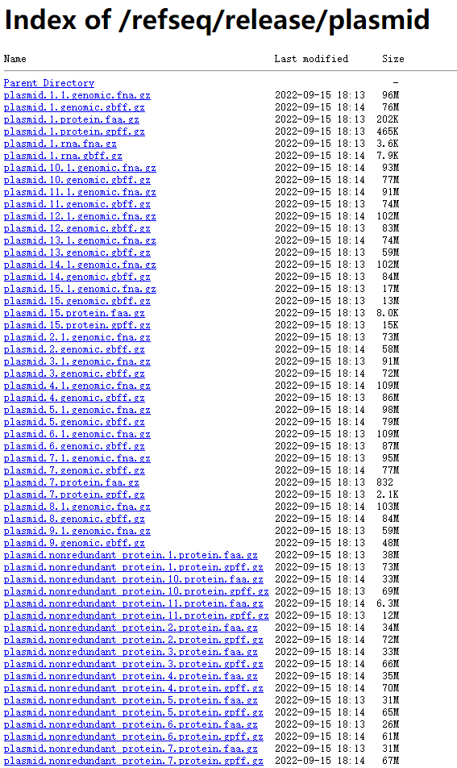

# Classifying Plasmids

[TOC levels=1-3]: # ""

- [Classifying Plasmids](#classifying-plasmids)
  - [NCBI RefSeq](#ncbi-refseq)
  - [MinHash to get non-redundant plasmids](#minhash-to-get-non-redundant-plasmids)
  - [Grouping by MinHash](#grouping-by-minhash)
  - [Plasmid: prepare](#plasmid-prepare)
  - [Plasmid: run](#plasmid-run)


## NCBI RefSeq

```bash
mkdir -p ~/data/plasmid
cd ~/data/plasmid

rsync -avP ftp.ncbi.nlm.nih.gov::refseq/release/plasmid/ RefSeq/
# -a 这是归档模式，表示以递归方式传输文件，并保持所有属性，它等同于-r、-l、-p、-t、-g、-o、-D 选项。-a 选项后面可以跟一个 --no-OPTION，表示关闭 -r、-l、-p、-t、-g、-o、-D 中的某一个，比如-a --no-l 等同于 -r、-p、-t、-g、-o、-D 选项。   
# -v  表示打印一些信息，比如文件列表、文件数量等。
# -P  显示文件传输的进度信息。(实际上"-P"="--partial --progress"，其中的"--progress"才是显示进度信息的)。

# RefSeq 是具有生物意义上的非冗余的基因和蛋白质序列。
```
进程：
```bash
Welcome to the NCBI rsync server.


receiving incremental file list
created directory RefSeq
./
plasmid.1.1.genomic.fna.gz
     57,114,624  56%   31.09kB/s    0:23:26
```
本`ftp.ncbi.nlm.nih.gov::refseq/release/plasmid/`页面内容:    

  


```
gzip -dcf RefSeq/*.genomic.gbff.gz > genomic.gbff
# 对genome内容解压  
# gzip -d 解开压缩文件； -c 把压缩后的文件输出到标准输出设备，不去更动原始文件; -f 强行压缩文件。不理会文件名称或硬连接是否存在以及该文件是否为符号连接。

perl ~/Scripts/withncbi/taxon/gb_taxon_locus.pl genomic.gbff > refseq_id_seq.csv
rm genomic.gbff

gzip -dcf RefSeq/plasmid.1.1.genomic.fna.gz |
    grep "^>" |
    head -n 5
#>NC_006130.1 Streptococcus pyogenes 71-724 plasmid pDN571, complete sequence
#>NC_004464.2 Citrobacter freundii plasmid pCTX-M3, complete sequence
#>NC_006427.1 Enterococcus faecium plasmid pJB01, complete sequence
#>NC_001370.1 Lactobacillus plantarum plasmid pC30il, complete sequence
#>NC_002810.1 Streptococcus mutans LM7 plasmid pLM7, complete sequence

faops n50 -S -C RefSeq/*.genomic.fna.gz
#N50     222278
#S       2072550889
#C       22389

gzip -dcf RefSeq/*.genomic.fna.gz > RefSeq/plasmid.fa

```

## MinHash to get non-redundant plasmids

```bash
mkdir ~/data/plasmid/nr
cd ~/data/plasmid/nr

faops size ../RefSeq/plasmid.fa > refseq.sizes

tsv-filter refseq.sizes --le 2:2000 | wc -l
#2473

faops some ../RefSeq/plasmid.fa <(tsv-filter refseq.sizes --gt 2:2000) refseq.fa

cat refseq.fa |
    mash sketch -k 21 -s 1000 -i -p 8 - -o refseq.plasmid.k21s1000.msh

# split
mkdir -p job
faops size refseq.fa |
    cut -f 1 |
    split -l 1000 -a 3 -d - job/

find job -maxdepth 1 -type f -name "[0-9]??" | sort |
    parallel -j 4 --line-buffer '
        echo >&2 "==> {}"
        faops some refseq.fa {} stdout |
            mash sketch -k 21 -s 1000 -i -p 6 - -o {}.msh
    '

find job -maxdepth 1 -type f -name "[0-9]??" | sort |
    parallel -j 4 --line-buffer '
        echo >&2 "==> {}"
        mash dist -p 6 {}.msh refseq.plasmid.k21s1000.msh > {}.tsv
    '

# distance < 0.01
find job -maxdepth 1 -type f -name "[0-9]??" | sort |
    parallel -j 16 '
        cat {}.tsv |
            tsv-filter --ff-str-ne 1:2 --le 3:0.01
    ' \
    > redundant.tsv

head -n 5 redundant.tsv
#NZ_CP034776.1   NC_005249.1     0.000730741     0       970/1000
#NZ_CP034416.1   NC_005249.1     0.00580821      0       794/1000
#NZ_LR745046.1   NC_005249.1     0.0010072       0       959/1000
#NZ_LR745043.1   NC_005249.1     0.000656154     0       973/1000
#NZ_CP033694.1   NC_006323.1     0.00766986      0       741/1000

cat redundant.tsv | wc -l
# 129384

cat redundant.tsv |
    perl -nla -F"\t" -MGraph::Undirected -e '
        BEGIN {
            our $g = Graph::Undirected->new;
        }

        $g->add_edge($F[0], $F[1]);

        END {
            for my $cc ( $g->connected_components ) {
                print join qq{\t}, sort @{$cc};
            }
        }
    ' \
    > connected_components.tsv

cat connected_components.tsv |
    perl -nla -F"\t" -e 'printf qq{%s\n}, $_ for @F' \
    > components.list

wc -l connected_components.tsv components.list
#  2073 connected_components.tsv
#  9800 components.list

faops some -i refseq.fa components.list stdout > refseq.nr.fa
faops some refseq.fa <(cut -f 1 connected_components.tsv) stdout >> refseq.nr.fa

rm -fr job

```

## Grouping by MinHash

```bash
mkdir ~/data/plasmid/grouping
cd ~/data/plasmid/grouping

cat ../nr/refseq.nr.fa |
    mash sketch -k 21 -s 1000 -i -p 8 - -o refseq.nr.k21s1000.msh

# split
mkdir -p job
faops size ../nr/refseq.nr.fa |
    cut -f 1 |
    split -l 1000 -a 3 -d - job/

find job -maxdepth 1 -type f -name "[0-9]??" | sort |
    parallel -j 4 --line-buffer '
        echo >&2 "==> {}"
        faops some ../nr/refseq.nr.fa {} stdout |
            mash sketch -k 21 -s 1000 -i -p 6 - -o {}.msh
    '

find job -maxdepth 1 -type f -name "[0-9]??" | sort |
    parallel -j 4 --line-buffer '
        echo >&2 "==> {}"
        mash dist -p 6 {}.msh refseq.nr.k21s1000.msh > {}.tsv
    '

find job -maxdepth 1 -type f -name "[0-9]??" | sort |
    parallel -j 1 '
        cat {}.tsv
    ' \
    > dist_full.tsv

# distance < 0.05
cat dist_full.tsv |
    tsv-filter --ff-str-ne 1:2 --le 3:0.05 \
    > connected.tsv

head -n 5 connected.tsv
#NC_019347.1     NC_000906.2     0.0321972       0       341/1000
#NC_004847.1     NC_000906.2     0.0458408       0       236/1000
#NC_002111.1     NC_002130.1     0.0375603       0       294/1000
#NC_002636.1     NC_006994.1     0.0284057       0       380/1000
#NC_002524.1     NC_006994.1     0.0444041       0       245/1000

cat connected.tsv | wc -l
#60618

mkdir -p group
cat connected.tsv |
    perl -nla -F"\t" -MGraph::Undirected -MPath::Tiny -e '
        BEGIN {
            our $g = Graph::Undirected->new;
        }

        $g->add_edge($F[0], $F[1]);

        END {
            my @rare;
            my $serial = 1;
            my @ccs = $g->connected_components;
            @ccs = map { $_->[0] }
                sort { $b->[1] <=> $a->[1] }
                map { [ $_, scalar( @{$_} ) ] } @ccs;
            for my $cc ( @ccs ) {
                my $count = scalar @{$cc};
                if ($count < 50) {
                    push @rare, @{$cc};
                }
                else {
                    path(qq{group/$serial.lst})->spew(map {qq{$_\n}} @{$cc});
                    $serial++;
                }
            }
            path(qq{group/00.lst})->spew(map {qq{$_\n}} @rare);

            path(qq{grouped.lst})->spew(map {qq{$_\n}} $g->vertices);
        }
    '

# get non-grouped
# this will no be divided to subgroups
faops some -i ../nr/refseq.nr.fa grouped.lst stdout |
    faops size stdin |
    cut -f 1 \
    > group/lonely.lst

wc -l group/*
#  3333 group/00.lst
#  1644 group/1.lst
#   359 group/2.lst
#    94 group/3.lst
#    69 group/4.lst
#    65 group/5.lst
#    55 group/6.lst
#    51 group/7.lst
#    51 group/8.lst
#  6477 group/lonely.lst
# 12198 total

find group -maxdepth 1 -type f -name "[0-9]*.lst" | sort |
    parallel -j 4 --line-buffer '
        echo >&2 "==> {}"

        faops some ../nr/refseq.nr.fa {} stdout |
            mash sketch -k 21 -s 1000 -i -p 6 - -o {}.msh

        mash dist -p 6 {}.msh {}.msh > {}.tsv
    '

find group -maxdepth 1 -type f -name "[0-9]*.lst.tsv" | sort |
    parallel -j 4 --line-buffer '
        echo >&2 "==> {}"

        cat {} |
            tsv-select -f 1-3 |
            Rscript -e '\''
                library(readr);
                library(tidyr);
                library(ape);
                pair_dist <- read_tsv(file("stdin"), col_names=F);
                tmp <- pair_dist %>%
                    pivot_wider( names_from = X2, values_from = X3, values_fill = list(X3 = 1.0) )
                tmp <- as.matrix(tmp)
                mat <- tmp[,-1]
                rownames(mat) <- tmp[,1]

                dist_mat <- as.dist(mat)
                clusters <- hclust(dist_mat, method = "ward.D2")
                tree <- as.phylo(clusters)
                write.tree(phy=tree, file="{.}.tree.nwk")

                group <- cutree(clusters, h=0.2) # k=3
                groups <- as.data.frame(group)
                groups$ids <- rownames(groups)
                rownames(groups) <- NULL
                groups <- groups[order(groups$group), ]
                write_tsv(groups, "{.}.groups.tsv")
            '\''
    '

# subgroup
mkdir -p subgroup
cp group/lonely.lst subgroup/

find group -name "*.groups.tsv" | sort |
    parallel -j 1 -k '
        cat {} | sed -e "1d" | xargs -I[] echo "{/.}_[]"
    ' |
    sed -e 's/.lst.groups_/_/' |
    perl -na -F"\t" -MPath::Tiny -e '
        path(qq{subgroup/$F[0].lst})->append(qq{$F[1]});
    '

# ignore small subgroups
find subgroup -name "*.lst" | sort |
    parallel -j 1 -k '
        lines=$(cat {} | wc -l)

        if (( lines < 5 )); then
            echo -e "{}\t$lines"
            cat {} >> subgroup/lonely.lst
            rm {}
        fi
    '

# append ccs
cat ../nr/connected_components.tsv |
    parallel -j 1 --colsep "\t" '
        file=$(rg -F -l  "{1}" subgroup)
        echo {} | tr "[:blank:]" "\n" >> ${file}
    '

# remove duplicates
find subgroup -name "*.lst" | sort |
    parallel -j 1 '
        cat {} | sort | uniq > tmp.lst
        mv tmp.lst {}
    '

wc -l subgroup/* |
    sort -nr |
    head -n 100

wc -l subgroup/* |
    perl -pe 's/^\s+//' |
    tsv-filter -d" " --le 1:10 |
    wc -l
#132

wc -l subgroup/* |
    perl -pe 's/^\s+//' |
    tsv-filter -d" " --ge 1:50 |
    tsv-filter -d " " --regex '2:\d+' |
    sort -nr \
    > next.tsv

wc -l next.tsv
#53

# rm -fr job

```

## Plasmid: prepare

* Split sequences

```bash
mkdir ~/data/plasmid/GENOMES
mkdir ~/data/plasmid/taxon

cd ~/data/plasmid/grouping

echo -e "#Serial\tGroup\tCount\tTarget" > ../taxon/group_target.tsv

cat next.tsv |
    cut -d" " -f 2 |
    parallel -j 4 -k --line-buffer '
        echo >&2 "==> {}"

        GROUP_NAME={/.}
        TARGET_NAME=$(head -n 1 {} | perl -pe "s/\.\d+//g")

        SERIAL={#}
        COUNT=$(cat {} | wc -l)

        echo -e "${SERIAL}\t${GROUP_NAME}\t${COUNT}\t${TARGET_NAME}" >> ../taxon/group_target.tsv

        faops order ../nr/refseq.fa {} stdout |
            faops filter -s stdin stdout \
            > ../GENOMES/${GROUP_NAME}.fa
    '

cat next.tsv |
    cut -d" " -f 2 |
    parallel -j 4 -k --line-buffer '
        echo >&2 "==> {}"
        GROUP_NAME={/.}
        faops size ../GENOMES/${GROUP_NAME}.fa > ../taxon/${GROUP_NAME}.sizes
    '

# Optional: RepeatMasker
#egaz repeatmasker -p 16 ../GENOMES/*.fa -o ../GENOMES/

# split-name
find ../GENOMES -maxdepth 1 -type f -name "*.fa" | sort |
    parallel -j 4 '
        faops split-name {} {.}
    '

# mv to dir of basename
find ../GENOMES -maxdepth 2 -mindepth 2 -type f -name "*.fa" | sort |
    parallel -j 4 '
        mkdir -p {.}
        mv {} {.}
    '

```

* `prepseq`

```bash
cd ~/data/plasmid/

cat taxon/group_target.tsv |
    sed -e '1d' |
    parallel --colsep '\t' --no-run-if-empty --linebuffer -k -j 4 '
        echo -e "==> Group: [{2}]\tTarget: [{4}]\n"

        for name in $(cat taxon/{2}.sizes | cut -f 1); do
            egaz prepseq GENOMES/{2}/${name}
        done
    '

```

* Check outliers of lengths

```bash
cd ~/data/plasmid/

cat taxon/*.sizes | cut -f 1 | wc -l
#4816

cat taxon/*.sizes | cut -f 2 | paste -sd+ | bc
#466119084

cat taxon/group_target.tsv |
    sed -e '1d' |
    parallel --colsep '\t' --no-run-if-empty --linebuffer -k -j 4 '
        echo -e "==> Group: [{2}]\tTarget: [{4}]"

        median=$(cat taxon/{2}.sizes | datamash median 2)
        mad=$(cat taxon/{2}.sizes | datamash mad 2)
        lower_limit=$( bc <<< " (${median} - 2 * ${mad}) / 2" )

#        echo $median $mad $lower_limit
        lines=$(tsv-filter taxon/{2}.sizes --le "2:${lower_limit}" | wc -l)

        if (( lines > 0 )); then
            echo >&2 "    $lines lines to be filtered"
            tsv-join taxon/{2}.sizes -e -f <(
                    tsv-filter taxon/{2}.sizes --le "2:${lower_limit}"
                ) \
                > taxon/{2}.filtered.sizes
            mv taxon/{2}.filtered.sizes taxon/{2}.sizes
        fi
    '

cat taxon/*.sizes | cut -f 1 | wc -l
#4780

cat taxon/*.sizes | cut -f 2 | paste -sd+ | bc
#464908146

```

* Rsync to hpcc

```bash
rsync -avP \
    ~/data/plasmid/ \
    wangq@202.119.37.251:data/plasmid

# rsync -avP wangq@202.119.37.251:data/plasmid/ ~/data/plasmid

```

## Plasmid: run

```bash
cd ~/data/plasmid/

cat taxon/group_target.tsv |
    sed -e '1d' | grep "^53" |
    parallel --colsep '\t' --no-run-if-empty --linebuffer -k -j 1 '
        echo -e "==> Group: [{2}]\tTarget: [{4}]\n"

        egaz template \
            GENOMES/{2}/{4} \
            $(cat taxon/{2}.sizes | cut -f 1 | grep -v -x "{4}" | xargs -I[] echo "GENOMES/{2}/[]") \
            --multi -o groups/{2}/ \
            --order \
            --parallel 24 -v

#        bash groups/{2}/1_pair.sh
#        bash groups/{2}/3_multi.sh

        bsub -q mpi -n 24 -J "{2}-1_pair" "bash groups/{2}/1_pair.sh"
        bsub -w "ended({2}-1_pair)" \
            -q mpi -n 24 -J "{2}-3_multi" "bash groups/{2}/3_multi.sh"
    '

# clean
find groups -mindepth 1 -maxdepth 3 -type d -name "*_raw" | parallel -r rm -fr
find groups -mindepth 1 -maxdepth 3 -type d -name "*_fasta" | parallel -r rm -fr
find . -mindepth 1 -maxdepth 3 -type f -name "output.*" | parallel -r rm

echo \
    $(find groups -mindepth 1 -maxdepth 1 -type d | wc -l) \
    $(find groups -mindepth 1 -maxdepth 3 -type f -name "*.nwk.pdf" | wc -l)

```

