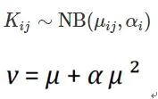

# DESeq2差异表达分析

[该文章](https://www.jianshu.com/p/2689e9a1d10c)写的非常细致全面  


# 介绍  

DESeq2是一个为高维计量数据的归一化、可视化和差异表达分析而设计的一个R语言包。是目前差异表达分析方面最常用的R包。它通过经验贝叶斯方法(empirical Bayes techniques)来估计对数倍数变化(log2foldchange）和离差的先验值，并计算这些统计量的后验值。

# 安装DESeq2  

```R
if (!require("BiocManager", quietly = TRUE))
    install.packages("BiocManager")

BiocManager::install("DESeq2")
```


# DEseq2包自带的rlog和vst函数  

1. 意义：  为了进行样本相关性分析，需要先把原始`read count`进行取对数转化进行校正，DEseq2包自带的rlog和vst函数（全名为variance stabilizing transformation），它们消除了方差对均值的依赖，尤其是低均值时的高log counts的变异。  
 

2. 注：    
但是在DESeq2包中实际上已经有了归一化的方法，rlog和vst，在使用的需要根据样本量的多少来选择方法。样本量少于30的话，选择rlog，多于30的话，建议选择vst。   

3. VST转换（方差稳定转换variance stabilizing transformation）  

* 目的:  to simplify considerations in graphical exploratory data analysis or to allow the application of simple regression-based or analysis of variance techniques.应用基于简单的基于回归或方差分析技术
* 概括：    
选择方差稳定变换的目的是找到一个简单的函数 ƒ 应用于数据集中的值 x，以创建新值 y = ƒ（x），使得值 y 的变异性与其平均值无关。在DESeq里就是，f是受平均值影响的raw count，找一个x，去避免y的方差收到一些极端值的影响。

4. rlog转换（规范化的log转换）  

函数rlog代表正则化log转换，通过拟合一个模型，将每个样本的一个项和一个根据数据估计的系数的先验分布进行拟合，将原始计数数据转换为log2尺度。这与DESeq和nbinomWaldTest所使用的对数倍数变化是相同的收缩（有时称为正则化或调节）。结果数据包含的元素定义如下：


```
\ [\ log_2（q_ {ij}）= \ beta_ {i0} + \ beta_ {ij} \]
```


其中\（q_ {ij} \）是与基因i和样本j的片段的预期真实浓度成比例的参数（参见下面的公式），\（\ beta_ {i0} \）是不经历收缩的截距，和\（\ beta_ {ij} \）是基于整个数据集上的色散平均趋势向零收缩的样本特定效应。这种趋势典型地表现为低计数的高分散性，因此这些基因表现出更高的收缩率。请注意，由于\（q_ {ij} \）表示大小因子\（s_j \）被分开之后的平均值\（\ mu_ {ij} \）的部分，因此很明显rlog转换具有固有的考虑到测序深度的差异。如果没有先验，这个设计矩阵将导致一个非独特的解决方案，然而，在非截距测试中增加一个先验的解决方案可以找到一个独特的解决方案。

## 使用流程  

### 1. 读入和处理数据  

DESeq2要求输入的数据必须是没有标准化的raw count，第i行第j列代表着在样本j分配到featrue(i)
的reads数或fragemnts数（feature可以是基因、转录本、ChIP-seq等NGS测的对应区段bin、定量质谱中的某肽段序列）  

链接：https://www.jianshu.com/p/88511070e2dd  


* 加载包  
```R
library(DESeq2)   
library(pheatmap)  # 用于作热图的包
library(ggplot2)   # 用于作图的包
```
* 对数据形式有要求，需要：  

|      gene   |  sample1  |  sample2  |
| ----------- | --------- | --------- |
| Gene名称1    | count   | count    |
| Gene名称2    | count    | count    |


整理数据：  

① 去除低表达的基因   
```R
countdata <- countdata[rowSums(countdata) > 0,]
# 同一个基因不同样本的count（一横行）加起来大于0

# 或者通过加和平均值来判断
countData <- countData[rowMeans(countData)>1,]
```

② 去除附带多余的信息，以及会出现一些无效的行  

```R
# 去除前面5行
countdata <- dataframe[-(1:5),]

#将ID的版本号去除[看个人情况是否去除]
# 得到行的名
row_names <- row.names(countdata)
# 开始替换
name_replace <- gsub("\\.\\w+","", row.names(countdata))
row.names(countdata) <- name_replace

# 查看数据
head(countdata)  
```
### 2.差异表达分析  


1.  构建DESeq2对象  

（1）从SummarizedExperiment对象构建DESeqDataSet对象  

```
dds <- DESeqDataSet( se, design = ~ cell + dex) 
```

* se为RangedSummarizedExperiment对象，行信息rowRanges(se)为基因区间，列信息colData(se)为样本信息（四种细胞系，每一个cell lines都有对照组与dex处理组），实验数据assays(se)为原始的read counts。   本流程中为（两组对照，三组实验各有两个重复）。  

* dds为DESeqDataSet对象，dds与se的区别是se的assay slot被DESeq2的counts accessor function代替。   

* dds包含设计公式design formula，design(dds)。实验设计为cell+dex，希望检测对于不同细胞，地塞米松处理的效果。本流程实验设计为 treatment，希望检测对于小鼠肝脏组织的不同处理的效果。代码应改为  
```
dds <- DESeqDataSet( se, design = ~ treatment) 
```  

（2）从表达矩阵countData和样品信息colData构建DESeqDataSet对象    
```
dds <- DESeqDataSetFromMatrix( countData = countdata, colData = coldata, design = ~ Group) 
```
* 表达矩阵countData，行为基因，列为样本，表达量必须是非负整数。  
也就是经过数据处理的raw count，每个样本的每个基因都对应了一个count。  


* 样本信息colData，每一行对应一个样本，`行名与countData的样本顺序一一对应`(必须完全一致，否则会报错)，列为各种分组信息。  

```
例如:

> coldata
                     state   condition treatment
SRR2190795 Liver cirrhosis DEN + AM095 treatment
SRR2240182 Liver cirrhosis DEN + AM095 treatment
SRR2240183 Liver cirrhosis DEN + AM063 treatment
SRR2240184 Liver cirrhosis DEN + AM063 treatment
SRR2240185 Liver cirrhosis         DEN treatment
SRR2240186 Liver cirrhosis         DEN treatment
SRR2240187 Healthy control         PBS   control
SRR2240228 Healthy control         PBS   control
```

* 设计公式通常格式为`~ batch批次影响 + conditions处理条件影响`，batch和conditions都是colData的一列，是因子型变量。为了方便后续计算，`最为关注的分组信息放在最后一位`。  

如果记录了样本的批次信息，或者其它需要抹除的信息可以定义在design参数中，在下游回归分析中会根据design formula来估计batch effect的影响，并在下游分析时减去这个影响。这是处理batch effect的推荐方式。  

在模型中考虑batch effect并没有在数据矩阵中移除bacth effect，如果下游处理时确实有需要，可以使用limma包的removeBatchEffect来处理。  


* 默认情况下，R会根据字母表顺序排列因子型变量，排在最前面的因子作为对照。设置对照：  

colData$Group <- relevel(colData$Group, ref=“WTF”)  

或 colData$Group <- factor(colData$Group, levels = c(“WTF”, ”WTM”, ”MF”, ”MMF”))  

* 多个因子——designs with multiple variables, e.g., ~ group + condition,  

and   

因子之间有相互作用——designs with interactions (answering: is the condition effect different across genotypes?) , e.g., ~ genotype + treatment + genotype:treatment.   

默认情况下，此包中的函数将使用公式中的最后一个变量来构建结果表和绘图。  


* design(dds) <- value. value, 用于估计色散和拟合负二项式 GLM 的公式。


2. [选择性过滤低丰度数据]  

构建dds之前： 
```
countData <- count[apply(count, 1, sum) > 1 , ] 

```

构建dds之后：
```
dds <- dds[rowSums(counts(dds)) > 1, ] 
```
* 在独立筛选（independent filtering）中，DESeq2可以去掉在所有样品中平均表达量CPM不大于min.CPM的基因，以减少假阴性。  

* EdgeR是保留在2个或更多样品中表达量大于min.CPM的基因。  

*  可以尝试不同的cutoff，以获得最佳效果   


3. 主成分分析[选择性采取该步骤，只用于看样本相关性]

PCA的两种数据转化方法  

**为什么要转换？** 

为了确保所有基因有大致相同的贡献。     

对于RNA-seq raw counts，方差随均值增长。如，假设值 x 是来自不同泊松分布的实现：即每个分布μ具有不同的平均值。然后，由于对于泊松分布，方差与均值相同，因此方差随均值而变化。    

如果直接用size-factor-normalized read counts：counts(dds, normalized=T) 进行主成分分析，结果通常只取决于少数几个表达最高的基因，因为它们显示了样本之间最大的绝对差异。  


为了避免这种情况，一个策略是采用the logarithm of the normalized count values plus a small pseudocount：log2(counts(dds2, normalized=T) +1)。就是加一个常数再取对数。但是这样，有很低counts的基因将倾向于主导结果。  


作为一种解决方案，DESeq2为counts数据提供了stabilize the variance across the mean的转换。其中之一是regularized-logarithm transformation or rlog2。  

对于counts较高的基因，rlog转换可以得到与普通log2转换相似的结果。然而，对于counts较低的基因，所有样本的值都缩小到基因的平均值。  

用于绘制PCA图或聚类的数据可以有多种：counts、CPM、log2(counts+1)、log2(CPM+1)、vst、rlog等。  


（1）方差稳定变换，The variance stabilizing transformation   

```
vsd <- vst(object=dds,blind=T) 
```
* 样本信息的列名names(colData(vsd))多了1列sizeFactor，colData(vsd)$sizeFactor  

* 基因信息的列名names(rowData(vsd))多了4列    

* vst函数快速估计离散趋势并应用方差稳定变换。该函数从拟合的离散-均值关系中计算方差稳定变换(VST)，然后变换count data（除以标准化因子），得到一个近似为同方差的值矩阵（沿均值范围具有恒定的方差）。许多常见的多维数据探索性分析方法，例如聚类或PCA，对于同方差的数据表现良好。  

**数据集小于30个样品可以用rlog，数据集大于30个样品用vst，因为rlog速度慢。**  


（2）正则化对数变换，The regularized-logarithm transformation  

```
rld <- rlog(object=dds,blind=F)
```

* 样本信息colData names多了1列sizeFactor，和vsd的sizeFactor相同  

* 基因信息rowData names多了7列  

* rlog函数将count data转换为log2尺度，以最小化有small counts的行的样本间差异，并使library size标准化。`rlog在size factors变化很大的情况下更稳健`。  


（3）用法  


blind，转换时是否忽视实验设计。blind=T，不考虑实验设计，用于样品质量保证（sample quality assurance，QA）。blind=F，考虑实验设计，用于downstream analysis。  

 (4) intgroup：分组  
 PCA详情见[该网址](https://www.jianshu.com/p/b7e55bacbede)    


interesting groups: a character vector of names in colData(x) to use for grouping。也就是在构建dds的时候的分组，实际上这个分组最后影响的是PCA图中的颜色，但是并不影响PCA图中各个样本的位置。换句话说，PCA降维的是时候并不会考虑这个分组。  


 (5) ntop：用于主成分分析的时候基因数  

官方解释：number of top genes to use for principal components, selected by highest row variance。也就是说PCA分析的时候，是根据基因表达的counts值来的。如果给出了ntop，那么意思就是只选出表达量高的这几个基因去计算。没想通作者为什么设置这个，我觉得应该是先筛选出差异的基因，然后再设置这个数会比较好，这样就是看筛选出的基因是不是符合预期。反正感觉ntop目前来说用的不是很多。  

 (6) returnData：返回PC1和PC2的dataframe  

官方解释：should the function only return the data.frame of PC1 and PC2 with intgroup covariates for custom plotting (default is FALSE)。注意只返回PC1和PC2，其他的成分不返回，而且还返回分组情况和样本名。是这种格式：
```
              PC1         PC2 group condition  name
X11_T  23.7381223  -3.9537594    II        II X11_T
X77_T  -1.7273395  29.0222667    II        II X77_T
X14_T -14.2359870   1.8616294    II        II X14_T
X76_T  -0.2251326  27.9834964    II        II X76_T
```
这个参数的作用就是当你的PCA图需要加样本名的时候，也就是你希望在PCA图上知道哪个点是哪个样本，你就需要导出这个, 设置returnData=T。

* 上述过程全部代码：   
```
#构建dds
dds <- DESeqDataSetFromMatrix(countData=indata, colData = state, design= ~ condition )
#归一化，因为样本量超过了30，因此用vst
vsd <- vst(dds, blind = FALSE)
#返回样本名和分组
pcaData <- plotPCA(vsd, intgroup=c("condition"),returnData = T)
#这里按照condition排序了，原因见下。
pcaData <- pcaData[order(pcaData$condition,decreasing=F),]
#知道每一个组有多少样本
table(pcaData$condition)
# II III  IV 
# 20  11  10 
#根据上面的结果，设置每一个组的数量，方便加颜色；这一步是把每一个样本根据分组情况画出来，效果见图1
plot(pcaData[,1:2],pch = 19,col= c(rep("red",20),rep("green",11),rep("blue",10)),
     cex=1)
#加上样本名字，效果见图2
text(pcaData[,1],pcaData[,2],row.names(pcaData),cex=1, font = 1)
#加上图例，效果见图3
legend(-70,43,inset = .02,pt.cex= 1.5,title = "Grade",legend = c("II", "III","IV"), 
       col = c( "red","green","blue"),pch = 19, cex=0.75,bty="n")
```
我的代码：
```
setwd("D:/project/rat/output/HTseq")

dataframe <- read.csv("merge.csv", header=TRUE, row.names = 1)

countdata <- dataframe[-(1:5),]

head(countdata)  

col_names <- colnames(countdata)
name_replace <- gsub("\\.\\w+","", colnames(countdata))
colnames(countdata) <- name_replace
head(countdata)

countdata <- countdata[rowSums(countdata) > 0,]


if (!require("BiocManager", quietly = TRUE))
    install.packages("BiocManager")  

  BiocManager::install("DESeq2")
  BiocManager::install("pheatmap")
  BiocManager::install("biomaRt")
  BiocManager::install("org.Rn.eg.db")
  BiocManager::install("clusterProfiler")
  BiocManager::install("ggplot2")   

  # 加载
  library(DESeq2)
  library(pheatmap)     
  library(biomaRt)
  library(org.Rn.eg.db)
  library(clusterProfiler)
  library(ggplot2)

browseVignettes("ggplot2")

# 写入 coldata文件内容  

head(countdata)

coldata <- read.table("phenotype.csv", row.names = 1, header = TRUE, sep = "," )
coldata

countdata <- countdata[row.names(coldata)]

dds <- DESeqDataSetFromMatrix(countData = countdata, colData = coldata, design= ~ treatment)
dds
```
！以上都是DESeq必须完成的前期步骤，下面是PCA及聚类分析特有的

```
rld <- rlog(dds, blind=FALSE)
rld

pcaData <- plotPCA(rld, intgroup=c("treatment"),returnData = T) 
pcaData

pcaData <- pcaData[order(pcaData$treatment,decreasing=F),]
pcaData

table(pcaData$treatment)

# 绘制plot图
plot(pcaData[,1:2],pch = 19,col= c(rep("red",2),rep("green",2),rep("blue",2),rep("yellow",2)))

text(pcaData[,1],pcaData[,2],row.names(pcaData),cex=1, font = 1)

legend(-30,-5,inset = .02,pt.cex= 1.5,legend = c("DEN","DEN + AM063","DEN + AM065","PBS"), 
       col = c( "red","green","blue"),pch = 19, cex=0.75,bty="n")


# 绘制聚类热图  
library("RColorBrewer")

gene_data_transform <- assay(rld)

sampleDists <- dist(t(gene_data_transform))

sampleDistMatrix <- as.matrix(sampleDists)

rownames(sampleDistMatrix) <- paste(rld$treatment, rld$condition, rld$ids,sep="-")
colnames(sampleDistMatrix) <- paste(rld$treatment, rld$condition, rld$ids,sep="-")
# 没办法显示ids，因为rld没办法导进入，还得想办法搞colnames

colors <- colorRampPalette( rev(brewer.pal(9, "Blues")) )(255)

pheatmap(sampleDistMatrix,
         clustering_distance_rows=sampleDists,
         clustering_distance_cols=sampleDists,
         col=colors)
```


4. 指定factor levels    

R 将基于字母顺序默认参考水平，但实际通常是根据对照组作为参考水平。因此有必要时要设置  
```
dds$condition <- factor(dds$condition, levels=c('untreated', 'treated'))  

# 也可以直接指定
dds$condition <- relevel(dds$condition, ref='untreated')
# 如果有时对dds取子集时，导致某些水平不含数据，那么这个水平就可以丢弃
dds$condition <- droplevels(dds$condition)
```
我的代码：

```
# 改变样本组别顺序
dds$treatment <- factor(as.vector(dds$treatment), levels = c("control","treatment"))
#as.vector用于将对象转换为向量，其实在dds建立的时候就已经自然转换了
```

5. DESeq2的标准化方法[好像不是必须]  


（1）计算归一化系数sizeFactor  
```
dds <- estimateSizeFactors(dds) 
```

colData(dds)多了sizeFactor这一列，对测序深度和文库组成进行校正。和vsd、rld的sizeFactor是一样的。  

（2）标准化之后的数据  

```
normalized_counts <- counts(dds,normalized=T) 
```

将原始的表达量除以每个样本的归一化系数，就得到了归一化之后的表达量。read counts/sizeFactor。

6. 差异表达分析  

（1）一步:首选  
```
dds <- DESeq(dds) 
```

2）用法
```
DESeq(object, test = c("Wald", "LRT"), fit Type = c("parametric", "local", "mean"), sfType = c("ratio", "poscounts", "iterate"),betaPrior, full = design(object), reduced, quiet = FALSE, minReplicatesForReplace = 7, modelMatrixType, useT = FALSE, minmu = 0.5, parallel = FALSE, BPPARAM = bpparam())
```

结果：  

```
estimating size factors估计尺寸因素
estimating dispersions估计分散
gene-wise dispersion estimates基因分散估计
mean-dispersion relationship平均离散关系
final dispersion estimates最终离散估计
fitting model and testing拟合模型和测试
```


test可以是`Wald significance tests`或`likelihood ratio test（似然比检验）`，on the difference in deviance between a full and reduced model formula。  


（3）分步  

* 计算归一化系数sizeFactor  
```
dds <- estimateSizeFactors(dds) 
```

* 估计基因的离散程度  
```
dds <- estimateDispersions(dds) 
```

DESeq2假定基因的表达量符合负二项分布，有两个关键参数，总体均值和离散程度α值。这个α值衡量的是均值和方差之间的关系。  

    
 
* 统计检验，差异分析  
```
dds <- nbinomWaldTest(dds) 
```

6. 获得分析结果  

（1）默认情况  
```
res <- results(dds)
```

 (2) 用法  

```
function (object, contrast, name, lfcThreshold = 0, altHypothesis = c("greaterAbs",
    "lessAbs", "greater", "less"), listValues = c(1, -1), cooksCutoff,
    independentFiltering = TRUE, alpha = 0.1, filter, theta,
    pAdjustMethod = "BH", filterFun, format = c("DataFrame",
        "GRanges", "GRangesList"), saveCols = NULL, test, addMLE = FALSE,
    tidy = FALSE, parallel = FALSE, BPPARAM = bpparam(), minmu = 0.5)

1. contrast
this argument specifies what comparison to extract from the object to build a results table. one of either:
（此参数指定从对象中提取什么比较以构建结果表）

① a character vector with exactly three elements: the name of a factor in the design formula, the name of the numerator level for the fold change,
 and the name of the denominator level for the fold change (simplest case) 
 （有三个元素的字符向量：设计公式中一个因子的名称、fold change的分子level的名称、fold change的分母level的名称）

② a list of 2 character vectors: the names of the fold changes for the numerator, and the names of the fold changes for the denominator. 
these names should be elements of resultsNames(object). 
if the list is length 1, a second element is added which is the empty character vector, character().
(more general case, can be to combine interaction terms and main effects)
（一个由两个字符向量组成的列表：分子的fold change名称，分母的fold change名称。这些名称应该是resultsNames(object)。
如果列表是长度1，则添加第二个元素，即空字符向量character()。更一般的情况是，可以将交互项和主要效果结合起来。）

③ a numeric contrast vector with one element for each element in resultsNames(object) (most general case)
（具有一个元素的数值型对比向量，对于resultsNames(object)中的每一个元素）

If specified, the name argument is ignored.


2. name

the name of the individual effect (coefficient) for building a results table.
 Use this argument rather than contrast for continuous variables, individual effects or for individual interaction terms. The value provided to name must be an element of resultsNames(object).
 （建立结果表的单个效应（系数）的名称。对于连续变量、单个效应或单个交互项，使用此参数而不是contrast。 提供给name的值必须是resultsNames(object)的元素）

3. lfcThreshold

a non-negative value which specifies a log2 fold change threshold. 
The default value is 0, corresponding to a test that the log2 fold changes are equal to zero.

4. independentFiltering

logical, whether independent filtering should be applied automatically

5. alpha

the significance cutoff used for optimizing the independent filtering (by default 0.1). 
If the adjusted p-value cutoff (FDR) will be a value other than 0.1, alpha should be set to that value.
（用于优化独立筛选的显著性截止值（默认情况下为0.1）。如果adjusted p-value cutoff (FDR)是0.1以外的值，则α应设置为该值。）
```

 (3) 结果分析  


* 默认使用样本信息的最后一个因子与第一个因子进行比较。  
* 返回一个数据框res，包含6列：`baseMean、log2FC、lfcSE、stat、pvalue、padj`  


* `baseMean`表示所有样本经过归一化系数矫正的read counts（counts/sizeFactor）的均值。  

baseMean = apply( normalized_counts, 1, mean )。  


* `log2Foldchange`表示该基因的表达发生了多大的变化，是估计的效应大小effect size。fold change是两组之间的均值差异倍数。  

对差异表达的倍数取以2为底的对数，变化倍数=2^log2Foldchange。  

log2FoldChange = apply( normalized_counts, 1, function(t) {log2( mean(t[5:8])/ mean(t[1:4]))}  

（并不完全相等。log2FC反映的是不同分组间表达量的差异，这个差异由两部分构成，一种是样本间本身的差异，比如生物学重复样本间基因的表达量就有一定程度的差异，另外一部分就是我们真正感兴趣的，由于分组不同或者实验条件不同造成的差异。用归一化之后的数值直接计算出的log2FC包含了以上两种差异，而我们真正感兴趣的只有分组不同造成的差异，DESeq2在差异分析的过程中已经考虑到了样本本身的差异，其最终提供的log2FC只包含了分组间的差异，所以会与手动计算的不同）。  


* lfcSE(logfoldchange Standard Error)是对于log2Foldchange估计的标准误差估计，效应大小估计有不确定性。  

* stat是Wald统计量，它是由log2Foldchange除以标准差所得。  


* pvalue和padj分别代表原始的p值以及经过校正后的p值。常用p=0.1.  

 adjusted p value less than 0.1 should contain no more than 10% false positives.  

  Need to filter on adjusted p-values, not p-values, to obtain FDR control. 10% FDR is common because RNA-seq experiments are often exploratory and having 90% true positives in the gene set is ok.  


（4）比较任何两组数据  


```
resultsNames(dds) 

res <- results(dds, name="Group_1_vs_2") 
res <- results(dds, contrast=c("Group"," 1 "," 2 ")) #后面的是对照 
```  

（5）结果的简单统计  
```
summary(res)
```

（6）排序和筛选
```
resOrdered <- res[order(res$pvalue), ]  #从小到大排序，默认decreasing = F 
sum(res$padj < 0.1, na.rm=TRUE)  #有多少padj小于0.1的 
diff_gene <-subset(res, padj < 0.1 & abs(log2FoldChange) > 1) 
```

 （7）排序和筛选
```
resOrdered <- res[order(res$pvalue), ]  #从小到大排序，默认decreasing = F 
sum(res$padj < 0.1, na.rm=TRUE)  #有多少padj小于0.1的 
diff_gene <-subset(res, padj < 0.1 & abs(log2FoldChange) > 1) 
```


我的代码：  

```
dds1$condition <- factor(as.vector(dds1$condition), levels = c("PBS","DEN","DEN + AM063","DEN + AM095")) 

dds1 <- DESeq(dds1)

result1 <- results(dds1, pAdjustMethod = "fdr", alpha = 0.05)

# 查看结果
head(result1)

result_order1 <- result[order(result1$pvalue),]
head(result_order1)

summary(result_order1)

table(result_order1$padj<0.05)

dir.create("../DESeq2")

write.csv(result1, file="../DESeq2/results1.csv", quote = F)


#  比较任意两组数据  

resultsNames(dds1) 

[1] "Intercept"                      "treatment_treatment_vs_control"

  
举例
res <- results(dds1, name="Group_MMF_vs_WTF") 
res <- results(dds1, contrast=c("Group"," MMF "," WTF ")) #后面的是对照 

```


* 分组：我们分析的数据有2个对照组和6个实验组。分组信息构建为condition向量。  

SRR228——PBScontrol_2；  SRR187——PBScontrol_1；  SRR185——lowdoseDEN_1；  SRR186——lowdoseDEN_2；  
SRR184——lowdoseDEN_AM063_2；SRR183——lowdoseDEN_AM063_1；  SRR182——lowdoseDEN_AM095_2；SRR795——lowdoseDEN_AM095_1。  

```R
 condition <- factor(c(rep("control",4),rep("treatment",4)))
 ```  


样本信息colData，每一行对应一个样本，行名与countData(即，统计出来的每个样本对应多少基因reads的count文件中横表头)的样本顺序一一对应，列为各种分组信息。  

```R
 colData <- data.frame(row.names=colnames(countData), condition)
 #* row.names: NULL或单个整数或字符串，指定某列用作行名，或者一个字符或整型向量用作数据框的行名。
 ```

这两个信息可以理解为告诉差异分析函数是要分析哪些变量间的差异.

2. 开始进行差异表达分析  

```R
dds <- DESeqDataSetFromMatrix(countData = countData, colData = colData, design = ~ condition)
```