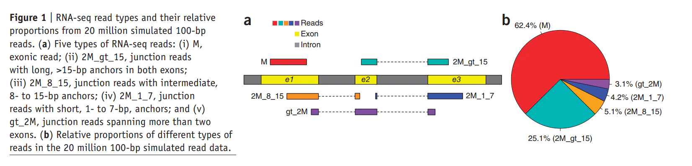
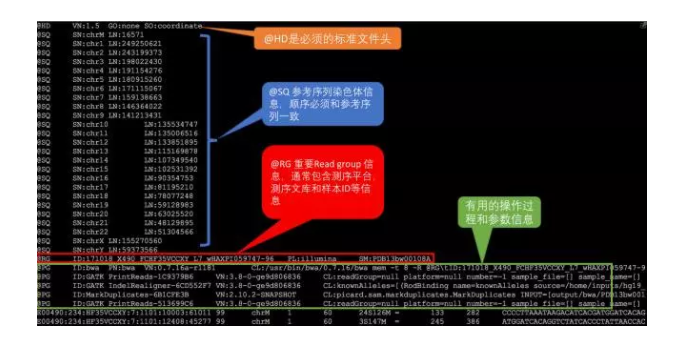
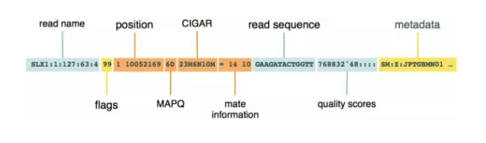
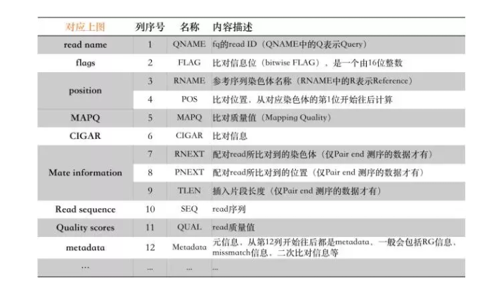
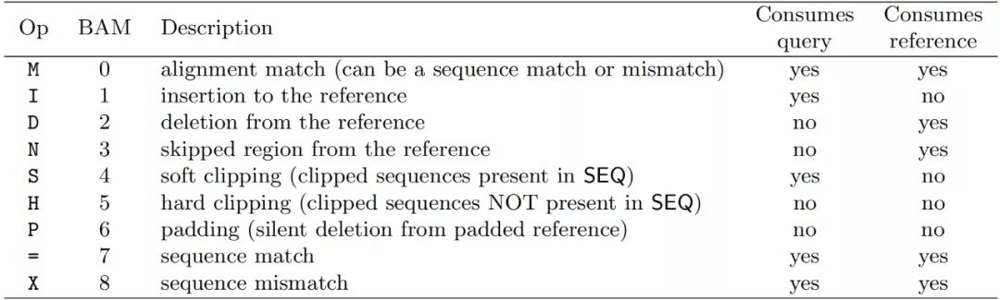

[HISAT2官网](https://daehwankimlab.github.io/hisat2/)  
[参考文章1](https://www.jianshu.com/p/ce3f4afb9b60)   
[参考文章2](https://zhuanlan.zhihu.com/p/451939113)  
[参考文章3](https://www.jianshu.com/p/87cb17e299b2)


# hisat2 -build 命令使用方法  
```
命令行：

hisat2-build[options]*

注意：

       如果使用--snp，--ss和/或--exon选项，hisat2-build将需要大约200GB的运行内存来满足人类基因组规模大小的基因组的索引构建，
因为建立索引涉及到graph construction。否则，就可以用8GB的运行内存在个人电脑构建索引了。

主要参数

<reference_in>

       以逗号分隔的FASTA文件列表，其中包含要比对的参考序列，例如chr1.fa，chr2.fa，chrX.fa，chrY.fa；如果指定了-c，
则可以具体的GGTCATCCT，ACGGGTCGT，CCGTTCTATGCGGCTTA序列。

<ht2_base>

       要写入的索引文件的basename；默认情况下，hisat2-build写入文件名为NAME.1.ht2, NAME.2.ht2, NAME.3.ht2, NAME.4.ht2, 
NAME.5.ht2, NAME.6.ht2, NAME.7.ht2, NAME.8.ht2的文件。<ht2_base>就是文件前缀NAME。

选项

1.-f

参考基因组输入文件(指定为<reference_in>_)是FASTA文件(通常具有.fa、.mfa、.fna或类似的扩展名)。

2.-c

在命令行上给出参考序列。也就是说<reference_in>是一个逗号分隔的序列列表，而不是一个FASTA文件列表。

3.--large-index

强制hisat2-build建立一个大的索引，即使参考的长度小于~ 40亿个核苷酸。

4.-a/--noauto

禁用hisat2-build根据可用内存自动选择--bmax，--dcv和[--packed]参数的这一默认行为。相反，用户可以为这些参数指定值。
如果内存在构建索引期间耗尽，将输出错误信息；由用户决定是否尝试新的参数。

5.--bmax

block中允许的最大后缀数。允许每个block使用更多的后缀可以加快索引构建速度，但会增加内存的峰值使用。
设置此选项将覆盖以前对--bmax或--bmaxdivn的任何设置。--bmaxdivn默认值是4。这是默认自动配置的；使用-a/- noauto则可以手动配置。

6.--bmaxdivn

block中允许的最大后缀数，表示为参考序列长度的一部分。设置此选项将覆盖以前对--bmax或--bmaxdivn的任何设置。默认值: --bmaxdivn 4。
这是默认自动配置的；使用-a/- noauto则可以手动配置。

7.--dcv

使用<int>作为difference-cover样本的period。较大的period产生较少的内存开销，但可能使后缀排序变慢，特别是如果存在重复。
必须是2的整数幂且必须不大于4096。默认值:1024。这是默认自动配置的；使用-a/- noauto手动配置。

8.--nodc

禁用difference-cover样本的使用。在最坏的情况下(最坏的情况是极度重复的参考序列)，后缀排序变成了二次排序。默认值:关闭。

9.-r/--noref

不要构建名称为NAME.3.ht2 、NAME.4.ht2的索引部分，它包含参考序列的bitpacked版本，用于双端测序的比对。

10.-3/--justref

只构建名称为NAME.3.ht2 、NAME.4.ht2的索引部分，它包含引用序列的bitpacked版本，用于双端测序的比对。

11.-o/--offrate<int>

为了将比对结果映射回参考序列上，有必要用基因组上相应位置标注(标记)部分或全部的Burrows-Wheeler

rows。-o/- offrate统计有多少行被标记:索引器将标记每2^<int>行。标记更多的行可以使序列-位置查找更快，但是需要更多的内存来在运行时保存注释。
默认值为4(每16行标记一次；对于人类基因组来说，注释大约有680兆字节)。

12.-t/--ftabchars

ftab是用于计算的第一个<int>字符的初始Burrows-Wheeler范围的查找表。较大的<int>将生成较大的查找表，但查询时间更快。ftab的大小为4^(<int>+1)字节。
默认设置为10 (ftab为4MB)。

13.--localoffrate

这个选项统计在本地索引中标记多少行:索引器将标记每2^<int>行。标记更多的行可以使引用位置查找更快，但是需要更多的内存来在运行时保存注释。
默认值为3(每标记第8行，每个本地索引大约占用16KB)。

14.--localftabchars

本地ftab是本地索引中的查找表。默认设置为6 (ftab为每个本地索引8KB)。

15.-p

并行运算线程数(默认:1)。

16.--snp

提供一个snp列表(HISAT2自己的格式)，如下(五列)。

SNPID snp type (single, deletion, or insertion) chromosomename zero-offset based genomic position of a SNP alternative base (single),
 the length of SNP (deletion), or insertion sequence(insertion)

例如：rs58784443，single，13，18447947，T

hisat2_extract_snps_haplotypes_UCSC.py(在HISAT2包中)从dbSNP文件(例如http://hgdownload.soe.ucsc.edu/goldenPath/hg38/database/snp144Common.txt.gz)
中提取SNPs和haplotypes。
或者hisat2_extract_snps_haplotypes_VCF.py从VCF文件中提取SNPs和haplotypes(例如ftp://ftp.1000genomes.ebi.ac.uk/vol1/ftp/release/20130502/supporting/GRCh38_

positions/ALL.chr22.phase3_shapeit2_mvncall_integrated_v3plus_nounphased.rsID.genotypes.GRCh38_dbSNP_no_SVs.vcf.gz)。

17.--haplotype

提供一个单倍型列表(使用HISAT2自己的格式)，如下所示(五列)。

HaplotypeID chromosome name zero-offset based left coordinate ofhaplotype zero-offset based right coordinate of 
haplotype a comma separated list of SNP ids in the haplotype

例如：ht35，13，18446877，18446945，rs12381094,rs12381056,rs192016659,rs538569910

关于如何提取单倍型，请参阅上面的-snp选项。这个选项不是必需的，但是单倍型信息可以防止索引构造激增，并大幅减少索引大小。

18.--ss

注意，这个选项应该与下面的--exon选项一起使用。提供一个剪切位点列表(HISAT2自己的格式)，如下(四列)：

chromosomename zero-offset based genomic position of the flanking base on theleft side of 
an intron zero-offset based genomic position of theflanking base on the right strand

可以用hisat2_extract_splice_sites.py 脚本从GTF注释文件中提取剪切位点文件。

19.--exon

注意，这个选项应该与上面的--ss选项一起使用。提供一个外显子列表(HISAT2自己的格式)，如下(三列)：

chromosomename zero-offset based left genomic position of an exon zero-offset based right genomic position of an exon

可以用hisat2_extract_exons.py脚本从GTF注释文件中提取外显子文件。

20. --seed

伪随机数生成器的种子

21.--cutoff


22.-q/--quiet

静默输出，只会输出错误信息。

23.-h/--help

帮助文档

24.--version

软件版本信息

作者：至尊小王子
链接：https://www.jianshu.com/p/87cb17e299b2
来源：简书
著作权归作者所有。商业转载请联系作者获得授权，非商业转载请注明出处。
```
# 使用方法  
```
$ hisat2 -h

HISAT2 version 2.2.1 by Daehwan Kim (infphilo@gmail.com, www.ccb.jhu.edu/people/infphilo)

Usage:
  hisat2 [options]* -x <ht2-idx> {-1 <m1> -2 <m2> | -U <r>} [-S <sam>]

  <ht2-idx>  Index filename prefix (minus trailing .X.ht2).
  <m1>       Files with #1 mates, paired with files in <m2>.
             Could be gzip'ed (extension: .gz) or bzip2'ed (extension: .bz2).
  <m2>       Files with #2 mates, paired with files in <m1>.
             Could be gzip'ed (extension: .gz) or bzip2'ed (extension: .bz2).
  <r>        Files with unpaired reads.
             Could be gzip'ed (extension: .gz) or bzip2'ed (extension: .bz2).
  <sam>      File for SAM output (default: stdout)

  <m1>, <m2>, <r> can be comma-separated lists (no whitespace) and can be
  specified many times.  E.g. '-U file1.fq,file2.fq -U file3.fq'.


Options (defaults in parentheses):

 Input:
  -q                 query input files are FASTQ .fq/.fastq (default)
  --qseq             query input files are in Illumina's qseq format
  -f                 query input files are (multi-)FASTA .fa/.mfa
  -r                 query input files are raw one-sequence-per-line
  -c                 <m1>, <m2>, <r> are sequences themselves, not files
  -s/--skip <int>    skip the first <int> reads/pairs in the input (none)
  -u/--upto <int>    stop after first <int> reads/pairs (no limit)
  -5/--trim5 <int>   trim <int> bases from 5'/left end of reads (0)
  -3/--trim3 <int>   trim <int> bases from 3'/right end of reads (0)
  --phred33          qualities are Phred+33 (default)
  --phred64          qualities are Phred+64
  --int-quals        qualities encoded as space-delimited integers

 Presets:                 Same as:
   --fast                 --no-repeat-index
   --sensitive            --bowtie2-dp 1 -k 30 --score-min L,0,-0.5
   --very-sensitive       --bowtie2-dp 2 -k 50 --score-min L,0,-1

 Alignment:
  --bowtie2-dp <int> use Bowtie2's dynamic programming alignment algorithm (0) - 0: no dynamic programming, 1: conditional dynamic programming, and 2: unconditional dynamic programming (slowest)
  --n-ceil <func>    func for max # non-A/C/G/Ts permitted in aln (L,0,0.15)
  --ignore-quals     treat all quality values as 30 on Phred scale (off)
  --nofw             do not align forward (original) version of read (off)
  --norc             do not align reverse-complement version of read (off)
  --no-repeat-index  do not use repeat index

 Spliced Alignment:
  --pen-cansplice <int>              penalty for a canonical splice site (0)
  --pen-noncansplice <int>           penalty for a non-canonical splice site (12)
  --pen-canintronlen <func>          penalty for long introns (G,-8,1) with canonical splice sites
  --pen-noncanintronlen <func>       penalty for long introns (G,-8,1) with noncanonical splice sites
  --min-intronlen <int>              minimum intron length (20)
  --max-intronlen <int>              maximum intron length (500000)
  --known-splicesite-infile <path>   provide a list of known splice sites
  --novel-splicesite-outfile <path>  report a list of splice sites
  --novel-splicesite-infile <path>   provide a list of novel splice sites
  --no-temp-splicesite               disable the use of splice sites found
  --no-spliced-alignment             disable spliced alignment
  --rna-strandness <string>          specify strand-specific information (unstranded)
  --tmo                              reports only those alignments within known transcriptome
  --dta                              reports alignments tailored for transcript assemblers
  --dta-cufflinks                    reports alignments tailored specifically for cufflinks
  --avoid-pseudogene                 tries to avoid aligning reads to pseudogenes (experimental option)
  --no-templatelen-adjustment        disables template length adjustment for RNA-seq reads

 Scoring:
  --mp <int>,<int>   max and min penalties for mismatch; lower qual = lower penalty <6,2>
  --sp <int>,<int>   max and min penalties for soft-clipping; lower qual = lower penalty <2,1>
  --no-softclip      no soft-clipping
  --np <int>         penalty for non-A/C/G/Ts in read/ref (1)
  --rdg <int>,<int>  read gap open, extend penalties (5,3)
  --rfg <int>,<int>  reference gap open, extend penalties (5,3)
  --score-min <func> min acceptable alignment score w/r/t read length
                     (L,0.0,-0.2)

 Reporting:
  -k <int>           It searches for at most <int> distinct, primary alignments for each read. Primary alignments mean
                     alignments whose alignment score is equal to or higher than any other alignments. The search terminates
                     when it cannot find more distinct valid alignments, or when it finds <int>, whichever happens first.
                     The alignment score for a paired-end alignment equals the sum of the alignment scores of
                     the individual mates. Each reported read or pair alignment beyond the first has the SAM ‘secondary’ bit
                     (which equals 256) set in its FLAGS field. For reads that have more than <int> distinct,
                     valid alignments, hisat2 does not guarantee that the <int> alignments reported are the best possible
                     in terms of alignment score. Default: 5 (linear index) or 10 (graph index).
                     Note: HISAT2 is not designed with large values for -k in mind, and when aligning reads to long,
                     repetitive genomes, large -k could make alignment much slower.
  --max-seeds <int>  HISAT2, like other aligners, uses seed-and-extend approaches. HISAT2 tries to extend seeds to
                     full-length alignments. In HISAT2, --max-seeds is used to control the maximum number of seeds that
                     will be extended. For DNA-read alignment (--no-spliced-alignment), HISAT2 extends up to these many seeds
                     and skips the rest of the seeds. For RNA-read alignment, HISAT2 skips extending seeds and reports
                     no alignments if the number of seeds is larger than the number specified with the option,
                     to be compatible with previous versions of HISAT2. Large values for --max-seeds may improve alignment
                     sensitivity, but HISAT2 is not designed with large values for --max-seeds in mind, and when aligning
                     reads to long, repetitive genomes, large --max-seeds could make alignment much slower.
                     The default value is the maximum of 5 and the value that comes with -k times 2.
  -a/--all           HISAT2 reports all alignments it can find. Using the option is equivalent to using both --max-seeds

                     and -k with the maximum value that a 64-bit signed integer can represent (9,223,372,036,854,775,807).
  --repeat           report alignments to repeat sequences directly

 Paired-end:
  -I/--minins <int>  minimum fragment length (0), only valid with --no-spliced-alignment
  -X/--maxins <int>  maximum fragment length (500), only valid with --no-spliced-alignment
  --fr/--rf/--ff     -1, -2 mates align fw/rev, rev/fw, fw/fw (--fr)
  --no-mixed         suppress unpaired alignments for paired reads
  --no-discordant    suppress discordant alignments for paired reads

 Output:
  -t/--time          print wall-clock time taken by search phases
  --un <path>           write unpaired reads that didn't align to <path>
  --al <path>           write unpaired reads that aligned at least once to <path>
  --un-conc <path>      write pairs that didn't align concordantly to <path>
  --al-conc <path>      write pairs that aligned concordantly at least once to <path>
  (Note: for --un, --al, --un-conc, or --al-conc, add '-gz' to the option name, e.g.
  --un-gz <path>, to gzip compress output, or add '-bz2' to bzip2 compress output.)
  --summary-file <path> print alignment summary to this file.
  --new-summary         print alignment summary in a new style, which is more machine-friendly.
  --quiet               print nothing to stderr except serious errors
  --met-file <path>     send metrics to file at <path> (off)
  --met-stderr          send metrics to stderr (off)
  --met <int>           report internal counters & metrics every <int> secs (1)
  --no-head             suppress header lines, i.e. lines starting with @
  --no-sq               suppress @SQ header lines
  --rg-id <text>        set read group id, reflected in @RG line and RG:Z: opt field
  --rg <text>           add <text> ("lab:value") to @RG line of SAM header.
                        Note: @RG line only printed when --rg-id is set.
  --omit-sec-seq        put '*' in SEQ and QUAL fields for secondary alignments.

 Performance:
  -o/--offrate <int> override offrate of index; must be >= index's offrate
  -p/--threads <int> number of alignment threads to launch (1)
  --reorder          force SAM output order to match order of input reads
  --mm               use memory-mapped I/O for index; many 'hisat2's can share

 Other:
  --qc-filter        filter out reads that are bad according to QSEQ filter
  --seed <int>       seed for random number generator (0)
  --non-deterministic seed rand. gen. arbitrarily instead of using read attributes
  --remove-chrname   remove 'chr' from reference names in alignment
  --add-chrname      add 'chr' to reference names in alignment
  --version          print version information and quit
  -h/--help          print this usage message
  ```
# 采用的比对策略  

1. RNA-seq产生的reads可能跨长度比较大的内含子，哺乳动物中甚至最长能达到1MB，同时外显子比较短，read也比较短，会有很多read（模拟数据中大概34%）跨两个外显子的情况  

2. 为了更好的比对，将跨外显子的reads分成了三类：  
1）长锚定read，至少有16bp在两个外显子的每一个上   
2）中间锚定read，有8-15bp在一个外显子上     
3）短锚定read，只有1-7bp在一个外显子上    


3. 所以总的reads可以被划分为五类：  
1）不跨外显子的read 2）长锚定read 3）中间锚定read 4）短锚定read 5）跨两个外显子以上的read  
  

4. 在模拟的数据中，有25%左右的read是长锚定read，`这种read在大多数情况下可以被唯一的定位到人的基因组上`  ;  
5%为中间锚定read，对于这类，很多依赖于全局索引的算法就`很难执行`下去（需要比对很多次）;  
而hisat，可以`先将read中的长片段实现唯一比对，之后再使用局部索引对剩下的小片段进行比对（局部索引可以实现快速检索）`


5. 4.2% 为短锚定read，因为这些序列特别短，因此只能通过在hisat比对其它read时发现的剪切位点或者用户自己提供的剪切位点来`辅助比对 `

6. 最后还有3%的是跨多个外显子的read，比对策略在hisat的online method中有介绍，文章中没有详解  

7. 比对过程中，中间锚定read、短锚定read、跨多个外显子read的比对占总比对时长的30%-60%，而且比对错误率很高

# 比对命令  

1. 建索引：
```
hisat2-build [options]* <reference_in> <ht2_base>
hisat2-build [选项] [基因组序列(.fa)] [索引文件的前缀名]


#<reference_in> ：fasta文件;  如果为list，使用逗号分开
#<ht2_base> ：索引文件的前缀名，如设为xxx，则生成的索引文件为xxx.1.ht2,xxx.2.ht2，默认的前缀名为NAME

#option:详见说明书
```

2. 检查索引：

```
hisat2-inspect [options]* <ht2_base>
#输出结果为一个fasta文件，主要用于检查已经构建好的索引所用的构建信息，感觉没啥用
```
3. 比对：
```
hisat2 [options]* -x <hisat2-idx> {-1 <m1> -2 <m2> | -U <r> | --sra-acc <SRA accession number>} [-S <hit>]

#参数说明：
#-p ：线程数目
#--dta  ：注意！！！在下游使用stringtie组装的时候一定要在hisat中设置这个参数！！！
#-x <hisat2-idx> ：参考基因组索引的basename，即前缀名

#{}：其中的内容意思为hisat2可以接受单端测序，双端测序，或者直接提交SRA ID号

#-1 <m1> ：双端测序的read1 list ，若为list，使用逗号隔开，名字与2要匹配，如-1 flyA_1.fq,flyB_1.fq
#-2 <m2> ：双端测序的read2 list ，若为list，使用逗号隔开，名字与1要匹配，如-2 flyA_2.fq,flyB_2.fq
#-U <r>：单端测序list，若为list，使用逗号隔开，-U lane1.fq,lane2.fq,lane3.fq,lane4.fq
#--sra-acc <SRA accession number> : SRAID list，若为list，使用逗号隔开，--sra-acc SRR353653,SRR353654

#-S <hit> ：SAM写入的文件名，默认写入到标准输出中

#options:这里只列出可调节的类别，至于参数调整，详见说明

#Input options
#Alignment options
#Scoring options
#Spliced alignment options（重要）
#Reporting options
#Paired-end options（重要）
#Output options（重要）
#SAM options
#Performance options
#Other options
```
4. report格式  

* 若为单端测序  
```
20000 reads; of these:
  20000 (100.00%) were unpaired; of these:
    1247 (6.24%) aligned 0 times
    18739 (93.69%) aligned exactly 1 time
    14 (0.07%) aligned >1 times
93.77% overall alignment rate
```
！ 计算方法：
比对到1次 % ＋ 比对大于1次 %  = 比对率  


* 若为双端测序
```
10000 reads; of these:
  10000 (100.00%) were paired; of these:
    650 (6.50%) aligned concordantly 0 times
    8823 (88.23%) aligned concordantly exactly 1 time
    527 (5.27%) aligned concordantly >1 times
    ----
    650 pairs aligned concordantly 0 times; of these:
      34 (5.23%) aligned discordantly 1 time
    ----
    616 pairs aligned 0 times concordantly or discordantly; of these:
      1232 mates make up the pairs; of these:
        660 (53.57%) aligned 0 times
        571 (46.35%) aligned exactly 1 time
        1 (0.08%) aligned >1 times
96.70% overall alignment rate
```  
！ 计算方法：   
单端测序的 比对到1次 % ＋单端测序的 比对大于1次 % ＋单端测序的 比对到0次 % * 反向测序 比对到1次 % + 反向测序 比对到0次 % * （再次比对到1次 % + 再次比对到大于1次 %）  
即：88.23 + 5.27 + 6.50 * 5.23% + 6.5 *（1-5.23）% *（46.35 + 0.08）%   

5. 比对结果bam文件  

使用Hisat2软件进行比对之后生成的默认文件是`sam文件格式`，`bam文件是sam文件的二进制格式`，可以减小文件的存储。了解sam/bam文件的格式对后续的分析结果的筛选非常重要  

[对bam文件的具体解读](https://luohao-brian.gitbooks.io/gene_sequencing_book/content/di-5-8282-li-jie-bing-cao-zuo-bam-wen-jian.html)  


* 查看方式  

如果是SAM文件，同时你也熟悉linux操作的话，直接在linux终端用less打开即可  
（注意：不要试图在本地使用文本编辑器，如vim等直接打开文件，会撑死机子的）  
但如果我们要查看的是BAM，那么必须通过Samtools（可以到samtools的网站下载并安装）。
```
$ less -SN in.sam          # 打开sam文件
$ samtools view -h in.bam  # 打开bam文件
加上-h参数目的是为了同时把它的header输出出来，如果没有这个参数，那么header默认是不显示的。
```

查看BAM文件内容：使用samtools view查看BAM文件   
$ samtools view in.bam
```
如果不想从头开始看，希望快速地跳转到基因组的其它位置上，比如chr22染色体，那么可以先用samtools index生成BAM文件的索引（如果已经有索引文件则不需该步骤），然后这样操作：  

```
$ samtools index in.bam  # 生成in.bam的索引文件in.bam.bai
$ samtools view in.bam chr22            # 跳转到chr22染色体
$ samtools view in.bam chr22:16050103   # 跳转到chr22:16050103位置
$ samtools view in.bam chr22:16050103-16050103  # 只查看该位置
```  


header 信息：  

    

比对信息：每一行都是一条read比对信息  

  


* bam/sam文件的说明如下：  

  

```
BAM文件分为两个部分：header和record。许多NGS组学数据的存储格式都是由header和record两部分组成的
第1列：reads名称；

第2列：Flag标签；Flag标签是二进制数字之和，不同数字代表了不同的意义。比如下面的数据代表的含义如下：

1：代表这个序列采用的是PE双端测序；

2：代表这个序列和参考序列完全匹配，没有插入缺失；

4：代表这个序列没有比对到参考序列上；

8：代表这个序列的另一端序列没有比对到参考序列上，比如这条序列是R1,它对应的R2端序列没有比对到参考序列上；

16：代表这个序列比对到参考序列的负链上；

32：代表这个序列对应的另一端序列比对到参考序列的负链上；

64：代表这个序列是R1端序列，read1；

128：代表这个序列是R2端序列，read2；

256：代表这个序列不是主要的比对，一条序列可能比对到参考序列的多个位置，只有一个是首要的比对位置，其他都是次要的。

第3列：比对到的染色体信息；

第4列：比对到参考基因组物理位置；

第5列：比对质量值（0-60）；这个值同样非常重要，它告诉我们的是这个read比对到参考序列上这个位置的可靠程度，用错误比对到该位置的概率值（转化为Phred scale）来描述：-10logP{错比概率}。因此MAPQ（mapping quality）值大于30就意味着错比概率低于0.001（千分之一），这个值也是我们衡量read比对质量的一个重要因子。

第6列：CIAGR（记录插入、缺失等）；CIAGR中包含的是比对结果信息，表明了一条reads所有碱基的比对情况。比如CIGAR = 150M表示150bp的reads都比对到参考基因组上；常见的CIAGR标签表示的含义如下：

第7列：配对reads比对到的染色体，=表示相同；（只有Pair-end 测序数据才有）

第8列：配对reads比对到的染色体物理位置；（只有Pair-end 测序数据才有）

第9列：文库插入序列大小，插入片段大小；（只有Pair-end 测序数据才有）

第10列：Reads序列；

第11列：质量值；

第12列之后都是元数据 metadata： 包括RG信息，miss match信息，二次比对信息等。

    


# 举例
```
hisat2-build human.fa --snp human.snp human_hg38
#最终会生成以human_hg38为前缀，以.*.ht2为后缀的索引文件
#其中提供了snp信息

* 单端测序比对
hisat2 -f -x human_hg38 -U reads_1.fa -S eg1.sam
#-f:输入文件为fasta文件
#-q：输入文件为fastq文件
#-x：只写前缀
#最终生成eg1.sam文件


* 双端测序比对
hisat2 -f -x human_hg38 -1 reads_1.fa -2 reads_2.fa -S eg2.sam
#最后生成eg2.sam

可以使用samtools或者bcftools作为下游
samtools view -bS eg2.sam > eg2.bam
#转化为bam文件

samtools sort eg2.bam -o eg2.sorted.bam
#bam文件转变为sorted bam

samtools mpileup -uf human.fa eg2.sorted.bam | bcftools view -bvcg - > eg2.raw.bcf
#生成bcf文件

bcftools view eg2.raw.bcf
#查看bcf文件
#详见samtools工具的使用
```