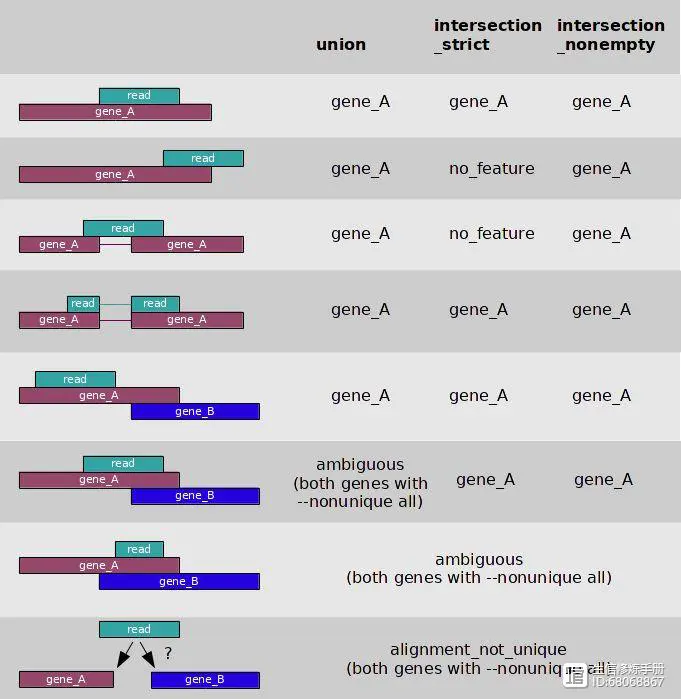

#  HTSeq
[官网](https://htseq.readthedocs.io/en/master/index.html)
##  使用方法
```
htseq-count [options] <alignment_files> <gtf_file>
```

##  HTSeq使用注意事项

1. HTSeq是对有参考基因组的转录组测序数据进行表达量分析的，其输入文件必须有`SAM和GTF文件`。  


2. 一般情况下HTSeq得到的Counts结果会用于下一步`不同样品间的基因表达量差异分析`，而不是一个样品内部基因的表达量比较。因此，HTSeq设置了`-a参数的默认值10`，来忽略掉比对到多个位置的reads信息，其结果有利于后续的差异分析。  


3. 输入的GTF文件中`不能包含可变剪接信息`，否则HTSeq会认为每个可变剪接都是单独的基因，导致能比对到多个可变剪接转录本上的reads的计算结果是ambiguous，从而不能计算到基因的count中。即使设置-i参数的值为transcript_id，其结果一样是不准确的，只是得到transcripts的表达量。  


htseq-count的设计思想和featurecounts非常类似，也包含了feature和meta-features两个概念。对于转录组数据而言，feature指的是exon, 而meta-feature可以是gene, 也可以是transcript。  


## 进行定量分析需要以下两个文件

1. 比对的BAM/SAM文件     `对于双端数据，要求输入sort之后的BAM文件。`  

2. 基因组的GTF文件  


## 比对模式  

由于序列读长的限制和基因组的同源性，一条reads可能比对到多个基因上，而且基因之间也存在overlap, 在对这些特殊情况进行处理时，htseq-count内置了以下3种模式：  

```
union  

intersection-strict

intersection-nonempty
```


通过--mode参数指定某种模式，默认值为union。这3种模式在判断一条reads是否属于某个feature时，有不同的判别标准  
    


## 比对结果统计  


1. 在BAM文件，包含了比对上的reads和没有比对上的reads, `只有比对上的reads 会用来计数`，htseq-count默认会根据mapping的质量值对BAM文件进行过滤，默认值为10, 意味着只有mapping quality > 10的reads才会用来计数，当然可以通过-a参数来修改这个阈值。  

2. 计数情况  


① 能够明确reads属于一个featurer时，比如示意图种的第一种情况，

reads完全是gene_A的一个片段，该feature的计数就加1；  


② 能明确reads不属于一个feature时，称之为no_feature, 比如示意图种的第二种情况，

reads的一部分比对上了gene_A, 在intersection_strict模式下，判定该reads不属于gene_A, 就是no_feature。  


③ 当不明确一条reads是否属于某个feature时，通常是由于reads在两个gene的overlap区，比如示意图中的第六和第七种情况，这样的reads被标记为ambigous。  


④ 当一条reads比对上了两个feature时，会被标记为alignment_not_unique。  


⑤ 在统计属于某个基因的reads数时，需要重点关注对 ambiguous 和 alignment_not_unique 的reads的处理， 通过--nonunique参数来指定，取值有以下两种`none`，`all`。    

默认值为none时，这两种reads被忽略掉，不进行任何的计数；取值为all时，对应的所有feature的计数都会加1。  


⑥ 除了--mode和--nonunique两个参数外，还需要关注--stranded参数，这个参数指定文库的类型，默认值为yes, 代表文库为链特异性文库，no代表为非链特异性文库。 对于非链特异性文库文库，在判断一条reads是否属于一个基因时，只需要关注比对位置，默认值为yes, 代表文库为链特异性文库，而链特异性文库还需要关注比对的正负链和基因的正负链是否一致，只有一致时，才会计数。  


3. 对于非链特异性的数据，常规用法如下  

```
htseq-count -f bam -r name -s no -a 10 -t exon -i gene_id -m union --nonunique=none -o htseq.count align.sorted.bam hg19.gtf
```  

在运行速度上，featurecounts比htseq-count快很多倍，而且feature-count不仅支持基因/转录本的定量，也支持exon等单个feature的定量。所以更加推荐使用featurecounts来定量。  


# htseq-count 命令参数
```
-f | --format default: sam 设置输入文件的格式，该参数的值可以是sam或bam。

-r | --order default: name 设置sam或bam文件的排序方式，该参数的值可以是name或pos。前者表示按read名进行排序，后者表示按比对的参考基因组位置进行排序。若测序数据是双末端测序，当输入sam/bam文件是按pos方式排序的时候，两端reads的比对结果在sam/bam文件中一般不是紧邻的两行，程序会将reads对的第一个比对结果放入内存，直到读取到另一端read的比对结果。因此，选择pos可能会导致程序使用较多的内存，它也适合于未排序的sam/bam文件。而pos排序则表示程序认为双末端测序的reads比对结果在紧邻的两行上，也适合于单端测序的比对结果。很多其它表达量分析软件要求输入的sam/bam文件是按pos排序的，但HTSeq推荐使用name排序，且一般比对软件的默认输出结果也是按name进行排序的。

-s | --stranded default: yes 设置是否是链特异性测序。该参数的值可以是yes,no或reverse。no表示非链特异性测序；若是单端测序，yes表示read比对到了基因的正义链上；若是双末端测序，yes表示read1比对到了基因正义链上，read2比对到基因负义链上；reverse表示双末端测序情况下与yes值相反的结果。根据说明文件的理解，一般情况下双末端链特异性测序，该参数的值应该选择reverse（本人暂时没有测试该参数）。

-a | --a default: 10 忽略比对质量低于此值的比对结果。在0.5.4版本以前该参数默认值是0。

-t | --type default: exon 程序会对该指定的feature（gtf/gff文件第三列）进行表达量计算，而gtf/gff文件中其它的feature都会被忽略。

-i | --idattr default: gene_id 设置feature ID是由gtf/gff文件第9列那个标签决定的；若gtf/gff文件多行具有相同的feature ID，则它们来自同一个feature，程序会计算这些features的表达量之和赋给相应的feature ID。

-m | --mode default: union 设置表达量计算模式。该参数的值可以有union, intersection-strict and intersection-nonempty。这三种模式的选择请见上面对这3种模式的示意图。从图中可知，对于原核生物，推荐使用intersection-strict模式；对于真核生物，推荐使用union模式。

-o | --samout 输出一个sam文件，该sam文件的比对结果中多了一个XF标签，表示该read比对到了某个feature上。

-q | --quiet 不输出程序运行的状态信息和警告信息。

-h | --help 输出帮助信息。
```
 

## 结果    


每个样本输出一个count文件，其中包含了基因名和reads计数；另外，如果你看到文件倒数5行，tail htseq.count.txt 会发现还有几行带文字的

```
no_feature：比对区域与任何基因都没有重叠 。

ambiguous：比对区域与多个基因都发生重叠

 too_low_aQual：比对质量低于设定阈值（默认是10）

 not_aligned：无法比对上

 alignment_not_unique：比对位置不唯一
```


## 对两个软件的结果进行合并  

```
##合并htdeq生成的count文件到matrix.count

cd $MATRIX/htseqperl -lne 'if ($ARGV=~/(.*).count/){print "$1\t$_"}' *.count | grep -v "_" >matrix.count

##合并featureCounts生成的count文件到matrix_2.count

cd $MATRIX/featureCountsfor i in `seq 15 18`;docut -f 1,7 SRR20382${i}.feature.count | grep -v "^#" > SRR20382${i}.matrixsed -i '1d' SRR20382${i}.matrixdoneperl -lne 'if ($ARGV=~/(.*).matrix/){print "$1\t$_"}' *.matrix >matrix_2.count
```

## 统计一下两个软件的计数之和
```
#统计featureCounts  

perl -alne '$sum += $F[2]; END {print $sum}' matrix.count

#结果是5882943

#统计htseq-count,结果是786338
```


链接：https://www.jianshu.com/p/e825827d74cc
