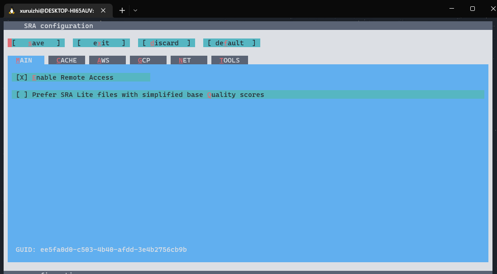

# SRA toolkit
## 一、前言

1. 目的：  测序成本的降低和测序速度的增加导致提交到Sequence Read Archive (SRA)的数据呈爆炸性增长，于是NCBI推出了SRAtoolkit技术来对数据进行压缩，以减少存储成本； 
2. 功能：SRA toolkit可以从SRA数据库读（“dumping”）序列文件，也可以将文件写 ("loading")成.sra格式。  
3. 优点：由于使用了完全索引的柱状数据库（fully indexed columnar database）设计，可以有效减少存储占用。cSRA技术提供了单一的工具包界面，支持高效压缩，读取数据片段，索引回收，序列化流水线处理数据，可选BAM标签的保留，有损压缩并且支持非标准参考序列。  
4. SRA toolkit工具获取地址：[获取地址](http://www.ncbi.nlm.nih.gov/Traces/sra/sra.cgi?view=software)
## 二、下载与安装
`最好直接选用brew安装 ` 
```
xuruizhi@DESKTOP-HI65AUV:~$ brew install sratoolkit

HOMEBREW_BREW_GIT_REMOTE set: using https://mirrors.tuna.tsinghua.edu.cn/git/homebrew/brew.git for Homebrew/brew Git remote.
HOMEBREW_CORE_GIT_REMOTE set: using https://mirrors.tuna.tsinghua.edu.cn/git/homebrew/homebrew-core.git for Homebrew/core Git remote.
Running `brew update --auto-update`...
Warning: sratoolkit 3.0.0 is already installed and up-to-date.
To reinstall 3.0.0, run:
  brew reinstall sratoolkit
```
brew安装完成之后，
输入vdb-config --interactive     
 #会出现一个框架，按字母x键退出，然后就可以使用啦  
  

