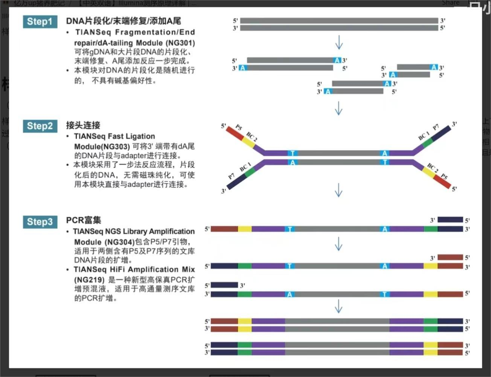
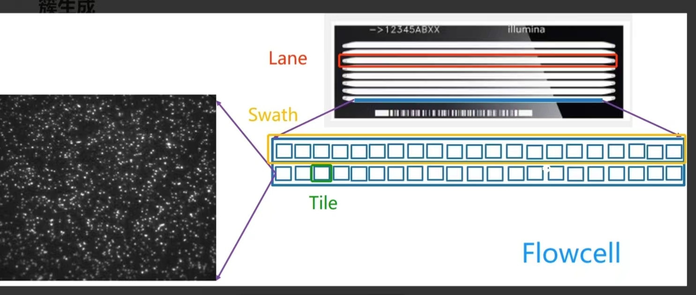

# Illumina测序步骤

## 文库构建
   
1. 文库特点： 中间插入的DNA序列各不相同，两端的接头序列已知，人为加上去的。DNA文库其实就是许多DNA片段，在两头接上了特定的DNA接头，形成的DNA混合物。  

2. 流程： 
```
将基因组DNA片段化：用超声波打断，在两端用酶补平，在3'端加一个A碱基
中间为 insert size，即打断之后的片段长度
        ↓
连接接头：用连接酶把特定接头adapter链接上去
    adapter包含： sequencing binding 位点，Indies（index），和flow cell上的寡聚核苷酸引物互补的特定序列
        ↓
PCR富集
```
## 簇生成  
1. flow cell
  
也可称之为芯片  
中间通道是 lane：测序反应发生的地方；lane的两端有凹槽，有 液流孔，是液体流进流出的地方；lane 又可以分为几行，一行为一个 swath ；一个 swath分为好几个小格子，每个格子为一个 tile。  
2. 簇生成目的： 簇生产每个DNA片段被扩增的过程，目的是为了增强测序信号。  
3. 原理：  
```
① 在lane的内表面种了很多oligos，有两种 oligos寡聚核苷酸引物:P5和P7。 他们通过共价键连接到flowcell的表面，和即将测序的DNA文库的adapter接头序列互补。  
共价键原因：测序过程有大量液体流过flow cell表面，只有共价键的连接才不会被冲掉。  
② 桥式PCR扩增： 将文库种到flow cell表面。  

一条链的adapter与flow cell上与其互补配对的oligo进行杂交；  
   ↓
加入dNTPs和聚合酶，聚合酶从引物开始依靠模板链进行延伸合成互补链；
   ↓
加入NAOH碱溶液将双链解开，与oligos互补的模板链（没有和flow cell共价连接的链）被冲洗掉；留下互补链，通过 磷酸二酯键 和引物相连接；
   ↓
加入中性液体中和碱液，使环境变为中性，链发生折叠和另一种oligo发生互补配对；
再加入dNTPs和聚合酶，使其沿着第二类adapter合成出一条新链。
   ↓
加入NAOH碱溶液将双链解开，加入中性液体中和碱液，两条链都不会冲走，分别和新引物杂交而合成新的链。
   ↓
把合成的双链变成单链，通过某化学反应，将其中一个引物上的特定基团给切除
   ↓
碱溶液洗去flow cell，去掉反向链，留下正向链（模板链）
   ↓
加入中性溶液和测序引物，测序使用带有荧光标记的dNTPs，3'末端链接叠氮基团，链延申时阻止聚合，所以一个循环只可以延长一个碱基  
即，荧光修饰dNTPs可逆合成终止
   ↓
通过激光扫描，根据发出的荧光判断是哪个碱基，推断模板连；
通过化学试剂把叠氮基团和荧光基团切掉继续延伸
循环次数决定了reads长度，发射波长和信号强度决定了base call
   ↓
第一次读段之后，read product被洗去，进行index的读取
index可以标记样本的来源，SE是一个index，PE有index1和index2
读取index的引物结合位点正好在index1的序列旁边，一般读6-8个碱基
   ↓
测序链折叠互补到另一个oligo上进行双端测序，读取index2，再互补配对形成doubled stranded bridge
通过3 primer ends blocked来洗去原来测序了的链

注意： read2得到的是与read1反向且互补的链
```
问题：实际发现，混样的时候，形成cluster的时候有的会掺在一起
## 数据分析  


得到的reads会根据index进行分类排列：

1. 每个样本具有相似延申的就被聚类，正向和反向的reads被配对成为连续序列
2. 将这些序列与参考基因组进行比对，可用于突变识别


# 注意事项等

1. 不同的测序目的要使用不同的测序策略。  

如DNA组装使用较多的是2X100bp或更长的双端测序；RNA-seq使用较多的是100bp或更长的单端链特异性测序；small RNA-seq多用50bp单端测序。  

2. 预估转录本大小  

RNA-seq检测灵敏度和最大值是随测序深度变化的，深度不够，不能发现超低表达的转录本，需要在测序前预估转录本大小。  

3. 比对情况    


单端测序读段的比对比较简单，双端测序的质量不一致，往往是反向一端测序质量低，如果按照同样的标准要求两端测序的读段都比对上，会丢失很多比对结果。一般采取的方式是两端读段分别依据不同的标准（例如正向允许错配一个，反向允许错配两个）做单端比对，然后根据两端对齐后中间距离抽取成对的比对结果。


# 测序的质量分数  

链接：https://www.jianshu.com/p/8f89284c16f8


1. Phred分数  

测序中常用错误概率（Error probability）来表示每个核苷酸测量的准确性，还可以赋予一个数值来更简便地表示这个意思，叫做测序质量分数（Quality score）。因为这个分数最开始通过Phred软件从测序仪生成的色谱图中得到的，所以也叫做Phred分数。  

Phred分数的取值范围是0到93，可以表示很宽的误差范围，即从1（完全错误）到非常低的错误率。Phred分数是最基本的质量分数，其他的质量计分标准都来自Phred分数。

|  Q     | Pe    | base call accuracy |
| -----  | ----- | -----              | 
| 0      | 1  | 0   |
| 10     | 0.1     | 0.9  |
| 20   | 0.01  | 0.99 |
| 30   | 0.001| 0.999   |
| 40  | 0.0001   | 0.9999   |

2. Sanger分数（Phred+33）  


Phred分数包括2位数字，还需要用空格分隔，不方便阅读，又要占用大量存储空间，实际上文件中不采用它。为了在文件中方便地表示质量，常常将Phred分数加上33（从33到126变化，ASCII码正好覆盖了可打印区），并用其ASCII码值对应的字符表示，这就是Sanger分数。Sanger分数常用于FASTQ格式的文件。

3. Illumina/Solexa分数（Phred+64）  

4. 

Sanger分数（Phred+33）和Illumina分数（Phred+64）是当前应用最为普遍的质量分数系统。

以Phred=20（即常见的Q20标准）为例，其Sanger分数为53，对应数字5；其Illumina分数为84，对应字母T。


