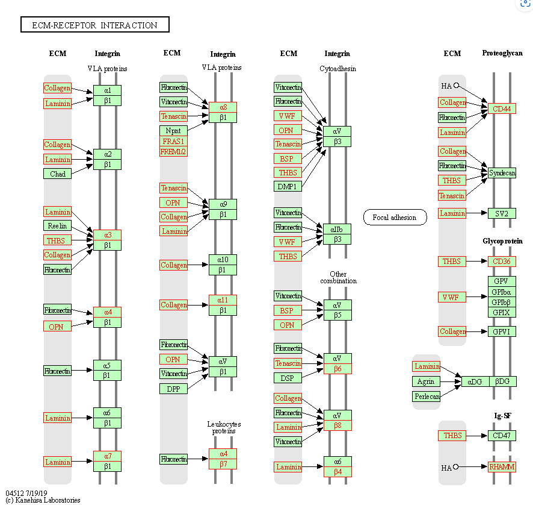

 # 目录  

 * [RNA-seq分析](#rna-seq分析)
      * [3. 数据下载](#3-数据下载)
         * [3.1 参考数据](#31-参考数据)
            * [Ensembl](#ensembl)
         * [3.2 测试数据（实验数据）](#32-测试数据实验数据)
      * [4. 质量控制](#4-质量控制)
         * [4.1 质量评估](#41-质量评估)
         * [4.2 剔除接头以及测序质量差的碱基](#42-剔除接头以及测序质量差的碱基)
         * [4.4 再次去除低质量区域](#44-再次去除低质量区域)
         * [4.3 再次查看质量情况](#43-再次查看质量情况)
      * [5. 去除rRNA序列](#5-去除rrna序列)
      * [6. 序列比对](#6-序列比对)
         * [6.1 建立索引](#6.1建立索引)
         * [6.2-开始比对](#6.2-开始比对)
      * [7. 表达量统计](#7-表达量统计)
      * [8. 合并表达矩阵与标准化](#8-合并表达矩阵与标准化)
         * [8.1 合并](#81-合并)
         * [8.2 数据标准化](#82-数据标准化)
            * [8.2.1 简介](#821-简介)
         * [8.2.2 cufflinks](#822-cufflinks)
         * [8.2.3 手动计算](#823-手动计算)
      * [9. 差异表达分析](#9-差异表达分析)
         * [9.1 数据前处理](#91-数据前处理)
         * [9.2 差异分析](#92-差异分析)
            * [9.2.1 安装与加载包](#921-安装与加载包)
            * [9.2.2 构建对象](#922-构建对象)
            * [9.2.3 样本相关性](#923-样本相关性)
            * [9.2.4 差异基因](#924-差异基因)
      * [10. 提取差异表达基因与注释](#10-提取差异表达基因与注释)
         * [10.1 名词解释](#101-名词解释)
         * [10.2 使用ClusterProfiler对基因的ID进行转化](#102-使用clusterprofiler对基因的id进行转化)
         * [10.3 使用biomaRt进行注释](#103-使用biomart进行注释)
      * [11. 可视化](#11-可视化)
      * [12. 富集分析](#12-富集分析)
         * [12.1 Gene Ontology (GO)分析](#121-gene-ontology-go分析)
         * [12.2 KEGG分析](#122-kegg分析)
         * [12.3 GSEA分析](#123-gsea分析)
         * [12.4 DO（Disease Ontology）分析](#124-dodisease-ontology分析)
         * [12.4 另外可以使用几个在线网站](#124-另外可以使用几个在线网站)
      * [========================================](#-1)
      * [5. 表达量分析](#5-表达量分析)
      * [6. 表达量分析](#6-表达量分析)
      * [7. 差异表达分析](#7-差异表达分析)
      * [作者](#作者)
      * [参考](#参考)
         * [流程](#流程)
         * [结果解读](#结果解读)
         * [原理](#原理)
         * [程序下载安装](#程序下载安装)
         * [问题](#问题)  

## 前期准备  

新建好合适目录：  
```
$ cd /mnt/d/project/rat6.0
$ mkdir annotation genome sequence output script

$ tree
.
├── annotation
├── genome
├── output
├── script
└── sequence

5 directories, 0 files
```

## 3. 数据下载  

### 3.1 参考数据
1. 下载基因组数据  

[Ensemble网址](https://asia.ensembl.org/)  

在左侧`All genomes`中，选择物种`Rat`; 在左侧`Download DNA sequence (FASTA)` 下载基因组序列数据，选择6.0版本; 在右侧的`Download GTF or GFF3 (files for genes, cDNAs, ncRNA, proteins)`下载基因注释文件   

* 下载、解压并查看，得到原始.fa的基因组数据

```
# 下载  
$ cd /mnt/d/project/rat6.0/genome
$ wget http://ftp.ensembl.org/pub/release-104/fasta/rattus_norvegicus/dna/Rattus_norvegicus.Rnor_6.0.dna.toplevel.fa.gz
# 注意：即使是下载原来的版本，网页地址也发生了改变

# 下载得到一个GZ文件， 解压为 .fa文件
$ gzip -d Rattus_norvegicus.Rnor_6.0.dna.toplevel.fa.gz


# 为方便后续操作，改名为rn6
$ mv   Rattus_norvegicus.Rnor_6.0.dna.toplevel.fa   rn6.fa

# 得到基因组文件，查看一下内容：
$ cat rn6.fa | grep "^>"    
# 只显示染色体的第一行的描述基因，.fa文件应该是第一行描述信息+具体测序结果 


# 结果： 
。。。
>18 dna:chromosome chromosome:Rnor_6.0:18:1:88201929:1 REF
>19 dna:chromosome chromosome:Rnor_6.0:19:1:62275575:1 REF
>20 dna:chromosome chromosome:Rnor_6.0:20:1:56205956:1 REF
>X dna:chromosome chromosome:Rnor_6.0:X:1:159970021:1 REF
>Y dna:chromosome chromosome:Rnor_6.0:Y:1:3310458:1 REF
>MT dna:chromosome chromosome:Rnor_6.0:MT:1:16313:1 REF
>KL568162.1 dna:scaffold scaffold:Rnor_6.0:KL568162.1:1:10937627:1 REF
>KL568139.1 dna:scaffold scaffold:Rnor_6.0:KL568139.1:1:9752924:1 REF
>KL568161.1 dna:scaffold scaffold:Rnor_6.0:KL568161.1:1:7627431:1 REF
。。。

```
* 整理  
```
# 去掉第一行的描述信息，只保留染色体编号和具体测序结果

$ mv rn6.fa rn6.raw.fa    # 首先将之前的名称更改一下

$ cat rn6.raw.fa | perl -n -e 'if(m/^>(.+?)(?:\s|$)/){ print ">$1\n";}else{print}' > rn6.fa    # 然后去除染色体编号后的描述信息

$ rm rn6.raw.fa   # 删除，可选
```  

* 统计染色体长度  
可以直接在第一行描述信息中统计，也可以直接计算后面跟的具体测序数目  
```
cat rn6.fa | perl -n -e '    # perl语言，回头记得看
    s/\r?\n//;
    if(m/^>(.+?)\s*$/){
        $title = $1;   
        push @t, $title;  
         # 如果染色体标号是数字则输出数字
    }elsif(defined $title){
        # 如果是其他字符则输出其他字符
        $title_len{$title} += length($_);
    }
    END{
        for my $title (@t){
            print "$title","\t","$title_len{$title}","\n";
        }
    }
'

# 结果
19      62275575
20      56205956
X       159970021
Y       3310458
MT      16313
KL568162.1      10937627
KL568139.1      9752924
KL568161.1      7627431
KL568148.1      6483517
```  

* 单独拿出来一号染色体做后续处理  

```
$ cat rn6.fa | perl -n -e '
  if(m/^>/){
    if(m/>1$/){
      $title = 1;
    }else{
      $title = 0;
    }
  }else{
    push @s, $_ if $title;
  }
  END{
    printf ">1\n%s", join("", @s);
  }
' > rn6.chr1.fa
```

2. 下载注释信息  

* 下载gff信息
```
$ cd /mnt/d/project/rat6.0/annotation
$ wget http://ftp.ensembl.org/pub/release-104/gff3/rattus_norvegicus/Rattus_norvegicus.Rnor_6.0.104.gff3.gz
$ gzip -d Rattus_norvegicus.Rnor_6.0.104.gff3.gz

# 同样的也改名
$ mv Rattus_norvegicus.Rnor_6.0.104.gff3 rn6.gff

# 使用head查看部分
$ head rn6.gff

# 结果:   和流程里面可能不太对
##gff-version 3
##sequence-region   1 1 282763074
##sequence-region   10 1 112626471
##sequence-region   11 1 90463843
##sequence-region   12 1 52716770
##sequence-region   13 1 114033958
##sequence-region   14 1 115493446
##sequence-region   15 1 111246239
##sequence-region   16 1 90668790
##sequence-region   17 1 90843779

# 直接cat rn6.gff
X       ensembl exon    157152216       157152290       .       +       .       Parent=transcript:ENSRNOT00000090795;Name=ENSRNOE00000522621;constitutive=1;ensembl_end_phase=2;ensembl_phase=2;exon_id=ENSRNOE00000522621;rank=4;version=1
X       ensembl CDS     157152216       157152290       .       +       1       ID=CDS:ENSRNOP00000074179;Parent=transcript:ENSRNOT00000090795;protein_id=ENSRNOP00000074179

# 查找师兄举例的基因，发现可以找到，文件应该没有问题
xuruizhi@DESKTOP-HI65AUV:/mnt/d/project/rat6.0/annotation$ cat rn6.gff | grep "ENSRNOG00000046319"
1       ensembl_havana  ncRNA_gene      396700  409750  .       +       .       ID=gene:ENSRNOG00000046319;Name=AABR07000046.1;biotype=processed_transcript;gene_id=ENSRNOG00000046319;logic_name=ensembl_havana_gene;version=4
1       ensembl lnc_RNA 396700  409676  .       +       .       ID=transcript:ENSRNOT00000044187;Parent=gene:ENSRNOG00000046319;Name=AABR07000046.1-202;biotype=processed_transcript;transcript_id=ENSRNOT00000044187;version=4
```

* 下载gtf信息
```
$ cd /mnt/d/project/rat6.0/annotation
$ wget http://ftp.ensembl.org/pub/release-104/gtf/rattus_norvegicus/Rattus_norvegicus.Rnor_6.0.104.gtf.gz
$ gzip -d Rattus_norvegicus.Rnor_6.0.104.gtf.gz

# 同样的也改名
$ mv Rattus_norvegicus.Rnor_6.0.104.gtf rn6.gtf

# 使用head查看部分
$ head rn6.gtf

# 结果: 
#!genome-build Rnor_6.0
#!genome-version Rnor_6.0
#!genome-date 2014-07
#!genome-build-accession GCA_000001895.4
#!genebuild-last-updated 2017-01
1       havana  gene    261992430       261993135       .       -       .       gene_id "ENSRNOG00000054910"; gene_version "1"; gene_name "AC096317.3"; gene_source "havana"; gene_biotype "sense_intronic";
1       havana  transcript      261992430       261993135       .       -       .       gene_id "ENSRNOG00000054910"; gene_version "1"; transcript_id "ENSRNOT00000079974"; transcript_version "1"; gene_name "AC096317.3"; gene_source "havana"; gene_biotype "sense_intronic"; transcript_name "AC096317.3-201"; transcript_source "havana"; transcript_biotype "sense_intronic";
```

## 3.2 测试数据（实验数据）  
1. 下载RNA测序数据  

* 从NCBI上查找相关的RNA-seq数据进行下载，在[GEO数据库](http://www.ncbi.nlm.nih.gov/geo) 中找了一个数据`GSE72960`，对应的`SRP`数据为`SRP063345`   

* 点击最下面的`SRA Run selector`下载测序数据, 在Accession中搜索SRA号(SRPxxx，	SRP063345)，里面包含了所有测序样本的测序信息以及文件SRR编号（例如，SRR2190795）  

* 将刚才在`Run selector`中查找到的数据的编号复制下来，之后下载测序数据，下载脚本如下，这里是采用`SRAtoolkit`工具包中的`prefetch`工具，如果部分数据下载失败，那么再次执行下面的代码    

```
cd /mnt/d/project/rat6.0/sequence

nohup prefetch SRR2190795 SRR224018{2..7} SRR2240228 -o . &
```

上面代码下载容易出错 
采用下面↓代码进行下载  

```
# 先把需要下载的文件名称写入一个单独的txt文件中
# 不可像SRR224018{2..7}这样省略，要不然找不到数据

xuruizhi@DESKTOP-HI65AUV:/mnt/d/project/rat6.0/sequence$  cat >1.txt <<EOF
> SRR2190795
> SRR2240182
> SRR2240183
> SRR2240184
> SRR2240185
> SRR2240186
> SRR2240187
> SRR2240228
> EOF

# 执行下列代码下载数据,下载到 /mnt/d/project/rat6.0/sequence 文件夹内  
[onhup]  prefetch --option-file 1.txt

注： 原来已经下载到了~/data/sra文件夹内，所以没有办法再下载  
```

2. 更改.sra 为 fastq 格式  

```
xuruizhi@DESKTOP-HI65AUV:~/data/sra$ ls
SRR2190795.sra  SRR2240183.sra  SRR2240185.sra  SRR2240187.sra
SRR2240182.sra  SRR2240184.sra  SRR2240186.sra  SRR2240228.sra


xuruizhi@DESKTOP-HI65AUV:~/data/sra$ 
parallel -j 4 "    # 用parallel多线程加快速度，并行任务数为4  
    fastq-dump --outdir /mnt/d/project/rat6.0/sequence --gzip {1}    
    # 将sra文件转化为fastq文件之后压缩为gz文件

" ::: $(ls *.sra)     # :::后接对象

# ls *.sra代表，列举出任何以.sra结尾的文件
--gzip 将转换出的fastq文件以gz格式输出，可以节省空间
--split-3 把pair-end测序分成两个文件输出，可用于双端测序转化为两个文件，本文举例为单端测序，删掉不影响
-O 输出文件夹名，不加直接放在该文件夹

# 删除sra文件
$ rm *.sra
```
* 查看下载好的gz文件  
```
   cd ~/data/sra/mnt/d/project/rat6.0/sequence
   gzip -d -c SRR2190795.fastq.gz | head -n 20
或者
   zless -S SRR2190795.fastq.gz


# gzip
-c或--stdout或--to-stdout 　把压缩后的文件输出到标准输出设备，不去更动原始文件。
-d或--decompress或----uncompress 　解开压缩文件。

结果：
@SRR2190795.1 HWI-ST1147:240:C5NY7ACXX:1:1101:1320:2244 length=100
ATGCTGGGGGCATTAGCATTGGGTACTGAATTATTTTCAGTAAGAGGGAAAGAATCCATCTCCNNNNNNNNNNNNNNNNNNNNNNAAANAAAAATAAAAT
+SRR2190795.1 HWI-ST1147:240:C5NY7ACXX:1:1101:1320:2244 length=100
CCCFFFFFHHHHHJIJJJJJJJJDHHJJJIJJJJJIJJJJJJJJJJJJJJJJJJJJJJJJJHH#####################################
@SRR2190795.2 HWI-ST1147:240:C5NY7ACXX:1:1101:1598:2247 length=100
AACTTCGGTTCTCTACTAGGAGTATGCCTCATAGTACAAATCCTCACAGGCTTATTCCTAGCANNNNNNNNNNNNNNNNNNNNNNTAACAGCATTTTCAT
+SRR2190795.2 HWI-ST1147:240:C5NY7ACXX:1:1101:1598:2247 length=100
@@@7D8+@A:1CFG<C:23<:E<;FF<BHIIEHG:?:??CDF<9DCGGG?1?FEG@@<@CA#######################################
```

##  4. 质量控制
### 4.1 用 fastqc 进行质量评估  
* 对测序结果fastqc  

```
# 新建目录  
mkdir /mnt/d/project/rat6.0/output/fastqc

！注意！一定在存储fastqc.gz的文件夹路径下执行下面的命令

xuruizhi@DESKTOP-HI65AUV:~$ cd /mnt/d/project/rat6.0/sequence
fastqc -t 6 -o /mnt/d/project/rat6.0/output/fastqc *.gz
# -t 指定线程数
# -o 指定输出文件夹
# *.gz 表示这个目录下以 .gz 的所有文件
```
* 用multiqc 进行整合  
```
$ cd /mnt/d/project/rat6.0/output/fastqc

$ multiqc .
```

### 4.2 剔除接头以及测序质量差的碱基  
采用`cutadapt`进行两端低质量的区域的去除  

```

# 新建文件夹
$ mkdir -p /mnt/d/project/rat6.0/output/adapter/
xuruizhi@DESKTOP-HI65AUV:/mnt/d/project/rat6.0/output$ mkdir adapter
xuruizhi@DESKTOP-HI65AUV:/mnt/d/project/rat6.0/output$ ls
adapter  fastqc

# 挂载到测序数据存储文件夹内
cd /mnt/d/project/rat6.0/sequence

xuruizhi@DESKTOP-HI65AUV:/mnt/d/project/rat6.0/sequence$ ls
SRR2190795.fastq.gz  SRR2240183.fastq.gz  SRR2240185.fastq.gz  SRR2240187.fastq.gz
SRR2240182.fastq.gz  SRR2240184.fastq.gz  SRR2240186.fastq.gz  SRR2240228.fastq.gz


# 循环处理文件夹下的数据
for i in $(ls *.fastq.gz);
do
    cutadapt -a AATGATACGGCGACCACCGAGATCTACACTCTTTCCCTACACGACGCTCTTCCGATCT \
    --minimum-length 30 --overlap 4 --trim-n \
    -o /mnt/d/project/rat6.0/output/adapter/${i}  ${i} 
    
    # --minimum-length 如果剔除接头后read长度低于30，这条read将会被丢弃
    # --overlap        如果两端的序列与接头有4个碱基的匹配将会被剔除
    # --trim-n         剔除两端的N
    # -a 去除3端引物序列

done
```

### 4.3 再次去除低质量区域  

```
$ cd /mnt/d/project/rat6.0/output/adapter
$ mkdir ../trim

$ parallel -j 4 "
 
  # Trimmomatic-0.38我下载到了别的盘内，记得更改路径
  java -jar /mnt/d/biosoft/Trimmomatic-0.38/Trimmomatic-0.38.jar \
    SE -phred33 {1} /mnt/d/project/rat6.0/output/trim/{1} \
    LEADING:20 TRAILING:20 SLIDINGWINDOW:5:15 MINLEN:30 \

  # LEADING:20，从序列的开头开始去掉质量值小于 20 的碱基
  # TRAILING:20，从序列的末尾开始去掉质量值小于 20 的碱基
  # SLIDINGWINDOW:5:15，从 5' 端开始以 5bp 的窗口计算碱基平均质量，如果此平均值低于 15，则从这个位置截断read
  # MINLEN:30， 如果 reads 长度小于 30bp 则扔掉整条 read。

" ::: $( ls *.gz)

# 本命令逻辑  
java -jar  [Trimmomatic软件存储位置]\
   [单端测序] SE -phred33 {变量名称}      [指明存储路径和名称] ../trim/{变量名称}\
   Trimmomatic软件的命令选项  
```


### 4.3 再次查看质量情况  
```
$ cd /mnt/d/project/rat6.0/output/trim

$ mkdir ../fastqc_trim
$ parallel -j 4 "
    fastqc -t 4 -o ../fastqc_trim {1}
" ::: $(ls *.gz)

$ cd ../fastqc_trim
$ multiqc .
```
但是CG含量的情况出现下降，怎么回事？

### 5. 去除rRNA序列[可不做]    
! 没有完成   

## 6. 序列比对   

### 6.1 建立索引  

这一步使用`hisat2`中的工具`hisat2-build`建立索引。  
在基因组文件上加上index，测序reads上有index，可以在后续步骤将reads匹配到基因组上。  

```
hisat2-build [选项] [基因组序列(.fa)] [索引文件的前缀名]
```

```
$ cd /mnt/d/project/rat6.0/genome
$ mkdir index
$ cd index

xuruizhi@DESKTOP-HI65AUV:/mnt/d/project/rat6.0/genome/index$    
hisat2-build  -p 6 ../rn6.chr1.fa  rn6.chr1
#-p 并行运算线程数为6
```

在运行过程中会有部分信息提示，其中说到建立索引文件的分块情况以及运行时间的统计

索引建立完成之后在`D:\project\rat6.0\genome\index`文件夹下会出现
```
rn6.chr1.1.ht2
rn6.chr1.2.ht2
。。
rn6.chr1.8.ht2
```
8个文件，这些文件是对基因组进行压缩之后的文件，这个将基因组序列数据分块成了8份，在执行序列比对的时候直接使用这些文件而不是基因组`rn6.chr1.fa`文件。

### 6.2 开始比对
使用hasat2进行比对

* 用法
```
hisat2 [选项] -x [索引文件] [ -1 1测序文件 -2 2测序文件 -U 未成对测序文件| --sra-acc <SRA 编号> ] [ -S 输出的sam文件 ]
```
```
cd /mnt/d/project/rat6.0/output

mkdir align
cd trim  # 没有经过rRNA的去除，所以和师兄的不一样

parallel -k -j 4 "    #-k --keep-order 强制使输出与参数保持顺序；-j 并行任务数
    hisat2 -t -x ../../genome/index/rn6.chr1 \    # -x 定位到索引文件
      -U {1} -S ../align/{1}.sam \
      # -U <r>：单端测序list，若为list，使用逗号隔开，-U lane1.fq,lane2.fq,lane3.fq,lane4.fq
      # -S <hit> ：SAM写入的文件名，默认写入到标准输出中

      2>../align/{1}.log      # 标准输出输入到相对应的文件中
" ::: $(ls *.gz | perl -p -e 's/.fq.gz$//')    # perl 语句起到批量替换作用，将文件格式后缀去掉
```
比对完成之后可以进入文件夹查看一下日志信息；或者直接在文件夹里打开即可（文本文档格式）
```
$ cd /mnt/d/project/rat6.0/output/align

$ cat SRR2190795.log
```
```
Time loading forward index: 00:00:07
Time loading reference: 00:00:01
Multiseed full-index search: 00:11:31
14998487 reads; of these:
  14998487 (100.00%) were unpaired; of these:
    13387964 (89.26%) aligned 0 times
    1444699 (9.63%) aligned exactly 1 time
    165824 (1.11%) aligned >1 times
10.74% overall alignment rate
Time searching: 00:11:32
Overall time: 00:11:39
```

* 总结比对情况  

自己写一个脚本将序列比对率和时间进行统计  
```
cd /mnt/d/project/rat6.0/output/align
file_list=($(ls *.log))

echo -e "sample\tratio\ttime"      # 用-e选项打印出转义字符，换行输出表头
for i in ${file_list[@]};
do
    
    prefix=$(echo ${i} | perl -p -e 's/\.log//')  # i为输出的log文件，删掉格式后缀
    echo -n -e "${prefix}\t"    # -e‘后面跟上‘/t’会在空格间加上水平制表符
    # 输出横列表头为‘SRR2190795.fastq.gz’‘SRR2240182.fastq.gz’的表

    cat ${i} |
      
      grep -E "(overall alignment rate)|(Overall time)" |  
      # 查找这两个数据
      # 如果使用了grep 命令的选项-E，则应该使用 | 来分割多个pattern，以此实现OR操作。

      perl -n -e '
        if(m/alignment/){
          $hash{precent} = $1 if m/([\d.]+)%/;
        }elsif(m/time/){
          if(m/(\d\d):(\d\d):(\d\d)/){
            my $time = $1 * 60 + $2 + $3 / 60;  # 把时间换算成分钟
            $hash{time} = $time;
          }
        }
        END{
          $hash{precent} = "NA" if not exists $hash{precent}; 
          # 如果没有该数据输出NA
          $hash{time} = "NA" if not exists $hash{time};
          printf "%.2f\t%.2f\n", $hash{precent}, $hash{time};
        }
      '
done
```
结果：  
```
sample                  ratio   time （min）    # 该行没法一起出现，之后还需要改进
SRR2190795.fastq.gz     10.74   11.65
SRR2240182.fastq.gz     11.32   22.03
SRR2240183.fastq.gz     12.14   14.43
SRR2240184.fastq.gz     11.76   17.57
SRR2240185.fastq.gz     12.95   23.62
SRR2240186.fastq.gz     12.56   14.23
SRR2240187.fastq.gz     11.24   17.93
SRR2240228.fastq.gz     11.68   14.73
```

* 格式转化与排序  
[对bam文件的具体解读](https://luohao-brian.gitbooks.io/gene_sequencing_book/content/di-5-8282-li-jie-bing-cao-zuo-bam-wen-jian.html)  

`SAM格式`是目前用来`存放大量核酸比对结果信息`的通用格式,`bam文件是sam文件的二进制格式`，可以减小文件的存储。`CRAM`格式与bam类似作用

比对后的分析步骤通常要求`sam/bam`文件被进一步处理，例如在`IGV`查看比对结果时，常需要输入的bam文件已经`被index`
```
$ cd /mnt/d/project/rat6.0/output/align
$ parallel -k -j 4 "
    samtools sort -@ 4 {1}.sam > {1}.sort.bam     
    # 将文件夹内sam文件全部转换为其二进制bam文件以减少内存,并按照 read name 排序
    
    
    # samtools index对排序好的bam文件，可以通过以下命令进行index
    （注意只能对排序过的文件进行index），默认在当前文件夹产生*.bai的index文件
    samtools index {1}.sort.bam

" ::: $(ls *.sam | perl -p -e 's/\.sam$//')
# 该步产生 sort.bam 和 .sort.bam.bai 格式的文件

$ rm *.sam

$ ls
```  

用代码查看BAM 文件内容：  

```
xuruizhi@DESKTOP-HI65AUV:/mnt/d/project/rat6.0/output/align$ samtools view -h SRR2190795.fastq.gz.sort.bam | head -n 30

@HD     VN:1.0  SO:coordinate    # HD是必须的标准文件头  
# VN 格式版本  SO表示比对排序类型；有unknown（default），unsorted，queryname和coordinate几种


@SQ     SN:1    LN:260522016     # SQ参考序列染色体信息，顺序必须和参考序列一致，这些参考序列决定了比对结果sort的顺序


@PG     ID:hisat2       PN:hisat2       VN:2.2.1        CL:"/home/linuxbrew/.linuxbrew/bin/../Cellar/hisat2/2.2.1/bin/hisat2-align-s --wrapper basic-0 -t -x ../../genome/index/mRatBN7.2.chr1 -S ../align/SRR2190795.fastq.gz.sam --read-lengths 100,99,63,98,57,96,97,55,54,95,53,58,94,62,56,64,52,93,75,91,92,79,60,59,90,67,61,74,45,87,85,83,72,69,70,89,65,51,88,86,80,50,44,82,66,78,73,71,49,46,39,36,68,48,42,81,35,84,77,47,30,40,38,37,43,31,33,76,41,34,32 -U /tmp/131.unp"       
@PG     ID:samtools     PN:samtools     PP:hisat2       VN:1.16 CL:samtools sort -@ 4 SRR2190795.fastq.gz.sam            
 # PG是重要的read group信息，通常包含测序平台、测序文库、样本ID等信息  

@PG     ID:samtools.1   PN:samtools     PP:samtools     VN:1.16 CL:samtools view -h SRR2190795.fastq.gz.sort.bam


！ RECORD 每一行都是一条read比对信息 
注：CIGAR中的M，不能觉得它代表的是匹配就以为是百分百没有任何miss-match，这是不对的，多态性碱基或者单碱基错配也是用M标记！


SRR2190795.4538171  # read name    272  # flags比对信息位（272=0PE+16+256，根据表格对应比对情况）   1（参考序列名，或染色体编号）       20（从左边开始数，该基因在染色体上的具体位置）     1（比对质量值）       97M3S（CIGAR）   * (第二次比对)      0       0       TCCTTTTCAACAGAAGCAGAAGCTCATCTGAATATGCTCAAGGATGCTGACATCAACATTTAATCATCTCCTCACTCATCCAGGAAGAAGGGGAGATAAG    9?A@B@@A;BDDB?><ECEA?==.7FEC;DFF>IIGFF<FFDEFB9>B<DF@?0:*D?<@FDC<??C:*FBAA<A33A:?4<F>FEBFFFBC?4DDD8=:    AS:i:-3(匹配的得分) ZS:i:-3() XN:i:0(在参考序列上模糊碱基的个数)  XM:i:0(错配的个数)  XO:i:0(gap open的个数)  XG:i:0(gap 延伸的个数)  NM:i:0(经过编辑的序列)  MD:Z:97(代表序列和参考序列错配的字符串)  YT:Z:UU(UU表示不是pair中一部分)  NH:i:5
SRR2190795.13114124     272     1       23      1       98M     *       0       0       TTTTCAACAGAAGCAGAAGCTCATCTGAATATGCTCAAGGATGCTGACATCAACATTTAATCATCTCCTCACTCATCCAGGAAGAAGGGGAGATCAGT      CCA@C@6.:DDDD>;?7777==7EC=7:EGEIFB4CFFB94?899*0?<DB:0B?*<C1?1:?EC?;A<229+A<;FEAF<G<BBC:DBFDD?B;;@@      AS:i:0  ZS:i:0  XN:i:0  XM:i:0  XO:i:0  XG:i:0  NM:i:0  MD:Z:98YT:Z:UU  NH:i:5
SRR2190795.5690499      256     1       151     1       100M    *       0       0       TCACCATGTTACAAAAATAGCAAGCTGCCATAATAAAAAATGAGGCTCCTCTATCCAGCACCAGATAGCATCATTTTACTTTCAAGCCTAGAAATTGCAC    @C@DDFEFHFHHHJIBHGEHHIJJJJJJJIIJEIIIIJJJJIJJJGGIJJJJGGIJIJJJJJGEACHHHHGHFFF;@@CCEEEECCDDDDDDDDDDDDCC    AS:i:-6 ZS:i:-6 XN:i:0  XM:i:1  XO:i:0  XG:i:0  NM:i:1  MD:Z:41A58      YT:Z:UU NH:i:5
SRR2190795.8395828      256     1       201     1       95M     *       0       0       CTATCCAGCACCAGATAGCATCATTTTACTTTCAAGCCTAGAAATTGCACACTTGTATATAAACCAACCGAAGATGAGGATTGAGAGTTCATCTT =DDDDD<A;CA2A:33CFEEACEEEEA9EE<?CBDADIEDDIADBDDEIB<DDB=.==<BCA@D>A=@8A5?<>;>AA35>;>A><A555;>>35 AS:i:0  ZS:i:0  XN:i:0  XM:i:0  XO:i:0  XG:i:0  NM:i:0  MD:Z:95 YT:Z:UU NH:i:5
SRR2190795.7850706      256     1       225     1       98M     *       0       0       TTTACTTTCAAGCCTAGAAATTGCACACTTGTATATAAACCAACCGAAGATGAGGATTGAGAGTTCGTCTTGGTGGATTTTTCCTTTGATGAATATGA      =@?DABDDFFHFFEHGGAIHIIIIAHGIGIGIEEGGGC??CBHEHIHGIIHIG>C=FHF;FAE=@7CA?C?DE?BA2(.;>;--;>@CCCCDADEAC@      AS:i:-5 ZS:i:-5 XN:i:0  XM:i:1  XO:i:0  XG:i:0  NM:i:1  MD:Z:66A31      YT:Z:UU NH:i:5


6.0版本的结果：

xuruizhi@DESKTOP-HI65AUV:/mnt/d/project/rat6.0/output/align$ samtools view -h SRR2190795.fastq.gz.sort.bam | head -n 30
@HD     VN:1.0  SO:coordinate
@SQ     SN:1    LN:282763074
@PG     ID:hisat2       PN:hisat2       VN:2.2.1        CL:"/home/linuxbrew/.linuxbrew/bin/../Cellar/hisat2/2.2.1/bin/hisat2-align-s --wrapper basic-0 -t -x ../../genome/index/rn6.chr1 -S ../align/SRR2190795.fastq.gz.sam --read-lengths 100,99,63,98,57,96,97,55,54,95,53,58,94,62,56,64,52,93,75,91,92,79,60,59,90,67,61,74,45,87,85,83,72,69,70,89,65,51,88,86,80,50,44,82,66,78,73,71,49,46,39,36,68,48,42,81,35,84,77,47,30,40,38,37,43,31,33,76,41,34,32 -U /tmp/277.unp"
@PG     ID:samtools     PN:samtools     PP:hisat2       VN:1.16 CL:samtools sort -@ 4 SRR2190795.fastq.gz.sam
@PG     ID:samtools.1   PN:samtools     PP:samtools     VN:1.16 CL:samtools view -h SRR2190795.fastq.gz.sort.bam
SRR2190795.1871543      256     1       12025   0       1S99M   *       0       0       CCGATGTGGTATGCAAATGTAGTGTATTTGACAATAAAGGAAAGCATATGAATGTACTCAATGTGGTAAAGCTCGGAGCTCTTCCATTTCTCTTCAAATA    @@@?DD?DHFDDDF@FGGGHIHEEBFHGFHIIDFHIIGHG@HCGHGGIGIIIIIIEFGIGEHG@FGCCGIIIGIA@BEHB?DDB@CCDCD@ACCCDACC>    AS:i:-11        ZS:i:-11        XN:i:0  XM:i:2  XO:i:0  XG:i:0 NM:i:2   MD:Z:28C44T25   YT:Z:UU NH:i:2
SRR2190795.4391230      16      1       12362   0       100M    *       0       0       GAAAGATGTCATACTGGAGAGAAACCATCTGAAAATACTCAGTGTGGTAAAGCCTTTGCACAACATAGTCATCTCCAAAGACATAAGAGCACACATACTG    >CAACDEEFFFFFFFEHHHHHGGHIJJIIGJJJJJGHJIIJIJIJIGIJJHFIIJIJJIIIJIJIJIIHIJIJJJIJJJJJJJJJJJHHHDHEFFFFC@C    AS:i:-11        ZS:i:-11        XN:i:0  XM:i:2  XO:i:0  XG:i:0 NM:i:2   MD:Z:23G2C73    YT:Z:UU NH:i:2
SRR2190795.2673470      0       1       12379   60      100M    *       0       0       AGAGAAACCATCTGAAAATACTCAGTGTGGTAAAGCCTTTGCACAACATAGTCATCTCCAAAGACATAAGAGCACACATACTGGAGAGAAACTCTATGAA    CC<DFFFFHHHHGJJJJJJJJJJJJJJIJJIHIIJIJJJJJJIJJJJJJJJHIJJIIJJJJJJIJJJJJJJJIJJ?EHFFFFFEFEDDDDDDCCDCDECA    AS:i:-10        ZS:i:-10        XN:i:0  XM:i:2  XO:i:0  XG:i:0 NM:i:2   MD:Z:6G2C90     YT:Z:UU NH:i:1
```


## 7. 表达量统计    

使用 HTSEQ-count  判断某个 read 属于哪个基因:  
Given a SAM file with alignments and a GFF file with genomic features, this script counts how many reads map to each feature.    

* 用法  
```
htseq-count [options] <alignment_files> <gff_file>

htseq-count [选项] <alignment_files 比对到基因组的read> <gff_file基因组注释文件，包含基因组上基因的信息>
```  
```
htseq-count [-h] [--version] [-f {sam,bam,auto}] [-r {pos,name}] [--max-reads-in-buffer MAX_BUFFER_SIZE]
                   [-s {yes,no,reverse}] [-a MINAQUAL] [-t FEATURE_TYPE] [-i IDATTR]
                   [--additional-attr ADDITIONAL_ATTRIBUTES] [--add-chromosome-info]
                   [-m {union,intersection-strict,intersection-nonempty}] [--nonunique {none,all,fraction,random}]
                   [--secondary-alignments {score,ignore}] [--supplementary-alignments {score,ignore}] [-o SAMOUTS]
                   [-p {SAM,BAM,sam,bam}] [-d OUTPUT_DELIMITER] [-c OUTPUT_FILENAME] [--counts-output-sparse]
                   [--append-output] [-n NPROCESSES] [--feature-query FEATURE_QUERY] [-q] [--with-header]
                   samfilenames [samfilenames ...] featuresfilename
```          

* 举例  

```bash
cd /mnt/d/project/rat6.0/output
mkdir HTseq

cd align
parallel -j 4 "
     htseq-count -s no -f bam {1}.sort.bam ../../annotation/rn6.gtf \

     (gff注释文件无法得到相应的比对结果，会报错，改为gtf版本)
    # htseq-count  [选项]  输入read比对文件   基因组注释文件
    #-s | --stranded default: yes 设置是否是链特异性测序。no表示非链特异性测序
    #-f | --format default: sam 设置输入文件的格式是bam。

      >../HTseq/{1}.count  2>../HTseq/{1}.log
      # 输出文件，并将标准输出储存在文本文档中

" ::: $(ls *.sort.bam | perl -p -e 's/\.sort\.bam$//')


* 查看生成的文件

```
cd /mnt/d/project/rat6.0/output/HTseq
cat SRR2190795.fastq.gz.count | head -n 10
```

结果（第一列：基因的ID，第二列：read计数）

```
结果每个样本输出一个count文件，其中包含了基因名和reads计数；
另外，如果你看到文件倒数5行，tail htseq.count.txt 会发现还有几行带文字的:
no_feature：比对区域与任何基因都没有重叠 。
ambiguous：比对区域与多个基因都发生重叠
too_low_aQual：比对质量低于设定阈值（默认是10）
not_aligned：无法比对上
alignment_not_unique：比对位置不唯一  
```


# 基因比对还是出问题

解决办法：  


1. 下载原来的gff文件，看看是不是用gff文件比对成功率高；结果：不合适，不是gff改版的原因      


2. 有可能是最初基因和注释文件不匹配的原因    

最终结果：    
gff就是不包含gene ID的参数，所以用gtf文件      

为什么管家基因会显示0？    
是因为管家基因有可能不存在于一号染色体上，所以用全基因组去比对处理reads等  


## 7. 表达量统计  

[参考文章](https://www.jianshu.com/p/e825827d74cc)  

使用 HTSEQ-count  判断某个 read 属于哪个基因:Given a SAM file with alignments and a GFF file with genomic features, this script counts how many reads map to each feature.  

如何判断一个 reads 属于某个基因， htseq-count 提供了 `union, intersection_strict,intersection_nonempty` 3 种模型，如图（大多数情况下作者推荐用 union 模型），它描述了在多种情况下，比对到基因组上的read分配的问题，在这些问题中，最难分配的就是一条read在两个基因相交的地方比对上了之后的情况。一般情况下推荐使用union的方式。  

  

* 注意：

在统计属于某个基因的reads数时，需要重点关注对 `ambiguous `和 `alignment_not_unique `的reads的处理，
 通过--nonunique参数来指定，取值有以下两种:`none，all`  


1. 默认值为none时，这两种reads被忽略掉，不进行任何的计数；
取值为all时，对应的所有feature的计数都会加1。

2. 除了--mode和--nonunique两个参数外，还需要关注--stranded参数，
这个参数指定文库的类型，默认值为yes, 代表文库为链特异性文库，no代表为非链特异性文库。

对于非链特异性文库文库，在判断一条reads是否属于一个基因时，只需要关注比对位置，
默认值为yes, 代表文库为链特异性文库，
而链特异性文库还需要关注比对的正负链和基因的正负链是否一致，只有一致时，才会计数。


* 用法  
```
htseq-count [options] <alignment_files>  <featuresfilename>

htseq-count [选项] <alignment_files 比对到基因组的read> <gtf_file基因组注释文件，包含基因组上基因的信息>
```  
```
htseq-count [-h] [--version] [-f {sam,bam,auto}] [-r {pos,name}] [--max-reads-in-buffer MAX_BUFFER_SIZE]
                   [-s {yes,no,reverse}] [-a MINAQUAL] [-t FEATURE_TYPE] [-i IDATTR]
                   [--additional-attr ADDITIONAL_ATTRIBUTES] [--add-chromosome-info]
                   [-m {union,intersection-strict,intersection-nonempty}] [--nonunique {none,all,fraction,random}]
                   [--secondary-alignments {score,ignore}] [--supplementary-alignments {score,ignore}] [-o SAMOUTS]
                   [-p {SAM,BAM,sam,bam}] [-d OUTPUT_DELIMITER] [-c OUTPUT_FILENAME] [--counts-output-sparse]
                   [--append-output] [-n NPROCESSES] [--feature-query FEATURE_QUERY] [-q] [--with-header]
                   samfilenames [samfilenames ...] featuresfilename
```                 
* 参数说明

| 参数 | 说明 |
| --- | --- |
| -f --format | default: sam 设置输入文件的格式，该参数的值可以是sam或bam。|
| -r --order | default: name 设置sam或bam文件的排序方式，该参数的值可以是name或pos。前者表示按read名进行排序，后者表示按比对的参考基因组位置进行排序。若测序数据是双末端测序，当输入sam/bam文件是按pos方式排序的时候，两端reads的比对结果在sam/bam文件中一般不是紧邻的两行，程序会将reads对的第一个比对结果放入内存，直到读取到另一端read的比对结果。因此，选择pos可能会导致程序使用较多的内存，它也适合于未排序的sam/bam文件。而pos排序则表示程序认为双末端测序的reads比对结果在紧邻的两行上，也适合于单端测序的比对结果。很多其它表达量分析软件要求输入的sam/bam文件是按pos排序的，但`HTSeq推荐使用name排序，且一般比对软件的默认输出结果也是按name进行排序的。`|
| -s --stranded | default: yes 设置是否是链特异性测序。该参数的值可以是yes,no或reverse。no表示非链特异性测序；若是单端测序，yes表示read比对到了基因的正义链上；若是双末端测序，yes表示read1比对到了基因正义链上，read2比对到基因负义链上；reverse表示双末端测序情况下与yes值相反的结果。根据说明文件的理解，一般情况下双末端链特异性测序，该参数的值应该选择reverse（本人暂时没有测试该参数）。|
| -a --a | default: 10 忽略比对质量低于此值的比对结果。在0.5.4版本以前该参数默认值是0。|
| -t --type | default: exon 程序会对该指定的feature（gtf/gff文件第三列）进行表达量计算，而gtf/gff文件中其它的feature都会被忽略。|
| -i --idattr | default: gene_id 设置feature ID是由gtf/gff文件第9列那个标签决定的；若gtf/gff文件多行具有相同的feature ID，则它们来自同一个feature，程序会计算这些features的表达量之和赋给相应的feature ID。|
| -m --mode | default: union 设置表达量计算模式。该参数的值可以有union, intersection-strict and intersection-nonempty。这三种模式的选择请见上面对这3种模式的示意图。从图中可知，对于原核生物，推荐使用intersection-strict模式；对于真核生物，推荐使用union模式。|
| -o --samout | 输出一个sam文件，该sam文件的比对结果中多了一个XF标签，表示该read比对到了某个feature上。|
| -q --quiet | 不输出程序运行的状态信息和警告信息。|
| -h --help | 输出帮助信息。|


* 举例  

```bash
cd /mnt/d/project/rat/output
mkdir HTseq

cd align
parallel -j 4 "
    htseq-count -s no -f bam {1}.sort.bam ../../annotation/mRatBN7.2.107.gtf \
    # htseq-count  [选项]  输入read比对文件   基因组注释文件
    #-s | --stranded default: yes 设置是否是链特异性测序。no表示非链特异性测序
    #-f | --format default: sam 设置输入文件的格式是bam。

      >../HTseq/{1}.count  2>../HTseq/{1}.log
      # 输出文件，并将标准输出储存在文本文档中

" ::: $(ls *.sort.bam | perl -p -e 's/\.sort\.bam$//')
```

* 查看生成的文件

```
cd /mnt/d/project/rat/output/HTseq
cat SRR2190795.fastq.gz.count | head -n 10
```

结果（第一列：基因的ID，第二列：read计数）

```
结果每个样本输出一个count文件，其中包含了基因名和reads计数；
另外，如果你看到文件倒数5行，tail htseq.count.txt 会发现还有几行带文字的:
no_feature：比对区域与任何基因都没有重叠 。
ambiguous：比对区域与多个基因都发生重叠
too_low_aQual：比对质量低于设定阈值（默认是10）
not_aligned：无法比对上
alignment_not_unique：比对位置不唯一


EENSRNOG00000000001     2
ENSRNOG00000000007      3
ENSRNOG00000000008      0
ENSRNOG00000000009      0
ENSRNOG00000000010      0
ENSRNOG00000000012      0
ENSRNOG00000000017      10
ENSRNOG00000000021      0
ENSRNOG00000000024      844
ENSRNOG00000000033      28
```
* HTSeq使用注意事项:  

```
1. 在BAM文件，包含了比对上的reads和没有比对上的reads, 只有比对上的reads 会用来计数，
htseq-count默认会根据mapping的质量值对BAM文件进行过滤，默认值为10, 意味着只有mapping quality > 10的reads才会用来计数。

2. HTSeq是对有参考基因组的转录组测序数据进行表达量分析的，其输入文件必须有SAM和GTF文件。

3. 一般情况下HTSeq得到的Counts结果会用于下一步不同样品间的基因表达量差异分析，而不是一个样品内部基因的表达量比较。
因此，HTSeq设置了-a参数的默认值10，来忽略掉比对到多个位置的reads信息，其结果有利于后续的差异分析。

4. 输入的GTF文件中不能包含可变剪接信息，否则HTSeq会认为每个可变剪接都是单独的基因，导致能比对到多个可变剪接转录本上的reads的计算结果是ambiguous，从而不能计算到基因的count中。
即使设置-i参数的值为transcript_id，其结果一样是不准确的，只是得到transcripts的表达量。

```
* 补充  

对于非链特异性的数据，常规用法如下  
```
htseq-count -f bam -r name -s no -a 10 -t exon -i gene_id -m union --nonunique=none -o htseq.count align.sorted.bam hg19.gtf
```
在运行速度上，`featurecounts`比htseq-count快很多倍，而且feature-count不仅支持基因/转录本的定量，也支持exon等单个feature的定量。所以更加推荐使用featurecounts来定量。

## 8. 合并表达矩阵与标准化

### 8.1 合并

这里就是将下面的这种表合并为一张表，作为一个整体输入到后续分析的程序中  


```
      样本1 |        样本2 |       样本3
基因1   x   | 基因1    x   | 基因1   x
基因2   x   | 基因2    x   | 基因2   x
基因3   x   | 基因3    x   | 基因3   x
基因4   x   | 基因4    x   | 基因4   x
```

合并为  


```
      样本1   样本2  样本3
基因1   x      x      x
基因2   x      x      x
基因3   x      x      x
基因4   x      x      x
```

下面使用`R`语言中的`merge`将表格合并  


```R
# 先输入大写R，再输入下列命令；或使用Rstudio，应保证路径一致，目前还不太会
rm(list=ls())
setwd("/mnt/d/project/rat/output/HTseq")

# 得到文件样本编号
files <- list.files(".", "*.count")
f_lists <- list()
for(i in files){
    prefix = gsub("(_\\w+)?\\.count", "", i, perl=TRUE)
    f_lists[[prefix]] = i
}

id_list <- names(f_lists)
data <- list()
count <- 0
for(i in id_list){
  count <- count + 1
  a <- read.table(f_lists[[i]], sep="\t", col.names = c("gene_id",i))
  data[[count]] <- a
}

# 合并文件
data_merge <- data[[1]]
for(i in seq(2, length(id_list))){
    data_merge <- merge(data_merge, data[[i]],by="gene_id")
}

write.csv(data_merge, "merge.csv", quote = FALSE, row.names = FALSE)
```
最后会得到一个统计好的excel表格


### 8.2 数据标准化


#### 8.2.1 简介

1. 归一化原因  
  通过read count以及标准化之后得到的并不是真实的具体的数量，这个数量是**相对定量** .  
在RNA-Seq的分析中，对基因或转录本的read counts数目进行标准化（normalization）是一个极其重要的步骤，因为落在一个基因区域内的read counts数目取决于`基因长度和测序深度`。

很容易理解，`一个基因越长，测序深度越高，落在其内部的read counts数目就会相对越多`。
[关于测序深度的解释](https://www.jianshu.com/p/302300b7d782)  
```
（1）不同样本的测序深度：例如sample1测序深度为5X，sample2测序深度为15，自然sample2的基因counts都比sample1的高很多。如若消除，计算比例即可。即针对每一样本，计算每一个基因counts相对于整体测序深度的比例。
（2）不同基因的长度：例如geneA长度为1KB，geneB长度为10KB；那么geneB的counts数总体都大于geneA。若相除，则计算基因平均每KB的表达量即可。
```

2. 样本内 & 间标准化： RPKM、FPKM，TPM  
得到的原始`read count`数目并不能体现出基因与基因之间的相对的表达量的关系。比如经过`HTseq-count`得到的那些数值代表`落在基因区域内的read的数量`。但是，不同的基因的长度不同，那么对应的read比对到的区域的大小不同，基因之间的长度不同这就带来了<strong>直接比落在基因上的read数量来说明表达量就是不公平的</strong>情况，`需要进行样本内不同基因之间的标准化 `    


后续只是为了分析基因的差异表达，所以在对测序**深度进行标准化之后**就可以直接`对不同样本同一个基因之间的read count数`进行比较，因为并不涉及到一个样本内不同基因的对比,属于**样本间**的标准化。

```
             由测序深度不同造成，样本间相同基因的对比（TMM分位数标准化或者深度标准化，或者还是CPM、RPKM、FPKM、TPM标准化）
                    |
          sample1   |   sample2      sample3
gene1       x    <--+-->  x            x
                                       ^
                                       |
                                       +------ 由基因长度不同造成，样本内的不同基因对比（RPKM、FPKM、TPM标准化）
                                       |
                                       v
gene2       x             x            x
gene3       x             x            x
```
* FPKM和RPKM的定义是相同的，唯一的区别是`FPKM适用于双端测序文库，而RPKM适用于单端测序文库`。FPKM会将配对比对到一个片段（fragment）上的两个reads计算一次，接下来的计算过程跟RPKM一样————`先考虑 测序深度 ，再考虑 基因长度`。  

* FPKM与RPKM的区别：  

  


* 虽然同样是标准化测序深度和基因长度，TPM的不同在于它的处理顺序是不同的。即`先考虑基因长度，再是测序深度。`  

* TPM的优势在于：   
每个样本的TPM的总和是相同的，这就意味着`TPM数值能体现出比对上某个基因的reads的比例`，使得该数值可以直接进行样本间的比较。    

如果需要比较的样本之间转录本分布不一致时(例如不同物种RNA-seq的比较)，使用TPM是一个较佳的Normalization方案。  


3. 为了后续可能需要的QPCR实验验证，这里将数据进行一个样本内的标准化的计算。但是这个数值不用于后续的差异分析当中。  
相关博文[RNA-Seq分析|RPKM, FPKM, TPM, 傻傻分不清楚？](http://www.360doc.com/content/18/0112/02/50153987_721216719.shtml)；[BBQ(生物信息基础问题35，36)：RNA-Seq 数据的定量之RPKM，FPKM和TPM](https://www.jianshu.com/p/30035cae4ee9)，但是目前存在争议究竟是使用`FPKM`还是`TPM`的问题，这里对两种方法都进行计算。

### 8.2.2 cufflinks  


对于Tophat的比对结果，可以使用Cufflinks软件进行后续的分析。而Cufflinks这个软件其实是个套装，其中是包含许多的软件，包括cuffflinks，cuffmerge，cuffnorm，cuffdiff等，可以对转录本进行拼接、整合、表达丰度的估计以及差异表达的筛选。  

还没有仔细看网上文件。

### 8.2.3 手动计算  
[该文章](http://www.360doc.com/content/18/0112/02/50153987_721216719.shtml)已经把计算方法说的很明白了  

已知： 每个样本上不同基因对应到的reads数目  
可计算： 每个样本的总reads数目  
需要额外获得的数据： 基因长度    


+ 首先得到相关基因的长度信息

① 目前主流定义基因长度的几种方式：  
* 挑选基因的最长转录本  
* 选取多个转录本长度的平均值  
* 非冗余外显子(EXON)长度之和  
* 非冗余 CDS（Coding DNA Sequence） 长度之和  

PS: 外显子包括外显子、5’和3’UTR的非编码区域；CDs从5‘末端的起始密码子并结束于3’端的终止密码子
 
[该文章](https://www.jianshu.com/p/abea4033b61e)对每一种方法都做了详细的代码介绍。  
[补充文章：如何将FPKM转换成TPM](https://www.jianshu.com/p/9dfb65e405e8)  


② 以`非冗余外显子(EXON)长度之和`为主:  

因为基因组中很多外显子区域是重合的，简单的将每个外显子的长度加在一起是不对的.
假设外显子1序列3-10，2序列3-5。计算总长度即uniq所有的具体的数即可。3,4,5,6,7,8,9,10,3,4,5 unique下还是8个。  

这时我们可以使用R包 `GenomicFeatures` 统计每个基因的外显子长度。


```R
# 先下载 GenomicFeatures
BiocManager::install('GenomicFeatures')


library(GenomicFeatures)

# 构建Granges对象
txdb <- makeTxDbFromGFF("mRatBN7.2.gff" )
# 或者用gtf尝试一下，有什么区别
# txdb <- makeTxDbFromGFF("mRatBN7.2.107.gtf",format="gtf")
#Warning message:
  In .get_cds_IDX(mcols0$type, mcols0$phase) :
  The "phase" metadata column contains non-NA values for features of type
  stop_codon. This information was ignored.

# 查找基因的外显子
exons_gene <- exonsBy(txdb, by = "gene")

# 计算总长度
# reduce()、width()是Irange对象的方法
gene_len <- list()
for(i in names(exons_gene)){
    range_info = reduce(exons_gene[[i]])
    width_info = width(range_info)
    sum_len    = sum(width_info)
    gene_len[[i]] = sum_len
}

# 或者写为lapply的形式(快很多)
gene_len <- lapply(exons_gene,function(x){sum(width(reduce(x)))})

#查看下
class(gene_lens)
length(gene_lens)

#转换成data frame
data <- t(as.data.frame(gene_len))

# 写入文件
write.table(data, file = "mRatBN7.2_gene_len.tsv", row.names = TRUE, sep="\t", quote = FALSE, col.names = FALSE)
```


 开始计算`RPKM` 和 `TPM`

+ `cpm`计算公式

   ```
   CPM = (10^6 * nr) / N
   ```
   + `CPM` : Counts per million
   + `10^6`  : 因为有一个million的基础单位
   + `nr`  : 每个样本比对至每个目标基因的read数量(read count)
   + `N`   : 是每个样本总有效比对至基因组的read数量


+ `RPKM`计算公式    RPKM适用于单端测序文库

   ```
   RPKM = (10^6 * nr) / (L * N)
   ```
   + `RPKM`: Reads Per Kilobase per Million
   + `nr`  : 每个样本比对至每个目标基因的read数量
   + `L`   : 目标基因的外显子长度之和（除掉冗余）除以1000(因此，**要注意这里的L单位是kb，不是bp**)
   + `N`   : 是每个样本总有效比对至基因组的read数量


```R
#!R
# =========== RPKM =============

gene_len_file <- "mRatBN7.2_gene_len.tsv"
#将原来储存在annotation中的外显子长度文件粘贴到count 所在的 HTseq 文件夹下 

count_file <- "SRR2190795.fastq.gz.count"   

# 基因长度文件
gene_len <- read.table(gene_len_file, header = FALSE, row.name = 1)
colnames(gene_len) <- c("length")

# read count 文件
count <- read.table(count_file, header = FALSE, row.name = 1)
colnames(count) <- c("count")

# all read number
all_count <- sum(count["count"])

RPKM <- c()
for(i in row.names(count)){
    count_ = 0
    exon_kb = 1
    rpkm = 0
    count_ = count[i, ]
    exon_kb  = gene_len[i, ] / 1000
    rpkm    = (10 ^ 6 * count_ ) / (exon_kb * all_count )
    RPKM = c(RPKM, rpkm)
}
```

+ TPM计算公式
   
   ```
   TPM = nr * read_r * 10^6 / g_r * T
   T   = ∑(ni * read_i / g_i)
   ```

   简言之

   ```
   TPM = (nr / g_r) * 10^6 / ∑(ni / gi)
   ```
   + `TPM`   : Transcripts Per Million
   + `nr`    : 比对至目标基因的read数量
   + `read_r`: 是比对至基因r的平均read长度
   + `g_r`   : 是基因r的外显子长度之和（**这里无需将其除以1000**）


```R
# =========== 计算TPM ============
# 首先得到总的结果
sum_ <- 0
for(i in row.names(count)){
    count_ = 0
    exon = 1
    count_ = count[i, ]
    exon  = gene_len[i, ]
    value = count_ / exon
    if(is.na(value)){
        print(paste(i, " is error! please check"))
    }else{
        sum_ = sum_ + value
    }
}

TPM <- c()
for(i in row.names(count)){
    count_ = 0
    exon = 1
    count_ = count[i, ]
    exon  = gene_len[i, ]
    tpm = (10 ^ 6 * count_ / exon ) / sum_     
    # 先除以基因长度再除以总read数
    TPM = c(TPM, tpm)
}

count["RPKM"] <- RPKM
count["TPM"] <- TPM       
           
write.table(count, "123.normalize.count", col.names = TRUE, row.names = TRUE, sep="\t", quote = FALSE)

```
结果：输出一个表头为 count rpkm tpm的表格
```
xuruizhi@DESKTOP-HI65AUV:/mnt/d/project/rat/output/HTseq$ cat 123.normalize.count | head -n 30

count   RPKM    TPM
ENSRNOG00000000001      2       0.0372477049103083      0.0962932087007736
ENSRNOG00000000007      3       0.058985601701078       0.152490277417621
ENSRNOG00000000008      0       0       0
ENSRNOG00000000009      0       0       0
ENSRNOG00000000010      0       0       0
ENSRNOG00000000012      0       0       0
ENSRNOG00000000017      10      0.529995165257964       1.37014978993946
ENSRNOG00000000021      0       0       0
ENSRNOG00000000024      844     53.5927073050451        138.548502835029
ENSRNOG00000000033      28      0.441963771331594       1.14256998581505
```  


假如肝细胞比红细胞的RNA总量高，但是在经过RPKM的时候将

```
某基因表达量： 
            +----+ 占比0.01
肝细胞总RNA：
            +------------------+


某基因表达量： 
            +--+ 占比0.01
红细胞总RNA： 
            +-------------+
```

经过`nr / N`归一化压缩到`0~1`的范围内（这个时候没有乘以`10^6 / L`这个常量），那么按照比例来说一样，但是实际上的RNA表达量数值是不等的。只能说表达的占比相等。

```
                    归一化

----------------------------------------------

肝细胞某基因表达量：         红细胞某基因表达量：

y^                         y^
1|-------------+           1|-------------+
 |             |            |             |
 |             |            |             |
 |   *         |            |   *         |
 | *           |            | *           |
 +--------------->          +--------------->
               1 x                         1x
```

但是这个数值相等了，是否能评判不同组织中的具体的基因表达量呢？


## 9. 差异表达分析


```bash
cd /mnt/d/project/rat/output/HTseq

cat merge.csv | grep -E "ENSRNOG00000018630|ENSRNOG00000034254"
```
这是两个基因的表达量情况
```
# 第一次自己运行时的数据都是0，应该是不对的，但是和师兄的原始数据就不一样，很难判断哪一步出错了，等全部走完之后再用rn6.fa重新捋一遍：原因是第一次数据只用了一号染色体，因为管家基因不在一号染色体所以为0 

#第二次用全基因组分析的数据：
ENSRNOG00000018630, 2890,8323,4905,5965,8529,4288,3518,3364
ENSRNOG00000034254, 8355,18238,9325,11956,25015,11295,6821,7330
```
### 9.1 数据前处理

+ 删除`HTseq-count`的总结行

```R
dataframe <- read.csv("merge.csv", header=TRUE, row.names = 1)
```
在数据中存在总结的项，这些项对于后续分析有影响，在HTseq-count的结果有5行总结的内容，分别是：

| 项                     | 说明                                   |
| ---------------------- | -------------------------------------- |
| __alignment_not_unique | 比对到多个位置的reads数                |
| __ambiguous            | 不能判断落在那个单位类型的reads数      |
| __no_feature           | 不能对应到任何单位类型的reads数        |
| __not_aligned          | 存在于SAM文件，但没有比对上的reads数   |
| __too_low_aQual        | 低于-a设定的reads mapping质量的reads数 |


这里删除掉

```
                       SRR2190795 SRR2240182 SRR2240183 SRR2240184
__alignment_not_unique    1237425    1821001    1327114    1554701
__ambiguous                237874     419677     260420     328308
__no_feature              1331291    1927193    1435345    1475574
__not_aligned             1350172    2317888    1262136     963510
__too_low_aQual                 0          0          0          0


                       SRR2240185 SRR2240186 SRR2240187 SRR2240228
__alignment_not_unique    1807092     962538    1703558    1436165
__ambiguous                364825     186332     336135     275106
__no_feature              2239366    1150812    1566965    1425114
__not_aligned             1336922    1027748    1734828    1539988
__too_low_aQual                 0          0          0          0
```


```R
# 去除前面5行
countdata <- dataframe[-(1:5),]

# 查看数据
head(countdata)  

#不会在原始表格中修改，只是在运行过程中变量中修改

# 结果
                    SRR2190795.fastq.gz SRR2240182.fastq.gz SRR2240183.fastq.gz
ENSRNOG00000000001                   2                   5                   0
ENSRNOG00000000007                   3                   8                   1
ENSRNOG00000000008                   0                   0                   0
ENSRNOG00000000009                   0                   2                   0
ENSRNOG00000000010                   0                   1                   2
ENSRNOG00000000012                   0                   0                   1
                   SRR2240184.fastq.gz SRR2240185.fastq.gz SRR2240186.fastq.gz
ENSRNOG00000000001                   3                  17                   6
ENSRNOG00000000007                   4                   5                   4
ENSRNOG00000000008                   0                   1                   0
ENSRNOG00000000009                   0                   0                   1
ENSRNOG00000000010                   0                   0                   0
ENSRNOG00000000012                   1                   1                   0
                   SRR2240187.fastq.gz SRR2240228.fastq.gz
ENSRNOG00000000001                   0                   1
ENSRNOG00000000007                   3                   0
ENSRNOG00000000008                   0                   0
ENSRNOG00000000009                   0                   0
ENSRNOG00000000010                   0                   0
ENSRNOG00000000012                   0                   0
```

+ 将ID的版本号去除[看个人情况是否去除]

有的时候在基因名后面会有`.1`或者`.2`等等的标号出现（这里没有），这个时候需要把它除去

```R
# 得到每一行的名
row_names <- row.names(countdata)

# 开始替换
name_replace <- gsub("\\.\\w+","", row.names(countdata))
# 句号.和加号w+是特殊的，要添加\\来识别
# 表示句号后面的word都要被替换为 [空]


row.names(countdata) <- name_replace
```

+ 去除低表达的基因  

> 在`任何样本中`都`没有足够多的序列片段的基因`应该从下游分析中过滤掉。这样做的原因有好几个。  
 ① 从生物学的角度来看，在任何条件下的表达水平都不具有生物学意义的基因都不值得关注，因此最好忽略。  
 ② 从统计学的角度来看，去除低表达计数基因使数据中的均值 - 方差关系可以得到更精确的估计，并且还减少了在观察差异表达的下游分析中需要进行的统计检验的数量。

```R
countdata <- countdata[rowSums(countdata) > 0,]
```
不是只要是个0的数据去删除，而是所有样本中该基因都是0才删除  

到这里就得到了可以用于后续差异分析的数据了

### 9.2 差异分析

差异分析使用`DESeq2`包进行分析，这个对于输入的数据是原始的`read count`，所以上述经过`HTseq`的read计数之后的数据可以输入到`DESeq2`包中进行差异分析。它与`EdgeR`包类似，都是基于负二项分布模型。  
在转录组分析中有三个分析的水平`基因水平(gene-level)`、`转录本水平(transcript-level)`、`外显子使用水平(exon-usage-level)`。但是原始的`read count`数量并不能代表基因的表达量。  


表达差异分析只对比相同基因不同样本之间的同一个转录本，所以不需要考虑转录本长度，只考虑总读段数。  
一个**最简单思想**就是，样本测序得到的总读段数（实际上是可以比对到转录组的总读段数）越多，则每个基因分配到的读段越多。因此**最简单的标准化因子**就是总读段数，用总读段数作标准化的前提是大部分基因的表达是非显著变化的，这与基因芯片中的基本假设相同。**但是**实际工作中发现很多情况下总读段数主要是一小部分大量表达的基因贡献的。  

Bullard等（2010）在比较了几种标准化方法的基础上发现在每个泳道内使用非零计数分布的上`四分位数（Q75%）作为标准化因子`是一种更稳健的选择，总体表现是所研究方法中最优的。  


Bioconductor的edgeR包和DESeq包分别提供了上四分位数和中位数来作为标准化因子，就是出于这个思想。[Bioconductor分析RNA-seq数据](https://www.jianshu.com/p/8f89284c16f8) 


补充：  
edgeR提供了三种标准化算法，分别是M值加权截断均值法（Weighted trimmed mean of M-values, TMM），相对对数表达值法（Relative log expression, RLE）和上四分位法（Upperquartile），其中TMM是默认设定。这些标准化方法大同小异，其基本思想就是`去除表达值较大的少数基因的影响，而保留大部分没有显著变化的基因`。

相对于edgeR，DESeq默认设置采取了最保守的估计策略，即选取每个基因的经验散度和拟合得到的散度趋势线取值中最大的作为最终的散度估计值，因此DESeq往往选出更少的差异表达基因（为什么呢？）。DESeq由于可以利用同一个样本基因间的数据估计散度，而不一定需要重复样本来计算，因此可以直接用于无重复实验的表达差异分析。


+ DESeq2的差异分析的步骤

 1. **构建一个dds(DESeqDataSet)的对象**
 2. **利用DESeq函数进行标准化处理**
 3. **用result函数来提取差异比较的结果**  


#### 9.2.1 安装与加载包

首先安装对应的R包

```R

# 使用bioconductor进行安装
source("http://bioconductor.org/biocLite.R")
options(BioC_mirror="http://mirrors.ustc.edu.cn/bioc/")

# 安装包
biocLite("DESeq2")
biocLite("pheatmap")
biocLite("biomaRt")
biocLite("org.Rn.eg.db")
biocLite("clusterProfiler")


# 加载
library(DESeq2)
library(pheatmap)
library(biomaRt)
library(org.Rn.eg.db)
library(clusterProfiler)

# ↑ 师兄的代码，Error: With R version 3.5 or greater, install Bioconductor packages using BiocManager; 
see https://bioconductor.org/install，
而且package ‘Biocondutor’ is not available for Bioconductor version '3.15'没办法用BiocManager来install("Biocondutor")；
官网建议，一些bioconductor的packages用manager安装就可以，于是采用 BiocManager 来安装   

根据http://bioconductor.org/install/#bioc-version中代码来安装


#### 9.2.2 构建对象

这里说白了就是把数据导入到R中生成对应的数据结构，它的基本用法如下：

```R
dds <- DESeqDataSetFromMatrix(countData = cts, colData = coldata, design= ~ batch + condition)
```
+ `countData（表达矩阵）`：是上面一步生成的一个数据框（列对应着每一个样本，行对应的基因名称，中间的值是read的计数），类似于下面的

|       | 样本1 | 样本2 | 样本3 | 样本4 |
| ----- | ----- | ----- | ----- | ----- |
| 基因1 | 10    | 20    | 15    | 16    |
| 基因2 | 0     | 0     | 2     | 2     |
| 基因3 | 120   | 110   | 20    | 10    |
| 基因4 | 40    | 44    | 10    | 20    |
| 基因5 | 20    | 10    | 13    | 12    |

+ `colData（样本信息）`：这个是用来描述样本的是实验组还是对照组，类似于下面

| sample      | treatment |
| ----------- | --------- |
| Control1    | control   |
| Control2    | control   |
| Experiment1 | treatment |
| Experiment2 | treatment |

treatment不一定就是指代样本是经过什么处理的，也可以是`细胞类型`、`基因型`、`表现型`、`样本处理方式`、`批次`等等信息，因为如果直接给样本信息程序是不知道究竟是怎样的分组的，而这些信息就是被用于区分样本的性质对样本分组，所以说是很重要的信息，如果分错那么数据比较的时候就会相应的发生变化，最后得到的结果就会发生变化。

+ `design（样本差异比较）`：就是指定样本依据什么分为实验组与对照组

上面的`表达矩阵`已经得到了，下面需要生成样本的信息，下面的表格我直接从NCBI的`Run selector`中得到。

| Run | BioSample | Sample name | Experiment | LoadDate |health_state| treatment |
| --- | --- | --- | --- | --- | --- | --- | 
| SRR2190795 | SAMN03975625 | AM95_3_4__DEN283_275_index2 | SRX1140283 | 2015-09-07 |  Liver cirrhosis | DEN + AM095 |
| SRR2240182 | SAMN03975626 | AM95_5__DEN284_index4 | SRX1180447 | 2015-09-07 |Liver cirrhosis | DEN + AM095 |
| SRR2240183 | SAMN03975627 | AM63_1_3__DEN265_285_index5 | SRX1182152 | 2015-09-07 |  Liver cirrhosis | DEN + AM063 |
| SRR2240184 | SAMN03975628 | AM63_4_5__DEN261_282_index6 | SRX1182156 | 2015-09-07 |Liver cirrhosis | DEN + AM063 |
| [SRR2240185](https://www.ncbi.nlm.nih.gov/Traces/sra/?run=SRR2240185) | [SAMN03975629](https://www.ncbi.nlm.nih.gov/biosample/SAMN03975629) | DEN_1_2__DEN251_255_index7 | [SRX1182156](https://www.ncbi.nlm.nih.gov/sra/SRX1182156) | 2015-09-07 | Liver cirrhosis | DEN |
| [SRR2240186](https://www.ncbi.nlm.nih.gov/Traces/sra/?run=SRR2240186) | [SAMN03975630](https://www.ncbi.nlm.nih.gov/biosample/SAMN03975630) | DEN_4_5__DEN24_59_index12 | [SRX1182158](https://www.ncbi.nlm.nih.gov/sra/SRX1182158) | 2015-09-07 | Liver cirrhosis | DEN |
| [SRR2240187](https://www.ncbi.nlm.nih.gov/Traces/sra/?run=SRR2240187) | [SAMN03975631](https://www.ncbi.nlm.nih.gov/biosample/SAMN03975631) | PBS_1_2__PBS8_9_index13 | [SRX1182166](https://www.ncbi.nlm.nih.gov/sra/SRX1182166) | 2015-09-07 | Healthy control | PBS |
| [SRR2240228](https://www.ncbi.nlm.nih.gov/Traces/sra/?run=SRR2240228) | [SAMN03975632](https://www.ncbi.nlm.nih.gov/biosample/SAMN03975632) | PBS_3_5__PBS18_19_index14 | [SRX1182170](https://www.ncbi.nlm.nih.gov/sra/SRX1182170) | 2015-09-07 | Healthy control | PBS |

这个表格说明了样本`ID`及其处理的情况，可以看到就是`treatment`那一栏不一样，

表达数据已经有了，下面是写一下实验组与对照组的信息，打开终端，`cd /mnt/d/project/rat`

```bash
cat <<EOF >./phenotype/phenotype.csv
"ids","state","condition","treatment"
"SRR2190795","Liver cirrhosis",	"DEN + AM095","treatment"
"SRR2240182","Liver cirrhosis",	"DEN + AM095","treatment"
"SRR2240183","Liver cirrhosis",	"DEN + AM063","treatment"
"SRR2240184","Liver cirrhosis",	"DEN + AM063","treatment"
"SRR2240185","Liver cirrhosis","DEN","treatment"
"SRR2240186","Liver cirrhosis","DEN","treatment"
"SRR2240187","Healthy control","PBS","control"
"SRR2240228","Healthy control","PBS","control"
EOF

```

下面将这些数据导入到R中

```R
# 刚才countdata已经得到,标准化的count矩阵

countdata
# 会把所有数据全列出来
                   SRR2190795 SRR2240182 SRR2240183 SRR2240184 SRR2240185
ENSRNOG00000000001          2          5          0          3         17
ENSRNOG00000000007          3          8          1          4          5
ENSRNOG00000000008          0          0          0          0          1
ENSRNOG00000000009          0          2          0          0          0
ENSRNOG00000000010          0          1          2          0          0
ENSRNOG00000000012          0          0          1          1          1
                   SRR2240186 SRR2240187 SRR2240228
ENSRNOG00000000001          6          0          1
ENSRNOG00000000007          4          3          0
ENSRNOG00000000008          0          0          0
ENSRNOG00000000009          1          0          0
ENSRNOG00000000010          0          0          0
ENSRNOG00000000012          0          0          0

# 读取样本分组信息(注意，需要加上row.names = 1, header = TRUE，将行列名需要看好) 
#这样代码出来会少IDS这个表头；去掉row.names = 1就会显示ids；但是这样后面走不通；去掉HEADER也走不通  
coldata <- read.table("phenotype.csv", row.names = 1, header = TRUE, sep = "," )
# 确认一下行列名是否有（不是简单的数值）
coldata

#结果:
> coldata
                     state   condition treatment
SRR2190795 Liver cirrhosis DEN + AM095 treatment
SRR2240182 Liver cirrhosis DEN + AM095 treatment
SRR2240183 Liver cirrhosis DEN + AM063 treatment
SRR2240184 Liver cirrhosis DEN + AM063 treatment
SRR2240185 Liver cirrhosis         DEN treatment
SRR2240186 Liver cirrhosis         DEN treatment
SRR2240187 Healthy control         PBS   control
SRR2240228 Healthy control         PBS   control


# 调整数据顺序
countdata <- countdata[row.names(coldata)]


# 构建dds对象,从表达矩阵countData和样品信息colData构建DESeqDataSet对象；以treatment为重要因子，将使用公式中的最后一个变量来构建结果表和绘图
dds <- DESeqDataSetFromMatrix(countData = countdata, colData = coldata, design= ~ treatment)
# 结果：
Warning message:
In DESeqDataSet(se, design = design, ignoreRank) :
  some variables in design formula are characters, converting to factors

# 查看dds
dds

class: DESeqDataSet
dim: 20769 8
metadata(1): version
assays(1): counts
rownames(20769): ENSRNOG00000000001 ENSRNOG00000000007 ...
  ENSRNOG00000071216 ENSRNOG00000071217
rowData names(0):
colnames(8): SRR2190795 SRR2240182 ... SRR2240187 SRR2240228
colData names(3): state condition treatment
```

#### 9.2.3 样本相关性[选择性步骤，不是差异分析所必须的]   

实现PCA分析的软件和方法概括：  

对网上找到的各种方法进行总结，最后全流程走完再看  


[文章](https://www.jianshu.com/p/109a0205fa81)  

* PCA {FactoMineR}  
* plotPCA {DESeq2}  
[PCA的代码](https://www.jianshu.com/p/1c8cf59699b6):也包括了前面对数据进行TPM标准化，但是好像不是用的表达量数据，没有通过DESeq    


当我们使用的数据是表达量的时候，我们可以首选利用 DESeq2 软件包中的内置函数 plotPCA 来绘制主成分分析图   

5. 用DESeq中的plotPCA分析流程：  


参考[该文章](https://www.jianshu.com/p/b7e55bacbede)  


师兄的代码：  
```
vsdata <- rlog(dds, blind=FALSE)

# intgroup 分组
> plotPCA(vsdata, intgroup="treatment") + ylim(-20, 20)
Warning message:
Removed 3 rows containing missing values (geom_point).已删除包含缺失值的 3 行 #原因：y设定太小，有些 y 超过了±10，ylim(-20, 20)

```
① 构建好dds，要先对raw count做处理：为了确保所有基因有大致相同的贡献        

由于上面得到的是最原始的`read count`，但是PCA分析需要对数据进行转化才能进行。一般`取对数`，但是最原始的数据中有些基因的计数为`0`，这样在取`log`值的时候意味着`−∞`，这样是不行的，所以一般会加上一个常数再取`log`，也就是`log(count + N)`（其中`N`是一个常数），但是也有较好的方法来进行校正，比如`DEseq2`包自带的`rlog`和`vst`函数（全名为[`variance stabilizing transformation`](https://en.wikipedia.org/wiki/Variance-stabilizing_transformation)），它们消除了方差对均值的依赖，尤其是低均值时的高`log counts`的变异。

> 在DESeq2包中实际上已经有了归一化的方法，rlog和vst，在使用的需要根据样本量的多少来选择方法。样本量少于30的话，选择rlog，多于30的话，建议选择vst。


```R
# 接续着上面的构建得到的dds对象
# DEseq2包提供了相应的函数
rld <- rlog(dds, blind=FALSE)   #blind=F，考虑实验设计，用于downstream analysis

# 结果：
class: DESeqTransform
dim: 20769 8
metadata(1): version
assays(1): ''
rownames(20769): ENSRNOG00000000001 ENSRNOG00000000007 ...
  ENSRNOG00000071216 ENSRNOG00000071217
rowData names(7): baseMean baseVar ... dispFit rlogIntercept
colnames(8): SRR2190795 SRR2240182 ... SRR2240187 SRR2240228
colData names(4): state condition treatment sizeFactor 
```
② intgroup分组

```
# intgroup 分组和返回样本名
pcaData <- plotPCA(rld, intgroup=c("treatment"),returnData = T) 
# 结果：
> pcaData
                  PC1        PC2     group treatment       name
SRR2190795  -3.609355  -9.995188 treatment treatment SRR2190795
SRR2240182  13.693284   1.207845 treatment treatment SRR2240182
SRR2240183   4.336928 -12.196038 treatment treatment SRR2240183
SRR2240184   3.192955 -10.431817 treatment treatment SRR2240184
SRR2240185  25.000915  10.581395 treatment treatment SRR2240185
SRR2240186  21.265391   8.173094 treatment treatment SRR2240186
SRR2240187 -31.372777   5.996602   control   control SRR2240187
SRR2240228 -32.507342   6.664108   control   control SRR2240228

# ylim的参数等着调整图像的时候再加进去， y坐标轴的范围，只写出最小值和最大值
```
③ 按照treatment排序，方便画图标注颜色  
```
pcaData <- pcaData[order(pcaData$treatment,decreasing=F),]
> pcaData
                  PC1        PC2     group treatment       name
SRR2240187 -31.372777   5.996602   control   control SRR2240187
SRR2240228 -32.507342   6.664108   control   control SRR2240228
SRR2190795  -3.609355  -9.995188 treatment treatment SRR2190795
SRR2240182  13.693284   1.207845 treatment treatment SRR2240182
SRR2240183   4.336928 -12.196038 treatment treatment SRR2240183
SRR2240184   3.192955 -10.431817 treatment treatment SRR2240184
SRR2240185  25.000915  10.581395 treatment treatment SRR2240185
SRR2240186  21.265391   8.173094 treatment treatment SRR2240186
```


## 10. 提取差异表达基因与注释

### 10.1 名词解释

+ `Log2FC ` FC就是`Fold Change`就是倍数差异，就是将对照组与实验组的基因表达量的差别，一般将`Fold Change`等于2作为是否差异的临界点，那么对应的`Log2FC`就是`1`。 


将上述的数据

```R
# padj 小于 0.05 并且 Log2FC 大于 1（2倍） 或者小于 -1（1/2倍）
diff_gene <- subset(result_order, padj < 0.05 & abs(log2FoldChange) > 1)

# 查看数据框的大小
dim(diff_gene)
```

```
[1] 2674    6
```

+ 把差异基因写入到文件中

```R
dir.create("../DESeq2/")
write.csv(diff_gene, file="../DESeq2/difference.csv", quote = F)
```

### 10.2 使用`ClusterProfiler`对基因的ID进行转化

```R
# 首先安装ClusterProfiler
source("http://bioconductor.org/biocLite.R")
# 安装clusterProfiler包
biocLite("clusterProfiler")
# 这里我们分析的是大鼠，安装大鼠的数据库
biocLite("org.Rn.eg.db")

# 加载包
library(clusterProfiler)
library(org.Rn.eg.db)

# 得到基因ID(这个ID是Ensembl数据库的编号)
ensembl_gene_id <- row.names(diff_gene)

# 转换函数
ensembl_id_transform <- function(ENSEMBL_ID){
    # geneID是输入的基因ID，fromType是输入的ID类型，toType是输出的ID类型，OrgDb注释的db文件，drop表示是否剔除NA数据
    a = bitr(ENSEMBL_ID, fromType="ENSEMBL", toType=c("SYMBOL","ENTREZID"), OrgDb="org.Rn.eg.db")
    return(a)
}

# 开始转化
ensembl_id_transform(ensembl_gene_id)
# 一定要写入文件，直接显示的不全
write.csv(ensembl_id_transform(ensembl_gene_id), file="../DESeq2/cluster.csv", quote = F)
# 查看行数和列数
dim(ensembl_id_transform(ensembl_gene_id))

[1] 2601    3
```
```
'select()' returned 1:many mapping between keys and columns
               ENSEMBL       SYMBOL  ENTREZID
1   ENSRNOG00000011250         Inmt    368066
2   ENSRNOG00000047945      Cyp2c12     25011
3   ENSRNOG00000001466 LOC100361492 100361492
4   ENSRNOG00000017897        Adam8    499285
5   ENSRNOG00000064951        Acsm2    246263
6   ENSRNOG00000014013       Map4k4    301363
7   ENSRNOG00000018371        Tubb6    307351
8   ENSRNOG00000027433       Akr1b8    286921
9   ENSRNOG00000014555         Aox4    316424
10  ENSRNOG00000014555         Aox3    493909
11  ENSRNOG00000053047        Top2a    360243
12  ENSRNOG00000010805        Fabp4     79451
13  ENSRNOG00000007682        Gria3     29628
14  ENSRNOG00000013061        Tusc3    290783
15  ENSRNOG00000013241      Cyp2c24    499353
16  ENSRNOG00000033609         Irx1    306659
17  ENSRNOG00000002948        Abcc3    140668


 [ reached 'max' / getOption("max.print") -- omitted 2268 rows ]
Warning message:
In bitr(ENSEMBL_ID, fromType = "ENSEMBL", toType = c("SYMBOL", "ENTREZID"),  :
  4.41% of input gene IDs are fail to map...

```
使用`ClusterProfiler`包进行转化似乎有部分没有映射到，换`biomaRt`包试一下

### 10.3 使用`biomaRt`进行注释

```R
# 安装
biocLite("biomaRt")

# 加载
library("biomaRt")

# 选择数据库
mart <- useDataset("rnorvegicus_gene_ensembl", useMart("ENSEMBL_MART_ENSEMBL"))

# 得到基因ID(这个ID是Ensembl数据库的编号)
ensembl_gene_id <- row.names(diff_gene)
rat_symbols <- getBM(attributes=c("ensembl_gene_id","external_gene_name","entrezgene_id", "description"), filters = 'ensembl_gene_id', values = ensembl_gene_id, mart = mart)
```

+ 将基因矩阵与`symbols`合并

```R
# 生成用于合并的列
diff_gene$ensembl_gene_id <- ensembl_gene_id
# 将DESeq2对象转换为数据库
diff_gene_dataframe <- as.data.frame(diff_gene)
# 合并
diff_gene_symbols <- merge(diff_gene_dataframe, rat_symbols, by = c("ensembl_gene_id"))

dim(diff_gene)
[1] 2674    7

dim(diff_gene_symbols)
[1] 2717   10   
# 比cluster filer更多一些
```

+ 将数据存储起来

```R
dir.create("../stat")
write.table(result, "../stat/all_gene.tsv", sep="\t", quote = FALSE)
write.table(diff_gene_symbols, "../stat/diff_gene.tsv", row.names = F,sep="\t", quote = FALSE)
write.csv(diff_gene_symbols, "../stat/biomart diff_gene.csv", row.names = F, quote = FALSE)
```

+ 统计样本的差异基因  
这一步有问题，应该目的是为了把每个样本里的差异基因数目统计出来，但是文件夹没有建好，不太需要

```bash
echo -e "sample\tnum" > all_samples.tsv
for i in $(ls);
do
    if [ -d ${i} ];   # 如果i是目录
    then
        prefix=$i
        diff_num=$(cat $i/diff_gene.tsv | tail -n+2 | wc -l)
        echo -e "${prefix}\t${diff_num}" >> all_samples.tsv
    fi
done
```

使用`R`绘图

```R
library(ggplot2)
data <- read.table("all_samples.tsv", header = T)

pdf("samples_diff_gene_num.pdf")
  ggplot(data=data, aes(x=sample, y=num, fill=sample)) +
  geom_bar(stat = "identity", position = "dodge") +
  labs(x = "samples",y = "num",title = "different gene number")
dev.off()
```

## 11. 可视化

+ MA图  

> MA-plot (R. Dudoit et al. 2002) ，也叫 mean-difference plot或者Bland-Altman plot，用来估计模型中系数的分布。 X轴, the “A” （ “average”）；Y轴，the “M” （“minus”） – subtraction of log values is equivalent to the log of the ratio。  
> M表示log fold change，衡量基因表达量变化，上调还是下调。A表示每个基因的count的均值。提供了模型预测系数的分布总览。

```R
plotMA(result_order, ylim=c(-10,10))
```

+ 热图


## 12. 富集分析


功能富集分析是将基因或者蛋白列表分成多个部分，即将一堆基因进行分类，而这里的分类标准往往是按照基因的功能来限定的。换句话说，就是把一个基因列表中，具有相似功能的基因放到一起，并和生物学表型关联起来。    

利用富集分析，我们就可以把很多看着杂乱的差异基因总结出一个比较整体反应事件发生的概述性的句子。  


+ 使用`clusterProfiler`进行富集分析

```R
# 接续着上面的结果，将有差异的基因名称转到ensembl_gene_id
ensembl_gene_id <- row.names(diff_gene)

# 通过biomart得到symbol
rat_symbols <- getBM(attributes=c("ensembl_gene_id","external_gene_name","entrezgene_id", "description"), filters = 'ensembl_gene_id', values = ensembl_gene_id, mart = mart)

#将symbols里面的id单独提出来
diff_gene_ensembl_id <- rat_symbols$ensembl_gene_id
write.csv(diff_gene_ensembl_id, "../stat/diff_gene_ensembl_id.csv", row.names = F, quote = FALSE)

```

### 12.1 `Gene Ontology (GO)`分析

[参考文章1](https://zhuanlan.zhihu.com/p/99789859)   
[](https://zhuanlan.zhihu.com/p/372214539#:~:text=%E4%B8%80%E3%80%81GO%E5%88%86%E6%9E%90%E5%8E%9F%E7%90%86%20GO%EF%BC%88Gene,Ontology%EF%BC%89%E6%98%AF%E5%9F%BA%E5%9B%A0%E6%9C%AC%E4%BD%93%E8%81%94%E5%90%88%E4%BC%9A%EF%BC%88Gene%20Ontology%20Consortium%EF%BC%89%E6%89%80%E5%BB%BA%E7%AB%8B%E7%9A%84%E6%95%B0%E6%8D%AE%E5%BA%93%EF%BC%8C%E6%97%A8%E5%9C%A8%E5%BB%BA%E7%AB%8B%E4%B8%80%E4%B8%AA%E9%80%82%E7%94%A8%E4%BA%8E%E5%90%84%E7%A7%8D%E7%89%A9%E7%A7%8D%E7%9A%84%EF%BC%8C%E5%AF%B9%E5%9F%BA%E5%9B%A0%E5%92%8C%E8%9B%8B%E7%99%BD%E5%8A%9F%E8%83%BD%E8%BF%9B%E8%A1%8C%E9%99%90%E5%AE%9A%E5%92%8C%E6%8F%8F%E8%BF%B0%E7%9A%84%EF%BC%8C%E5%B9%B6%E8%83%BD%E9%9A%8F%E7%9D%80%E7%A0%94%E7%A9%B6%E4%B8%8D%E6%96%AD%E6%B7%B1%E5%85%A5%E8%80%8C%E6%9B%B4%E6%96%B0%E7%9A%84%E8%AF%AD%E4%B9%89%E8%AF%8D%E6%B1%87%E6%A0%87%E5%87%86%EF%BC%8C%E9%80%82%E7%94%A8%E4%BA%8E%E5%90%84%E7%89%A9%E7%A7%8D%E3%80%82)  

[参考文章2](https://www.jianshu.com/p/78ab0f792dda?u_atoken=46b59e22-13d1-4a8e-b591-f013956a1228&u_asession=01cguf5DpYblb9jyzBCYSNOO66Df7o-tvpUgJ0uAcx1hbm1-IeYr85YyJqrko1xib-X0KNBwm7Lovlpxjd_P_q4JsKWYrT3W_NKPr8w6oU7K_P764IwOZmO9LYDTJUt3b9Pn5sJEo90JdruCukG2OVYmBkFo3NEHBv0PZUm6pbxQU&u_asig=05oZA2Qw_h2K9TMJRBuf0aC78OimR9M-cf6sPaT7bdo6fICVv3hlCwo3mjyi7SyibjisLT4xIZksgH_THNhsttDwfKmOqQn_MERnxyPoNGLrCXSf6DyM7RYBvnbcCIXe3ZbR6oOE5nsetIu_UiZMwFhsoP3ls0SloC9eEBmhv7mLT9JS7q8ZD7Xtz2Ly-b0kmuyAKRFSVJkkdwVUnyHAIJzdFSwaLY-4GbpgiwjkVLLD2H0OcD3Eyw9mXetq72mpixLoLNx2oKfcIBo1yjPF0Bne3h9VXwMyh6PgyDIVSG1W87xC1Pq0-ACcuB8LBDCoQzKtBp_GYAoTfNrX2yA44vCsAvYk7QjhZEM6yaamgn7lFHMMpmi4RMp8hmPLp6qz4NmWspDxyAEEo4kbsryBKb9Q&u_aref=JGE1U%2B%2BwIRUzujfYPkKYw%2BZxAOc%3D)

使用方法：  


在`clusterProfiler`包中有`enrichGO`方法就是用来进行GO富集的

```react
enrichGO     GO Enrichment Analysis of a gene set. Given a vector of genes, this
             function will return the enrichment GO categories after FDR control.
Usage:
  enrichGO(gene, OrgDb, keyType = "ENTREZID", ont = "MF", pvalueCutoff = 0.05, 
           pAdjustMethod = "BH", universe, qvalueCutoff = 0.2, minGSSize = 10, 
           maxGSSize = 500, readable = FALSE, pool = FALSE)
Arguments:
  gene                 a vector of entrez gene id.
  OrgDb                OrgDb
  keyType              keytype of input gene
  ont                  One of "MF", "BP", and "CC" subontologies or 'ALL'.
  pvalueCutoff         Cutoff value of pvalue.
  pAdjustMethod        one of "holm", "hochberg", "hommel", "bonferroni", "BH", "BY", "fdr", "none"
  universe             background genes
  qvalueCutoff         qvalue cutoff
  minGSSize            minimal size of genes annotated by Ontology term for testing.
  maxGSSize            maximal size of genes annotated for testing
  readable             whether mapping gene ID to gene Name
  pool                 If ont=’ALL’, whether pool 3 GO sub-ontologies
```

| 参数          | 说明                                                         |
| ------------- | ------------------------------------------------------------ |
| gene          | 差异基因对应的向量                                           |
| keyType       | 指定的gene的ID类型，一般都用ENTREZID，该参数的取值可以参考`keytypes(org.Hs.eg.db)`的结果 |
| OrgDb         | 该物种对应的org包的名字                                      |
| ont           | 代表GO的3大类别，`BP`, `CC`, `MF`                            |
| pAdjustMethod | 指定多重假设检验矫正的方法："holm", "hochberg", "hommel", "bonferroni", "BH", "BY", "fdr", "none"                                   |
| pvalueCutoff  | 对应的阈值                                                   |
| qvalueCutoff  | 对应的阈值                                                   |

参数需要指定正确，特别是`OrgDb`。

* 补充：Org包   

[查找地址](https://www.omicsclass.com/article/262)    

物种对应的全基因组注释R包，方便根据EntreZ进行基因的注释分析等等  


需要用`R`来安装，安装方式：  

```
if (!require("BiocManager", quietly = TRUE))
    install.packages("BiocManager")

# The following initializes usage of Bioc devel
BiocManager::install(version='devel')

BiocManager::install("org.Rn.eg.db")
library("org.Rn.eg.db")
```


5. 开始GO分析


```R

for(i in c("MF", "BP", "CC")){
    ego1 <- enrichGO(gene       = rat_symbols$entrezgene_id,
                    OrgDb      = org.Rn.eg.db,
                    keyType    = 'ENSEMBL',
                    ont        = i,
                    pAdjustMethod = "BH",
                    pvalueCutoff = 0.01,
                    qvalueCutoff = 0.05)
   
dotplot(ego, showCategory = 30, title = paste("The GO ", i, " enrichment analysis", sep = ""))
}
 
！师兄办法报错：--> No gene can be mapped....
--> Expected input gene ID: ENSRNOG00000004585,ENSRNOG00000018129,ENSRNOG00000010477,ENSRNOG00000025416,ENSRNOG00000029966,ENSRNOG00000003681
--> return NULL...
Error in (function (classes, fdef, mtable)  : 
  函数‘dotplot’标签‘"NULL"’找不到继承方法

解决办法：安装dotplot
BiocManager::install("dotplot")
library("dotplot")
安装不了，之后再说


改进：
for(i in c("MF", "BP", "CC")){
    ego2 <- enrichGO(gene       = rat_symbols$entrezgene_id,
                    OrgDb      = org.Rn.eg.db,
                    keyType    = 'ENSEMBL',
                    ont        = i,
                    pAdjustMethod = "BH",
                    pvalueCutoff = 0.01,
                    qvalueCutoff = 0.05)
  write.csv(summary(ego2),"ego1.csv",row.names=FALSE)
}

结果：
--> No gene can be mapped....
--> Expected input gene ID: ENSRNOG00000010993,ENSRNOG00000026589,ENSRNOG00000006806,ENSRNOG00000021573,ENSRNOG00000033065,ENSRNOG00000025416
--> return NULL...
Error in dimnames(x) <- dnx : 'dimnames' applied to non-array
原因：gene = rat_symbols$entrezgene_id中ensemble中的id，没有对应的gene map


再改进：
for(i in c("MF", "BP", "CC")){
    ego3 <- enrichGO(gene       = rat_symbols$entrezgene_id,
                    OrgDb      = org.Rn.eg.db,
                    keyType    = 'ENTREZID',
                    ont        = i,
                    pAdjustMethod = "BH",
                    pvalueCutoff = 0.01,
                    qvalueCutoff = 0.05)
# 绘图：
 dotplot(ego3, showCategory = 30, font.size = 8, title = paste("The GO ", i, " enrichment analysis", sep = ""))  
}

结果：
           Count
GO:0050900   123     #leukocyte migration
GO:0031589   119
GO:0045785   139
GO:0032103   132
GO:0030198   101
GO:0043062   101

```
```R

# 设置工作目录
setwd(D:/project/rat/output/stat)
# 加载包
BiocManager::install("org.Rn.eg.db")
# 直接在Rstudio中给勾选即可

# 整理好symbol文件

ensembl_gene_id <- row.names(diff_gene)
# 通过biomart得到symbol
rat_symbols <- getBM(attributes=c("ensembl_gene_id","external_gene_name","entrezgene_id", "description"), filters = 'ensembl_gene_id', values = ensembl_gene_id, mart = mart)
diff_gene_ensembl_id <- rat_symbols$ensembl_gene_id
# 感觉ensembl_gene_id 和diff_gene_ensembl_id虽然行数不一样，但是内容差不多，只不过排列顺序不同
# 将diff_gene_ensembl_id转化为向量
write.table(diff_gene_ensembl_id, "../stat/diff_gene_ensembl_id.txt", row.names = F, quote = FALSE)


for(i in c("MF", "BP", "CC")){
    ego <- enrichGO(gene       = rat_symbols$ensembl_gene_id,   # 有差异基因的基因id
                    OrgDb      = org.Rn.eg.db,  # 下载大鼠的全基因组注释包
                    keyType    = 'ENSEMBL',
                    ont        = i,
                    pAdjustMethod = "BH",
                    pvalueCutoff = 0.01, 
                    readable =T,   #readable = TRUE表示将entrez ID转化为gene Symbol
                    qvalueCutoff = 0.05)
head(ego) 
write.table(ego,file="GO.txt",sep="\t",quote=F,row.names = F)  

write.csv(summary(ego),"ego.csv",row.names=FALSE)              
# 绘图：
 dotplot(ego, showCategory = 30, font.size = 8, title = paste("The GO ", i, " enrichment analysis", sep = ""))  
    #点图，按富集数从大到小排，绘制前30个Term    
}


* 结果：  

```R
> head(ego)
                   ID                              Description GeneRatio   BgRatio
GO:0031012 GO:0031012                     extracellular matrix  128/2350 403/17588
GO:0030312 GO:0030312         external encapsulating structure  128/2350 405/17588
GO:0062023 GO:0062023 collagen-containing extracellular matrix   89/2350 246/17588
GO:0009897 GO:0009897         external side of plasma membrane  126/2350 440/17588
GO:0015629 GO:0015629                       actin cytoskeleton  124/2350 487/17588
GO:0098857 GO:0098857                     membrane microdomain  106/2350 399/17588
                 pvalue     p.adjust       qvalue
GO:0031012 3.781869e-22 1.927102e-19 1.591066e-19
GO:0030312 6.156874e-22 1.927102e-19 1.591066e-19
GO:0062023 7.210040e-20 1.504495e-17 1.242151e-17
GO:0009897 1.173730e-17 1.836887e-15 1.516583e-15
GO:0015629 3.025422e-13 3.787828e-11 3.127330e-11
GO:0098857 9.769106e-13 1.019243e-10 8.415142e-11
                                                                                                                                                                                                                                                                                                                                                                                                                                                                                                                                                                                                                                                                                                                                                                                                                               geneID
GO:0031012 Nid2/Col6a1/Col6a2/Serpine1/Eln/Ccdc80/Fras1/Ibsp/Tgfb2/Nid1/Lamc2/Lamc1/Olfml2b/Pmp22/Col3a1/Adamts4/Col5a2/Col1a1/Dcn/Cthrc1/Lum/Cst3/Coch/Itgb4/Lamb1/Mgp/Angpt1/Smoc1/Ptprz1/Fbn1/Plscr1/Emilin1/Tnfrsf11b/Loxl1/Ccn3/Col5a1/Lad1/Fcnb/Tgfb3/Adamts15/Mmp8/Timp1/Col20a1/Anxa2/Mmp7/Thbs2/Lgals3/Ccn5/Col8a2/Col1a2/Ptn/Egflam/Thbs4/Postn/Sparc/Fgl2/Entpd2/Wnt4/Olfml2a/Fbln1/Smoc2/Lox/Entpd1/Il1rl1/Igfals/Sparcl1/Col4a3/Aspn/Wnt5a/Scara3/Col4a1/Mmp2/Loxl2/Atrnl1/Mmp23/Mmp9/Fbln7/Sfrp1/Ihh/Col4a5/Colq/Col6a3/Vwf/Col5a3/Dmbt1/Efemp2/Tgfb1/Ltbp3/Mmp20/Frem1/Hapln3/Elfn1/Col11a1/Adamts9/Col4a2/Cpn2/Chadl/Mmrn1/Col14a1/Tril/Adamtsl2/Tsku/Adamts7/Mmp11/Mmp12/Col16a1/Ltbp1/Timp2/Efna5/Spn/Col8a1/Mfap4/Thbs1/Lamb2/Mmp28/Comp/Fbln5/Lama5/Bgn/Adamts5/Spon1/Col12a1/Tnc/Gpc3/Col15a1/Pxdn/Loxl3/Adamts2
GO:0030312 Nid2/Col6a1/Col6a2/Serpine1/Eln/Ccdc80/Fras1/Ibsp/Tgfb2/Nid1/Lamc2/Lamc1/Olfml2b/Pmp22/Col3a1/Adamts4/Col5a2/Col1a1/Dcn/Cthrc1/Lum/Cst3/Coch/Itgb4/Lamb1/Mgp/Angpt1/Smoc1/Ptprz1/Fbn1/Plscr1/Emilin1/Tnfrsf11b/Loxl1/Ccn3/Col5a1/Lad1/Fcnb/Tgfb3/Adamts15/Mmp8/Timp1/Col20a1/Anxa2/Mmp7/Thbs2/Lgals3/Ccn5/Col8a2/Col1a2/Ptn/Egflam/Thbs4/Postn/Sparc/Fgl2/Entpd2/Wnt4/Olfml2a/Fbln1/Smoc2/Lox/Entpd1/Il1rl1/Igfals/Sparcl1/Col4a3/Aspn/Wnt5a/Scara3/Col4a1/Mmp2/Loxl2/Atrnl1/Mmp23/Mmp9/Fbln7/Sfrp1/Ihh/Col4a5/Colq/Col6a3/Vwf/Col5a3/Dmbt1/Efemp2/Tgfb1/Ltbp3/Mmp20/Frem1/Hapln3/Elfn1/Col11a1/Adamts9/Col4a2/Cpn2/Chadl/Mmrn1/Col14a1/Tril/Adamtsl2/Tsku/Adamts7/Mmp11/Mmp12/Col16a1/Ltbp1/Timp2/Efna5/Spn/Col8a1/Mfap4/Thbs1/Lamb2/Mmp28/Comp/Fbln5/Lama5/Bgn/Adamts5/Spon1/Col12a1/Tnc/Gpc3/Col15a1/Pxdn/Loxl3/Adamts2
GO:0062023                                                                                                                                                                                                                                                    Nid2/Col6a1/Col6a2/Serpine1/Eln/Ccdc80/Fras1/Tgfb2/Nid1/Lamc2/Lamc1/Pmp22/Col3a1/Col5a2/Col1a1/Lum/Cst3/Coch/Itgb4/Lamb1/Mgp/Angpt1/Smoc1/Ptprz1/Fbn1/Plscr1/Emilin1/Loxl1/Ccn3/Col5a1/Lad1/Fcnb/Tgfb3/Adamts15/Timp1/Col20a1/Anxa2/Thbs2/Col1a2/Ptn/Egflam/Thbs4/Postn/Sparc/Fgl2/Entpd2/Fbln1/Smoc2/Lox/Entpd1/Sparcl1/Col4a3/Col4a1/Loxl2/Atrnl1/Sfrp1/Col4a5/Colq/Vwf/Col5a3/Dmbt1/Efemp2/Tgfb1/Ltbp3/Frem1/Col11a1/Col4a2/Chadl/Mmrn1/Col14a1/Col16a1/Ltbp1/Timp2/Efna5/Spn/Mfap4/Thbs1/Lamb2/Comp/Fbln5/Lama5/Adamts5/Col12a1/Tnc/Gpc3/Col15a1/Pxdn/Loxl3/Adamts2
GO:0009897                                  Antxr2/Csf2rb/Cd24/RT1-Ba/Vsir/Ptprc/RT1-M3-1/RT1-S3/RT1-N3/Cd209d/Abcg1/Itgb2/Azgp1/Cd80/Sell/Cd55/Il2rg/Itga3/Thbd/Cd48/Itga4/Cd36/Cd44/Thy1/Itga11/Sema7a/Mcam/Itga7/Slamf9/Itgb6/Antxr1/Csf3r/Fcnb/Tlr2/Serpina5/Ldlr/Clec4a3/Clec4a/Abcc4/Ada/Nrg1/Scube1/Lgals3/Msr1/Cd207/Cdh5/Cxcl12/S1pr1/Gfra2/Cdh13/Scara5/Anxa5/Entpd1/Il1rl1/Ghr/Ccl19/Il21r/Itga8/Gfra1/Anxa1/Cd14/Itgal/Cd83/Cx3cr1/Clec10a/Cd74/Slc7a5/Fas/Scnn1a/Cd9/Ackr3/Vwf/Itgam/Folr2/Cd248/Il6r/Ano1/Ms4a2/Ctsk/Fcgr1a/Prnd/Lag3/Cd84/Fcer1g/Plet1/Btnl2/Clec4a2/Ncam1/RT1-T24-1/RT1-Bb/Il13ra2/RT1-M5/Osmr/RT1-Db1/Cd276/Capn2/Efna5/Itgax/Spn/Tnfrsf9/Cd33/Cd86/Btn2a2/Cd200r1/Clec4a1/Cd34/Thbs1/Tlr8/Adgre1/Itgae/Cntfr/Ccr5/Fcgr2a/RT1-M2/Crlf2/Ebi3/Enpep/Clec7a/Flt3/Ace/Gypa/Ccr2/Cxcr2/Il7r/Abcb1b/Clec4d
GO:0015629                                             Marcks/Fyn/Aif1/Sh2b2/Clcn2/Septin11/Limch1/Ddr2/Myh10/Specc1/Krt15/Sh3pxd2b/Myo1c/Cobl/Pof1b/Ctnna2/Rflnb/Rac2/Bmf/Fhl3/Fscn3/Myo5c/Myo1f/Ppp1r9a/Diaph3/Rtkn/Lad1/Hck/Espn/Lcp1/Cryab/Ccn5/Trmt10a/Fblim1/Map2/Iqgap1/Prkcb/Msra/Nexn/Lpxn/Pdlim3/Cyba/Capg/Fyb1/Nox4/Dbn1/Anln/Cttnbp2nl/Synpo2/Smtnl2/Vil1/Klhl14/Tpm4/Cotl1/Pstpip1/Carmil1/Tpm2/Inpp5d/Anxa1/Abi2/Adam8/Dapk1/Wipf1/Ezr/Gsn/Dpysl3/Synpo/Tax1bp3/Ablim3/Scnn1a/Coro1a/Mlph/Myh14/Myl9/Axl/Fermt3/Micall2/LOC680875/Fhdc1/Ccdc102a/Neurl1b/Actg2/Pak1/Was/Fmn1/Cela1/Enah/Kntc1/Tnnt2/Acaca/Xirp2/Actg1/Hcls1/Fchsd1/Cnn2/Ablim1/Clic5/Twf2/Gas7/Pdlim4/Lmod1/Parvg/Ppp1r9b/Aldoa/Myadm/Flna/Parvb/Cenpq/Fscn1/Ahnak/Acta2/Myo5a/Myo1g/Gys2/Lima1/Rnd1/Rapgef3/Afap1/Gck/Cttnbp2/Gas2l3/Abcb1b/Rac3/Cdc45
GO:0098857                                                                                                                                                                                          Pdzk1/Cd24/Unc5b/Fyn/Ptprc/Selplg/Gja1/Itgb2/Tlr6/Ptgs2/Emp2/Cd55/Sgca/Lrrk2/Myo1c/Cd48/Has2/Tfpi/Slc1a2/Lcp2/Birc3/Angpt1/Cd36/Erbb2/Thy1/App/Cacna1c/Cln6/Anxa13/Plscr1/Plpp3/Ptgis/Smo/Sulf1/Hck/Nos3/Mme/Tlr2/Ldlr/Anxa2/Slc25a4/Ednrb/Rftn1/Ehd2/Iqgap1/Npc1/Asah2/Podxl/Ednra/Ldhb/Lrp8/Trem2/S1pr1/Cdh13/Adgrg1/Mal/Gprc5b/Myof/Rgs19/Gnai2/Serpinh1/Zap70/Inpp5d/Synj2/Plvap/Cd14/Ezr/Fas/Kcnn4/Pld2/Prss8/Itgam/Kcnq1/Ano1/Ms4a2/Fcgr1a/Nfam1/S100a10/Card11/Ptk2b/Adcy2/Plcd1/Dysf/Mlc1/Capn2/Efna5/Tnfrsf10b/Tlr1/Hk1/F2r/Ms4a4a/Hspa1a/Btk/Myadm/Tuba1a/Vdr/Olr1/Cav1/Gnai1/Ahnak/Cys1/Unc5a/Adra1b/Tubb5/Atp7a/Rap2b
           Count
GO:0031012   128
GO:0030312   128
GO:0062023    89
GO:0009897   126
GO:0015629   124
GO:0098857   106
 
```


标准：  
```
GO富集分析
----------方法一：用差异基因的ensembl_gene_id（身份证号）进行分析的------
BP层面上的富集分析：
go_bp<-enrichGO(gene = diff_gene$ensembl_gene_id,
   OrgDb  = org.Hs.eg.db,
   keyType    = 'ENSEMBL', 
   ont  = "BP", 
   pAdjustMethod = "BH",
   pvalueCutoff = 0.01, 
   qvalueCutoff = 0.05)

CC层面上的富集分析：
go_cc<-enrichGO(gene  = diff_gene$ensembl_gene_id,
OrgDb  = org.Hs.eg.db,
keyType    = 'ENSEMBL', 
ont = "CC", 
pAdjustMethod = "BH",pvalueCutoff = 0.01, 
qvalueCutoff = 0.05)


----------方法二：如果不想用差异基因的ensembl_gene_id（身份证号）进行分析，想通过基因的名字进行功能分析，请看以下代码------
先进行id到名字转换
library(clusterProfiler)
library(DOSE)
library(org.Hs.eg.db)
ensembl_gene_id = diff_gene[,1]
gene.name <-bitr(ensembl_gene_id, fromType = "ENSEMBL", 
              toType = c("SYMBOL","ENTREZID"),
              OrgDb = org.Hs.eg.db,drop =  FALSE )

BP层面上的富集分析：

go_bp<-enrichGO(gene = gene.name$SYMBOL,
OrgDb  = org.Hs.eg.db,
keyType    = 'SYMBOL', 
ont  = "BP", 
pAdjustMethod = "BH",
pvalueCutoff = 0.01, qvalueCutoff = 0.05)

把结果导出保存
write.csv(go_bp@result,"go_bp.csv") 


CC层面上的富集分析：
go_cc<-enrichGO(gene  = gene.name$SYMBOL,OrgDb  = org.Hs.eg.db,keyType    = 'SYMBOL', ont = "CC", pAdjustMethod = "BH",pvalueCutoff = 0.01, qvalueCutoff = 0.05)

可视化
##分析完成后，作图，自己选择喜欢的一款,一般GO分析画这两个图就可以了
做成气泡图形式
dotplot(go_bp)
dotplot(go_cc)
做成条形图形式
> barplot(go_bp,showCategory = 12,title="The GO_BP enrichment analysis of all DEGs ", drop=TRUE)
```


换成all，不使用循环语句：
```R
ensemble:
  ego4 <- enrichGO(gene       = rat_symbols$ensembl_gene_id,   # 有差异基因的基因id
                    OrgDb      = org.Rn.eg.db,  # 下载大鼠的全基因组注释包
                    keyType    = 'ENSEMBL',
                    ont        = "all",
                    pAdjustMethod = "BH",
                    pvalueCutoff = 0.01, 
                    qvalueCutoff = 0.05)

 dotplot(ego4, showCategory = 10, font.size = 8, title = paste("The GO ", "all", " enrichment analysis"))  

entrez:

    ego5 <- enrichGO(gene       = rat_symbols$entrezgene_id,
                    OrgDb      = org.Rn.eg.db,
                    keyType    = 'ENTREZID',
                    ont        = "all",
                    pAdjustMethod = "BH",
                    pvalueCutoff = 0.01,
                    qvalueCutoff = 0.05)

 dotplot(ego5, showCategory = 10, font.size = 8, title = paste("The GO ", "all", " enrichment analysis"))  
```


注意：   


[用ensembl和entred分析的不同](https://www.jianshu.com/p/e8e04f34fd7c?u_atoken=eae0c7b0-3a65-4efa-94d2-9f4648321def&u_asession=012jHlKXRbhS2O0zeJXFZJrXpSxI3sYeXFX-OBZu-ShgojVGTiWmceDIcIIfznuhoTX0KNBwm7Lovlpxjd_P_q4JsKWYrT3W_NKPr8w6oU7K-HfJDW8B_qrPnszEV6HC-jPn5sJEo90JdruCukG2OVYmBkFo3NEHBv0PZUm6pbxQU&u_asig=0542fXvqK8gRfKwMVOlZEptbAF076SqfLjYVqvqWwgBCx3cZgjyhvWi3nnqMcr5T0vkUSWObh9DsDx5bfv-HwKrCZV-rVbhvkXqQExKS2QK1l9sSw8YP0QENK5tGS_mqnTI8Eyl4ybOlQawe77L_acBLCMLcnJMbSRx14Q-qwpfYj9JS7q8ZD7Xtz2Ly-b0kmuyAKRFSVJkkdwVUnyHAIJzTrI2SFx3r7ysfizj6ijWoLlRP0WLT3t1p7aN5amXB_pLoLNx2oKfcIBo1yjPF0Bne3h9VXwMyh6PgyDIVSG1W-FHpykZmZ0Cx6uZLXE1iv_y0qTsxR7qEWTA1lqp7eisF6choaRVhNrPBvlIsTu47kG-w6UFwQY0kEVZfaJl85AmWspDxyAEEo4kbsryBKb9Q&u_aref=Qo7%2BoeZP37Mj4gPVvQAH66koihY%3D)  

* gene的ID type不一样，富集的结果也会有稍微的差异。OrgDb库中，entrezedID可能对应多个ENSEMBL，entrezedID和SYMBOL是一一对应的
* 通过自己比较发现：结果稍有不同，大体差不多
```R
'ENSEMBL'     # 最常用
           Count
GO:0050900   123
GO:0031589   118
GO:0045785   138
GO:0032103   132
GO:0060326   101
GO:0030198   101

'ENTREZID'
           Count
GO:0050900   123
GO:0031589   119
GO:0045785   139
GO:0032103   132
GO:0030198   101
GO:0043062   101
```
```R
如果enrichGO的ont为'ALL'，barplot与dotplot还可以设置使不同ont项目通路分隔开展示。

#没研究明白

### barplot
barp <- barplot(ego, font.size=14, showCategory=10)+
    theme(plot.margin=unit(c(1,1,1,1),'lines'))
ggsave(barp,filename = "barplot.pdf", width =10,height =10)   
#如果enrichGO的ont为'ALL'
if (F) {
  barpall <- barplot(ego4, split= "ONTOLOGY", font.size =14)+
      facet_grid(ONTOLOGY~., scale="free")
  }
ggsave(barpall,filename =  "barplotall.pdf", width=10, height=10)
# 画不出来Error in plot_theme(plot) : object 'barpall' not found

### dotplot 
dotp <- enrichplot::dotplot(ego4,font.size =14)+
  theme(legend.key.size = unit(10, "pt"),#调整图例大小
        plot.margin=unit(c(1,1,1,1),'lines'))#调整四周留白大小
#如果enrichGO的ont为'ALL'
if (i in c("MF", "BP", "CC")) {
    dotp <- enrichplot::dotplot(ego4,font.size =8,split = 'ONTOLOGY')+
      facet_grid(ONTOLOGY~., scale="free")+     
      theme(legend.key.size = unit(10, "pt"),#调整图例大小
            plot.margin=unit(c(1,1,1,1),'lines'))#调整四周留白大小
  }
ggsave(dotp,filename =  "dotplotall.pdf",width =10,height =10)
```
* 建议尽量不用SYMBOL做enrichGO

### 12.2   KEGG分析

除了对基因本身功能的注释，我们也知道基因会参与人体的各个通路，基于人体通路而形成的数据库就是通路相关的数据库。而KEGG就是通路相关的数据库的一种,大多数听说过KEGG的人都会把它当做一个基因通路（Pathway）的数据库，其实功能远不止于此。     


`KEGG是一个整合了基因组、化学和系统功能信息的综合数据库。`KEGG下属4个大类和17和子数据库，而其中有一个数据库叫做KEGG Pathway，专门存储不同物种中基因通路的信息，也是用的最多的一个。   

KEGG由三个数据库组成：用于表示相互作用分子网络的高阶函数的pathway，用于收集所有完全测序的基因组和一些部分基因组的基因目录的GENES，以及用于化学品收集的LIGAND细胞中的化合物，酶分子和酶促反应。用户可以从通路（功能）信息开始自上而下进入KEGG系统，或者从KEGG目录页面的基因组信息开始自下而上进入。https://www.ncbi.nlm.nih.gov/pmc/articles/PMC102409/  


ko编号就是一个pathway，例如ko04722，这个通路不分物种，相当于所有物种这一通路的并集。   


K编号表示一个基因，例如K02582，是ko通路中的基本单元，某一K编号代表的不是某一具体物种的基因，而是所有物种的某一同源基因的统称。


举例：  

```R

kegg_enrich_results <- enrichKEGG(gene  = gene_up_entrez,
                                  organism  = "mmu", #物种人类 hsa 小鼠mmu
                                  pvalueCutoff = 0.05,
                                  qvalueCutoff = 0.2)
kk_read <- DOSE::setReadable(kegg_enrich_results, 
                                         OrgDb="org.Mm.eg.db", 
                                         keyType='ENTREZID')#ENTREZID to gene Symbol
write.csv(kk_read@result,'KEGG_gene_up_enrichresults.csv') 
enrichKEGG()其没有readable参数，因此之后还要用DOSE包的setReadable进行转化entrez ID为gene Symbol

or简易版
> kk <- enrichKEGG(gene =  gene.name$ENTREZID,organism = 'hsa',  pvalueCutoff = 0.1)


对前10条通路可视化
> ggplot(head(kk@result,10),aes(x=GeneRatio,y=Description))+
labs(title="The KEGG enrichment analysis of all DEGs")+
geom_point(aes(size = `Count`, color = `pvalue`), shape = 16)+  scale_size(range = c(1, 10))+scale_color_gradient(low = "#cf0000",high = "#f5c6c6")

或者条形图
barplot(kk,showCategory = 25, title="The KEGG enrichment analysis of all DEGs")+
scale_size(range=c(2, 12))+
scale_x_discrete(labels=function(kk) str_wrap(kk,width = 25))

或者点图
dotplot(kk,showCategory = 25, title="The KEGG enrichment analysis of all DEGs")+
scale_size(range=c(2, 12))+
scale_x_discrete(labels=function(kk) str_wrap(kk,width = 25))
```


```R
library(clusterProfiler)
library(DOSE)
library(org.Rn.eg.db)


* 直接用ensemble分析：
kk-ensemble <- enrichKEGG(gene =$ENSEMBL, 
                 organism ='rno',
                 pvalueCutoff = 0.05,
                 qvalueCutoff = 0.05,
                 minGSSize = 1,
                 #readable = TRUE ,
                 use_internal_data = FALSE)
dim(kk-ensemble)
head(kk-ensemble)
不成功！map不到，No gene can be mapped...

改进：

kk-ensemble <-enrichKEGG(gene =rat_symbols$ensembl_gene_id, 
                 organism ='rno',
                 pvalueCutoff = 0.05,
                 qvalueCutoff = 0.05,
                 minGSSize = 1,
                 #readable = TRUE ,
                 use_internal_data = FALSE)
dim(kk-ensemble)
head(kk-ensemble)
不成功！


用entrezd需要先转换ID ：

ensembl_gene_id <- row.names(diff_gene)
gene.name <-bitr(ensembl_gene_id, fromType = "ENSEMBL", 
              toType = c("SYMBOL","ENTREZID"),
              OrgDb = org.Rn.eg.db,drop =  FALSE )
          
这一步问题：会有一部分差异基因丢失
'select()' returned 1:many mapping between keys and columns
Warning message:
In bitr(ensembl_gene_id, fromType = "ENSEMBL", toType = c("SYMBOL",  :
  4.41% of input gene IDs are fail to map...


             ENSEMBL       SYMBOL  ENTREZID
1 ENSRNOG00000011250         Inmt    368066
2 ENSRNOG00000047945      Cyp2c12     25011
3 ENSRNOG00000001466 LOC100361492 100361492
4 ENSRNOG00000017897        Adam8    499285
5 ENSRNOG00000064951        Acsm2    246263
6 ENSRNOG00000014013       Map4k4    301363


kk <- enrichKEGG(gene =gene.name$ENTREZID, 
                 organism ='rno',
                 pvalueCutoff = 0.05,
                 qvalueCutoff = 0.05,
                 minGSSize = 1,
                 #readable = TRUE ,
                 use_internal_data = FALSE)
```
结果和绘图：

```R
dim(kk)
[1] 107   9

head(kk)
               ID                      Description GeneRatio  BgRatio       pvalue
rno04512 rno04512         ECM-receptor interaction   38/1198  87/8963 3.193715e-12
rno04510 rno04510                   Focal adhesion   60/1198 200/8963 4.314963e-10
rno04974 rno04974 Protein digestion and absorption   38/1198 103/8963 1.269732e-09
rno04145 rno04145                        Phagosome   55/1198 185/8963 3.349067e-09
rno04640 rno04640       Hematopoietic cell lineage   33/1198  90/8963 1.856056e-08
rno05146 rno05146                       Amoebiasis   34/1198  96/8963 3.107024e-08
             p.adjust       qvalue
rno04512 1.053926e-09 6.219340e-10
rno04510 7.119689e-08 4.201411e-08
rno04974 1.396706e-07 8.242123e-08
rno04145 2.762981e-07 1.630467e-07
rno04640 1.224997e-06 7.228849e-07
rno05146 1.686752e-06 9.953721e-07
                                                                                                                                                                                                                                                                                                                                                                                                               geneID
rno04512                                                                                                                                                 29184/499985/25353/192362/25460/289486/25406/290905/306628/84352/364786/445442/298941/140433/363457/29393/116640/117036/361821/311061/360606/294337/29220/367313/25724/292406/363265/25304/25713/298185/25473/81008/24477/362800/315744/311144/116669/681309
rno04510 25353/192362/290905/306628/84352/364786/445442/293860/298941/29154/140433/366957/362973/25156/287876/100361457/363457/366508/29431/66018/25404/29393/116640/117036/25150/361821/296313/311061/24629/360606/294337/29220/367313/25724/64033/292406/363265/25313/362332/25304/25713/78971/25473/81008/24446/25513/360457/24477/362800/315744/311144/24337/29414/314612/295378/689069/25023/116669/681309/60664
rno04974                                                                                                                                                      290905/306628/84032/84352/314981/24590/85250/170566/25683/117522/302668/84551/363457/315439/29715/29393/292657/85490/361821/366474/25043/117261/304021/294337/367313/313592/363265/29639/54242/84020/25654/60379/83509/311716/298873/24269/298069/65206
rno04145                           307351/364018/29184/499985/309622/29214/65052/294273/60350/294269/501854/64158/500929/309621/294270/502902/445442/294274/500904/24747/116591/309684/287876/100361457/498276/24988/310553/140914/50654/66021/299159/24750/114553/155151/29213/305353/79129/25021/361289/295279/29220/292406/294228/363856/361787/414788/25304/499400/24981/498638/246118/498011/24984/365542/681309
rno04640                                                                                                                                                                                      29184/499985/309622/25406/294273/25145/60350/294269/309621/294270/688972/24590/294274/24499/25668/24936/690492/294797/307403/298518/64036/60427/78965/25021/360606/29185/295279/305081/24981/311144/24984/140635/365542
rno05146                                                                                                                                                                                 361241/192362/29221/290905/60350/306628/84032/501854/84352/298941/140433/81503/59086/309684/363457/366508/310553/29393/291085/117036/85240/25021/363265/296545/81809/25473/25513/364705/25023/25031/171551/25717/24599/60664
         Count
rno04512    38
rno04510    60
rno04974    38
rno04145    55
rno04640    33
rno05146    34

画图：


browseKEGG(kk, 'rno04512') #网页查看通路举例，见下图


library(ggplot2)

ggplot(head(kk@result,30),aes(x=GeneRatio,y=Description))+
labs(title="The KEGG enrichment analysis of all DEGs")+
geom_point(aes(size = `Count`, color = `pvalue`), shape = 16)+  scale_size(range = c(1, 10))+scale_color_gradient(low = 'blue',high = 'red')
```
  


### 12.3 GSEA分析

[参考文献1](https://zhuanlan.zhihu.com/p/337001292) 
[参考文献2](https://zhuanlan.zhihu.com/p/467253795) 


1. 简介  


`传统的富集分析只能定位到功能，这些差异基因与哪些功能相关，而不能回答某条通路的整体表现形式。想要回答这个问题，我们需要GSEA富集方法的结果。`   


常规富集分析侧重于比较两组间的基因表达差异，集中关注少数几个显著上调或下调的基因，这种方式可能由于筛选参数的不合理导致漏掉一些关键信息，比如，部分差异表达不显著却有重要生物学意义的基因。GSEA的优势在于，`无需做差异分析，直接用所有基因的表达量进行分析，可检测出不显著但是一致的差异表达趋势的基因集`。  


这个富集方式与上面的相似，它就是以KEGG数据库（或其他基因注释数据库，例如GO）为背景，根据所选样品`所有的基因表达量`来做富集分析，得到的结果是所有表达的基因在各个代谢通路中的富集情况。

但是与上面的两个富集分析不同，它的输入文件不是一个基因列表，而是除了基因之外还有它的表达量（目前样本中所有的非`0`的基因的倍数的改变的数值）。

另外就是GSEA针对**所有基因**，KEGG针对**差异基因**富集的通路，现在一般结合两者的结果来做推断。

2. 步骤 

+ 制作genelist
+ GSEA分析
+ 富集分布

3. 方法1： 通过软件做GSEA分析  

4. 方法2： 利用clusterProfiler包进行GSEA富集  


### 12.4 DO（Disease Ontology）分析

这个是疾病相关的本体分析

### 12.5 ReactomePA

### 12.6 另外可以使用几个在线网站

+ [metascape](http://metascape.org/gp/index.html)

+ [webgenstal](http://www.webgestalt.org/)

+ [DAVID](https://david-d.ncifcrf.gov/)

## ========================================

`StringTie` + `Ballgown`是较新的RNA-seq的分析方法。但是其中出现部分一定会出现的情况不知如何解决。这个过程没有走完，有待解决（在用`StringTie`合并第一步的转录本的gff之后，后面了`MSTRG`等基因名称。这种名称是在`stringtie`合并样本`gff`文件的时候产生的，后续差异分析之后不知道如何对应回去？）

## ========================================

## 5. 表达量分析

StringTie


```bash
$ cd ~/project/rat/output
$ mkdir assembly

$ cd align
$ parallel -j 4 "
    stringtie -p 4 -G ../../annotation/rn6.gff -l {1} {1}.sort.bam -o ../assembly/{1}.gtf
" ::: $(ls *.sort.bam | perl -p -e 's/\.sort\.bam$//')
```
+ 查看一下新生成的`.gtf`文件

```bash
cd ~/project/rat/output/assembly

cat SRR2190795.gtf | head -n 4
```
可以看到使用StringTie处理后的注释文件与之前不一样了，在第九列里面出现了更多的描述信息，包括比对上的样本名，每个碱基的覆盖深度的平均数`cov`，表达量的标准化数值`TPM`和`FPKM`等等。

```bash
# stringtie -p 4 -G ../../annotation/rn6.gff -l SRR2190795 SRR2190795.sort.bam -o ../assembly/SRR2190795.gtf
# StringTie version 1.3.6
1	StringTie	transcript	1545134	1546169	1000	+	.	gene_id "SRR2190795.1"; transcript_id "SRR2190795.1.1"; reference_id "ENSRNOT00000044523"; ref_gene_id "ENSRNOG00000029897"; ref_gene_name "AABR07000156.1"; cov "0.192085"; FPKM "0.147392"; TPM "0.242629";
1	StringTie	exon	1545134	1546169	1000	+	.	gene_id "SRR2190795.1"; transcript_id "SRR2190795.1.1"; exon_number "1"; reference_id "ENSRNOT00000044523"; ref_gene_id "ENSRNOG00000029897"; ref_gene_name "AABR07000156.1"; cov "0.192085";
```
+ 合并`.gtf`文件

StringTie与之前的分析方式多了一步，这里将这些所有的样本的注释文件合并，在某种程度上根据比对的结果将那些没有出现在注释信息中的比对情况也进行了增补。

```bash
cd ~/project/rat/output/assembly

# 将生成 .gtf 文件的文件名放到文件中
ls *.gtf > mergelist.txt

##### 合并 ######
# --merge 合并模式
# -p 线程数
# -G 参考基因组的
stringtie --merge -p 8 -G ../../annotation/rn6.gff -o merged.gtf mergelist.txt 
```
参数--merge 为转录本合并模式。 在合并模式下，stringtie将所有样品的GTF/GFF文件列表作为输入，并将这些转录本合并/组装成非冗余的转录本集合。这种模式被用于新的差异分析流程中，用以生成一个**跨多个RNA-Seq样品的全局的、统一的转录本**。

接下来，重新组装转录本并估算基因表达丰度。

+ 估计转录本的丰度

```bash
$ cd ~/project/rat/output
$ mkdir abundance

$ cd align

$ parallel -j 4 "
    ../abundance/{1}
    stringtie -e -B -p 4 -G ../assembly/merged.gtf -l {1} {1}.sort.bam -o ../abundance/{1}/{1}.gtf
" ::: $(ls *.sort.bam | perl -p -e 's/\.sort\.bam$//')
```
+ 对比原始的注释文件，查看有哪些新发现的转录本

```bash
$ gffcompare 
```
+ 转化为表达量的矩阵

这里不用下游的`ballgown`进行分析，下载一个转换脚本，这个`python`脚本可以把之前生成的`.gtf`文件转换为表达量矩阵，这个脚本的下载方式是：

```bash
cd ~/project/rat/script

wget https://ccb.jhu.edu/software/stringtie/dl/prepDE.py

# 注意这个脚本是使用python2
python2 prepDE.py --help

cd ~/project/rat/output/
mkdir matrix

# 开始进行转换
python2 ~/project/rat/script/prepDE.py \
   -i ./abundance \
   -g ./matrix/gene_count_matrix.csv \
   -t ./matrix/transcript_count_matrix.csv \
   -l 100
```

到这里理一下文件夹，使用`tree`命令查看我们的目录结构

```bash
cd ~/project/rat

# -d 参数表示只显示文件夹
tree -d

.
├── annotation
├── genome
│   └── index
├── output
│   ├── abundance
│   │   ├── SRR2190795
│   │   ├── SRR2240182
│   │   ├── SRR2240183
│   │   ├── SRR2240184
│   │   ├── SRR2240185
│   │   ├── SRR2240186
│   │   ├── SRR2240187
│   │   └── SRR2240228
│   ├── adapter
│   ├── align
│   ├── assembly
│   │   ├── tmp.EpF0i246
│   │   └── tmp.bgxUpBmL
│   ├── fastqc
│   │   └── multiqc_data
│   ├── fastqc_trim
│   │   └── multiqc_data
│   ├── matrix
│   └── trim
├── phenotype
├── script
└── sequence
```

## 6. 表达量分析

在生物体中，不同部位、时间、不同处境下的基因表达情况是不一样的，这样在提取RNA并测序的时候，不同的RNA的存在量是不一样的，这个差异就导致了测序得到的read数量不同，基因表达越多，那么在组织中的存在越多，那么提取得到的量也就越多，最后测序测得的量也多。通过对RNA-seq的测序深度进行一个统计，就可以比较出基因的表达量，通过与特定的管家基因的表达量进行比较，就可以得出相对量从而判断上调还是下调。


在分析之前需要新建一个表型(phenotype)文件，这个文件是用来对样本记性描述的，下面是一个样例

```bash
"ids","sex","population"
"ERR188044","male","YRI"
"ERR188104","male","YRI"
"ERR188234","female","YRI"
"ERR188245","female","GBR"
"ERR188257","male","GBR"
"ERR188273","female","YRI"
"ERR188337","female","GBR"
"ERR188383","male","GBR"
"ERR188401","male","GBR"
"ERR188428","female","GBR"
"ERR188454","male","YRI"
"ERR204916","female","YRI"
```
这里我们创建一个类似的文件，在NCBI的`Run selector`中的表格

| Run | BioSample | Sample name | Experiment | LoadDate | MBases | MBytes | health state | treatment |
| --- | --- | --- | --- | --- | --- | --- | --- | --- |
| [SRR2190795](https://www.ncbi.nlm.nih.gov/Traces/sra/?run=SRR2190795) | [SAMN03975625](https://www.ncbi.nlm.nih.gov/biosample/SAMN03975625) | AM95_3_4__DEN283_275_index2 | [SRX1140283](https://www.ncbi.nlm.nih.gov/sra/SRX1140283) | 2015-09-05 | 1,440 | 1,039 | Liver cirrhosis | DEN + AM095 |
| [SRR2240182](https://www.ncbi.nlm.nih.gov/Traces/sra/?run=SRR2240182) | [SAMN03975626](https://www.ncbi.nlm.nih.gov/biosample/SAMN03975626) | AM95_5__DEN284_index4 | [SRX1180447](https://www.ncbi.nlm.nih.gov/sra/SRX1180447) | 2015-09-07 | 2,337 | 1,682 | Liver cirrhosis | DEN + AM095 |
| [SRR2240183](https://www.ncbi.nlm.nih.gov/Traces/sra/?run=SRR2240183) | [SAMN03975627](https://www.ncbi.nlm.nih.gov/biosample/SAMN03975627) | AM63_1_3__DEN265_285_index5 | [SRX1182152](https://www.ncbi.nlm.nih.gov/sra/SRX1182152) | 2015-09-07 | 1,680 | 1,214 | Liver cirrhosis | DEN + AM063 |
| [SRR2240184](https://www.ncbi.nlm.nih.gov/Traces/sra/?run=SRR2240184) | [SAMN03975628](https://www.ncbi.nlm.nih.gov/biosample/SAMN03975628) | AM63_4_5__DEN261_282_index6 | [SRX1182155](https://www.ncbi.nlm.nih.gov/sra/SRX1182155) | 2015-09-07 | 1,886 | 1,371 | Liver cirrhosis | DEN + AM063 |
| [SRR2240185](https://www.ncbi.nlm.nih.gov/Traces/sra/?run=SRR2240185) | [SAMN03975629](https://www.ncbi.nlm.nih.gov/biosample/SAMN03975629) | DEN_1_2__DEN251_255_index7 | [SRX1182156](https://www.ncbi.nlm.nih.gov/sra/SRX1182156) | 2015-09-07 | 2,195 | 1,590 | Liver cirrhosis | DEN |
| [SRR2240186](https://www.ncbi.nlm.nih.gov/Traces/sra/?run=SRR2240186) | [SAMN03975630](https://www.ncbi.nlm.nih.gov/biosample/SAMN03975630) | DEN_4_5__DEN24_59_index12 | [SRX1182158](https://www.ncbi.nlm.nih.gov/sra/SRX1182158) | 2015-09-07 | 1,128 | 815 | Liver cirrhosis | DEN |
| [SRR2240187](https://www.ncbi.nlm.nih.gov/Traces/sra/?run=SRR2240187) | [SAMN03975631](https://www.ncbi.nlm.nih.gov/biosample/SAMN03975631) | PBS_1_2__PBS8_9_index13 | [SRX1182166](https://www.ncbi.nlm.nih.gov/sra/SRX1182166) | 2015-09-07 | 1,861 | 1,342 | Healthy control | PBS |
| [SRR2240228](https://www.ncbi.nlm.nih.gov/Traces/sra/?run=SRR2240228) | [SAMN03975632](https://www.ncbi.nlm.nih.gov/biosample/SAMN03975632) | PBS_3_5__PBS18_19_index14 | [SRX1182170](https://www.ncbi.nlm.nih.gov/sra/SRX1182170) | 2015-09-07 | 1,649 | 1,190 | Healthy control | PBS |

样本除了健康状态与给药情况不同，其他均相同

```
cd ~/project/rat/output

mkdir phenotype

cat <<EOF >./phenotype/phenodata.csv
"ids","health state","treatment"
"SRR2190795","Liver cirrhosis","DEN + AM095"
"SRR2240182","Liver cirrhosis","DEN + AM095"
"SRR2240183","Liver cirrhosis","DEN + AM063"
"SRR2240184","Liver cirrhosis","DEN + AM063"
"SRR2240185","Liver cirrhosis","DEN"
"SRR2240186","Liver cirrhosis","DEN"
"SRR2240187","Healthy control","PBS"
"SRR2240228","Healthy control","PBS"
EOF
```

接下来就可以用R语言进行后续的分析了，打开`Rstudio`

```R
# 使用biocLite("ballgown")进行包的安装
source("http://bioconductor.org/biocLite.R")
options(BioC_mirror="http://mirrors.ustc.edu.cn/bioc/")

# 安装包
biocLite("ballgown")
biocLite("RSkittleBrewer")
biocLite("devtools")
biocLite("genefilter")
biocLite("dplyr")

# 读取表型文件

```
## 7. 差异表达分析

在这里发现了差异基因出现了`MSTRG`等名称。这个名称是在`stringtie`合并样本`gff`文件的时候产生的，后续差异分析之后不知道如何对应回去？

