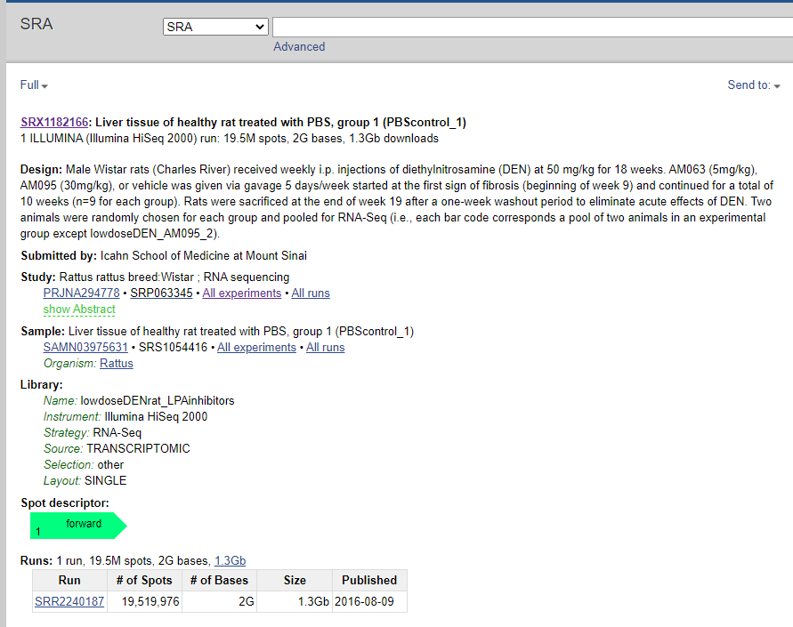
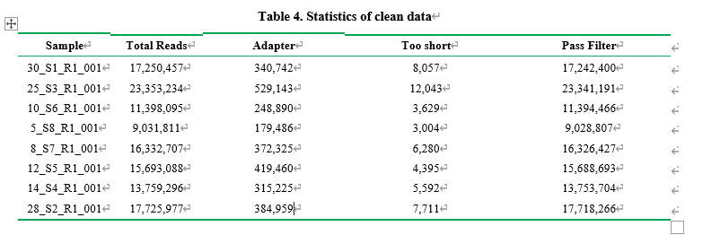
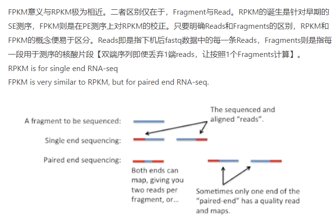

# 目录
一定结合[该文章](https://luohao-brian.gitbooks.io/gene_sequencing_book/content/di-4-8282-gou-jian-wgs-zhu-liu-cheng.html)看  


   * [RNA-seq分析](#rna-seq分析)
      * [0. 介绍](#0-介绍)
      * [1. 前期准备](#1-前期准备)
      * [2. 工具下载](#2-工具下载)
         * [2.0 生信管理工具](#20-生信管理工具)
         * [2.1 sratoolkit](#21-sratoolkit)
         * [2.2 fastqc](#22-fastqc)
         * [2.3 multiqc](#23-multiqc)
         * [2.4 cutadapt](#24-cutadapt)
         * [2.5 trimmomatic](#25-trimmomatic)
         * [2.6 hisat2](#26-hisat2)
         * [sortmerna](#sortmerna)
         * [2.7 samtools](#27-samtools)
         * [2.8 HTseq](#28-htseq)
         * [2.9 R](#29-r)
         * [2.10 Rstudio](#210-rstudio)
         * [2.11 parallel](#211-parallel)
         * [StringTie[可选]](#stringtie可选)
         * [Ballgown[可选]](#ballgown可选)
      * [3. 数据下载](#3-数据下载)
         * [3.1 参考数据](#31-参考数据)
            * [Ensembl](#ensembl)
         * [3.2 测试数据（实验数据）](#32-测试数据实验数据)
      * [4. 质量控制](#4-质量控制)
         * [4.1 质量评估](#41-质量评估)
         * [4.2 剔除接头以及测序质量差的碱基](#42-剔除接头以及测序质量差的碱基)
         * [4.4 再次去除低质量区域](#44-再次去除低质量区域)
         * [4.3 再次查看质量情况](#43-再次查看质量情况)
      * [5. 去除rRNA序列](#5-去除rrna序列)
      * [6. 序列比对](#6-序列比对)
         * [6.1 建立索引](#6.1建立索引)
         * [6.2-开始比对](#6.2-开始比对)
      * [7. 表达量统计](#7-表达量统计)
      * [8. 合并表达矩阵与标准化](#8-合并表达矩阵与标准化)
         * [8.1 合并](#81-合并)
         * [8.2 数据标准化](#82-数据标准化)
            * [8.2.1 简介](#821-简介)
         * [8.2.2 cufflinks](#822-cufflinks)
         * [8.2.3 手动计算](#823-手动计算)
      * [9. 差异表达分析](#9-差异表达分析)
         * [9.1 数据前处理](#91-数据前处理)
         * [9.2 差异分析](#92-差异分析)
            * [9.2.1 安装与加载包](#921-安装与加载包)
            * [9.2.2 构建对象](#922-构建对象)
            * [9.2.3 样本相关性](#923-样本相关性)
            * [9.2.4 差异基因](#924-差异基因)
      * [10. 提取差异表达基因与注释](#10-提取差异表达基因与注释)
         * [10.1 名词解释](#101-名词解释)
         * [10.2 使用ClusterProfiler对基因的ID进行转化](#102-使用clusterprofiler对基因的id进行转化)
         * [10.3 使用biomaRt进行注释](#103-使用biomart进行注释)
      * [11. 可视化](#11-可视化)
      * [12. 富集分析](#12-富集分析)
         * [12.1 Gene Ontology (GO)分析](#121-gene-ontology-go分析)
         * [12.2 KEGG分析](#122-kegg分析)
         * [12.3 GSEA分析](#123-gsea分析)
         * [12.4 DO（Disease Ontology）分析](#124-dodisease-ontology分析)
         * [12.4 另外可以使用几个在线网站](#124-另外可以使用几个在线网站)
      * [========================================](#-1)
      * [5. 表达量分析](#5-表达量分析)
      * [6. 表达量分析](#6-表达量分析)
      * [7. 差异表达分析](#7-差异表达分析)
      * [作者](#作者)
      * [参考](#参考)
         * [流程](#流程)
         * [结果解读](#结果解读)
         * [原理](#原理)
         * [程序下载安装](#程序下载安装)
         * [问题](#问题)

# RNA-seq分析

## 0. 介绍
```
转录组（Transcriptome）被定义为一个细胞中存在的所有转录本读取的集合。
RNA-seq数据用于研究和/或量化一个生物体的转录组，它可用于以下类型的实验：

差异基因表达（Differential Gene Expression）: 转录本水平的定量评估和比较
转录组组装（Transcriptome assembly）: 构建基因组转录区域的轮廓，是一种定性评估
能被用于帮助建立更好的基因模型，并使用组装来验证
元转录组学或群体转录组学分析
RNA-seq 除了得到差异表达的基因之外，还可以对SNP、新颖的转录本、可变剪接、RNA编辑等进行分析，但是最为常见的是得到差异表达的基因。
```

各种软件功能简介：
```
     database                   Workflow                        tools
======================================================================================
  
+=================+     +-------------------------+                               
|     database    |     |      Quality Analysis   |---------------> fastqc 
+=================+     +-------------------------+                                
|+------+         |                 v                                      
|| rRNA |---------|--+  +-------------------------+
|+------+         |  |  | Base Quality Filtering  |------------> TrimGalore
|  +------+       |  |  +-------------------------+
|  |genome|-------|-+|              v
|  +------+       | ||  +-------------------------+
|     +----------+| |+->| rRNA Sequence Filtering |------------> SortMeRNA
|     |  Genome  || |   +-------------------------+
|     |Annotation|| |               v
|     +----------+| |   +-------------------------+
|          |      | +-->|   Genome Alignment      |------------> hisat2
+----------|------+     +-------------------------+
           |                        v
           |            +-------------------------+
           +----------->|  Count Mapped Reads     |------------> HTseq
                        +-------------------------+
                                    v
                        +-------------------------+
                        | Differential Expression |------------> DESeq2
                        +-------------------------+
                                    v
                        +-------------------------+
                        |     Pathway analysis    |------------> ClusterProfiler
                        +-------------------------+
```
各类数据分析步骤及需要用到的软件：  
* RNA-seq  
① MultiQC 整理数据，general statistics  
② featureCounts： Subread featureCounts是一个高效的通用阅读摘要程序，用于计算基因组特征（如基因，外显子，启动子，基因体，基因组箱和染色体位置）的映射读取。    
③ cutadapt： Cutadapt是一种工具，用于从高通量测序读取中查找和删除adapter序列，引物，poly-A尾部和其他类型的不需要的序列。   
④ fastQC: FastQC是高通量序列数据的质量控制工具。  
* whole-genome seq :   
① MultiQC 整理数据，general statistics  
② QualiMap： 是一个独立于平台的应用程序，用于促进比对序列数据及其衍生物（如特征计数）的质量控制。        
③ SnpEff： SnpEff是一个遗传变异注释和效果预测工具箱。它注释和预测变异对基因的影响（如氨基酸变化）。     
④ GATK: GATK是一个工具包，提供各种工具，主要关注变异发现和基因分型。  
⑤ Picard： Picard 是一组用于操作高通量测序数据的 Java 命令行工具。  
⑥ FastQ Screen ：FastQ Screen允许您根据一组序列数据库筛选FastQ格式的序列库，以便您可以查看库的组成是否与您期望的匹配。  
⑦ fastQC: FastQC是高通量序列数据的质量控制工具。   
* Bisulfite seq   
① MultiQC 整理数据，general statistics  
② Bismark ： Bismark是一种绘制亚硫酸氢盐转化序列读数和确定胞嘧啶甲基化状态的工具。  
③ cutadapt： Cutadapt是一种工具，用于从高通量测序读取中查找和删除adapter序列，引物，poly-A尾部和其他类型的不需要的序列。  
④ fastQC: FastQC是高通量序列数据的质量控制工具。  
* Hi-C  
① MultiQC 整理数据，general statistics  
② HICUP： HiCUP（Hi-C user pipeline）是一种用于对Hi-C数据进行映射和执行质量控制的工具。  
③ fastQC: FastQC是高通量序列数据的质量控制工具。   
* MultiQC  
① MultiQC 整理数据，general statistics  
② edgeR：样本相似性由通过 edgeR 归一化的基因计数生成。然后计算 log2 归一化 CPM 值之间的欧氏距离并进行聚类。  
③ MDS PLOT: 显示项目中样本之间的相关性。这些值是在 edgeR_heatmap_MDS.r 脚本中使用 edgeR 计算的。    
④ STAR: STAR是一种超快的通用RNA-seq aligner。  
⑤ cutadapt： Cutadapt是一种工具，用于从高通量测序读取中查找和删除adapter序列，引物，poly-A尾部和其他类型的不需要的序列。  
⑥ fastQC: FastQC是高通量序列数据的质量控制工具。    


## 1. 前期准备
将目录建在d盘 cd /mnt/d  
建立目录    
`mkdir biosoft`   
`mkdir -p project/rat`    
`mkdir annotation genome sequence output script`  
 
结果：  
```
xuruizhi@DESKTOP-HI65AUV:/mnt/d/project/rat$ tree
.
├── annotation
├── genome
├── output
├── script
└── sequence

5 directories, 0 files
```

## 2. 工具下载 
### 2.0 生信管理工具 

Linux brew  
来源[wang-q Ubuntu -](https://github.com/wang-q/ubuntu#install-linuxbrew)

### 2.1 sratoolkit   
* 使用brew安装  
```
xuruizhi@DESKTOP-HI65AUV:~$ brew install sratoolkit

HOMEBREW_BREW_GIT_REMOTE set: using https://mirrors.tuna.tsinghua.edu.cn/git/homebrew/brew.git for Homebrew/brew Git remote.
HOMEBREW_CORE_GIT_REMOTE set: using https://mirrors.tuna.tsinghua.edu.cn/git/homebrew/homebrew-core.git for Homebrew/core Git remote.
Running `brew update --auto-update`...
Warning: sratoolkit 3.0.0 is already installed and up-to-date.
To reinstall 3.0.0, run:
  brew reinstall sratoolkit
```
### 2.2 fastqc  
* 使用brew安装  
```
xuruizhi@DESKTOP-HI65AUV:~$ brew install fastqc
HOMEBREW_BREW_GIT_REMOTE set: using https://mirrors.tuna.tsinghua.edu.cn/git/homebrew/brew.git for Homebrew/brew Git remote.
HOMEBREW_CORE_GIT_REMOTE set: using https://mirrors.tuna.tsinghua.edu.cn/git/homebrew/homebrew-core.git for Homebrew/core Git remote.
Running `brew update --auto-update`...
Warning: fastqc 0.11.9_1 is already installed and up-to-date.
To reinstall 0.11.9_1, run:
  brew reinstall fastqc
```
### 2.3 multiqc 
``` 
# 使用python的安装器安装
pip install multiqc
```
```
xuruizhi@DESKTOP-HI65AUV:~$ pip install multiqc

Requirement already satisfied: multiqc in /home/linuxbrew/.linuxbrew/lib/python3.9/site-packages (1.12)
。。。
  File "/home/linuxbrew/.linuxbrew/opt/python@3.9/lib/python3.9/site-packages/pip/_internal/utils/logging.py", line 179, in emit
    self.handleError(record)
Message: '[present-rich] %s'
Arguments: (UpgradePrompt(old='22.1.2', new='22.2.2'),)
```
### 2.4 cutadapt  

pip install cutadapt 类似  
```
# Check that cutadapt is installed
xuruizhi@DESKTOP-HI65AUV:~$ cutadapt --version
4.1

# Check that FastQC is installed
xuruizhi@DESKTOP-HI65AUV:~$ fastqc -v
FastQC v0.11.9
```

### 2.5 质量修剪  
* Trim Galore
```
cd /mnt/d/biosoft
# 先挂载到d盘相应文件

wget https://github.com/FelixKrueger/TrimGalore/archive/0.6.3.tar.gz -O TrimGalore.gz

gzip -d TrimGalore.gz
```
! [作者GitHub](https://github.com/FelixKrueger/TrimGalore)已经更新至2021年7月的0.6.6版本
```
# Install Trim Galore
curl -fsSL https://github.com/FelixKrueger/TrimGalore/archive/0.6.6.tar.gz -o TrimGalore.tar.gz
tar xvzf TrimGalore.tar.gz

# Run Trim Galore
~/TrimGalore-0.6.6/trim_galore
```
结果：  
```
xuruizhi@DESKTOP-HI65AUV:/mnt/d/biosoft$ curl -fsSL https://github.com/FelixKrueger/TrimGalore/archive/0.6.6.tar.gz -o TrimGalore.tar.gz
xuruizhi@DESKTOP-HI65AUV:/mnt/d/biosoft$ ls
TrimGalore.tar.gz  Trimmomatic-0.38  Trimmomatic-0.38.zip  hisat2-2.2.1  sortmerna-2.1  sortmerna-2.1.tar.gz  wget-log
xuruizhi@DESKTOP-HI65AUV:/mnt/d/biosoft$ tar xvzf TrimGalore.tar.gz
TrimGalore-0.6.6/
TrimGalore-0.6.6/.travis.yml
TrimGalore-0.6.6/Changelog.md
。。。
```
`！师兄的办法会得到一个单独的TrimGalore文件；作者的办法会得到包括trim_galore及其license在内的一个文件夹`

* fastp  
* trimmomatic  
```
cd /mnt/d/biosoft
# 先挂载到d盘相应文件 

wget http://www.usadellab.org/cms/uploads/supplementary/Trimmomatic/Trimmomatic-0.38.zip
unzip Trimmomatic-0.38.zip

cd Trimmomatic-0.38

# 导入临时环境变量
export PATH="$(pwd):$PATH"
```
### 2.6 hisat2  

1. [hisat2官网更改](https://daehwankimlab.github.io/hisat2/)
2. 右侧download下载,直接点击下载即可，不需要回到终端再下载。下载完成后剪切到d/biosoft文件夹内解压
```
Version: HISAT2 2.2.1
Release Date: 7/24/2020

Linux_x86_64	https://cloud.biohpc.swmed.edu/index.php/s/oTtGWbWjaxsQ2Ho/download
```
3. 回到终端写入环境
```

# 导入临时环境变量
$ export PATH="~/biosoft/hisat2-2.1.0:$PATH"

# 测试是否可用
$ hisat2 -h

xuruizhi@DESKTOP-HI65AUV:/mnt/d/biosoft$  hisat2 -h
HISAT2 version 2.2.1 by Daehwan Kim (infphilo@gmail.com, www.ccb.jhu.edu/people/infphilo)
Usage:
```
### sortmerna [选做]
有时因为安全问题无法直接从网页下载，最好还是回到终端在本地下载  

```
cd /mnt/d/biosoft
# 先挂载到d盘相应文件 
# 下载软件,已经是最新版本
$ wget https://github.com/biocore/sortmerna/archive/2.1.tar.gz -O sortmerna-2.1.tar.gz

# 解压
$ tar -xzvf sortmerna-2.1.tar.gz
$ cd sortmerna-2.1

# 配置相关信息
$ ./configure --prefix=$PWD

# 编译
$ make -j 4

# 查看是否成功
$ ./sortmerna --help

# 导入到环境变量
$ export PATH="$(pwd):$PATH"
```
结果： [具体参考](https://github.com/outcastaaa/bioinformatics-learning/blob/main/RNA-seq/%E8%A7%A3%E5%8E%8B%E5%90%8E.md) 

原本数据存放在`d/biosoft/sortmerna-2.1`文件夹内，移动数据库位置之前先在d盘新建一个database/sortmerna_db/rRNA_databases存放数据

```
xuruizhi@DESKTOP-HI65AUV:/mnt/d$ mkdir database
xuruizhi@DESKTOP-HI65AUV:/mnt/d$ cd database
。。。
xuruizhi@DESKTOP-HI65AUV:/mnt/d/database/sortmerna_db$ ls
rRNA_databases
```
```
# 把数据库文件移动到能找到的地方,d盘的database文件夹内
#没搞明白
$ mv ./rRNA_databases/ /mnt/d/database/sortmerna_db/rRNA_databases

# 相关库文件
$ cd ~/database/rRNA_databases
$ sortmerna_ref_data=$(pwd)/rRNA_databases/silva-bac-16s-id90.fasta,$(pwd)/index/silva-bac-16s-db:\
$(pwd)/rRNA_databases/silva-bac-23s-id98.fasta,$(pwd)/index/silva-bac-23s-db:\
$(pwd)/rRNA_databases/silva-arc-16s-id95.fasta,$(pwd)/index/silva-arc-16s-db:\
$(pwd)/rRNA_databases/silva-arc-23s-id98.fasta,$(pwd)/index/silva-arc-23s-db:\
$(pwd)/rRNA_databases/silva-euk-18s-id95.fasta,$(pwd)/index/silva-euk-18s-db:\
$(pwd)/rRNA_databases/silva-euk-28s-id98.fasta,$(pwd)/index/silva-euk-28s-db:\
$(pwd)/rRNA_databases/rfam-5s-database-id98.fasta,$(pwd)/index/rfam-5s-db:\
$(pwd)/rRNA_databases/rfam-5.8s-database-id98.fasta,$(pwd)/index/rfam-5.8s-db

# 真核生物的rRNA不需要那么多(5s, 5.8s, 18s, 28s)
$ euk_rNRA_ref_data=$(pwd)/rRNA_databases/silva-euk-18s-id95.fasta,$(pwd)/index/silva-euk-18s-db:\
$(pwd)/rRNA_databases/silva-euk-28s-id98.fasta,$(pwd)/index/silva-euk-28s-db:\
$(pwd)/rRNA_databases/rfam-5s-database-id98.fasta,$(pwd)/index/rfam-5s-db:\
$(pwd)/rRNA_databases/rfam-5.8s-database-id98.fasta,$(pwd)/index/rfam-5.8s-db

# 建立数据库索引
$ indexdb_rna --ref $data
```

### 2.7 samtools
最新版本为1.16  
本地下载时，在配制这步出错，使用`brew install samtools`安装

### 2.8 HTseq
```
pip install -i https://pypi.tuna.tsinghua.edu.cn/simple HTseq
```

### 2.9 R
最新版本4.2.1_2  
先进入官网，用清华镜像源下载合适版本的R，再`brew install r`

```
xuruizhi@DESKTOP-HI65AUV:~$ brew install r
HOMEBREW_BREW_GIT_REMOTE set: using https://mirrors.tuna.tsinghua.edu.cn/git/homebrew/brew.git for Homebrew/brew Git remote.
HOMEBREW_CORE_GIT_REMOTE set: using https://mirrors.tuna.tsinghua.edu.cn/git/homebrew/homebrew-core.git for Homebrew/core Git remote.
Running `brew update --auto-update`...
Warning: r 4.2.1_2 is already installed and up-to-date.
To reinstall 4.2.1_2, run:
  brew reinstall r
  ```
* !R 安装时多次尝试，RStudio都识别不到，因此直接在官网选择`Download R for Windows; install R for the first time`下载安装包即可；注意可以将两个文件放在同一个文件夹内  
[参考](https://blog.csdn.net/m0_49354332/article/details/116059239)  


### 2.10 Rstudio
进入网站：`https://www.rstudio.com/products/rstudio/download/`  
R studio 可以在 Windows 下安装;
选择版本下载,下载完成之后双击安装。  
`
Windows 10/11	   
RStudio-2022.07.1-554.exe
`
### 2.11 parallel  
```
brew install parallel
```
### StringTie[可选]  
安装：  #师兄的安装方式是MAC，改成Linux
```
cd /mnt/d/biosoft

wget http://ccb.jhu.edu/software/stringtie/dl/stringtie-2.2.1.Linux_x86_64.tar.gz

tar -xzvf stringtie-2.2.1.Linux_x86_64.tar.gz
mv stringtie-2.2.1.Linux_x86_64 stringtie-2.2.1
cd stringtie-2.2.1

export PATH="$(pwd):$PATH"

stringtie --help
```

### Ballgown[可选]
不知道在哪里安装
```
source("http://bioconductor.org/biocLite.R")
biocLite("Ballgown")
```
## 3. 数据下载  

### 3.1 参考数据
1. [Ensemble网址](https://asia.ensembl.org/)  
在左侧`All genomes`中，选择物种`Rat`; 在左侧`Download DNA sequence (FASTA)` 下载基因组序列数据; 在右侧的`Download GTF or GFF3 (files for genes, cDNAs, ncRNA, proteins)`下载基因注释文件     

 


2. ensemble中[基因组数据集命名方式](http://ftp.ensembl.org/pub/release-107/fasta/rattus_norvegicus/dna/README)  

* 这些文件始终按照以下模式命名：
```
   <species>.<assembly>.<sequence type>.<id type>.<id>.fa.gz
例：
    Rattus_norvegicus.mRatBN7.2.dna.nonchromosomal.fa.gz  
    Rattus_norvegicus.mRatBN7.2.dna.primary_assembly.1.fa.gz
    Rattus_norvegicus.mRatBN7.2.dna_sm.toplevel.fa.gz


<species>：物种的系统名称。

<assembly>：程序集构建名称。

<sequence type>：
  * 'dna' - unmasked未屏蔽的基因组 DNA 序列。
  * 'dna_rm' - masked掩蔽的基因组 DNA。使用 RepeatMasker 工具检测散布的 重复和低复杂性区域，并通过用“N”替换重复来掩盖。
  * 'dna_sm' -  soft-masked软掩蔽基因组 DNA。所有重复和低复杂性区域都已替换为 其核酸碱基的小写版本

<id 类型> 以下之一：
  * 'chromosome' - Ensembl 中大多数物种的顶级坐标系top-level coordinate system
  * 'nonchromosomal' - 包含尚未分配到染色体的 DNA
  * 'seqlevel' - 这通常是sequence scaffolds、块chunks或克隆clones。
     -- 'scaffold' - 短的测序reads（通常来自whole genome shotgun, WGS）组装成较大的序列contigs，但尚未组装成染色体。需要更多的基因组测序来缩小gaps并建立 a tiling path。
     -- 'chunk' - 虽然 contig 序列可以组装成更大区块，有时必须人为地将它们分解为更小的块，称为'chunks'。这是由于注释中的限制pipeline 和 MySQL 有限的记录大小，用于存储序列和注释信息。
     -- 'clone' - 通常这是最小的序列单位。它通常与一个 BAC 克隆的序列或一个 BAC 克隆的序列区域相同，后者形成了tiling path.
<id>：实际的序列标识符。根据 <id type> <id>
          可以代表A chromosome, a scaffold, a contig, a clone的名称..
          seqlevel 文件的字段为空

fa：这些目录中的所有文件都代表FASTA数据库文件

gz：所有文件都使用 GNU Zip 压缩以提高存储效率。
```
* TOPLEVEL    

这些文件包含了 在 Ensembl 模式中标记为toplevel的所有序列区域。 这包括染色体chromsomes、未组装成染色体not assembled into chromosomes的区域和 N 填充的单倍型haplotype/补丁patch区域。

* PRIMARY ASSEMBLY  

初级组装包含所有toplevel序列区域，不包括单倍型和补丁。  
该文件最适合用于`序列相似性搜索`，因为其中补丁和单倍型序列会混淆分析。 如果primary assembly文件不存在，则表明没有单倍型/补丁区域，此时与“toplevel”文件相同。

* special 注意  
一些染色体是单倍体，例如人类的X和Y染色体  
为了比对时能正确输出报告，这些单倍体的assembly和patch区域都会补上同等数量的N   
例如： A patch region with a start position of 1,000,001 will have 1e6 N's added，因这样对齐程序将报告相对于
整个染色体。

人类已对 Y 染色体进行了测序，并对 Y 上的伪常染色体区域pseudoautosomal region (PAR) 进行了注释。 根据定义，PAR 区域在 X 和 Y 染色体上是相同的。 Y染色体文件包含Y染色体减去这些重复的 PAR 区域，即 Y 的唯一部分。  


3. 基因组下载代码：  
目前大鼠的基因组测序版本到了7.2  
可以直接在网页下载，也可用代码  
```
# 下载
cd /mnt/d/project/rat/genome
wget http://ftp.ensembl.org/pub/release-107/fasta/rattus_norvegicus/dna/Rattus_norvegicus.mRatBN7.2.dna.toplevel.fa.gz
gzip -d Rattus_norvegicus.mRatBN7.2.dna.toplevel.fa.gz

# 改名（方便后面使用，名字太长一来不方便输入，二来可能会输错）
mv Rattus_norvegicus.mRatBN7.2.dna.toplevel.fa mRatBN7.2.fa
```
4. 对下载的基因组数据进行整理  

！ 和师兄的演示不一样的原因：因为师兄下载的测序版本是6，[旧版本](http://ftp.ensembl.org/pub/release-104/fasta/rattus_norvegicus/dna/)    
`下载的数据id类型是chromosome，新版本是PRIMARY ASSEMBLY`  

  


* 下载得到的基因组文件可以查看一下包含哪些染色体，确认文件是否下载正确。
```
cat mRatBN7.2.fa | grep "^>"
```
* 结果：除了1-20号+X+Y+MT之外还有很多别的ID名。这些都是scaffold
```
>19 dna:primary_assembly primary_assembly:mRatBN7.2:19:1:57337602:1 REF
>20 dna:primary_assembly primary_assembly:mRatBN7.2:20:1:54435887:1 REF
>X dna:primary_assembly primary_assembly:mRatBN7.2:X:1:152453651:1 REF
>Y dna:primary_assembly primary_assembly:mRatBN7.2:Y:1:18315841:1 REF
>MT dna:primary_assembly primary_assembly:mRatBN7.2:MT:1:16313:1 REF
>MU150191.1 dna:primary_assembly primary_assembly:mRatBN7.2:MU150191.1:1:1794995:1 REF

>JACYVU010000493.1 dna:primary_assembly primary_assembly:mRatBN7.2:JACYVU010000493.1:1:444596:1 REF
>MU150193.1 dna:primary_assembly primary_assembly:mRatBN7.2:MU150193.1:1:383091:1 REF
```
* 每一条primary_assembly的名称后面还跟了一些描述信息，这些描述信息就是当前组装版本，长度等等信息，但是这个信息会妨碍后面写脚本统计或者一些分析，所以这里最好去掉  
```
# 首先将之前的名称更改一下
mv mRatBN7.2.fa mRatBN7.2.raw.fa

# 然后去除染色体编号后的描述信息
$ cat mRatBN7.2.raw.fa | perl -n -e 'if(m/^>(.+?)(?:\s|$)/){ print ">$1\n";}else{print}' > mRatBN7.2.fa

# 删除
$ rm mRatBN7.2.raw.fa
```  
结果：
```
>19
>20
>X
>Y
>MT
>MU150191.1
>MU150189.1
>MU150194.1
>MU150190.1
>MU150195.1
>JACYVU010000493.1
>MU150193.1
>MU150196.1
>MU150197.1
>JACYVU010000705.1
>JACYVU010000706.1
>MU150192.1
>JACYVU010000707.1
```

* 可以使用脚本统计每一条染色体的长度  
```
cat mRatBN7.2.fa | perl -n -e '
    s/\r?\n//;
    if(m/^>(.+?)\s*$/){
        $title = $1;
        push @t, $title;
    }elsif(defined $title){
        $title_len{$title} += length($_);
    }
    END{
        for my $title (@t){
            print "$title","\t","$title_len{$title}","\n";
        }
    }
'
```
结果：  
```
。。。
19      57337602
20      54435887
X       152453651
Y       18315841
MT      16313
MU150191.1      1794995
MU150189.1      1402623
MU150194.1      648519
MU150190.1      573231
MU150195.1      529129
JACYVU010000493.1       444596
。。。
```  
* 以染色体1 举例  
```
cat mRatBN7.2.fa | perl -n -e '
  if(m/^>/){
    if(m/>1$/){
      $title = 1;
    }else{
      $title = 0;
    }
  }else{
    push @s, $_ if $title;
  }
  END{
    printf ">1\n%s", join("", @s);
  }
' > mRatBN7.2.chr1.fa
```
5. 下载基因组索引文件 - [可选]

方法1. 在[hisat2 官网](https://daehwankimlab.github.io/hisat2/download/#r-norvegicus)上可以找到现成的已经建立好索引的大鼠基因组文件, 点击`	https://genome-idx.s3.amazonaws.com/hisat/rn6_genome.tar.gz`, 下载到了`D:\database`文件夹内   
或通过代码下载  
```
cd /mnt/d/database
wget https://genome-idx.s3.amazonaws.com/hisat/rn6_genome.tar.gz
gzip -d rn6.tar
```

方法2. 自己用命令基于之前下载的基因组文件自行建立   


6.  下载注释信息  
```
# 下载 gff3 格式
cd /mnt/d/project/rat/annotation
wget http://ftp.ensembl.org/pub/release-107/gff3/rattus_norvegicus/Rattus_norvegicus.mRatBN7.2.107.gff3.gz
gzip -d Rattus_norvegicus.mRatBN7.2.107.gff3.gz
# 同样的也改名
mv Rattus_norvegicus.mRatBN7.2.107.gff3 mRatBN7.2.gff
# 使用head查看部分
head mRatBN7.2.gff

# gff查看结果：
xuruizhi@DESKTOP-HI65AUV:/mnt/d/project/rat/annotation$ head mRatBN7.2.gff
##gff-version 3
##sequence-region   1 1 260522016
##sequence-region   10 1 107211142
##sequence-region   11 1 86241447
##sequence-region   12 1 46669029
##sequence-region   13 1 106807694
##sequence-region   14 1 104886043
##sequence-region   15 1 101769107
##sequence-region   16 1 84729064
##sequence-region   17 1 86533673 


# 下载 gtf 格式  
cd /mnt/d/project/rat/annotation
wget http://ftp.ensembl.org/pub/release-107/gtf/rattus_norvegicus/Rattus_norvegicus.mRatBN7.2.107.gtf.gz
gzip -d 	Rattus_norvegicus.mRatBN7.2.107.gtf.gz

# gtf查看结果

xuruizhi@DESKTOP-HI65AUV:/mnt/d/project/rat/annotation$ head  mRatBN7.2.107.gtf

#gtf文件开头描述了这个注释数据的基本信息，比如版本号，更新时间，组装的NCBI的Assembly编号等等，后面每一行表示描述信息，说明了在哪条染色体的什么位置是什么东西。
#!genome-build mRatBN7.2
#!genome-version mRatBN7.2
#!genome-date 2020-11
#!genome-build-accession GCA_015227675.2
#!genebuild-last-updated 2021-02
1       ensembl gene    36112690        36122387        .       -       .       gene_id "ENSRNOG00000066169"; gene_version "1"; gene_source "ensembl"; gene_biotype "protein_coding";
# 比如该行表示在1号染色体负链上 36112690-36122387 这个范围内有一个基因编号为ENSRNOG00000066169的基因

1       ensembl transcript      36112690        36122387        .       -       .       gene_id "ENSRNOG00000066169"; gene_version "1"; transcript_id "ENSRNOT00000101581"; transcript_version "1"; gene_source "ensembl"; gene_biotype "protein_coding"; transcript_source "ensembl"; transcript_biotype "protein_coding";
1       ensembl exon    36122324        36122387        .       -       .       gene_id "ENSRNOG00000066169"; gene_version "1"; transcript_id "ENSRNOT00000101581"; transcript_version "1"; exon_number "1"; gene_source "ensembl"; gene_biotype "protein_coding"; transcript_source "ensembl"; transcript_biotype "protein_coding"; exon_id "ENSRNOE00000618632"; exon_version "1";
1       ensembl CDS     36122324        36122387        .       -       0       gene_id "ENSRNOG00000066169"; gene_version "1"; transcript_id "ENSRNOT00000101581"; transcript_version "1"; exon_number "1"; gene_source "ensembl"; gene_biotype "protein_coding"; transcript_source "ensembl"; transcript_biotype "protein_coding"; protein_id "ENSRNOP00000083062"; protein_version "1";
1       ensembl exon    36121478        36121512        .       -       .       gene_id "ENSRNOG00000066169"; gene_version "1"; transcript_id "ENSRNOT00000101581"; transcript_version "1"; exon_number "2"; gene_source "ensembl"; gene_biotype "protein_coding"; transcript_source "ensembl"; transcript_biotype "protein_coding"; exon_id "ENSRNOE00000610554"; exon_version "1";
```

7. ensemble中  
[gff 注释信息命名方式](http://ftp.ensembl.org/pub/release-107/gff3/rattus_norvegicus/README)  
[gtf 注释信息命名方式](http://ftp.ensembl.org/pub/release-107/gtf/rattus_norvegicus/README)  

两者注释区别：gff是先判断该序列属于gene还是转录本等，呈现出不同的主要特征信息；但是gtf是所有的信息全部呈现出来

gff 注释信息：  

① gene features的类型：   

*  "gene" 代表 protein-coding genes 编码蛋白的基因  
*  "ncRNA_gene" 代表 RNA genes   RNA基因   
*  "pseudogene" 代表 pseudogenes假基因  

② transcript features的类型:
   * "mRNA" 代表 protein-coding transcripts 编码蛋白的转录本
   * a specific type or RNA transcript such as "snoRNA" or "lnc_RNA"  RNA转录本
   * "pseudogenic_transcript" for pseudogenes 假基因转录本
所有的转录本都和exon特征相关。编码蛋白的转录本和 "CDS", "five_prime_UTR", and "three_prime_UTR" 特征相关。


③ Attributes for feature types:
* region types: "five_prime_UTR", and "three_prime_UTR"
    * ID: 唯一识别号, 形式 "<region_type>:<region_name>"
    * [Alias]：别名，以逗号分隔的别名列表，通常包括 INSDC accession
    * [Is_circular]: 标志环形区域 circular regions
 * gene types:
    * ID:  唯一识别号, 形式 "gene:<gene_stable_id>"
    * biotype: Ensembl 生物型, e.g. "蛋白质编码", "假基因"
    * gene_id: Ensembl 基因稳定 ID  
    * version: Ensembl 基因版本   
    * [Name]： 基因名称
    * [description]： 基因描述
 * transcript types:  
    * ID: 唯一识别号, 形式 "transcript:<transcript_stable_id>"
    * Parent: 基因标识符, 形式 "gene:<gene_stable_id>"
    * biotype: Ensembl 生物型, e.g. "蛋白质编码", "假基因" 
    * transcript_id: Ensembl 转录本 stable ID
    * version: Ensembl 转录本版本
    * [Note]: 如果转录序列已被编辑 (i.e. 和基因组序列不同), 编辑在注释中描述。
 * exon
    * Parent: Transcript identifier, 形式 "transcript:<transcript_stable_id>"
    * exon_id: Ensembl 外显子 stable ID
    * version: Ensembl 外显子版本
    * constitutive: 组成型外显子，标志着该外显子在所有转录本中均存在
    * rank:  代表5'->3' ordering of exons的整数
 * CDS  
 CDS（Coding sequence）是指成熟mRNA中可以被翻译为蛋白质的编码序列区域，自起始密码子开始至终止密码子结束。
    * ID:  唯一识别号, 形式  "CDS:<protein_stable_id>"
    * Parent: Transcript identifier，形式"transcript:<transcript_stable_id>"
    * protein_id: Ensembl 蛋白 stable ID
    * version: Ensembl 蛋白版本

④ 元数据Metadata：
 * 基因组构建 - 构建assembly的标识符，例如GRCh37.p11
 * 基因组版本 - 此assembly的版本，例如GRCh37
 * 基因组日期 - 此assembly的发布日期，例如2009-02
 * 基因组构建加入 - 基因组加入，例如GCA_000001405.14
 * genebuild-last-updated - 最后一次genebuild更新的日期，例如2013-09


⑤ FILE NAMES： 
  <species>.<assembly>.<_version>.gff3.gz  

对于预测的基因集，在名称文件中添加了一个额外的 abinitio 标志。  
  <species>.<assembly>.<version>.abinitio.gff3.gz  

```
e.g. 
GL476399        Pmarinus_7.0    supercontig     1       4695893 .       .       .       ID=supercontig:GL476399;Alias=scaffold_71
GL476399        ensembl gene                  2596494   2601138 .       +       .       ID=gene:ENSPMAG00000009070;Name=TRYPA3;biotype=protein_coding;description=Trypsinogen A1%3B Trypsinogen a3%3B Uncharacterized protein  [Source:UniProtKB/TrEMBL%3BAcc:O42608];logic_name=ensembl;version=1
```


[gtf 注释信息](http://ftp.ensembl.org/pub/release-107/gtf/rattus_norvegicus/README)   


 GTF (General Transfer Format)   
① FILE NAMES：   
  <species>.<assembly>.<_version>.gtf.gz    

对于预测的基因集，在名称文件中添加了一个额外的 abinitio 标志。    
  <species>.<assembly>.<version>.abinitio.gtf.gz  

② Fields  

Fields are tab-separated. Also, all but the final field in each 
feature line must contain a value; "empty" columns are denoted 
with a '.'  
 
    seqname   - name of the chromosome or scaffold; chromosome names 
                without a 'chr' 
    source    - name of the program that generated this feature, or 
                the data source (database or project name)
    feature   - feature type name. Current allowed features are
                {gene, transcript, exon, CDS, Selenocysteine, start_codon,
                stop_codon and UTR}
    start     - start position of the feature, with sequence numbering 
                starting at 1.
    end       - end position of the feature, with sequence numbering 
                starting at 1.
    score     - a floating point value indiciating the score of a feature
    strand    - defined as + (forward) or - (reverse).
    frame     - one of '0', '1' or '2'. Frame indicates the number of base pairs
                before you encounter a full codon. '0' indicates the feature 
                begins with a whole codon. '1' indicates there is an extra
                base (the 3rd base of the prior codon) at the start of this feature.
                '2' indicates there are two extra bases (2nd and 3rd base of the 
                prior exon) before the first codon. All values are given with
                relation to the 5' end.
    attribute - a semicolon-separated list of tag-value pairs (separated by a space), 
                providing additional information about each feature. A key can be
                repeated multiple times.

③ Attributes  

The following attributes are available. All attributes are semi-colon
separated pairs of keys and values.  

- gene_id: The stable identifier for the gene
- gene_version: The stable identifier version for the gene
- gene_name: The official symbol of this gene
- gene_source: The annotation source for this gene
- gene_biotype: The biotype of this gene
- transcript_id: The stable identifier for this transcript
- transcript_version: The stable identifier version for this transcript
- transcript_name: The symbold for this transcript derived from the gene name
- transcript_source: The annotation source for this transcript
- transcript_biotype: The biotype for this transcript
- exon_id: The stable identifier for this exon
- exon_version: The stable identifier version for this exon
- exon_number: Position of this exon in the transcript
- ccds_id: CCDS identifier linked to this transcript
- protein_id: Stable identifier for this transcript's protein
- protein_version: Stable identifier version for this transcript's protein
- tag: A collection of additional key value tags
- transcript_support_level: Ranking to assess how well a transcript is supported (from 1 to 5)

④ Tags  

Tags are additional flags used to indicate attibutes of the transcript.  

- CCDS: Flags this transcript as one linked to a CCDS record
- seleno: Flags this transcript has a Selenocysteine edit. Look for the Selenocysteine
feature for the position of this on the genome
- cds_end_NF: the coding region end could not be confirmed
- cds_start_NF: the coding region start could not be confirmed
- mRNA_end_NF: the mRNA end could not be confirmed
- mRNA_start_NF: the mRNA start could not be confirmed.
- basic: the transcript is part of the gencode basic geneset


## 3.2 测试数据（实验数据）
从NCBI上查找相关的RNA-seq数据进行下载，在`GEO数据库`中找了一个数据`GSE72960`，对应的`SRP`数据为`SRP063345`   

GEO数据库 [参考文章](https://zhuanlan.zhihu.com/p/132559646#:~:text=GEO%E6%95%B0%E6%8D%AE%E5%BA%93%E5%85%A8%E7%A7%B0Gene%20Expression,Omnibus%20database%EF%BC%8C%E6%98%AF%E7%94%B1%E7%BE%8E%E5%9B%BD%E5%9B%BD%E7%AB%8B%E7%94%9F%E7%89%A9%E6%8A%80%E6%9C%AF%E4%BF%A1%E6%81%AF%E4%B8%AD%E5%BF%83NCBI%E5%88%9B%E5%BB%BA%E5%B9%B6%E7%BB%B4%E6%8A%A4%E7%9A%84%E5%9F%BA%E5%9B%A0%E8%A1%A8%E8%BE%BE%E6%95%B0%E6%8D%AE%E5%BA%93%E3%80%82)  

① 介绍    
GEO数据库全称Gene Expression Omnibus database，是由美国国立生物技术信息中心NCBI创建并维护的基因表达数据库。  
收录了世界各国研究机构提交的高通量基因表达数据，也就是说只要是目前已经发表的论文，论文中涉及到的基因表达检测的数据都可以通过这个数据库中找到。  

② GEO提供的数据类型    
[详细信息](https://www.ncbi.nlm.nih.gov/geo/info/overview.html)  

GSE数据编号(Series)，

GPL数据编号(GEO platforms)，

GSM数据编号(Samples)，

GDS数据编号(Datasets)。  

一篇文章可以有一个或者多个GSE(Series)数据集，一个GSE里面可以有一个或者多个GSM(Samples)样本，而每个数据集都有着自己对应的芯片平台，就是GPL(GEO platforms)。GSE编号一般为作者提交时生成的原始数据编号，后续NCBI中的工作人员会根据研究目的、样品类型等信息归纳整合为一个GDS(Datasets)，整理后的数据还会有GEO profile数据，也就是基因在这次实验中的表达数据。GDS里面的数据往往对应相同的平台具有可比性，另外，不是所有的GSE数据都能被整理，所以，有的GSE数据里面没有GDS数据也是正常。    

③ GEO数据检索、下载方法    
* GSE编号已知 (文献中会提到该编号)：如果你知道GSE编号可以通过网址http://www.ncbi.nlm.nih.gov/geo直接进入  
 [参考文章](https://www.omicsclass.com/article/1100)  
 搜索：   `GSE72960`
   
得到相应数据信息：    
    

    * 点击最下面的`SRA Run selector`下载测序数据, 在Accession中搜索SRA号(SRPxxx，	SRP063345)，里面包含了所有测序样本的测序信息以及文件SRR编号（例如，SRR2190795）

    * 将刚才在`Run selector`中查找到的数据的编号复制下来，之后下载测序数据，下载脚本如下，这里是采用`SRAtoolkit`工具包中的`prefetch`工具，如果部分数据下载失败，那么再次执行下面的代码  
    ```
    # 后台下载
    nohup prefetch SRR2190795 SRR224018{2..7} SRR2240228 -o . &

    # nohup 英文全称 no hang up（不挂起），用于在系统后台不挂断地运行命令，退出终端不会影响程序的运行。nohup 命令，在默认情况下（非重定向时），会输出一个名叫 nohup.out 的文件到当前目录下，如果当前目录的 nohup.out 文件不可写，输出重定向到 $HOME/nohup.out 文件中。
    ```
    或者  
    * 执行下列代码：
    ```
    # 先把需要下载的文件名称写入一个单独的txt文件中
    # 不可像SRR224018{2..7}这样省略，要不然找不到数据

   xuruizhi@DESKTOP-HI65AUV:~/data$  cat >1.txt <<EOF
   > SRR2190795
   > SRR2240182
   > SRR2240183
   > SRR2240184
   > SRR2240185
   > SRR2240186
   > SRR2240187
   > SRR2240228
   > EOF

   # 执行下列代码下载数据,下载到了 ~/data/sra文件夹内  
   [onhup]  prefetch --option-file 1.txt
    ```
    * 网页也可以直接点击下载FASTA/FASTQ文件      

     

    在GSE搜索后的界面的`relation`一栏直接点击`SRA编号`，选择需要的样本SRA文件下载即可  
     此外，在每个SRRxxx的具体页面内，可以查看是单端测序还是双端测序  

      


* GSE编号未知： 通过NCBI主页的入口基因搜索下载。通常是不知道GEO编号，通过`样品类型，实验处理，平台信息`等搜索筛选想要的GEO数据：`https://www.ncbi.nlm.nih.gov/`，进入NCBI主页，搜索数据选择GEO DataSets，如果搜索某个基因表达量可选择GEO Profiles。  
 [参考文章](https://www.omicsclass.com/article/1101)    


 * GEO数据其他编号下载方法：

如果一个GSE数据被NCBI工作人员整理过，会有相应的GDS数据，可到[这个网址](https://www.ncbi.nlm.nih.gov/sites/GDSbrowser)查询    

④ GEO下载数据格式  

    

⑤  格式转换  
下载得到`.sra`文件，使用SRAtoolkit工具包的`fastq-dump`工具，使用它来进行格式转化
```
xuruizhi@DESKTOP-HI65AUV:~/data/sra$ ls
SRR2190795.sra  SRR2240183.sra  SRR2240185.sra  SRR2240187.sra
SRR2240182.sra  SRR2240184.sra  SRR2240186.sra  SRR2240228.sra


$ parallel -j 4 "    # 用parallel多线程加快速度，并行任务数为4
    fastq-dump --split-3 --gzip {1}    # 将sra文件转化为fastq文件之后压缩为gz文件
" ::: $(ls *.sra)     # :::后接对象

# ls *.sra代表，列举出任何以.sra结尾的文件
--gzip 将转换出的fastq文件以gz格式输出，可以节省空间
--split-3 把pair-end测序分成两个文件输出，可用于双端测序转化为两个文件，本文举例为单端测序，删掉不影响
-O 输出文件夹名，不加直接放在该文件夹


# 删除sra文件
$ rm *.sra
```
结果：  
```
Academic tradition requires you to cite works you base your article on.
If you use programs that use GNU Parallel to process data for an article in a
scientific publication, please cite:

  Tange, O. (2022, July 22). GNU Parallel 20220722 ('Roe vs Wade').
  Zenodo. https://doi.org/10.5281/zenodo.6891516

This helps funding further development; AND IT WON'T COST YOU A CENT.
If you pay 10000 EUR you should feel free to use GNU Parallel without citing.

More about funding GNU Parallel and the citation notice:
https://www.gnu.org/software/parallel/parallel_design.html#citation-notice

To silence this citation notice: run 'parallel --citation' once.

Read 15107730 spots for SRR2190795.sra
Written 15107730 spots for SRR2190795.sra
Read 17622974 spots for SRR2240183.sra
Written 17622974 spots for SRR2240183.sra
Read 19779076 spots for SRR2240184.sra
Written 19779076 spots for SRR2240184.sra
Read 24510465 spots for SRR2240182.sra
Written 24510465 spots for SRR2240182.sra
Read 11837415 spots for SRR2240186.sra
Written 11837415 spots for SRR2240186.sra
Read 23017882 spots for SRR2240185.sra
Written 23017882 spots for SRR2240185.sra
Read 19519976 spots for SRR2240187.sra
Written 19519976 spots for SRR2240187.sra
Read 17296729 spots for SRR2240228.sra
Written 17296729 spots for SRR2240228.sra
```
网上找到的另一种循环语句的方法  [https://www.jianshu.com/p/bdfa8f7e5a61](https://www.jianshu.com/p/bdfa8f7e5a61)

```
#定义存放输出数据的文件夹，需要先创建这个文件夹‘fastq’
mkdir fastq
fqdir=/trainee2/Mar7/rna/project/fastq

#转换单个文件
fastq-dump --gzip --split-3 -X 25000 -O ${fqdir} SRR1039510


#批量转换，将样本名写成文件——sample.ID，echo是打印命令，while循环的意义是生成脚本
cat sample.ID | while read id
do
 echo "fastq-dump --gzip --split-3 -X 25000 -O ${fqdir} ${id}
done >sra2fq.sh
# 提交后台运行命令，脚本文件后缀为.sh，日志文件后缀为.log，运行脚本的命令为sh
nohup sh sra2fq.sh>sra2fq.log &

#查看输出的fastq的gz压缩文件，用zless命令
zless -S SRR1039510_1.fastq.gz
```


⑥ `parallel`用法补充 [parallel](https://www.jianshu.com/p/cc54a72616a1)  
```
Usage:

parallel [options] [command [arguments]] < list_of_arguments
parallel [options] [command [arguments]] (::: arguments|:::: argfile(s))...
cat ... | parallel --pipe [options] [command [arguments]]

常用选项：
::: 后面接参数
:::: 后面接文件
-j、--jobs   并行任务数
-N  每次输入的参数数量
--xargs会在一行中输入尽可能多的参数
-xapply 从每一个源获取一个参数（或文件一行）
--header  把每一行输入中的第一个值做为参数名
-m   表示每个job不重复输出“背景”（context）
-X   与-m相反，会重复输出“背景文本”
-q  保护后面的命令
--trim  lr 去除参数两头的空格，只能去除空格，换行符和tab都不能去除
--keep-order/-k   强制使输出与参数保持顺序 --keep-order/-k
--tmpdir/ --results   都是保存文件，但是后者可以有结构的保存
--delay  延迟每个任务启动时间
--halt  终止任务
--pipe    该参数使得我们可以将输入（stdin）分为多块（block）
--block  参数可以指定每块的大小
```


⑦ 格式介绍  
```
# 查看下载好的gz文件
   cd ~/data/sra
   gzip -d -c SRR2190795.fastq.gz | head -n 20

# gzip
-c或--stdout或--to-stdout 　把压缩后的文件输出到标准输出设备，不去更动原始文件。
-d或--decompress或----uncompress 　解开压缩文件。
```
结果：  

```
@SRR2190795.1 HWI-ST1147:240:C5NY7ACXX:1:1101:1320:2244 length=100
ATGCTGGGGGCATTAGCATTGGGTACTGAATTATTTTCAGTAAGAGGGAAAGAATCCATCTCCNNNNNNNNNNNNNNNNNNNNNNAAANAAAAATAAAAT
+SRR2190795.1 HWI-ST1147:240:C5NY7ACXX:1:1101:1320:2244 length=100
CCCFFFFFHHHHHJIJJJJJJJJDHHJJJIJJJJJIJJJJJJJJJJJJJJJJJJJJJJJJJHH#####################################
@SRR2190795.2 HWI-ST1147:240:C5NY7ACXX:1:1101:1598:2247 length=100
AACTTCGGTTCTCTACTAGGAGTATGCCTCATAGTACAAATCCTCACAGGCTTATTCCTAGCANNNNNNNNNNNNNNNNNNNNNNTAACAGCATTTTCAT
+SRR2190795.2 HWI-ST1147:240:C5NY7ACXX:1:1101:1598:2247 length=100
@@@7D8+@A:1CFG<C:23<:E<;FF<BHIIEHG:?:??CDF<9DCGGG?1?FEG@@<@CA#######################################
@SRR2190795.3 HWI-ST1147:240:C5NY7ACXX:1:1101:1641:2250 length=100
AGAAGGTCTTAGATCAGAAGGAGCACAGACTGGATGGTCGTGTCATTGACCCTAAAAAGGCTANNNNNNNNNNNNNNNNNNNNNTGAAGAAAATCTTTGT
+SRR2190795.3 HWI-ST1147:240:C5NY7ACXX:1:1101:1641:2250 length=100
BC@FFFDDHHHHHJJJJJJJJJJJJJJJJJJJJIJJJFHGHHEGHIIIHJIJJIJJIJIJJID#####################################
@SRR2190795.4 HWI-ST1147:240:C5NY7ACXX:1:1101:1851:2233 length=100
GGGATTTCATGGCCTCCACGTAATTATTGGCTCAACTTTCCTAATTGTCTGTCTACTACGACANNNNNNNNNNNNNNNNNNNNNNNNNNNNNNTNNCNNN
+SRR2190795.4 HWI-ST1147:240:C5NY7ACXX:1:1101:1851:2233 length=100
@@?DDBDDFFDDDGHGGGGI?B;FFHGHA@FEHGHDDGHEGGFGHIGEHIIHIGGBGACD6AH#####################################
@SRR2190795.5 HWI-ST1147:240:C5NY7ACXX:1:1101:1957:2243 length=100
CAGCCATTGTGGCTCCCGATGGCTTTGACATCATTGACATGACAGCCGGAGGTCAGATAAACTNNNNNNNNNNNNNNNNNNNNNNATCNGTGGCAAAGGT
+SRR2190795.5 HWI-ST1147:240:C5NY7ACXX:1:1101:1957:2243 length=100
@CCFFFFFHHHHAHJJJIJJJJJJIJJIGGGIFIJIIHIIGGJJJJJJJFHIGIJHHHHHHFC#####################################
```

```
1、sra数据
sra数据是SRA数据库用于储存二代测序数据的原始数据的一种压缩格式，这种数据格式不能直接进行处理，需要转换成fastq才能进行质控以及去adapt等处理——相当于解压缩

2、fastq文件（简称fq文件）
高通量测序得到的原始图像数据文件，经过碱基识别（base calling）分析转化为原始测序序列（sequenced reads），称之为raw data或raw reads，结果以fastq（简称fq）文件格式存储

链接：https://www.jianshu.com/p/bdfa8f7e5a61    

3. 为何转格式、将fq文件压缩？
因为sra是二进制文件，在Linux下如果用less去查看，它会显示这是个二进制文件，你是否确定打开它。一般我们分析测序数据，是用fastq文件打开分析，所以就需要转格式。没压缩的fq文件通常十几个G，文件一多硬盘就爆炸，所以希望能够以压缩好的gz文件存储，通常只有原始文件的1/8左右，只有原始SRA文件的2倍左右。如果利用gzip命令，处理是单线程，压缩起来很慢，因此需要parallel多线程提高速度

```

  

⑧ 一些尝试记录  
```
# 如果直接在随便一个文件夹下转换格式，不会成功
xuruizhi@DESKTOP-HI65AUV:~$ fastq-dump --split-3 SRR2190795.sra
2022-08-24T11:57:06 fastq-dump.3.0.0 err: item not found while constructing within virtual database module - the path 'SRR2190795.sra' cannot be opened as database or table
fastq-dump quit with error code 3

# 在存储sra文件的文件夹下去转换，ok
xuruizhi@DESKTOP-HI65AUV:~$ cd ~/data/sra

xuruizhi@DESKTOP-HI65AUV:~/data/sra$ fastq-dump --split-3 SRR2190795.sra
Read 15107730 spots for SRR2190795.sra
Written 15107730 spots for SRR2190795.sra

xuruizhi@DESKTOP-HI65AUV:~/data/sra$ ls
SRR2190795.fastq  SRR2240182.sra  SRR2240184.sra  SRR2240186.sra  SRR2240228.sra
SRR2190795.sra    SRR2240183.sra  SRR2240185.sra  SRR2240187.sra
```

##  4. 质量控制
### 4.1用 fastqc 进行质量评估  
[具体用法](https://github.com/outcastaaa/bioinformatics-learning/blob/main/RNA-seq/Tools/fastqc.md)  
1. 常用选项  

```
# 基本格式

# fastqc [-o output dir] [--(no)extract] [-f fastq|bam|sam] [-c contaminant file] seqfile1 .. seqfileN

# 主要是包括前面的各种选项和最后面的可以加入N个文件
# -o --outdir FastQC生成的报告文件的储存路径，生成的报告的文件名是根据输入来定的
# --extract 生成的报告默认会打包成1个压缩文件，使用这个参数是让程序不打包
# -t --threads 选择程序运行的线程数，每个线程会占用250MB内存，越多越快咯
# -c --contaminants 污染物选项，输入的是一个文件，格式是Name [Tab] Sequence，里面是可能的污染序列，如果有这个选项，FastQC会在计算时候评估污染的情况，并在统计的时候进行分析，一般用不到
# -a --adapters 也是输入一个文件，文件的格式Name [Tab] Sequence，储存的是测序的adpater序列信息，如果不输入，目前版本的FastQC就按照通用引物来评估序列时候有adapter的残留
# -q --quiet 安静运行模式，一般不选这个选项的时候，程序会实时报告运行的状况。
```
2. 输入代码  
```
# 新建目录  
mkdir /mnt/d/project/rat/output/fastqc

！注意！一定在存储fastqc.gz的文件夹路径下执行下面的命令
xuruizhi@DESKTOP-HI65AUV:~$ cd ~/data/sra
fastqc -t 6 -o /mnt/d/project/rat/output/fastqc *.gz
# -t 指定线程数
# -o 指定输出文件夹
# *.gz 表示这个目录下以 .gz 的所有文件
```
3. 结果：

```
# 分析进程
xuruizhi@DESKTOP-HI65AUV:~/data/sra$ fastqc -t 6 -o /mnt/d/project/rat/output/fastqc *.gz
Started analysis of SRR2190795.fastq.gz
Started analysis of SRR2240182.fastq.gz
Started analysis of SRR2240183.fastq.gz
Started analysis of SRR2240184.fastq.gz
Started analysis of SRR2240185.fastq.gz
Started analysis of SRR2240186.fastq.gz
Approx 5% complete for SRR2190795.fastq.gz
Approx 5% complete for SRR2240186.fastq.gz
Approx 5% complete for SRR2240183.fastq.gz
Approx 5% complete for SRR2240184.fastq.gz
Approx 5% complete for SRR2240182.fastq.gz
Approx 5% complete for SRR2240185.fastq.gz
Approx 10% complete for SRR2240186.fastq.gz
Approx 10% complete for SRR2190795.fastq.gz
Approx 10% complete for SRR2240183.fastq.gz
。。。
Analysis complete for SRR2240228.fastq.gz

# 结果
xuruizhi@DESKTOP-HI65AUV:/mnt/d/project/rat/output/fastqc$ ls
SRR2190795_fastqc.html  SRR2240183_fastqc.html  SRR2240185_fastqc.html  SRR2240187_fastqc.html
SRR2190795_fastqc.zip   SRR2240183_fastqc.zip   SRR2240185_fastqc.zip   SRR2240187_fastqc.zip
SRR2240182_fastqc.html  SRR2240184_fastqc.html  SRR2240186_fastqc.html  SRR2240228_fastqc.html
SRR2240182_fastqc.zip   SRR2240184_fastqc.zip   SRR2240186_fastqc.zip   SRR2240228_fastqc.zip
```
4. 分析  
.html用浏览器打开，查看情况  [该文章](https://zhuanlan.zhihu.com/p/20731723)也分析的很好
* Encoding指测序平台的版本和相应的编码版本号，这个在计算Phred反推error P的时候有用
* Total Sequences记录了输入文本的reads的数量
* Sequence length 是测序的长度
* %GC 是我们需要重点关注的一个指标，这个值表示的是整体序列中的GC含量，这个数值一般是物种特意的，比如人类细胞就是42%左右。像前面一部分很乱的情况，即使测序的得分很高，也需要cut开始部分的序列信息，一般会cut前面5bp  

5. 将所有的fastqc的检测报告合并到一个文件上的程序`multiqc`，方便分析
```
cd /mnt/d/project/rat/output/fastqc

multiqc .

结果: 在该文件夹内得到一个multiqc_report.html文件
xuruizhi@DESKTOP-HI65AUV:/mnt/d/project/rat/output/fastqc$ multiqc .

  /// MultiQC 🔍 | v1.12

|           multiqc | Search path : /mnt/d/project/rat/output/fastqc
|         searching | ━━━━━━━━━━━━━━━━━━━━━━━━━━━━━━━━━━━━━━━━ 100% 16/16
|            fastqc | Found 8 reports
|           multiqc | Compressing plot data
|           multiqc | Report      : multiqc_report.html
|           multiqc | Data        : multiqc_data
|           multiqc | MultiQC complete
```
### 4.2 剔除接头以及测序质量差的碱基  
采用`trimmomatic`进行两端低质量的区域的去除  

[cutadapt使用参考文章](https://www.cnblogs.com/xudongliang/p/6404958.html#:~:text=%E7%94%A8%E6%B3%95%EF%BC%9A%20cutadapt%20-q%2010%20-o%20output.fastq%20input.fastq%20%E9%BB%98%E8%AE%A4%E5%8F%AA%E8%BF%87%E6%BB%A43%E7%AB%AF%E7%9A%84%E4%BD%8E%E8%B4%A8%E9%87%8F%E5%BA%8F%E5%88%97%EF%BC%8C,%E5%A6%82%E6%9E%9C%E6%83%B3%E8%A6%81%E8%BF%87%E6%BB%A45%E7%AB%AF%E4%BD%8E%E8%B4%A8%E9%87%8F%E5%BA%8F%E5%88%97%EF%BC%8C%E9%9C%80%E8%A6%81%E7%94%A8%E9%80%97%E5%8F%B7%E9%9A%94%E5%BC%80%20cutadapt%20-q%2015%2C10%20-o%20output.fastq%20input.fastq%205%E7%AB%AF%E7%94%A815%E8%BF%9B%E8%A1%8C%E8%BF%87%E6%BB%A4%EF%BC%8C3%E7%AB%AF%E7%94%A810%E8%BF%9B%E8%A1%8C%E8%BF%87%E6%BB%A4)
```

# 新建文件夹
$ mkdir -p ../output/adapter/
xuruizhi@DESKTOP-HI65AUV:/mnt/d/project/rat/output$ mkdir adapter
xuruizhi@DESKTOP-HI65AUV:/mnt/d/project/rat/output$ ls
adapter  fastqc

# 挂载到数据存储文件夹内
xuruizhi@DESKTOP-HI65AUV:~/data$ cd sra
xuruizhi@DESKTOP-HI65AUV:~/data/sra$ ls
SRR2190795.fastq.gz  SRR2240182.sra       SRR2240184.fastq.gz  SRR2240185.sra       SRR2240187.fastq.gz  SRR2240228.sra
SRR2190795.sra       SRR2240183.fastq.gz  SRR2240184.sra       SRR2240186.fastq.gz  SRR2240187.sra
SRR2240182.fastq.gz  SRR2240183.sra       SRR2240185.fastq.gz  SRR2240186.sra       SRR2240228.fastq.gz

# 循环处理文件夹下的数据
for i in $(ls *.fastq.gz);
do

    # --minimum-length 如果剔除接头后read长度低于30，这条read将会被丢弃
    # --overlap        如果两端的序列与接头有4个碱基的匹配将会被剔除
    # --trim-n         剔除两端的N
    # -a 去除3端引物序列
    cutadapt -a AATGATACGGCGACCACCGAGATCTACACTCTTTCCCTACACGACGCTCTTCCGATCT \
    --minimum-length 30 --overlap 4 --trim-n \
    -o /mnt/d/project/rat/output/adapter/${i}  ${i}
done
```
结果：  
```
This is cutadapt 4.1 with Python 3.9.13
Command line parameters: -a AATGATACGGCGACCACCGAGATCTACACTCTTTCCCTACACGACGCTCTTCCGATCT \
--minimum-length 30 --overlap 4 --trim-n -o /mnt/d/project/rat/output/adapter/SRR2190795.fastq.gz SRR2190795.fastq.gz
Processing single-end reads on 1 core ...
Done           00:06:10    15,107,730 reads @  24.5 µs/read;   2.45 M reads/minute
Finished in 370.64 s (25 µs/read; 2.45 M reads/minute).

=== Summary ===

Total reads processed:              15,107,730
Reads with adapters:                    98,256 (0.7%)

== Read fate breakdown ==
Reads that were too short:               2,032 (0.0%)
Reads written (passing filters):    15,105,698 (100.0%)

Total basepairs processed: 1,510,773,000 bp
Total written (filtered):  1,510,124,284 bp (100.0%)

=== Adapter 1 ===

Sequence: AATGATACGGCGACCACCGAGATCTACACTCTTTCCCTACACGACGCTCTTCCGATCT; Type: regular 3'; Length: 58; Trimmed: 98256 times

Minimum overlap: 4
No. of allowed errors:
1-9 bp: 0; 10-19 bp: 1; 20-29 bp: 2; 30-39 bp: 3; 40-49 bp: 4; 50-58 bp: 5

Bases preceding removed adapters:
  A: 34.5%
  C: 24.7%
  G: 23.4%
  T: 15.3%
  none/other: 2.1%

Overview of removed sequences
length  count   expect  max.err error counts
4       68190   59014.6 0       68190
5       19937   14753.6 0       19937
6       5861    3688.4  0       5861
7       1406    922.1   0       1406
8       345     230.5   0       345
9       235     57.6    0       3 232
10      202     14.4    1       3 199
11      27      3.6     1       1 26
12      7       0.9     1       0 7
14      1       0.1     1       1
21      1       0.0     2       0 0 1
23      1       0.0     2       0 0 1
35      2       0.0     3       1 1
37      2       0.0     3       1 0 0 1
40      2       0.0     4       0 1 0 1
41      2       0.0     4       1 1
42      1       0.0     4       0 1
52      1       0.0     5       0 0 1
70      1       0.0     5       0 1
99      10      0.0     5       0 0 2 1 3 4
100     2022    0.0     5       79 227 295 436 504 481
```
网上找到的整理最后数据的方法：  
```
import re
import os
newfile_name = 'Cutadapt_stat.txt' #生成输出文件夹名
newfile = open(newfile_name,'w') #打开输出文件夹，准备录入信息
for root,dirs,files in os.walk(r"./"): #读取当前路径所有文件
for file in files:
if ".trimmed_Cutadapt.report" in file:
#筛选文件名并且获取文件路径
#print(os.path.join(root,file))查看路径名是否正确
cutadapt_file = open(os.path.join(root,file),'r')#打开文件
genome_line = cutadapt_file.readlines() #按行读取文件，我们需要的数据在8-11行
total_reads = genome_line[7].split(" ") #python第一行为genome_line[0],同时使用.split对注释和数字进行分割，下同
total_reads = total_reads[-1].replace('\n','') #过滤数值后的换行符
total_adapters = genome_line[8].split(" ")
too_short = genome_line[9].split(" ")
Pass_filters = genome_line[10].split(" ")
file_name = file.replace('.trimmed_Cutadapt.report','')
result_stat = file_name+"\t"+total_reads+"\t"+total_adapters[-2]+"\t"+too_short[-2]+"\t"+Pass_filters[-2]+"\n"
#print(result_stat) ，打印样品统计结果
newfile.write(result_stat)
newfile.close()
fastp_file.close()
```
    


### 4.4 再次去除低质量区域    
```
$ cd /mnt/d/project/rat/output/adapter
$ mkdir ../trim

$ parallel -j 4 "
  # LEADING:20，从序列的开头开始去掉质量值小于 20 的碱基
  # TRAILING:20，从序列的末尾开始去掉质量值小于 20 的碱基
  # SLIDINGWINDOW:5:15，从 5' 端开始以 5bp 的窗口计算碱基平均质量，如果此平均值低于 15，则从这个位置截断read
  # MINLEN:30， 如果 reads 长度小于 30bp 则扔掉整条 read。


  # Trimmomatic-0.38我下载到了别的盘内，记得更改路径
  java -jar /mnt/d/biosoft/Trimmomatic-0.38/Trimmomatic-0.38.jar \
    SE -phred33 {1} ../trim/{1} \
    LEADING:20 TRAILING:20 SLIDINGWINDOW:5:15 MINLEN:30 \
" ::: $( ls *.gz)

# 本命令逻辑  
java -jar  [Trimmomatic软件存储位置]\
   [单端测序] SE -phred33 {变量名称}      [指明存储路径和名称] ../trim/{变量名称}\
   Trimmomatic软件的命令选项  
```
结果：  # Trimmomatic软件处理转入后台，不会显示实时步骤，耐心等待
```
出现下列结果表示成功：

TrimmomaticSE: Started with arguments:
 -phred33 SRR2190795.fastq.gz ../trim/SRR2190795.fastq.gz LEADING:20 TRAILING:20 SLIDINGWINDOW:5:15 MINLEN:30
Automatically using 4 threads     
# 与parallel -j 4语句相对应，一次多线程处理四个文件，即：如果你有八个文件，一次性处理四个，处理完这四个再重新处理另外四个

Input Reads: 15105698 Surviving: 14998487 (99.29%) Dropped: 107211 (0.71%)
TrimmomaticSE: Completed successfully
```
### 4.3 再次查看质量情况  
```
$ cd /mnt/d/project/rat/output/trim
# 挂载到存储gz文件的文件夹下

$ mkdir ../fastqc_trim
$ parallel -j 4 "
    fastqc -t 4 -o ../fastqc_trim {1}   #不可将1换成i
" ::: $(ls *.gz)

$ cd ../fastqc_trim
$ multiqc .
```
可观察到，比原来的情况好了很多  

### 5. 去除rRNA序列[可不做]    
! 没有完成  
[参考文章1](https://www.jianshu.com/p/5fbca83e00d8)  
[参考文章2](https://www.jianshu.com/p/f1be238eb1e5)
```
$ cd ~/project/rat/output
$ mkdir -p ./rRNA/discard

$ cd trim

$ parallel -j 4 "
  # 解压测序文件
  gzip -d {1}*.fq.gz
  
  # euk_rNRA_ref_data就是之前安装sortmerna的时候定义的数据库文件
  # --reads  : 测序文件
  # --aligned: 与rRNA数据库能比对上的序列(后续不需要的)
  # --other  : 与rRNA数据库不能比对上的序列(后续需要的)
  # --fastx  : 输出fastq文件
  # --log    : 生成日志文件
  # -a       : 线程数
  # -v       : 吵闹模式
  
  # 注意--aligned和--other后接文件名前缀，不用在加什么 .fq 或者 .fastq之类的，否则将会生成 xxx.fq.fq
  sortmerna \
    --ref $euk_rNRA_ref_data \
    --reads {1}*.fq \
    --aligned ../rRNA/discard/{1} \
    --other ../rRNA/{1} \
    --fastx \
    --log \
    -a 4 \
    -v
  
  # 压缩fastq文件
  gzip ../rRNA/{1}.fq
  gzip ../rRNA/discard/{1}.fq
" ::: $(ls *.fq.gz | perl -n -e 'print $1."\n" if m/(.+?)_/')
```
## 6. 序列比对  

将`read`定位到它位于基因组的位置，通过找寻之后发现这条read是属于哪条基因的，这样才能对基因的表达进行定量。另外RNA-seq的序列与基因组的序列有时候会不一样，因为存在`内含子与外显子`这种序列的差别，而RNA-seq是测的RNA的序列，所以会出现跨区段的序列的比对  

### 6.1 建立索引  

这一步使用`hisat2`中的工具`hisat2-build`建立索引。  
[HISAT2官网](https://daehwankimlab.github.io/hisat2/)  
[参考文章1](https://www.jianshu.com/p/ce3f4afb9b60)   
[参考文章2](https://zhuanlan.zhihu.com/p/451939113)   
[参考文章3](https://www.jianshu.com/p/87cb17e299b2)

* 用法
`
hisat2-build [选项] [基因组序列(.fa)] [索引文件的前缀名]
`
* 开始使用
! 师兄只用一号染色体做了比对，发现结果不太对，所以接下来以全基因组做比对  

```
$ cd /mnt/d/project/rat/genome
$ mkdir index
$ cd index

xuruizhi@DESKTOP-HI65AUV:/mnt/d/project/rat/genome/index$    
hisat2-build  -p 6 ../mRatBN7.2.fa mRatBN7.2
#-p 并行运算线程数为6
```
在运行过程中会有部分信息提示，其中说到建立索引文件的分块情况以及运行时间的统计

索引建立完成之后在`D:\project\rat\genome\index`文件夹下会出现
```
mRatBN7.2.1.ht2
mRatBN7.2.2.ht2
。。
mRatBN7.2.8.ht2
```
8个文件，这些文件是对基因组进行压缩之后的文件，这个将基因组序列数据分块成了8份，在执行序列比对的时候直接使用这些文件而不是基因组`mRatBN7.2.fa`文件。

### 6.2 开始比对
使用hasat2进行比对

* 用法
```
hisat2 [选项] -x [索引文件] [ -1 1测序文件 -2 2测序文件 -U 未成对测序文件| --sra-acc <SRA 编号> ] [ -S 输出的sam文件 ]
```
```
cd /mnt/d/project/rat/output

mkdir align
cd trim  # 没有经过rRNA的去除，所以和师兄的不一样

parallel -k -j 4 "    #-k --keep-order 强制使输出与参数保持顺序；-j 并行任务数
    hisat2 -t -x ../../genome/index/mRatBN7.2 \    # -x 定位到索引文件
      -U {1} -S ../align/{1}.sam \
      # -U <r>：单端测序list，若为list，使用逗号隔开，-U lane1.fq,lane2.fq,lane3.fq,lane4.fq
      # -S <hit> ：SAM写入的文件名，默认写入到标准输出中

      2>../align/{1}.log      # 标准输出输入到相对应的文件中
" ::: $(ls *.gz | perl -p -e 's/.fq.gz$//')    # perl 语句起到批量替换作用，将文件格式后缀去掉
```
比对完成之后可以进入文件夹查看一下日志信息；或者直接在文件夹里打开即可（文本文档格式）
```
$ cd /mnt/d/project/rat/output/align

$ cat  cat SRR2190795.fastq.gz.log

Time loading forward index: 00:01:05
Time loading reference: 00:00:06
Multiseed full-index search: 00:15:41
14998487 reads; of these:
  14998487 (100.00%) were unpaired; of these:
    1149668 (7.67%) aligned 0 times
    13132093 (87.56%) aligned exactly 1 time
    716726 (4.78%) aligned >1 times
92.33% overall alignment rate
Time searching: 00:15:47
Overall time: 00:16:52
```

* 总结比对情况  

自己写一个脚本将序列比对率和时间进行统计  
```
cd /mnt/d/project/rat/output/align
file_list=($(ls *.log))

echo -e "sample\tratio\ttime"      # 用-e选项打印出转义字符，换行输出表头
for i in ${file_list[@]};
do
    
    prefix=$(echo ${i} | perl -p -e 's/\.log//')  # i为输出的log文件，删掉格式后缀
    echo -n -e "${prefix}\t"    # -e‘后面跟上‘/t’会在空格间加上水平制表符
    # 输出横列表头为‘SRR2190795.fastq.gz’‘SRR2240182.fastq.gz’的表

    cat ${i} |
      
      grep -E "(overall alignment rate)|(Overall time)" |  
      # 查找这两个数据
      # 如果使用了grep 命令的选项-E，则应该使用 | 来分割多个pattern，以此实现OR操作。

      perl -n -e '
        if(m/alignment/){
          $hash{precent} = $1 if m/([\d.]+)%/;
        }elsif(m/time/){
          if(m/(\d\d):(\d\d):(\d\d)/){
            my $time = $1 * 60 + $2 + $3 / 60;  # 把时间换算成分钟
            $hash{time} = $time;
          }
        }
        END{
          $hash{precent} = "NA" if not exists $hash{precent}; 
          # 如果没有该数据输出NA
          $hash{time} = "NA" if not exists $hash{time};
          printf "%.2f\t%.2f\n", $hash{precent}, $hash{time};
        }
      '
done
```
结果：  
```
sample                  ratio   time （min）    # 该行没法一起出现，之后还需要改进
SRR2190795.fastq.gz     92.33   16.87
SRR2240182.fastq.gz     91.53   27.28
SRR2240183.fastq.gz     93.97   20.08
SRR2240184.fastq.gz     96.29   23.28
SRR2240185.fastq.gz     95.29   28.10
SRR2240186.fastq.gz     92.29   15.40
SRR2240187.fastq.gz     92.54   18.95
SRR2240228.fastq.gz     92.59   17.45
```

* 格式转化与排序  
[对bam文件的具体解读](https://luohao-brian.gitbooks.io/gene_sequencing_book/content/di-5-8282-li-jie-bing-cao-zuo-bam-wen-jian.html)  

`SAM格式`是目前用来`存放大量核酸比对结果信息`的通用格式,`bam文件是sam文件的二进制格式`，可以减小文件的存储。`CRAM`格式与bam类似作用

比对后的分析步骤通常要求`sam/bam`文件被进一步处理，例如在`IGV`查看比对结果时，常需要输入的bam文件已经`被index`
```
$ cd /mnt/d/project/rat/output/align
$ parallel -k -j 4 "
    samtools sort -@ 4 {1}.sam > {1}.sort.bam     
    # 将文件夹内sam文件全部转换为其二进制bam文件以减少内存,并按照 read name 排序
    
    
    # samtools index对排序好的bam文件，可以通过以下命令进行index
    （注意只能对排序过的文件进行index），默认在当前文件夹产生*.bai的index文件
    samtools index {1}.sort.bam

" ::: $(ls *.sam | perl -p -e 's/\.sam$//')
# 该步产生 sort.bam 和 .sort.bam.bai 格式的文件

$ rm *.sam

$ ls
```  

补充：

```
1. samtools sort [options] input.bam  

options:
-n : 根据read的name进行排序，默认对最左侧坐标进行排序
-o : 设置排序后输出文件的文件名
-O : 后跟sam或bam，规定排序后输出文件的格式，默认是bam
-@ : 后跟正整数，指定分析所用线程数
-m : 后跟数字 + K/M/G，指定每个线程所使用内存量  


举例：对bam文件进行排序

samtools sort -o output.bam input.bam : 按默认方式排序并输出为bam
samtools sort input.bam > output.bam : 按默认方式排序并输出为bam

samtools sort -n -o output.bam input.bam : 按read name进行排序并输出为bam
samtools sort -n input.bam > output.bam : 按read name进行排序并输出为bam

链接：https://www.jianshu.com/p/e6bd632627a3


2. samtools index  

 为了能够快速访问bam文件，可以为已经基于坐标排序后bam或者cram的文件创建索引，生成以.bai或者.crai为后缀的索引文件。
 必须使用排序后的文件，否则可能会报错。
 另外，不能对sam文件使用此命令。如果想对sam文件建立索引，那么可以使用tabix命令创建。

index命令格式如下：

      samtools index [-bc] [-m INT] aln.bam |aln.cram [out.index]

      参数：

      -b 创建bai索引文件，未指定输出格式时，此参数为默认参数；

      -c 创建csi索引文件，默认情况下，索引的最小间隔值为2^14，与bai格式一致；

      -m INT 创建csi索引文件，最小间隔值2^INT；

原文链接：https://blog.csdn.net/u013553061/article/details/53192807
```


查看BAM文件内容：使用samtools view查看BAM文件  

``` 
$ samtools view in.bam

* 如果不想从头开始看，希望快速地跳转到基因组的其它位置上，比如chr22染色体，那么可以先用samtools index生成BAM文件的索引（如果已经有索引文件则不需该步骤），然后这样操作：  

$ samtools index in.bam  # 生成in.bam的索引文件in.bam.bai
$ samtools view in.bam chr22            # 跳转到chr22染色体
$ samtools view in.bam chr22:16050103   # 跳转到chr22:16050103位置
$ samtools view in.bam chr22:16050103-16050103  # 只查看该位置

* 这里发现，原始的.bam文件，和.sort.bam以及.name.sort.bam文件的大小不一致，并且.sort.bam小很多，检查三个文件的行数：

samtools view -c input.sort.bam
```  
用代码查看BAM 文件内容（下面为举例，与修改后内容不同）：  

```
xuruizhi@DESKTOP-HI65AUV:/mnt/d/project/rat6.0/output/align$ samtools view -h SRR2190795.fastq.gz.sort.bam | head -n 30

@HD     VN:1.0  SO:coordinate    # HD是必须的标准文件头  
# VN 格式版本  SO表示比对排序类型；有unknown（default），unsorted，queryname和coordinate几种


@SQ     SN:1    LN:260522016     # SQ参考序列染色体信息，顺序必须和参考序列一致，这些参考序列决定了比对结果sort的顺序


@PG     ID:hisat2       PN:hisat2       VN:2.2.1        CL:"/home/linuxbrew/.linuxbrew/bin/../Cellar/hisat2/2.2.1/bin/hisat2-align-s --wrapper basic-0 -t -x ../../genome/index/mRatBN7.2.chr1 -S ../align/SRR2190795.fastq.gz.sam --read-lengths 100,99,63,98,57,96,97,55,54,95,53,58,94,62,56,64,52,93,75,91,92,79,60,59,90,67,61,74,45,87,85,83,72,69,70,89,65,51,88,86,80,50,44,82,66,78,73,71,49,46,39,36,68,48,42,81,35,84,77,47,30,40,38,37,43,31,33,76,41,34,32 -U /tmp/131.unp"       
@PG     ID:samtools     PN:samtools     PP:hisat2       VN:1.16 CL:samtools sort -@ 4 SRR2190795.fastq.gz.sam            
 # PG是重要的read group信息，通常包含测序平台、测序文库、样本ID等信息  

@PG     ID:samtools.1   PN:samtools     PP:samtools     VN:1.16 CL:samtools view -h SRR2190795.fastq.gz.sort.bam


！ RECORD 每一行都是一条read比对信息 
注：CIGAR中的M，不能觉得它代表的是匹配就以为是百分百没有任何miss-match，这是不对的，多态性碱基或者单碱基错配也是用M标记！


SRR2190795.4538171  # read name    272  # flags比对信息位（272=0PE+16+256，根据表格对应比对情况）   1（参考序列名，或染色体编号）       20（从左边开始数，该基因在染色体上的具体位置）     1（比对质量值）       97M3S（CIGAR）   * (第二次比对)      0       0       TCCTTTTCAACAGAAGCAGAAGCTCATCTGAATATGCTCAAGGATGCTGACATCAACATTTAATCATCTCCTCACTCATCCAGGAAGAAGGGGAGATAAG    9?A@B@@A;BDDB?><ECEA?==.7FEC;DFF>IIGFF<FFDEFB9>B<DF@?0:*D?<@FDC<??C:*FBAA<A33A:?4<F>FEBFFFBC?4DDD8=:    AS:i:-3(匹配的得分) ZS:i:-3() XN:i:0(在参考序列上模糊碱基的个数)  XM:i:0(错配的个数)  XO:i:0(gap open的个数)  XG:i:0(gap 延伸的个数)  NM:i:0(经过编辑的序列)  MD:Z:97(代表序列和参考序列错配的字符串)  YT:Z:UU(UU表示不是pair中一部分)  NH:i:5
SRR2190795.13114124     272     1       23      1       98M     *       0       0       TTTTCAACAGAAGCAGAAGCTCATCTGAATATGCTCAAGGATGCTGACATCAACATTTAATCATCTCCTCACTCATCCAGGAAGAAGGGGAGATCAGT      CCA@C@6.:DDDD>;?7777==7EC=7:EGEIFB4CFFB94?899*0?<DB:0B?*<C1?1:?EC?;A<229+A<;FEAF<G<BBC:DBFDD?B;;@@      AS:i:0  ZS:i:0  XN:i:0  XM:i:0  XO:i:0  XG:i:0  NM:i:0  MD:Z:98YT:Z:UU  NH:i:5
SRR2190795.5690499      256     1       151     1       100M    *       0       0       TCACCATGTTACAAAAATAGCAAGCTGCCATAATAAAAAATGAGGCTCCTCTATCCAGCACCAGATAGCATCATTTTACTTTCAAGCCTAGAAATTGCAC    @C@DDFEFHFHHHJIBHGEHHIJJJJJJJIIJEIIIIJJJJIJJJGGIJJJJGGIJIJJJJJGEACHHHHGHFFF;@@CCEEEECCDDDDDDDDDDDDCC    AS:i:-6 ZS:i:-6 XN:i:0  XM:i:1  XO:i:0  XG:i:0  NM:i:1  MD:Z:41A58      YT:Z:UU NH:i:5
```
！ 可以下载`IGV`查看，更简洁明了 [IGV参考文章](https://zhuanlan.zhihu.com/p/474852466) [操作视频](https://mp.weixin.qq.com/s?__biz=MzkxNjE4MDQ5Ng==&mid=2247485231&idx=1&sn=84d3086d1c957dd8e509850e7817b7f7&chksm=c1529c50f6251546ea4e61bd30c05c5e56c64ffeb3f6a09a2a286e32f868785390853d4d1f90&scene=21#wechat_redirect)  # 不会搞RNA的测序文件

## 7. 表达量统计  

[参考文章](https://www.jianshu.com/p/e825827d74cc)  

使用 HTSEQ-count  判断某个 read 属于哪个基因:Given a SAM file with alignments and a GFF file with genomic features, this script counts how many reads map to each feature.  

如何判断一个 reads 属于某个基因， htseq-count 提供了 `union, intersection_strict,intersection_nonempty` 3 种模型，如图（大多数情况下作者推荐用 union 模型），它描述了在多种情况下，比对到基因组上的read分配的问题，在这些问题中，最难分配的就是一条read在两个基因相交的地方比对上了之后的情况。一般情况下推荐使用union的方式。  

  

* 注意：

在统计属于某个基因的reads数时，需要重点关注对 `ambiguous `和 `alignment_not_unique `的reads的处理，
 通过--nonunique参数来指定，取值有以下两种:`none，all`  


1. 默认值为none时，这两种reads被忽略掉，不进行任何的计数；
取值为all时，对应的所有feature的计数都会加1。

2. 除了--mode和--nonunique两个参数外，还需要关注--stranded参数，
这个参数指定文库的类型，默认值为yes, 代表文库为链特异性文库，no代表为非链特异性文库。

对于非链特异性文库文库，在判断一条reads是否属于一个基因时，只需要关注比对位置，
默认值为yes, 代表文库为链特异性文库，
而链特异性文库还需要关注比对的正负链和基因的正负链是否一致，只有一致时，才会计数。


* 用法  
```
htseq-count [options] <alignment_files>  <featuresfilename>

htseq-count [选项] <alignment_files 比对到基因组的read> <gtf_file基因组注释文件，包含基因组上基因的信息>
```  
```
htseq-count [-h] [--version] [-f {sam,bam,auto}] [-r {pos,name}] [--max-reads-in-buffer MAX_BUFFER_SIZE]
                   [-s {yes,no,reverse}] [-a MINAQUAL] [-t FEATURE_TYPE] [-i IDATTR]
                   [--additional-attr ADDITIONAL_ATTRIBUTES] [--add-chromosome-info]
                   [-m {union,intersection-strict,intersection-nonempty}] [--nonunique {none,all,fraction,random}]
                   [--secondary-alignments {score,ignore}] [--supplementary-alignments {score,ignore}] [-o SAMOUTS]
                   [-p {SAM,BAM,sam,bam}] [-d OUTPUT_DELIMITER] [-c OUTPUT_FILENAME] [--counts-output-sparse]
                   [--append-output] [-n NPROCESSES] [--feature-query FEATURE_QUERY] [-q] [--with-header]
                   samfilenames [samfilenames ...] featuresfilename
```                 
* 参数说明

| 参数 | 说明 |
| --- | --- |
| -f --format | default: sam 设置输入文件的格式，该参数的值可以是sam或bam。|
| -r --order | default: name 设置sam或bam文件的排序方式，该参数的值可以是name或pos。前者表示按read名进行排序，后者表示按比对的参考基因组位置进行排序。若测序数据是双末端测序，当输入sam/bam文件是按pos方式排序的时候，两端reads的比对结果在sam/bam文件中一般不是紧邻的两行，程序会将reads对的第一个比对结果放入内存，直到读取到另一端read的比对结果。因此，选择pos可能会导致程序使用较多的内存，它也适合于未排序的sam/bam文件。而pos排序则表示程序认为双末端测序的reads比对结果在紧邻的两行上，也适合于单端测序的比对结果。很多其它表达量分析软件要求输入的sam/bam文件是按pos排序的，但`HTSeq推荐使用name排序，且一般比对软件的默认输出结果也是按name进行排序的。`|
| -s --stranded | default: yes 设置是否是链特异性测序。该参数的值可以是yes,no或reverse。no表示非链特异性测序；若是单端测序，yes表示read比对到了基因的正义链上；若是双末端测序，yes表示read1比对到了基因正义链上，read2比对到基因负义链上；reverse表示双末端测序情况下与yes值相反的结果。根据说明文件的理解，一般情况下双末端链特异性测序，该参数的值应该选择reverse（本人暂时没有测试该参数）。|
| -a --a | default: 10 忽略比对质量低于此值的比对结果。在0.5.4版本以前该参数默认值是0。|
| -t --type | default: exon 程序会对该指定的feature（gtf/gff文件第三列）进行表达量计算，而gtf/gff文件中其它的feature都会被忽略。|
| -i --idattr | default: gene_id 设置feature ID是由gtf/gff文件第9列那个标签决定的；若gtf/gff文件多行具有相同的feature ID，则它们来自同一个feature，程序会计算这些features的表达量之和赋给相应的feature ID。|
| -m --mode | default: union 设置表达量计算模式。该参数的值可以有union, intersection-strict and intersection-nonempty。这三种模式的选择请见上面对这3种模式的示意图。从图中可知，对于原核生物，推荐使用intersection-strict模式；对于真核生物，推荐使用union模式。|
| -o --samout | 输出一个sam文件，该sam文件的比对结果中多了一个XF标签，表示该read比对到了某个feature上。|
| -q --quiet | 不输出程序运行的状态信息和警告信息。|
| -h --help | 输出帮助信息。|


* 举例  

```bash
cd /mnt/d/project/rat/output
mkdir HTseq

cd align
parallel -j 4 "
    htseq-count -s no -f bam {1}.sort.bam ../../annotation/mRatBN7.2.107.gtf \
    # htseq-count  [选项]  输入read比对文件   基因组注释文件
    #-s | --stranded default: yes 设置是否是链特异性测序。no表示非链特异性测序
    #-f | --format default: sam 设置输入文件的格式是bam。

      >../HTseq/{1}.count  2>../HTseq/{1}.log
      # 输出文件，并将标准输出储存在文本文档中

" ::: $(ls *.sort.bam | perl -p -e 's/\.sort\.bam$//')
```

* 查看生成的文件

```
cd /mnt/d/project/rat/output/HTseq
cat SRR2190795.fastq.gz.count | head -n 10
```

结果（第一列：基因的ID，第二列：read计数）

```
结果每个样本输出一个count文件，其中包含了基因名和reads计数；
另外，如果你看到文件倒数5行，tail htseq.count.txt 会发现还有几行带文字的:
no_feature：比对区域与任何基因都没有重叠 。
ambiguous：比对区域与多个基因都发生重叠
too_low_aQual：比对质量低于设定阈值（默认是10）
not_aligned：无法比对上
alignment_not_unique：比对位置不唯一


EENSRNOG00000000001     2
ENSRNOG00000000007      3
ENSRNOG00000000008      0
ENSRNOG00000000009      0
ENSRNOG00000000010      0
ENSRNOG00000000012      0
ENSRNOG00000000017      10
ENSRNOG00000000021      0
ENSRNOG00000000024      844
ENSRNOG00000000033      28
```
* HTSeq使用注意事项:  

```
1. 在BAM文件，包含了比对上的reads和没有比对上的reads, 只有比对上的reads 会用来计数，
htseq-count默认会根据mapping的质量值对BAM文件进行过滤，默认值为10, 意味着只有mapping quality > 10的reads才会用来计数。

2. HTSeq是对有参考基因组的转录组测序数据进行表达量分析的，其输入文件必须有SAM和GTF文件。

3. 一般情况下HTSeq得到的Counts结果会用于下一步不同样品间的基因表达量差异分析，而不是一个样品内部基因的表达量比较。
因此，HTSeq设置了-a参数的默认值10，来忽略掉比对到多个位置的reads信息，其结果有利于后续的差异分析。

4. 输入的GTF文件中不能包含可变剪接信息，否则HTSeq会认为每个可变剪接都是单独的基因，导致能比对到多个可变剪接转录本上的reads的计算结果是ambiguous，从而不能计算到基因的count中。
即使设置-i参数的值为transcript_id，其结果一样是不准确的，只是得到transcripts的表达量。

```
* 补充  

对于非链特异性的数据，常规用法如下  
```
htseq-count -f bam -r name -s no -a 10 -t exon -i gene_id -m union --nonunique=none -o htseq.count align.sorted.bam hg19.gtf
```
在运行速度上，`featurecounts`比htseq-count快很多倍，而且feature-count不仅支持基因/转录本的定量，也支持exon等单个feature的定量。所以更加推荐使用featurecounts来定量。

## 8. 合并表达矩阵与标准化

### 8.1 合并

这里就是将下面的这种表合并为一张表，作为一个整体输入到后续分析的程序中  


```
      样本1 |        样本2 |       样本3
基因1   x   | 基因1    x   | 基因1   x
基因2   x   | 基因2    x   | 基因2   x
基因3   x   | 基因3    x   | 基因3   x
基因4   x   | 基因4    x   | 基因4   x
```

合并为  


```
      样本1   样本2  样本3
基因1   x      x      x
基因2   x      x      x
基因3   x      x      x
基因4   x      x      x
```

下面使用`R`语言中的`merge`将表格合并  


```R
# 先输入大写R，再输入下列命令；或使用Rstudio，应保证路径一致，目前还不太会
rm(list=ls())
setwd("/mnt/d/project/rat/output/HTseq")

# 得到文件样本编号
files <- list.files(".", "*.count")
f_lists <- list()
for(i in files){
    prefix = gsub("(_\\w+)?\\.count", "", i, perl=TRUE)
    f_lists[[prefix]] = i
}

id_list <- names(f_lists)
data <- list()
count <- 0
for(i in id_list){
  count <- count + 1
  a <- read.table(f_lists[[i]], sep="\t", col.names = c("gene_id",i))
  data[[count]] <- a
}

# 合并文件
data_merge <- data[[1]]
for(i in seq(2, length(id_list))){
    data_merge <- merge(data_merge, data[[i]],by="gene_id")
}

write.csv(data_merge, "merge.csv", quote = FALSE, row.names = FALSE)
```
最后会得到一个统计好的excel表格


### 8.2 数据标准化


#### 8.2.1 简介

1. 归一化原因  
  通过read count以及标准化之后得到的并不是真实的具体的数量，这个数量是**相对定量** .  
在RNA-Seq的分析中，对基因或转录本的read counts数目进行标准化（normalization）是一个极其重要的步骤，因为落在一个基因区域内的read counts数目取决于`基因长度和测序深度`。

很容易理解，`一个基因越长，测序深度越高，落在其内部的read counts数目就会相对越多`。
[关于测序深度的解释](https://www.jianshu.com/p/302300b7d782)  
```
（1）不同样本的测序深度：例如sample1测序深度为5X，sample2测序深度为15，自然sample2的基因counts都比sample1的高很多。如若消除，计算比例即可。即针对每一样本，计算每一个基因counts相对于整体测序深度的比例。
（2）不同基因的长度：例如geneA长度为1KB，geneB长度为10KB；那么geneB的counts数总体都大于geneA。若相除，则计算基因平均每KB的表达量即可。
```

2. 样本内 & 间标准化： RPKM、FPKM，TPM  
得到的原始`read count`数目并不能体现出基因与基因之间的相对的表达量的关系。比如经过`HTseq-count`得到的那些数值代表`落在基因区域内的read的数量`。但是，不同的基因的长度不同，那么对应的read比对到的区域的大小不同，基因之间的长度不同这就带来了<strong>直接比落在基因上的read数量来说明表达量就是不公平的</strong>情况，`需要进行样本内不同基因之间的标准化 `    


后续只是为了分析基因的差异表达，所以在对测序**深度进行标准化之后**就可以直接`对不同样本同一个基因之间的read count数`进行比较，因为并不涉及到一个样本内不同基因的对比,属于**样本间**的标准化。

```
             由测序深度不同造成，样本间相同基因的对比（TMM分位数标准化或者深度标准化，或者还是CPM、RPKM、FPKM、TPM标准化）
                    |
          sample1   |   sample2      sample3
gene1       x    <--+-->  x            x
                                       ^
                                       |
                                       +------ 由基因长度不同造成，样本内的不同基因对比（RPKM、FPKM、TPM标准化）
                                       |
                                       v
gene2       x             x            x
gene3       x             x            x
```
* FPKM和RPKM的定义是相同的，唯一的区别是`FPKM适用于双端测序文库，而RPKM适用于单端测序文库`。FPKM会将配对比对到一个片段（fragment）上的两个reads计算一次，接下来的计算过程跟RPKM一样————`先考虑 测序深度 ，再考虑 基因长度`。  

* FPKM与RPKM的区别：  

  


* 虽然同样是标准化测序深度和基因长度，TPM的不同在于它的处理顺序是不同的。即`先考虑基因长度，再是测序深度。`  

* TPM的优势在于：   
每个样本的TPM的总和是相同的，这就意味着`TPM数值能体现出比对上某个基因的reads的比例`，使得该数值可以直接进行样本间的比较。    

如果需要比较的样本之间转录本分布不一致时(例如不同物种RNA-seq的比较)，使用TPM是一个较佳的Normalization方案。  


3. 注意： 

无论是RPKM还是FPKM，亦或是TPM，本质上都是gene 表达水平的相对定量结果。  会有2种情况导致RNA-Seq定量失败：  

* 第1种情况：gene表达量发生普遍变化  

有两个样本分别叫做A和B，其中B的每一个gene表达量都只有对应样本A中的gene表达量的一半，那么结果就是如果使用RNA-Seq对这两个样本进行定量，那么定量的结果会是一样的，也就是两者计算的RPKM/FPKM/TPM会是一样的。  

`当两个样品中的绝大多数gene都发生相同方向的倍增或者倍减关系`的时候，RNA-Seq会定量失效。这个非常重要！比如在很多癌症样本与正常组织样本的比较中，癌症样本很多时候会出现很多gene的普遍升高或者普遍降低，这个时候就需要其他特殊的办法来解决这样的问题。不过这种现象一般比较少见，几种常见需要考虑这个问题的情况：某些特殊表达细胞体系；很多癌症的miRNA-Seq 等。  

* 第2种情况: 超高表达量的gene表达量发生变化  

有两类细胞，分别是cell1和cell2，真实的情况是geneA本身是一个表达量很高的gene，同时在cell2中，geneA的表达量继续升高数倍，同时其他gene的表达量几乎不变。这个时候我们对这两种情况进行RNA-Seq建库测序，结果就会是发现其他gene普遍下调，而不仅仅是geneA的上调。最后建库的时候，会测到非常多的geneA的reads，其他gene的reads就会相对减少，所以`某个基因在不同样本中表达量超高，会造成其他gene RPKM/FPKM/TPM下降的假象`。    


4. 样本间标准化：CPM   
只对测序文库（每个样本总reads数）标准化，而不对长度标准化。这是因为，`差异分析往往是同一基因在两组或多组样本量的差异，因此不必在计算单位长度基因的表达量`。
样本之间的标准化会使用`分位数标准化`或者`CPM(counts per million)`或者`log-CPM`进行  

（`log-CPM`的计算为`log2(CPM + 2 * 10^6/read数目N)`，这样的取对数避免了对`0`取对数的情况，这个说明在下面的`vst`标准化那里会提到，之所以取对数是因为使所有样本间的log倍数变化（log-fold-change）向0推移而减小低表达基因间微小计数变化带来的巨大的伪差异性，如果总的read数量有`4千万`，那么`0`的值就是`log2(2 / 40) = -4.32`）   


这个计算方法并不涉及到基因长度，`如果研究的样本在可变剪接的使用上有较大差异`，那么在比较的时候使用上面的几种方式可能就不好，这个时候需要考虑长度的因素了。

5. 重要：  
```
1.学术界已经不再推荐RPKM、FPKM；
2.比较基因的表达丰度，例如哪个基因在哪个组织里高表达，用TPM做均一化处理；
3.不同组间比较， 找差异基因， 先得到read counts， 然后用DESeq2或edgeR， 做均一化和差异基因筛选；如果对比某个基因的KO组和对照，推荐DESeq2。
```


6. 为了后续可能需要的QPCR实验验证，这里将数据进行一个样本内的标准化的计算。但是这个数值不用于后续的差异分析当中。  
相关博文[RNA-Seq分析|RPKM, FPKM, TPM, 傻傻分不清楚？](http://www.360doc.com/content/18/0112/02/50153987_721216719.shtml)；[BBQ(生物信息基础问题35，36)：RNA-Seq 数据的定量之RPKM，FPKM和TPM](https://www.jianshu.com/p/30035cae4ee9)，但是目前存在争议究竟是使用`FPKM`还是`TPM`的问题，这里对两种方法都进行计算。

### 8.2.2 cufflinks  


对于Tophat的比对结果，可以使用Cufflinks软件进行后续的分析。而Cufflinks这个软件其实是个套装，其中是包含许多的软件，包括cuffflinks，cuffmerge，cuffnorm，cuffdiff等，可以对转录本进行拼接、整合、表达丰度的估计以及差异表达的筛选。  

还没有仔细看网上文件。

### 8.2.3 手动计算  
[该文章](http://www.360doc.com/content/18/0112/02/50153987_721216719.shtml)已经把计算方法说的很明白了  

已知： 每个样本上不同基因对应到的reads数目  
可计算： 每个样本的总reads数目  
需要额外获得的数据： 基因长度    


+ 首先得到相关基因的长度信息

① 目前主流定义基因长度的几种方式：  
* 挑选基因的最长转录本  
* 选取多个转录本长度的平均值  
* 非冗余外显子(EXON)长度之和  
* 非冗余 CDS（Coding DNA Sequence） 长度之和  

PS: 外显子包括外显子、5’和3’UTR的非编码区域；CDs从5‘末端的起始密码子并结束于3’端的终止密码子
 
[该文章](https://www.jianshu.com/p/abea4033b61e)对每一种方法都做了详细的代码介绍。  
[补充文章：如何将FPKM转换成TPM](https://www.jianshu.com/p/9dfb65e405e8)  


② 以`非冗余外显子(EXON)长度之和`为主:  

因为基因组中很多外显子区域是重合的，简单的将每个外显子的长度加在一起是不对的.
假设外显子1序列3-10，2序列3-5。计算总长度即uniq所有的具体的数即可。3,4,5,6,7,8,9,10,3,4,5 unique下还是8个。  

这时我们可以使用R包 `GenomicFeatures` 统计每个基因的外显子长度。

references 1.
```R
## 安装R包"GenomicFeatures"
if (!requireNamespace("BiocManager", quietly = TRUE))
    install.packages("BiocManager")
BiocManager::install("GenomicFeatures")

## 加载R包
library("GenomicFeatures")

## 导入gff3文件
txdb <- makeTxDbFromGFF("genome.gff3",format="gff3")

## 获取外显子位置
exons_gene <- exonsBy(txdb, by = "gene")

## 去除外显子重叠部分，计算外显子长度
exons_gene_len <- lapply(exons_gene,function(x){sum(width(reduce(x)))})

```


references 2.
```R
#BiocManager::install('GenomicFeatures')
 
library(GenomicFeatures)
 
txdb <- makeTxDbFromGFF("./gencode.vM27.annotation.gtf",format="gtf")
 
# 通过exonsBy获取每个gene上的所有外显子的起始位点和终止位点，然后用reduce去除掉重叠冗余的部分，最后计算长度 -----------
 
exons_gene <- exonsBy(txdb, by = "gene")

exons_gene_lens <- lapply(exons_gene,function(x){sum(width(reduce(x)))})
 
exons_gene_2_lens=data.frame(t(data.frame(exons_gene_lens)))
 
names(exons_gene_2_lens)="length"
 
head(exons_gene_2_lens)[1]
 
write.csv(exons_gene_2_lens,"GRCh38_exon_length2.csv",row.names = T)
 
library(refGenome)
ens <- ensemblGenome()
# 不能读ncbi和genecode上gtf文件，r会崩溃
read.gtf(ens, "Homo_sapiens.GRCh38.104.gtf")    ###导入gtf文件 比较耗时
class(ens)
my_gene <- getGenePositions(ens)
```
自己运行的代码：  
记得先把文件挂载到包含注释文件的文件夹下， /mnt/d/project/rat/annotation


```R
# 先下载 GenomicFeatures
BiocManager::install('GenomicFeatures')


library(GenomicFeatures)

# 构建Granges对象
txdb <- makeTxDbFromGFF("mRatBN7.2.gff" )
# 或者用gtf尝试一下，有什么区别
# txdb <- makeTxDbFromGFF("mRatBN7.2.107.gtf",format="gtf")
#Warning message:
  In .get_cds_IDX(mcols0$type, mcols0$phase) :
  The "phase" metadata column contains non-NA values for features of type
  stop_codon. This information was ignored.

# 查找基因的外显子
exons_gene <- exonsBy(txdb, by = "gene")

# 计算总长度
# reduce()、width()是Irange对象的方法
gene_len <- list()
for(i in names(exons_gene)){
    range_info = reduce(exons_gene[[i]])
    width_info = width(range_info)
    sum_len    = sum(width_info)
    gene_len[[i]] = sum_len
}

# 或者写为lapply的形式(快很多)
gene_len <- lapply(exons_gene,function(x){sum(width(reduce(x)))})

data <- t(as.data.frame(gene_len))

# 写入文件
write.table(data, file = "mRatBN7.2_gene_len.tsv", row.names = TRUE, sep="\t", quote = FALSE, col.names = FALSE)
```


③ 最后会得到一个文本文件，用记事本打开   
要注意这里的单位是kb，不是bp 
```
内容： 统计好了每个基因对应的外显子数目  

ENSRNOG00000000001	3580
ENSRNOG00000000007	3391
ENSRNOG00000000008	1812
ENSRNOG00000000009	1377
ENSRNOG00000000010	2491
ENSRNOG00000000012	1000
ENSRNOG00000000017	1258
ENSRNOG00000000021	1038
ENSRNOG00000000024	1050
```
使用gff和gtf文件计算外显子的区别：   


目前没有发现区别    

```
xuruizhi@DESKTOP-HI65AUV:/mnt/d/project/rat/annotation$ cat mRatBN7.2_gene_len.tsv | wc -l
30560
xuruizhi@DESKTOP-HI65AUV:/mnt/d/project/rat/annotation$ cat mRatBN7.2_gene_len1.tsv | wc -l
30560

ENSRNOG00000000001      3580
ENSRNOG00000000007      3391
ENSRNOG00000000008      1812
ENSRNOG00000000009      1377
ENSRNOG00000000010      2491
ENSRNOG00000000012      1000
ENSRNOG00000000017      1258
ENSRNOG00000000021      1038
ENSRNOG00000000024      1050
```
④ 开始计算`RPKM` 和 `TPM`

+ `cpm`计算公式

   ```
   CPM = (10^6 * nr) / N
   ```
   + `CPM` : Counts per million
   + `10^6`  : 因为有一个million的基础单位
   + `nr`  : 每个样本比对至每个目标基因的read数量(read count)
   + `N`   : 是每个样本总有效比对至基因组的read数量

* 用途∶在某些情况下，只想了解每个基因被覆盖到的相对reads数，而不希望对其做长度校正，就会使用这个指标。

* 用总reads进行均一化是最简单的方法，其基于以下两个基本假设∶   
1）绝大多数的gene表达量不变；  
2）高表达量的gene表达量不发生改变；  

但实际上在转录组中，一小部分丰度极高的基因往往会贡献很多reads，如果这些“位高权重”的基因还是差异表达的，就会影响所有其它基因分配到的reads数。而且两个样本总mRNA量完全相同的前提假设也过于理想了。如果想进行表达量的基因间比较，则不得不考虑基因长度的不
100
同。如果进一步做长度的均一化，就得到了下面的RPKM、FPKM。


+ `RPKM`计算公式    RPKM适用于单端测序文库

   ```
   RPKM = (10^6 * nr) / (L * N)
   ```
   + `RPKM`: Reads Per Kilobase per Million
   + `nr`  : 每个样本比对至每个目标基因的read数量
   + `L`   : 目标基因的外显子长度之和（除掉冗余）除以1000(因此，**要注意这里的L单位是kb，不是bp**)
   + `N`   : 是每个样本总有效比对至基因组的read数量

* 用途∶用于与基因表达量相关的后期分析。基因表达趋势分析、WGCNA共表达网络构建，热土绘制等都使用。

```R
#!R
# =========== RPKM =============

gene_len_file <- "mRatBN7.2_gene_len.tsv"
#将原来储存在annotation中的外显子长度文件粘贴到count 所在的 HTseq 文件夹下 

count_file <- "SRR2190795.fastq.gz.count"   

# 基因长度文件
gene_len <- read.table(gene_len_file, header = FALSE, row.name = 1)
colnames(gene_len) <- c("length")

# read count 文件
count <- read.table(count_file, header = FALSE, row.name = 1)
colnames(count) <- c("count")

# all read number
all_count <- sum(count["count"])

RPKM <- c()
for(i in row.names(count)){
    count_ = 0
    exon_kb = 1
    rpkm = 0
    count_ = count[i, ]
    exon_kb  = gene_len[i, ] / 1000
    rpkm    = (10 ^ 6 * count_ ) / (exon_kb * all_count )
    RPKM = c(RPKM, rpkm)
}
```

+ TPM计算公式
   
   ```
   TPM = nr * read_r * 10^6 / g_r * T
   T   = ∑(ni * read_i / g_i)
   ```

   简言之

   ```
   TPM = (nr / g_r) * 10^6 / ∑(ni / gi)
   ```
   + `TPM`   : Transcripts Per Million
   + `nr`    : 比对至目标基因的read数量
   + `read_r`: 是比对至基因r的平均read长度
   + `g_r`   : 是基因r的外显子长度之和（**这里无需将其除以1000**）


```R
# =========== 计算TPM ============
# 首先得到总的结果
sum_ <- 0
for(i in row.names(count)){
    count_ = 0
    exon = 1
    count_ = count[i, ]
    exon  = gene_len[i, ]
    value = count_ / exon
    if(is.na(value)){
        print(paste(i, " is error! please check"))
    }else{
        sum_ = sum_ + value
    }
}

TPM <- c()
for(i in row.names(count)){
    count_ = 0
    exon = 1
    count_ = count[i, ]
    exon  = gene_len[i, ]
    tpm = (10 ^ 6 * count_ / exon ) / sum_     
    # 先除以基因长度再除以总read数
    TPM = c(TPM, tpm)
}

count["RPKM"] <- RPKM
count["TPM"] <- TPM       
           
write.table(count, "123.normalize.count", col.names = TRUE, row.names = TRUE, sep="\t", quote = FALSE)

```
结果：输出一个表头为 count rpkm tpm的表格
```
xuruizhi@DESKTOP-HI65AUV:/mnt/d/project/rat/output/HTseq$ cat 123.normalize.count | head -n 30

count   RPKM    TPM
ENSRNOG00000000001      2       0.0372477049103083      0.0962932087007736
ENSRNOG00000000007      3       0.058985601701078       0.152490277417621
ENSRNOG00000000008      0       0       0
ENSRNOG00000000009      0       0       0
ENSRNOG00000000010      0       0       0
ENSRNOG00000000012      0       0       0
ENSRNOG00000000017      10      0.529995165257964       1.37014978993946
ENSRNOG00000000021      0       0       0
ENSRNOG00000000024      844     53.5927073050451        138.548502835029
ENSRNOG00000000033      28      0.441963771331594       1.14256998581505
```  


⑤ 实际上上面两种计算方法都默认了每一个基因的所有的外显子都会表达出来，但是实际上可能并不是的，所以如果想要较为精确的值就需要对`bam`文件加上`gff`注释文件进行联合之后得到真实的基因的外显子的长度。  
但是这个对于`RPKM`的整体计算来说没有什么影响，但是对于`TPM`来说可能会有微弱的差异。对于不考虑基因长度的CPM 应该也没有影响。  

上面可以看到。`RPKM`的是单个基因的read count数做分子，然后分母均和总read数相关，实际上这样在一定程度上消除了测序的建库的大小的差异。但是这会带来一定的问题，就是不能保证不同的样本中总的RNA的表达总量总是一致的。  
即，有两个样本分别叫做A和B，其中B的每一个gene表达量都只有对应样本A中的gene表达量的一半，那么结果就是如果使用RNA-Seq对这两个样本进行定量，那么定量的结果会是一样的，也就是两者计算的RPKM/FPKM/TPM会是一样的。  

`当两个样品中的绝大多数gene都发生相同方向的倍增或者倍减关系`的时候，RNA-Seq会定量失效。  


假如肝细胞比红细胞的RNA总量高，但是在经过RPKM的时候将

```
某基因表达量： 
            +----+ 占比0.01
肝细胞总RNA：
            +------------------+


某基因表达量： 
            +--+ 占比0.01
红细胞总RNA： 
            +-------------+
```

经过`nr / N`归一化压缩到`0~1`的范围内（这个时候没有乘以`10^6 / L`这个常量），那么按照比例来说一样，但是实际上的RNA表达量数值是不等的。只能说表达的占比相等。

```
                    归一化

----------------------------------------------

肝细胞某基因表达量：         红细胞某基因表达量：

y^                         y^
1|-------------+           1|-------------+
 |             |            |             |
 |             |            |             |
 |   *         |            |   *         |
 | *           |            | *           |
 +--------------->          +--------------->
               1 x                         1x
```

但是这个数值相等了，是否能评判不同组织中的具体的基因表达量呢？


## 9. 差异表达分析

+ 查看几个管家基因的表达量情况。  

[补充：管家基因（housekeeping gene），又名持家基因、看家基因或家务基因，是指在生物体内所有细胞中都表达，并且为维持细胞基本生命活动所需而时刻都在表达的高度保守的基因。  

在细胞生物学中，管家基因(housekeeping genes)通常是维持基本的细胞功能的组成基因，并且在无论正常还是病理条件下都正常表达。尽管一些管家基因会在非病理的条件下以恒定的速率表达，但是其他管家基因的表达可能会因为实验条件而不同。  

通常实验会使用一个或者多个的管家基因的表达量作为其他基因表达水平的参考。在这种实验中，通常选择看家基因的关键标准是是否这个基因在对照和实验条件下均以低方差均匀表达。最常用的是ACTB和GAPDH。]

`GAPDH(ENSRNOG00000018630)`、`beta-actin(ENSRNOG00000034254)`

```bash
cd /mnt/d/project/rat/output/HTseq

cat merge.csv | grep -E "ENSRNOG00000018630|ENSRNOG00000034254"
```
这是两个基因的表达量情况
```
# 自己运行时的数据都是0，应该是不对的，但是和师兄的原始数据就不一样，很难判断哪一步出错了，等全部走完之后再用rn6.fa重新捋一遍  

ENSRNOG00000018630,2821,8092,4810,5813,8320,4161,3426,3249
ENSRNOG00000034254,5073,13386,5774,8791,16865,7583,4494,4860
```
### 9.1 数据前处理

+ 删除`HTseq-count`的总结行

```R
dataframe <- read.csv("merge.csv", header=TRUE, row.names = 1)
```
在数据中存在总结的项，这些项对于后续分析有影响，在HTseq-count的结果有5行总结的内容，分别是：

| 项                     | 说明                                   |
| ---------------------- | -------------------------------------- |
| __alignment_not_unique | 比对到多个位置的reads数                |
| __ambiguous            | 不能判断落在那个单位类型的reads数      |
| __no_feature           | 不能对应到任何单位类型的reads数        |
| __not_aligned          | 存在于SAM文件，但没有比对上的reads数   |
| __too_low_aQual        | 低于-a设定的reads mapping质量的reads数 |


这里删除掉

```
                       SRR2190795 SRR2240182 SRR2240183 SRR2240184
__alignment_not_unique    1237425    1821001    1327114    1554701
__ambiguous                237874     419677     260420     328308
__no_feature              1331291    1927193    1435345    1475574
__not_aligned             1350172    2317888    1262136     963510
__too_low_aQual                 0          0          0          0
ENSRNOG00000000001              1          2          0          1
                       SRR2240185 SRR2240186 SRR2240187 SRR2240228
__alignment_not_unique    1807092     962538    1703558    1436165
__ambiguous                364825     186332     336135     275106
__no_feature              2239366    1150812    1566965    1425114
__not_aligned             1336922    1027748    1734828    1539988
__too_low_aQual                 0          0          0          0
ENSRNOG00000000001              6          2          0          0
```


```R
# 去除前面5行
countdata <- dataframe[-(1:5),]

# 查看数据
head(countdata)

# 结果
                   SRR2190795.fastq.gz SRR2240182.fastq.gz SRR2240183.fastq.gz
ENSRNOG00000000001                   0                   0                   0
ENSRNOG00000000007                   0                   0                   0
ENSRNOG00000000008                   0                   0                   0
ENSRNOG00000000009                   0                   0                   0
ENSRNOG00000000010                   0                   0                   0
ENSRNOG00000000012                   0                   0                   0
                   SRR2240184.fastq.gz SRR2240185.fastq.gz SRR2240186.fastq.gz
ENSRNOG00000000001                   0                   0                   0
ENSRNOG00000000007                   0                   0                   0
ENSRNOG00000000008                   0                   0                   0
ENSRNOG00000000009                   0                   0                   0
ENSRNOG00000000010                   0                   0                   0
ENSRNOG00000000012                   0                   0                   0
                   SRR2240187.fastq.gz SRR2240228.fastq.gz
ENSRNOG00000000001                   0                   0
```

+ 将ID的版本号去除[看个人情况是否去除]

有的时候在基因名后面会有`.1`或者`.2`等等的标号出现（这里没有），这个时候需要把它除去

```R
# 得到行的名
row_names <- row.names(countdata)

# 开始替换
name_replace <- gsub("\\.\\w+","", row.names(countdata))

row.names(countdata) <- name_replace
```

+ 去除低表达的基因 [因为前面数据有些问题，导致很多基因上的reads都是0]  

> 在任何样本中都`没有足够多的序列片段的基因`应该从下游分析中过滤掉。这样做的原因有好几个。 ① 从生物学的角度来看，在任何条件下的表达水平都不具有生物学意义的基因都不值得关注，因此最好忽略。② 从统计学的角度来看，去除低表达计数基因使数据中的均值 - 方差关系可以得到更精确的估计，并且还减少了在观察差异表达的下游分析中需要进行的统计检验的数量。

```R
countdata <- countdata[rowSums(countdata) > 0,]
```

到这里就得到了可以用于后续差异分析的数据了

### 9.2 差异分析

差异分析使用`DESeq2`包进行分析，这个对于输入的数据是原始的`read count`，所以上述经过`HTseq`的read计数之后的数据可以输入到`DESeq2`包中进行差异分析。它与`EdgeR`包类似，都是基于负二项分布模型。  
在转录组分析中有三个分析的水平`基因水平(gene-level)`、`转录本水平(transcript-level)`、`外显子使用水平(exon-usage-level)`。但是原始的`read count`数量并不能代表基因的表达量。  


表达差异分析只对比相同基因不同样本之间的同一个转录本，所以不需要考虑转录本长度，只考虑总读段数。一个**最简单思想**就是，样本测序得到的总读段数（实际上是可以比对到转录组的总读段数）越多，则每个基因分配到的读段越多。因此**最简单的标准化因子**就是总读段数，用总读段数作标准化的前提是大部分基因的表达是非显著变化的，这与基因芯片中的基本假设相同。**但是**实际工作中发现很多情况下总读段数主要是一小部分大量表达的基因贡献的。  

Bullard等（2010）在比较了几种标准化方法的基础上发现在每个泳道内使用非零计数分布的上`四分位数（Q75%）作为标准化因子`是一种更稳健的选择，总体表现是所研究方法中最优的。  

Bioconductor的edgeR包和DESeq包分别提供了上四分位数和中位数来作为标准化因子，就是出于这个思想。[Bioconductor分析RNA-seq数据](https://www.jianshu.com/p/8f89284c16f8)

+ DESeq2的差异分析的步骤

 1. **构建一个dds(DESeqDataSet)的对象**
 2. **利用DESeq函数进行标准化处理**
 3. **用result函数来提取差异比较的结果**  


#### 9.2.1 安装与加载包

首先安装对应的R包

```R

# 使用bioconductor进行安装
source("http://bioconductor.org/biocLite.R")
options(BioC_mirror="http://mirrors.ustc.edu.cn/bioc/")

# 安装包
biocLite("DESeq2")
biocLite("pheatmap")
biocLite("biomaRt")
biocLite("org.Rn.eg.db")
biocLite("clusterProfiler")

# 加载
library(DESeq2)
library(pheatmap)
library(biomaRt)
library(org.Rn.eg.db)
library(clusterProfiler)

# ↑ 师兄的代码，Error: With R version 3.5 or greater, install Bioconductor packages using BiocManager; see https://bioconductor.org/install，而且package ‘Biocondutor’ is not available for Bioconductor version '3.15'没办法用BiocManager来install("Biocondutor")，也有可能重复安装了Biocondutor才报错；于是采用 BiocManager 来安装   

根据http://bioconductor.org/install/#bioc-version中代码来安装

我的代码：

 if (!require("BiocManager", quietly = TRUE))
    install.packages("BiocManager")  

  BiocManager::install("DESeq2")
  BiocManager::install("pheatmap")
  BiocManager::install("GenomicFeatures")
  BiocManager::install("GenomicFeatures")


要查看系统中安装的此软件包版本的文档，请启动 R 并输入：
browseVignettes("DESeq2")


```
#### 9.2.2 构建对象

这里说白了就是把数据导入到R中生成对应的数据结构，它的基本用法如下：

```R
dds <- DESeqDataSetFromMatrix(countData = cts, colData = coldata, design= ~ batch + condition)
```
+ `countData（表达矩阵）`：是上面一步生成的一个数据框（列对应着每一个样本，行对应的基因名称，中间的值是read的计数），类似于下面的

|       | 样本1 | 样本2 | 样本3 | 样本4 |
| ----- | ----- | ----- | ----- | ----- |
| 基因1 | 10    | 20    | 15    | 16    |
| 基因2 | 0     | 0     | 2     | 2     |
| 基因3 | 120   | 110   | 20    | 10    |
| 基因4 | 40    | 44    | 10    | 20    |
| 基因5 | 20    | 10    | 13    | 12    |

+ `colData（样本信息）`：这个是用来描述样本的是实验组还是对照组，类似于下面

| sample      | treatment |
| ----------- | --------- |
| Control1    | control   |
| Control2    | control   |
| Experiment1 | treatment |
| Experiment2 | treatment |

treatment不一定就是指代样本是经过什么处理的，也可以是`细胞类型`、`基因型`、`表现型`、`样本处理方式`、`批次`等等信息，因为如果直接给样本信息程序是不知道究竟是怎样的分组的，而这些信息就是被用于区分样本的性质对样本分组，所以说是很重要的信息，如果分错那么数据比较的时候就会相应的发生变化，最后得到的结果就会发生变化。

+ `design（样本差异比较）`：就是指定样本依据什么分为实验组与对照组

上面的`表达矩阵`已经得到了，下面需要生成样本的信息，下面的表格我直接从NCBI的`Run selector`中得到。

| Run | BioSample | Sample name | Experiment | LoadDate | MBases | MBytes | health state | treatment |
| --- | --- | --- | --- | --- | --- | --- | --- | --- |
| [SRR2240185](https://www.ncbi.nlm.nih.gov/Traces/sra/?run=SRR2240185) | [SAMN03975629](https://www.ncbi.nlm.nih.gov/biosample/SAMN03975629) | DEN_1_2__DEN251_255_index7 | [SRX1182156](https://www.ncbi.nlm.nih.gov/sra/SRX1182156) | 2015-09-07 | 2,195 | 1,590 | Liver cirrhosis | DEN |
| [SRR2240186](https://www.ncbi.nlm.nih.gov/Traces/sra/?run=SRR2240186) | [SAMN03975630](https://www.ncbi.nlm.nih.gov/biosample/SAMN03975630) | DEN_4_5__DEN24_59_index12 | [SRX1182158](https://www.ncbi.nlm.nih.gov/sra/SRX1182158) | 2015-09-07 | 1,128 | 815 | Liver cirrhosis | DEN |
| [SRR2240187](https://www.ncbi.nlm.nih.gov/Traces/sra/?run=SRR2240187) | [SAMN03975631](https://www.ncbi.nlm.nih.gov/biosample/SAMN03975631) | PBS_1_2__PBS8_9_index13 | [SRX1182166](https://www.ncbi.nlm.nih.gov/sra/SRX1182166) | 2015-09-07 | 1,861 | 1,342 | Healthy control | PBS |
| [SRR2240228](https://www.ncbi.nlm.nih.gov/Traces/sra/?run=SRR2240228) | [SAMN03975632](https://www.ncbi.nlm.nih.gov/biosample/SAMN03975632) | PBS_3_5__PBS18_19_index14 | [SRX1182170](https://www.ncbi.nlm.nih.gov/sra/SRX1182170) | 2015-09-07 | 1,649 | 1,190 | Healthy control | PBS |

这个表格说明了样本`ID`及其处理的情况，可以看到就是`treatment`那一栏不一样，下面针对

表达数据已经有了，下面是写一下实验组与对照组的信息，打开终端，`cd`到相应位置

```bash
cat <<EOF >./phenotype/phenotype.csv
"ids","state","condition","treatment"
"SRR2240185","Liver cirrhosis","DEN","treatment"
"SRR2240186","Liver cirrhosis","DEN","treatment"
"SRR2240187","Healthy control","PBS","control"
"SRR2240228","Healthy control","PBS","control"
EOF
```

下面将这些数据导入到R中

```R
# 刚才countdata已经得到
countdata

# 读取样本分组信息(注意，需要加上row.names = 1, header = TRUE，将行列名需要看好)
coldata <- read.table("../phenotype/phenotype.csv", row.names = 1, header = TRUE, sep = "," )
# 确认一下行列名是否有（不是简单的数值）
head(coldata)
# 调整数据顺序
countdata <- countdata[row.names(coldata)]

# 构建dds对象
dds <- DESeqDataSetFromMatrix(countData = countdata, colData = coldata, design= ~ treatment)

# 查看dds
dds
```

```
class: DESeqDataSet 
dim: 32883 8 
metadata(1): version
assays(1): counts
rownames(32883): ENSRNOG00000000001 ENSRNOG00000000007 ...
  ENSRNOG00000062307 ENSRNOG00000062308
rowData names(0):
colnames(8): SRR2190795 SRR2240182 ... SRR2240187 SRR2240228
colData names(4): ids health.state condition treatment
```