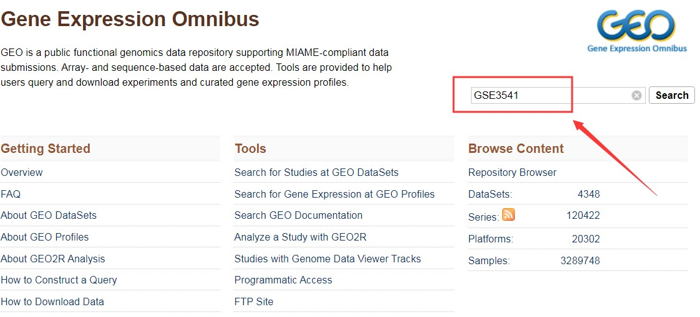
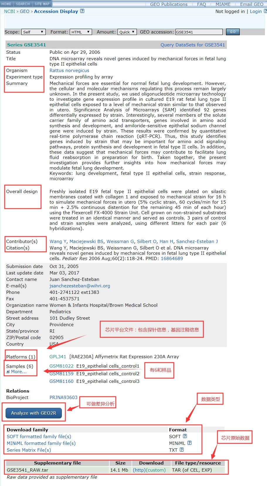
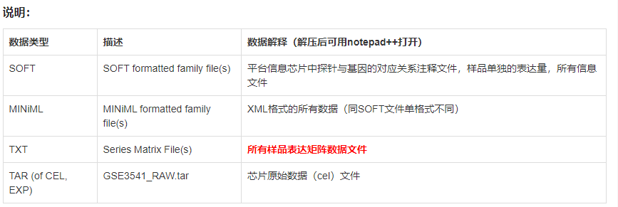
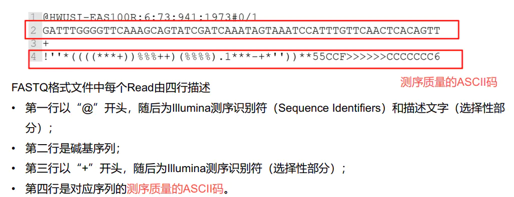

# 目录

   * [RNA-seq分析](#rna-seq分析)
      * [0. 介绍](#0-介绍)
      * [1. 前期准备](#1-前期准备)
      * [2. 工具下载](#2-工具下载)
         * [2.0 生信管理工具](#20-生信管理工具)
         * [2.1 sratoolkit](#21-sratoolkit)
         * [2.2 fastqc](#22-fastqc)
         * [2.3 multiqc](#23-multiqc)
         * [2.4 cutadapt](#24-cutadapt)
         * [2.5 trimmomatic](#25-trimmomatic)
         * [2.6 hisat2](#26-hisat2)
         * [sortmerna](#sortmerna)
         * [2.7 samtools](#27-samtools)
         * [2.8 HTseq](#28-htseq)
         * [2.9 R](#29-r)
         * [2.10 Rstudio](#210-rstudio)
         * [2.11 parallel](#211-parallel)
         * [StringTie[可选]](#stringtie可选)
         * [Ballgown[可选]](#ballgown可选)
      * [3. 数据下载](#3-数据下载)
         * [3.1 参考数据](#31-参考数据)
            * [Ensembl](#ensembl)
         * [3.2 测试数据（实验数据）](#32-测试数据实验数据)
      * [4. 质量控制](#4-质量控制)
         * [4.1 质量评估](#41-质量评估)
         * [4.2 剔除接头以及测序质量差的碱基](#42-剔除接头以及测序质量差的碱基)
         * [4.4 再次去除低质量区域](#44-再次去除低质量区域)
         * [4.3 再次查看质量情况](#43-再次查看质量情况)
      * [5. 去除rRNA序列](#5-去除rrna序列)
      * [6. 序列比对](#6-序列比对)
         * [6.1 建立索引](#61-建立索引)
         * [6.2  开始比对](#62--开始比对)
      * [7. 表达量统计](#7-表达量统计)
      * [8. 合并表达矩阵与标准化](#8-合并表达矩阵与标准化)
         * [8.1 合并](#81-合并)
         * [8.2 数据标准化](#82-数据标准化)
            * [8.2.1 简介](#821-简介)
         * [8.2.2 cufflinks](#822-cufflinks)
         * [8.2.3 手动计算](#823-手动计算)
      * [9. 差异表达分析](#9-差异表达分析)
         * [9.1 数据前处理](#91-数据前处理)
         * [9.2 差异分析](#92-差异分析)
            * [9.2.1 安装与加载包](#921-安装与加载包)
            * [9.2.2 构建对象](#922-构建对象)
            * [9.2.3 样本相关性](#923-样本相关性)
            * [9.2.4 差异基因](#924-差异基因)
      * [10. 提取差异表达基因与注释](#10-提取差异表达基因与注释)
         * [10.1 名词解释](#101-名词解释)
         * [10.2 使用ClusterProfiler对基因的ID进行转化](#102-使用clusterprofiler对基因的id进行转化)
         * [10.3 使用biomaRt进行注释](#103-使用biomart进行注释)
      * [11. 可视化](#11-可视化)
      * [12. 富集分析](#12-富集分析)
         * [12.1 Gene Ontology (GO)分析](#121-gene-ontology-go分析)
         * [12.2 KEGG分析](#122-kegg分析)
         * [12.3 GSEA分析](#123-gsea分析)
         * [12.4 DO（Disease Ontology）分析](#124-dodisease-ontology分析)
         * [12.4 另外可以使用几个在线网站](#124-另外可以使用几个在线网站)
      * [========================================](#-1)
      * [5. 表达量分析](#5-表达量分析)
      * [6. 表达量分析](#6-表达量分析)
      * [7. 差异表达分析](#7-差异表达分析)
      * [作者](#作者)
      * [参考](#参考)
         * [流程](#流程)
         * [结果解读](#结果解读)
         * [原理](#原理)
         * [程序下载安装](#程序下载安装)
         * [问题](#问题)

# RNA-seq分析

## 0. 介绍
```
转录组（Transcriptome）被定义为一个细胞中存在的所有转录本读取的集合。
RNA-seq数据用于研究和/或量化一个生物体的转录组，它可用于以下类型的实验：

差异基因表达（Differential Gene Expression）: 转录本水平的定量评估和比较
转录组组装（Transcriptome assembly）: 构建基因组转录区域的轮廓，是一种定性评估
能被用于帮助建立更好的基因模型，并使用组装来验证
元转录组学或群体转录组学分析
RNA-seq 除了得到差异表达的基因之外，还可以对SNP、新颖的转录本、可变剪接、RNA编辑等进行分析，但是最为常见的是得到差异表达的基因。
```

各种软件功能简介：
```
     database                   Workflow                        tools
======================================================================================
  
+=================+     +-------------------------+                               
|     database    |     |      Quality Analysis   |---------------> fastqc 
+=================+     +-------------------------+                                
|+------+         |                 v                                      
|| rRNA |---------|--+  +-------------------------+
|+------+         |  |  | Base Quality Filtering  |------------> TrimGalore
|  +------+       |  |  +-------------------------+
|  |genome|-------|-+|              v
|  +------+       | ||  +-------------------------+
|     +----------+| |+->| rRNA Sequence Filtering |------------> SortMeRNA
|     |  Genome  || |   +-------------------------+
|     |Annotation|| |               v
|     +----------+| |   +-------------------------+
|          |      | +-->|   Genome Alignment      |------------> hisat2
+----------|------+     +-------------------------+
           |                        v
           |            +-------------------------+
           +----------->|  Count Mapped Reads     |------------> HTseq
                        +-------------------------+
                                    v
                        +-------------------------+
                        | Differential Expression |------------> DESeq2
                        +-------------------------+
                                    v
                        +-------------------------+
                        |     Pathway analysis    |------------> ClusterProfiler
                        +-------------------------+
```
各类数据分析步骤及需要用到的软件：  
* RNA-seq  
① MultiQC 整理数据，general statistics  
② featureCounts： Subread featureCounts是一个高效的通用阅读摘要程序，用于计算基因组特征（如基因，外显子，启动子，基因体，基因组箱和染色体位置）的映射读取。    
③ cutadapt： Cutadapt是一种工具，用于从高通量测序读取中查找和删除adapter序列，引物，poly-A尾部和其他类型的不需要的序列。   
④ fastQC: FastQC是高通量序列数据的质量控制工具。  
* whole-genome seq :   
① MultiQC 整理数据，general statistics  
② QualiMap： 是一个独立于平台的应用程序，用于促进比对序列数据及其衍生物（如特征计数）的质量控制。        
③ SnpEff： SnpEff是一个遗传变异注释和效果预测工具箱。它注释和预测变异对基因的影响（如氨基酸变化）。     
④ GATK: GATK是一个工具包，提供各种工具，主要关注变异发现和基因分型。  
⑤ Picard： Picard 是一组用于操作高通量测序数据的 Java 命令行工具。  
⑥ FastQ Screen ：FastQ Screen允许您根据一组序列数据库筛选FastQ格式的序列库，以便您可以查看库的组成是否与您期望的匹配。  
⑦ fastQC: FastQC是高通量序列数据的质量控制工具。   
* Bisulfite seq   
① MultiQC 整理数据，general statistics  
② Bismark ： Bismark是一种绘制亚硫酸氢盐转化序列读数和确定胞嘧啶甲基化状态的工具。  
③ cutadapt： Cutadapt是一种工具，用于从高通量测序读取中查找和删除adapter序列，引物，poly-A尾部和其他类型的不需要的序列。  
④ fastQC: FastQC是高通量序列数据的质量控制工具。  
* Hi-C  
① MultiQC 整理数据，general statistics  
② HICUP： HiCUP（Hi-C user pipeline）是一种用于对Hi-C数据进行映射和执行质量控制的工具。  
③ fastQC: FastQC是高通量序列数据的质量控制工具。   
* MultiQC  
① MultiQC 整理数据，general statistics  
② edgeR：样本相似性由通过 edgeR 归一化的基因计数生成。然后计算 log2 归一化 CPM 值之间的欧氏距离并进行聚类。  
③ MDS PLOT: 显示项目中样本之间的相关性。这些值是在 edgeR_heatmap_MDS.r 脚本中使用 edgeR 计算的。    
④ STAR: STAR是一种超快的通用RNA-seq aligner。  
⑤ cutadapt： Cutadapt是一种工具，用于从高通量测序读取中查找和删除adapter序列，引物，poly-A尾部和其他类型的不需要的序列。  
⑥ fastQC: FastQC是高通量序列数据的质量控制工具。    


## 1.前期准备
将目录建在d盘 cd /mnt/d  
建立目录    
`mkdir biosoft`   
`mkdir -p project/rat`    
`mkdir annotation genome sequence output script`  
 
结果：  
```
xuruizhi@DESKTOP-HI65AUV:/mnt/d/project/rat$ tree
.
├── annotation
├── genome
├── output
├── script
└── sequence

5 directories, 0 files
```

## 2.工具下载 
### 2.0 生信管理工具 

Linux brew  
来源[wang-q Ubuntu -](https://github.com/wang-q/ubuntu#install-linuxbrew)

### 2.1 sratoolkit   
* 使用brew安装  
```
xuruizhi@DESKTOP-HI65AUV:~$ brew install sratoolkit

HOMEBREW_BREW_GIT_REMOTE set: using https://mirrors.tuna.tsinghua.edu.cn/git/homebrew/brew.git for Homebrew/brew Git remote.
HOMEBREW_CORE_GIT_REMOTE set: using https://mirrors.tuna.tsinghua.edu.cn/git/homebrew/homebrew-core.git for Homebrew/core Git remote.
Running `brew update --auto-update`...
Warning: sratoolkit 3.0.0 is already installed and up-to-date.
To reinstall 3.0.0, run:
  brew reinstall sratoolkit
```
### 2.2 fastqc  
* 使用brew安装  
```
xuruizhi@DESKTOP-HI65AUV:~$ brew install fastqc
HOMEBREW_BREW_GIT_REMOTE set: using https://mirrors.tuna.tsinghua.edu.cn/git/homebrew/brew.git for Homebrew/brew Git remote.
HOMEBREW_CORE_GIT_REMOTE set: using https://mirrors.tuna.tsinghua.edu.cn/git/homebrew/homebrew-core.git for Homebrew/core Git remote.
Running `brew update --auto-update`...
Warning: fastqc 0.11.9_1 is already installed and up-to-date.
To reinstall 0.11.9_1, run:
  brew reinstall fastqc
```
### 2.3 multiqc 
``` 
# 使用python的安装器安装
pip install multiqc
```
```
xuruizhi@DESKTOP-HI65AUV:~$ pip install multiqc

Requirement already satisfied: multiqc in /home/linuxbrew/.linuxbrew/lib/python3.9/site-packages (1.12)
。。。
  File "/home/linuxbrew/.linuxbrew/opt/python@3.9/lib/python3.9/site-packages/pip/_internal/utils/logging.py", line 179, in emit
    self.handleError(record)
Message: '[present-rich] %s'
Arguments: (UpgradePrompt(old='22.1.2', new='22.2.2'),)
```
### 2.4 cutadapt  

pip install cutadapt 类似  
```
# Check that cutadapt is installed
xuruizhi@DESKTOP-HI65AUV:~$ cutadapt --version
4.1

# Check that FastQC is installed
xuruizhi@DESKTOP-HI65AUV:~$ fastqc -v
FastQC v0.11.9
```

### 2.5 质量修剪  
* Trim Galore
```
cd /mnt/d/biosoft
# 先挂载到d盘相应文件

wget https://github.com/FelixKrueger/TrimGalore/archive/0.6.3.tar.gz -O TrimGalore.gz

gzip -d TrimGalore.gz
```
! [作者GitHub](https://github.com/FelixKrueger/TrimGalore)已经更新至2021年7月的0.6.6版本
```
# Install Trim Galore
curl -fsSL https://github.com/FelixKrueger/TrimGalore/archive/0.6.6.tar.gz -o TrimGalore.tar.gz
tar xvzf TrimGalore.tar.gz

# Run Trim Galore
~/TrimGalore-0.6.6/trim_galore
```
结果：  
```
xuruizhi@DESKTOP-HI65AUV:/mnt/d/biosoft$ curl -fsSL https://github.com/FelixKrueger/TrimGalore/archive/0.6.6.tar.gz -o TrimGalore.tar.gz
xuruizhi@DESKTOP-HI65AUV:/mnt/d/biosoft$ ls
TrimGalore.tar.gz  Trimmomatic-0.38  Trimmomatic-0.38.zip  hisat2-2.2.1  sortmerna-2.1  sortmerna-2.1.tar.gz  wget-log
xuruizhi@DESKTOP-HI65AUV:/mnt/d/biosoft$ tar xvzf TrimGalore.tar.gz
TrimGalore-0.6.6/
TrimGalore-0.6.6/.travis.yml
TrimGalore-0.6.6/Changelog.md
。。。
```
`！师兄的办法会得到一个单独的TrimGalore文件；作者的办法会得到包括trim_galore及其license在内的一个文件夹`

* fastp  
* trimmomatic  
```
cd /mnt/d/biosoft
# 先挂载到d盘相应文件 

wget http://www.usadellab.org/cms/uploads/supplementary/Trimmomatic/Trimmomatic-0.38.zip
unzip Trimmomatic-0.38.zip

cd Trimmomatic-0.38

# 导入临时环境变量
export PATH="$(pwd):$PATH"
```
### 2.6 hisat2  

1. [hisat2官网更改](https://daehwankimlab.github.io/hisat2/)
2. 右侧download下载,直接点击下载即可，不需要回到终端再下载。下载完成后剪切到d/biosoft文件夹内解压
```
Version: HISAT2 2.2.1
Release Date: 7/24/2020

Linux_x86_64	https://cloud.biohpc.swmed.edu/index.php/s/oTtGWbWjaxsQ2Ho/download
```
3. 回到终端写入环境
```

# 导入临时环境变量
$ export PATH="~/biosoft/hisat2-2.1.0:$PATH"

# 测试是否可用
$ hisat2 -h

xuruizhi@DESKTOP-HI65AUV:/mnt/d/biosoft$  hisat2 -h
HISAT2 version 2.2.1 by Daehwan Kim (infphilo@gmail.com, www.ccb.jhu.edu/people/infphilo)
Usage:
```
### sortmerna [选做]
有时因为安全问题无法直接从网页下载，最好还是回到终端在本地下载  

```
cd /mnt/d/biosoft
# 先挂载到d盘相应文件 
# 下载软件,已经是最新版本
$ wget https://github.com/biocore/sortmerna/archive/2.1.tar.gz -O sortmerna-2.1.tar.gz

# 解压
$ tar -xzvf sortmerna-2.1.tar.gz
$ cd sortmerna-2.1

# 配置相关信息
$ ./configure --prefix=$PWD

# 编译
$ make -j 4

# 查看是否成功
$ ./sortmerna --help

# 导入到环境变量
$ export PATH="$(pwd):$PATH"
```
结果： [具体参考](https://github.com/outcastaaa/bioinformatics-learning/blob/main/RNA-seq/%E8%A7%A3%E5%8E%8B%E5%90%8E.md) 

原本数据存放在`d/biosoft/sortmerna-2.1`文件夹内，移动数据库位置之前先在d盘新建一个database/sortmerna_db/rRNA_databases存放数据

```
xuruizhi@DESKTOP-HI65AUV:/mnt/d$ mkdir database
xuruizhi@DESKTOP-HI65AUV:/mnt/d$ cd database
。。。
xuruizhi@DESKTOP-HI65AUV:/mnt/d/database/sortmerna_db$ ls
rRNA_databases
```
```
# 把数据库文件移动到能找到的地方,d盘的database文件夹内
#没搞明白
$ mv ./rRNA_databases/ /mnt/d/database/sortmerna_db/rRNA_databases

# 相关库文件
$ cd ~/database/rRNA_databases
$ sortmerna_ref_data=$(pwd)/rRNA_databases/silva-bac-16s-id90.fasta,$(pwd)/index/silva-bac-16s-db:\
$(pwd)/rRNA_databases/silva-bac-23s-id98.fasta,$(pwd)/index/silva-bac-23s-db:\
$(pwd)/rRNA_databases/silva-arc-16s-id95.fasta,$(pwd)/index/silva-arc-16s-db:\
$(pwd)/rRNA_databases/silva-arc-23s-id98.fasta,$(pwd)/index/silva-arc-23s-db:\
$(pwd)/rRNA_databases/silva-euk-18s-id95.fasta,$(pwd)/index/silva-euk-18s-db:\
$(pwd)/rRNA_databases/silva-euk-28s-id98.fasta,$(pwd)/index/silva-euk-28s-db:\
$(pwd)/rRNA_databases/rfam-5s-database-id98.fasta,$(pwd)/index/rfam-5s-db:\
$(pwd)/rRNA_databases/rfam-5.8s-database-id98.fasta,$(pwd)/index/rfam-5.8s-db

# 真核生物的rRNA不需要那么多(5s, 5.8s, 18s, 28s)
$ euk_rNRA_ref_data=$(pwd)/rRNA_databases/silva-euk-18s-id95.fasta,$(pwd)/index/silva-euk-18s-db:\
$(pwd)/rRNA_databases/silva-euk-28s-id98.fasta,$(pwd)/index/silva-euk-28s-db:\
$(pwd)/rRNA_databases/rfam-5s-database-id98.fasta,$(pwd)/index/rfam-5s-db:\
$(pwd)/rRNA_databases/rfam-5.8s-database-id98.fasta,$(pwd)/index/rfam-5.8s-db

# 建立数据库索引
$ indexdb_rna --ref $data
```

### 2.7 samtools
最新版本为1.16  
本地下载时，在配制这步出错，使用`brew install samtools`安装

### 2.8 HTseq
```
pip install -i https://pypi.tuna.tsinghua.edu.cn/simple HTseq
```

### 2.9 R
最新版本4.2.1_2  
先进入官网，用清华镜像源下载合适版本的R，再`brew install r`

```
xuruizhi@DESKTOP-HI65AUV:~$ brew install r
HOMEBREW_BREW_GIT_REMOTE set: using https://mirrors.tuna.tsinghua.edu.cn/git/homebrew/brew.git for Homebrew/brew Git remote.
HOMEBREW_CORE_GIT_REMOTE set: using https://mirrors.tuna.tsinghua.edu.cn/git/homebrew/homebrew-core.git for Homebrew/core Git remote.
Running `brew update --auto-update`...
Warning: r 4.2.1_2 is already installed and up-to-date.
To reinstall 4.2.1_2, run:
  brew reinstall r
  ```
* !R 安装时多次尝试，RStudio都识别不到，因此直接在官网选择`Download R for Windows; install R for the first time`下载安装包即可；注意可以将两个文件放在同一个文件夹内  
[参考](https://blog.csdn.net/m0_49354332/article/details/116059239)  


### 2.10 Rstudio
进入网站：`https://www.rstudio.com/products/rstudio/download/`  
R studio 可以在 Windows 下安装;
选择版本下载,下载完成之后双击安装。  
`
Windows 10/11	   
RStudio-2022.07.1-554.exe
`
### 2.11 parallel  
```
brew install parallel
```
### StringTie[可选]  
安装：  #师兄的安装方式是MAC，改成Linux
```
cd /mnt/d/biosoft

wget http://ccb.jhu.edu/software/stringtie/dl/stringtie-2.2.1.Linux_x86_64.tar.gz

tar -xzvf stringtie-2.2.1.Linux_x86_64.tar.gz
mv stringtie-2.2.1.Linux_x86_64 stringtie-2.2.1
cd stringtie-2.2.1

export PATH="$(pwd):$PATH"

stringtie --help
```

### Ballgown[可选]
不知道在哪里安装
```
source("http://bioconductor.org/biocLite.R")
biocLite("Ballgown")
```
# 数据下载  

1. [Ensemble网址](https://asia.ensembl.org/)  
在左侧`All genomes`中，选择物种`Rat`; 在左侧`Download DNA sequence (FASTA)` 下载基因组序列数据; 在右侧的`Download GTF or GFF3 (files for genes, cDNAs, ncRNA, proteins)`下载基因注释文件     
 


2. ensemble中[基因组数据集命名方式](http://ftp.ensembl.org/pub/release-107/fasta/rattus_norvegicus/dna/README)  

* 这些文件始终按照以下模式命名：
```
   <species>.<assembly>.<sequence type>.<id type>.<id>.fa.gz
例：
    Rattus_norvegicus.mRatBN7.2.dna.nonchromosomal.fa.gz  
    Rattus_norvegicus.mRatBN7.2.dna.primary_assembly.1.fa.gz
    Rattus_norvegicus.mRatBN7.2.dna_sm.toplevel.fa.gz


<species>：物种的系统名称。

<assembly>：程序集构建名称。

<sequence type>：
  * 'dna' - unmasked未屏蔽的基因组 DNA 序列。
  * 'dna_rm' - masked掩蔽的基因组 DNA。使用 RepeatMasker 工具检测散布的 重复和低复杂性区域，并通过用“N”替换重复来掩盖。
  * 'dna_sm' -  soft-masked软掩蔽基因组 DNA。所有重复和低复杂性区域都已替换为 其核酸碱基的小写版本

<id 类型> 以下之一：
  * 'chromosome' - Ensembl 中大多数物种的顶级坐标系top-level coordinate system
  * 'nonchromosomal' - 包含尚未分配到染色体的 DNA
  * 'seqlevel' - 这通常是sequence scaffolds、块chunks或克隆clones。
     -- 'scaffold' - 短的测序reads（通常来自whole genome shotgun, WGS）组装成较大的序列contigs，但尚未组装成染色体。需要更多的基因组测序来缩小gaps并建立 a tiling path。
     -- 'chunk' - 虽然 contig 序列可以组装成更大区块，有时必须人为地将它们分解为更小的块，称为'chunks'。这是由于注释中的限制pipeline 和 MySQL 有限的记录大小，用于存储序列和注释信息。
     -- 'clone' - 通常这是最小的序列单位。它通常与一个 BAC 克隆的序列或一个 BAC 克隆的序列区域相同，后者形成了tiling path.
<id>：实际的序列标识符。根据 <id type> <id>
          可以代表A chromosome, a scaffold, a contig, a clone的名称..
          seqlevel 文件的字段为空

fa：这些目录中的所有文件都代表FASTA数据库文件

gz：所有文件都使用 GNU Zip 压缩以提高存储效率。
```
* TOPLEVEL    

这些文件包含了 在 Ensembl 模式中标记为toplevel的所有序列区域。 这包括染色体chromsomes、未组装成染色体not assembled into chromosomes的区域和 N 填充的单倍型haplotype/补丁patch区域。

* PRIMARY ASSEMBLY  

初级组装包含所有toplevel序列区域，不包括单倍型和补丁。  
该文件最适合用于`序列相似性搜索`，因为其中补丁和单倍型序列会混淆分析。 如果primary assembly文件不存在，则表明没有单倍型/补丁区域，此时与“toplevel”文件相同。

* special 注意  
一些染色体是单倍体，例如人类的X和Y染色体  
为了比对时能正确输出报告，这些单倍体的assembly和patch区域都会补上同等数量的N   
例如： A patch region with a start position of 1,000,001 will have 1e6 N's added，因这样对齐程序将报告相对于
整个染色体。

人类已对 Y 染色体进行了测序，并对 Y 上的伪常染色体区域pseudoautosomal region (PAR) 进行了注释。 根据定义，PAR 区域在 X 和 Y 染色体上是相同的。 Y染色体文件包含Y染色体减去这些重复的 PAR 区域，即 Y 的唯一部分。  


3. 基因组下载代码：  
目前大鼠的基因组测序版本到了7.2  
可以直接在网页下载，也可用代码  
```
# 下载
cd /mnt/d/project/rat/genome
wget http://ftp.ensembl.org/pub/release-107/fasta/rattus_norvegicus/dna/Rattus_norvegicus.mRatBN7.2.dna.toplevel.fa.gz
gzip -d Rattus_norvegicus.mRatBN7.2.dna.toplevel.fa.gz

# 改名（方便后面使用，名字太长一来不方便输入，二来可能会输错）
mv Rattus_norvegicus.mRatBN7.2.dna.toplevel.fa mRatBN7.2.fa
```
4. 对下载的基因组数据进行整理  

！ 和师兄的演示不一样的原因：因为师兄下载的测序版本是6，[旧版本](http://ftp.ensembl.org/pub/release-104/fasta/rattus_norvegicus/dna/)    
`下载的数据id类型是chromosome，新版本是PRIMARY ASSEMBLY`  

  


* 下载得到的基因组文件可以查看一下包含哪些染色体，确认文件是否下载正确。
```
cat mRatBN7.2.fa | grep "^>"
```
* 结果：除了1-20号+X+Y+MT之外还有很多别的ID名。这些都是scaffold
```
>19 dna:primary_assembly primary_assembly:mRatBN7.2:19:1:57337602:1 REF
>20 dna:primary_assembly primary_assembly:mRatBN7.2:20:1:54435887:1 REF
>X dna:primary_assembly primary_assembly:mRatBN7.2:X:1:152453651:1 REF
>Y dna:primary_assembly primary_assembly:mRatBN7.2:Y:1:18315841:1 REF
>MT dna:primary_assembly primary_assembly:mRatBN7.2:MT:1:16313:1 REF
>MU150191.1 dna:primary_assembly primary_assembly:mRatBN7.2:MU150191.1:1:1794995:1 REF

>JACYVU010000493.1 dna:primary_assembly primary_assembly:mRatBN7.2:JACYVU010000493.1:1:444596:1 REF
>MU150193.1 dna:primary_assembly primary_assembly:mRatBN7.2:MU150193.1:1:383091:1 REF
```
* 每一条primary_assembly的名称后面还跟了一些描述信息，这些描述信息就是当前组装版本，长度等等信息，但是这个信息会妨碍后面写脚本统计或者一些分析，所以这里最好去掉  
```
# 首先将之前的名称更改一下
mv mRatBN7.2.fa mRatBN7.2.raw.fa

# 然后去除染色体编号后的描述信息
$ cat mRatBN7.2.raw.fa | perl -n -e 'if(m/^>(.+?)(?:\s|$)/){ print ">$1\n";}else{print}' > mRatBN7.2.fa

# 删除
$ rm mRatBN7.2.raw.fa
```  
结果：
```
>19
>20
>X
>Y
>MT
>MU150191.1
>MU150189.1
>MU150194.1
>MU150190.1
>MU150195.1
>JACYVU010000493.1
>MU150193.1
>MU150196.1
>MU150197.1
>JACYVU010000705.1
>JACYVU010000706.1
>MU150192.1
>JACYVU010000707.1
```

* 可以使用脚本统计每一条染色体的长度  
```
cat mRatBN7.2.fa | perl -n -e '
    s/\r?\n//;
    if(m/^>(.+?)\s*$/){
        $title = $1;
        push @t, $title;
    }elsif(defined $title){
        $title_len{$title} += length($_);
    }
    END{
        for my $title (@t){
            print "$title","\t","$title_len{$title}","\n";
        }
    }
'
```
结果：  
```
。。。
19      57337602
20      54435887
X       152453651
Y       18315841
MT      16313
MU150191.1      1794995
MU150189.1      1402623
MU150194.1      648519
MU150190.1      573231
MU150195.1      529129
JACYVU010000493.1       444596
。。。
```  
* 以染色体1 举例  
```
cat mRatBN7.2.fa | perl -n -e '
  if(m/^>/){
    if(m/>1$/){
      $title = 1;
    }else{
      $title = 0;
    }
  }else{
    push @s, $_ if $title;
  }
  END{
    printf ">1\n%s", join("", @s);
  }
' > mRatBN7.2.chr1.fa
```
5. 下载基因组索引文件 - [可选]

方法1. 在[hisat2 官网](https://daehwankimlab.github.io/hisat2/download/#r-norvegicus)上可以找到现成的已经建立好索引的大鼠基因组文件, 点击`	https://genome-idx.s3.amazonaws.com/hisat/rn6_genome.tar.gz`, 下载到了`D:\database`文件夹内   
或通过代码下载  
```
cd /mnt/d/database
wget https://genome-idx.s3.amazonaws.com/hisat/rn6_genome.tar.gz
gzip -d rn6.tar
```

方法2. 自己用命令基于之前下载的基因组文件自行建立   


6.  下载注释信息  
```
# 下载 gff3 格式
cd /mnt/d/project/rat/annotation
wget http://ftp.ensembl.org/pub/release-107/gff3/rattus_norvegicus/Rattus_norvegicus.mRatBN7.2.107.gff3.gz
gzip -d Rattus_norvegicus.mRatBN7.2.107.gff3.gz
# 同样的也改名
mv Rattus_norvegicus.mRatBN7.2.107.gff3 mRatBN7.2.gff
# 使用head查看部分
head mRatBN7.2.gff

# gff查看结果：
xuruizhi@DESKTOP-HI65AUV:/mnt/d/project/rat/annotation$ head mRatBN7.2.gff
##gff-version 3
##sequence-region   1 1 260522016
##sequence-region   10 1 107211142
##sequence-region   11 1 86241447
##sequence-region   12 1 46669029
##sequence-region   13 1 106807694
##sequence-region   14 1 104886043
##sequence-region   15 1 101769107
##sequence-region   16 1 84729064
##sequence-region   17 1 86533673 


# 下载 gtf 格式  
cd /mnt/d/project/rat/annotation
wget http://ftp.ensembl.org/pub/release-107/gtf/rattus_norvegicus/Rattus_norvegicus.mRatBN7.2.107.gtf.gz
gzip -d 	Rattus_norvegicus.mRatBN7.2.107.gtf.gz

# gtf查看结果

xuruizhi@DESKTOP-HI65AUV:/mnt/d/project/rat/annotation$ head  mRatBN7.2.107.gtf

#gtf文件开头描述了这个注释数据的基本信息，比如版本号，更新时间，组装的NCBI的Assembly编号等等，后面每一行表示描述信息，说明了在哪条染色体的什么位置是什么东西。
#!genome-build mRatBN7.2
#!genome-version mRatBN7.2
#!genome-date 2020-11
#!genome-build-accession GCA_015227675.2
#!genebuild-last-updated 2021-02
1       ensembl gene    36112690        36122387        .       -       .       gene_id "ENSRNOG00000066169"; gene_version "1"; gene_source "ensembl"; gene_biotype "protein_coding";
# 比如该行表示在1号染色体负链上 36112690-36122387 这个范围内有一个基因编号为ENSRNOG00000066169的基因

1       ensembl transcript      36112690        36122387        .       -       .       gene_id "ENSRNOG00000066169"; gene_version "1"; transcript_id "ENSRNOT00000101581"; transcript_version "1"; gene_source "ensembl"; gene_biotype "protein_coding"; transcript_source "ensembl"; transcript_biotype "protein_coding";
1       ensembl exon    36122324        36122387        .       -       .       gene_id "ENSRNOG00000066169"; gene_version "1"; transcript_id "ENSRNOT00000101581"; transcript_version "1"; exon_number "1"; gene_source "ensembl"; gene_biotype "protein_coding"; transcript_source "ensembl"; transcript_biotype "protein_coding"; exon_id "ENSRNOE00000618632"; exon_version "1";
1       ensembl CDS     36122324        36122387        .       -       0       gene_id "ENSRNOG00000066169"; gene_version "1"; transcript_id "ENSRNOT00000101581"; transcript_version "1"; exon_number "1"; gene_source "ensembl"; gene_biotype "protein_coding"; transcript_source "ensembl"; transcript_biotype "protein_coding"; protein_id "ENSRNOP00000083062"; protein_version "1";
1       ensembl exon    36121478        36121512        .       -       .       gene_id "ENSRNOG00000066169"; gene_version "1"; transcript_id "ENSRNOT00000101581"; transcript_version "1"; exon_number "2"; gene_source "ensembl"; gene_biotype "protein_coding"; transcript_source "ensembl"; transcript_biotype "protein_coding"; exon_id "ENSRNOE00000610554"; exon_version "1";
```

7. ensemble中  
[gff 注释信息命名方式](http://ftp.ensembl.org/pub/release-107/gff3/rattus_norvegicus/README)  
[gtf 注释信息命名方式](http://ftp.ensembl.org/pub/release-107/gtf/rattus_norvegicus/README)  

两者注释区别：gff是先判断该序列属于gene还是转录本等，呈现出不同的主要特征信息；但是gtf是所有的信息全部呈现出来

gff 注释信息：  

① gene features的类型：   

*  "gene" 代表 protein-coding genes 编码蛋白的基因  
*  "ncRNA_gene" 代表 RNA genes   RNA基因   
*  "pseudogene" 代表 pseudogenes假基因  

② transcript features的类型:
   * "mRNA" 代表 protein-coding transcripts 编码蛋白的转录本
   * a specific type or RNA transcript such as "snoRNA" or "lnc_RNA"  RNA转录本
   * "pseudogenic_transcript" for pseudogenes 假基因转录本
所有的转录本都和exon特征相关。编码蛋白的转录本和 "CDS", "five_prime_UTR", and "three_prime_UTR" 特征相关。


③ Attributes for feature types:
* region types: "five_prime_UTR", and "three_prime_UTR"
    * ID: 唯一识别号, 形式 "<region_type>:<region_name>"
    * [Alias]：别名，以逗号分隔的别名列表，通常包括 INSDC accession
    * [Is_circular]: 标志环形区域 circular regions
 * gene types:
    * ID:  唯一识别号, 形式 "gene:<gene_stable_id>"
    * biotype: Ensembl 生物型, e.g. "蛋白质编码", "假基因"
    * gene_id: Ensembl 基因稳定 ID  
    * version: Ensembl 基因版本   
    * [Name]： 基因名称
    * [description]： 基因描述
 * transcript types:  
    * ID: 唯一识别号, 形式 "transcript:<transcript_stable_id>"
    * Parent: 基因标识符, 形式 "gene:<gene_stable_id>"
    * biotype: Ensembl 生物型, e.g. "蛋白质编码", "假基因" 
    * transcript_id: Ensembl 转录本 stable ID
    * version: Ensembl 转录本版本
    * [Note]: 如果转录序列已被编辑 (i.e. 和基因组序列不同), 编辑在注释中描述。
 * exon
    * Parent: Transcript identifier, 形式 "transcript:<transcript_stable_id>"
    * exon_id: Ensembl 外显子 stable ID
    * version: Ensembl 外显子版本
    * constitutive: 组成型外显子，标志着该外显子在所有转录本中均存在
    * rank:  代表5'->3' ordering of exons的整数
 * CDS  
 CDS（Coding sequence）是指成熟mRNA中可以被翻译为蛋白质的编码序列区域，自起始密码子开始至终止密码子结束。
    * ID:  唯一识别号, 形式  "CDS:<protein_stable_id>"
    * Parent: Transcript identifier，形式"transcript:<transcript_stable_id>"
    * protein_id: Ensembl 蛋白 stable ID
    * version: Ensembl 蛋白版本

④ 元数据Metadata：
 * 基因组构建 - 构建assembly的标识符，例如GRCh37.p11
 * 基因组版本 - 此assembly的版本，例如GRCh37
 * 基因组日期 - 此assembly的发布日期，例如2009-02
 * 基因组构建加入 - 基因组加入，例如GCA_000001405.14
 * genebuild-last-updated - 最后一次genebuild更新的日期，例如2013-09


⑤ FILE NAMES： 
  <species>.<assembly>.<_version>.gff3.gz  

对于预测的基因集，在名称文件中添加了一个额外的 abinitio 标志。  
  <species>.<assembly>.<version>.abinitio.gff3.gz  

```
e.g. 
GL476399        Pmarinus_7.0    supercontig     1       4695893 .       .       .       ID=supercontig:GL476399;Alias=scaffold_71
GL476399        ensembl gene                  2596494   2601138 .       +       .       ID=gene:ENSPMAG00000009070;Name=TRYPA3;biotype=protein_coding;description=Trypsinogen A1%3B Trypsinogen a3%3B Uncharacterized protein  [Source:UniProtKB/TrEMBL%3BAcc:O42608];logic_name=ensembl;version=1
```


[gtf 注释信息](http://ftp.ensembl.org/pub/release-107/gtf/rattus_norvegicus/README)   


 GTF (General Transfer Format)   
① FILE NAMES：   
  <species>.<assembly>.<_version>.gtf.gz    

对于预测的基因集，在名称文件中添加了一个额外的 abinitio 标志。    
  <species>.<assembly>.<version>.abinitio.gtf.gz  

② Fields  

Fields are tab-separated. Also, all but the final field in each 
feature line must contain a value; "empty" columns are denoted 
with a '.'  
 
    seqname   - name of the chromosome or scaffold; chromosome names 
                without a 'chr' 
    source    - name of the program that generated this feature, or 
                the data source (database or project name)
    feature   - feature type name. Current allowed features are
                {gene, transcript, exon, CDS, Selenocysteine, start_codon,
                stop_codon and UTR}
    start     - start position of the feature, with sequence numbering 
                starting at 1.
    end       - end position of the feature, with sequence numbering 
                starting at 1.
    score     - a floating point value indiciating the score of a feature
    strand    - defined as + (forward) or - (reverse).
    frame     - one of '0', '1' or '2'. Frame indicates the number of base pairs
                before you encounter a full codon. '0' indicates the feature 
                begins with a whole codon. '1' indicates there is an extra
                base (the 3rd base of the prior codon) at the start of this feature.
                '2' indicates there are two extra bases (2nd and 3rd base of the 
                prior exon) before the first codon. All values are given with
                relation to the 5' end.
    attribute - a semicolon-separated list of tag-value pairs (separated by a space), 
                providing additional information about each feature. A key can be
                repeated multiple times.

③ Attributes  

The following attributes are available. All attributes are semi-colon
separated pairs of keys and values.  

- gene_id: The stable identifier for the gene
- gene_version: The stable identifier version for the gene
- gene_name: The official symbol of this gene
- gene_source: The annotation source for this gene
- gene_biotype: The biotype of this gene
- transcript_id: The stable identifier for this transcript
- transcript_version: The stable identifier version for this transcript
- transcript_name: The symbold for this transcript derived from the gene name
- transcript_source: The annotation source for this transcript
- transcript_biotype: The biotype for this transcript
- exon_id: The stable identifier for this exon
- exon_version: The stable identifier version for this exon
- exon_number: Position of this exon in the transcript
- ccds_id: CCDS identifier linked to this transcript
- protein_id: Stable identifier for this transcript's protein
- protein_version: Stable identifier version for this transcript's protein
- tag: A collection of additional key value tags
- transcript_support_level: Ranking to assess how well a transcript is supported (from 1 to 5)

④ Tags  

Tags are additional flags used to indicate attibutes of the transcript.  

- CCDS: Flags this transcript as one linked to a CCDS record
- seleno: Flags this transcript has a Selenocysteine edit. Look for the Selenocysteine
feature for the position of this on the genome
- cds_end_NF: the coding region end could not be confirmed
- cds_start_NF: the coding region start could not be confirmed
- mRNA_end_NF: the mRNA end could not be confirmed
- mRNA_start_NF: the mRNA start could not be confirmed.
- basic: the transcript is part of the gencode basic geneset


# 3.2 测试数据（实验数据）
从NCBI上查找相关的RNA-seq数据进行下载，在`GEO数据库`中找了一个数据`GSE72960`，对应的`SRP`数据为`SRP063345`   

GEO数据库 [参考文章](https://zhuanlan.zhihu.com/p/132559646#:~:text=GEO%E6%95%B0%E6%8D%AE%E5%BA%93%E5%85%A8%E7%A7%B0Gene%20Expression,Omnibus%20database%EF%BC%8C%E6%98%AF%E7%94%B1%E7%BE%8E%E5%9B%BD%E5%9B%BD%E7%AB%8B%E7%94%9F%E7%89%A9%E6%8A%80%E6%9C%AF%E4%BF%A1%E6%81%AF%E4%B8%AD%E5%BF%83NCBI%E5%88%9B%E5%BB%BA%E5%B9%B6%E7%BB%B4%E6%8A%A4%E7%9A%84%E5%9F%BA%E5%9B%A0%E8%A1%A8%E8%BE%BE%E6%95%B0%E6%8D%AE%E5%BA%93%E3%80%82)  

① 介绍    
GEO数据库全称Gene Expression Omnibus database，是由美国国立生物技术信息中心NCBI创建并维护的基因表达数据库。  
收录了世界各国研究机构提交的高通量基因表达数据，也就是说只要是目前已经发表的论文，论文中涉及到的基因表达检测的数据都可以通过这个数据库中找到。  

② GEO提供的数据类型    
[详细信息](https://www.ncbi.nlm.nih.gov/geo/info/overview.html)  

GSE数据编号(Series)，

GPL数据编号(GEO platforms)，

GSM数据编号(Samples)，

GDS数据编号(Datasets)。  

一篇文章可以有一个或者多个GSE(Series)数据集，一个GSE里面可以有一个或者多个GSM(Samples)样本，而每个数据集都有着自己对应的芯片平台，就是GPL(GEO platforms)。GSE编号一般为作者提交时生成的原始数据编号，后续NCBI中的工作人员会根据研究目的、样品类型等信息归纳整合为一个GDS(Datasets)，整理后的数据还会有GEO profile数据，也就是基因在这次实验中的表达数据。GDS里面的数据往往对应相同的平台具有可比性，另外，不是所有的GSE数据都能被整理，所以，有的GSE数据里面没有GDS数据也是正常。    

③ GEO数据检索、下载方法    
* GSE编号已知 (文献中会提到该编号)：如果你知道GSE编号可以通过网址http://www.ncbi.nlm.nih.gov/geo直接进入  
 [参考文章](https://www.omicsclass.com/article/1100)  
 搜索：   
   
得到相应数据信息：    
    

    * 点击最下面的`SRA Run selector`下载测序数据, 在Accession中搜索SRA号(SRPxxx)，里面包含了所有测序样本的测序信息以及文件SRA编号（例如，SRR2190795）
    * 将刚才在`Run selector`中查找到的数据的编号复制下来，之后下载测序数据，下载脚本如下，这里是采用`SRAtoolkit`工具包中的`prefetch`工具，如果部分数据下载失败，那么再次执行下面的代码  
    ```
    # 后台下载
    nohup prefetch SRR2190795 SRR224018{2..7} SRR2240228 -o . &

    # nohup 英文全称 no hang up（不挂起），用于在系统后台不挂断地运行命令，退出终端不会影响程序的运行。nohup 命令，在默认情况下（非重定向时），会输出一个名叫 nohup.out 的文件到当前目录下，如果当前目录的 nohup.out 文件不可写，输出重定向到 $HOME/nohup.out 文件中。
    ```
    或者  
    * 执行下列代码：
    ```
    # 先把需要下载的文件名称写入一个单独的txt文件中
    # 不可像SRR224018{2..7}这样省略，要不然找不到数据

   xuruizhi@DESKTOP-HI65AUV:~/data$  cat >1.txt <<EOF
   > SRR2190795
   > SRR2240182
   > SRR2240183
   > SRR2240184
   > SRR2240185
   > SRR2240186
   > SRR2240187
   > SRR2240228
   > EOF

   # 执行下列代码下载数据,下载到了 ~/data/sra文件夹内  
   [onhup]  prefetch --option-file 1.txt

   # 网页也可以直接点击下载FASTA/FASTQ文件  

    ```

* GSE编号未知： 通过NCBI主页的入口基因搜索下载。通常是不知道GEO编号，通过`样品类型，实验处理，平台信息`等搜索筛选想要的GEO数据：`https://www.ncbi.nlm.nih.gov/`，进入NCBI主页，搜索数据选择GEO DataSets，如果搜索某个基因表达量可选择GEO Profiles。  
 [参考文章](https://www.omicsclass.com/article/1101)    


 * GEO数据其他编号下载方法：

如果一个GSE数据被NCBI工作人员整理过，会有相应的GDS数据，可到[这个网址](https://www.ncbi.nlm.nih.gov/sites/GDSbrowser)查询    

④ GEO下载数据格式  

    

⑤  格式转换  
下载得到`.sra`文件，使用SRAtoolkit工具包的`fastq-dump`工具，使用它来进行格式转化
```
xuruizhi@DESKTOP-HI65AUV:~/data/sra$ ls
SRR2190795.sra  SRR2240183.sra  SRR2240185.sra  SRR2240187.sra
SRR2240182.sra  SRR2240184.sra  SRR2240186.sra  SRR2240228.sra


$ parallel -j 4 "    # 用parallel多线程加快速度，并行任务数为4
    fastq-dump --split-3 --gzip {1}    # 将sra文件转化为fastq文件之后压缩为gz文件
" ::: $(ls *.sra)     # :::后接选项

# ls *.sra代表，列举出任何以.sra结尾的文件
--gzip 将转换出的fastq文件以gz格式输出，可以节省空间
--split-3 把pair-end测序分成两个文件输出
-O 输出文件夹名，不加直接放在该文件夹


# 删除sra文件
$ rm *.sra
```
结果：  
```
Academic tradition requires you to cite works you base your article on.
If you use programs that use GNU Parallel to process data for an article in a
scientific publication, please cite:

  Tange, O. (2022, July 22). GNU Parallel 20220722 ('Roe vs Wade').
  Zenodo. https://doi.org/10.5281/zenodo.6891516

This helps funding further development; AND IT WON'T COST YOU A CENT.
If you pay 10000 EUR you should feel free to use GNU Parallel without citing.

More about funding GNU Parallel and the citation notice:
https://www.gnu.org/software/parallel/parallel_design.html#citation-notice

To silence this citation notice: run 'parallel --citation' once.

Read 15107730 spots for SRR2190795.sra
Written 15107730 spots for SRR2190795.sra
Read 17622974 spots for SRR2240183.sra
Written 17622974 spots for SRR2240183.sra
Read 19779076 spots for SRR2240184.sra
Written 19779076 spots for SRR2240184.sra
Read 24510465 spots for SRR2240182.sra
Written 24510465 spots for SRR2240182.sra
Read 11837415 spots for SRR2240186.sra
Written 11837415 spots for SRR2240186.sra
Read 23017882 spots for SRR2240185.sra
Written 23017882 spots for SRR2240185.sra
Read 19519976 spots for SRR2240187.sra
Written 19519976 spots for SRR2240187.sra
Read 17296729 spots for SRR2240228.sra
Written 17296729 spots for SRR2240228.sra
```
网上找到的另一种循环语句的方法  [https://www.jianshu.com/p/bdfa8f7e5a61](https://www.jianshu.com/p/bdfa8f7e5a61)

```
#定义存放输出数据的文件夹，需要先创建这个文件夹‘fastq’
mkdir fastq
fqdir=/trainee2/Mar7/rna/project/fastq

#转换单个文件
fastq-dump --gzip --split-3 -X 25000 -O ${fqdir} SRR1039510


#批量转换，将样本名写成文件——sample.ID，echo是打印命令，while循环的意义是生成脚本
cat sample.ID | while read id
do
 echo "fastq-dump --gzip --split-3 -X 25000 -O ${fqdir} ${id}
done >sra2fq.sh
# 提交后台运行命令，脚本文件后缀为.sh，日志文件后缀为.log，运行脚本的命令为sh
nohup sh sra2fq.sh>sra2fq.log &

#查看输出的fastq的gz压缩文件，用zless命令
zless -S SRR1039510_1.fastq.gz
```


⑥ `parallel`用法补充 [parallel](https://www.jianshu.com/p/cc54a72616a1)  
```
Usage:

parallel [options] [command [arguments]] < list_of_arguments
parallel [options] [command [arguments]] (::: arguments|:::: argfile(s))...
cat ... | parallel --pipe [options] [command [arguments]]

常用选项：
::: 后面接参数
:::: 后面接文件
-j、--jobs   并行任务数
-N  每次输入的参数数量
--xargs会在一行中输入尽可能多的参数
-xapply 从每一个源获取一个参数（或文件一行）
--header  把每一行输入中的第一个值做为参数名
-m   表示每个job不重复输出“背景”（context）
-X   与-m相反，会重复输出“背景文本”
-q  保护后面的命令
--trim  lr 去除参数两头的空格，只能去除空格，换行符和tab都不能去除
--keep-order/-k   强制使输出与参数保持顺序 --keep-order/-k
--tmpdir/ --results   都是保存文件，但是后者可以有结构的保存
--delay  延迟每个任务启动时间
--halt  终止任务
--pipe    该参数使得我们可以将输入（stdin）分为多块（block）
--block  参数可以指定每块的大小
```


⑦ 格式介绍  
```
# 查看下载好的gz文件
   cd ~/data/sra
   gzip -d -c SRR2190795.fastq.gz | head -n 20

# gzip
-c或--stdout或--to-stdout 　把压缩后的文件输出到标准输出设备，不去更动原始文件。
-d或--decompress或----uncompress 　解开压缩文件。
```
结果：  

```
@SRR2190795.1 HWI-ST1147:240:C5NY7ACXX:1:1101:1320:2244 length=100
ATGCTGGGGGCATTAGCATTGGGTACTGAATTATTTTCAGTAAGAGGGAAAGAATCCATCTCCNNNNNNNNNNNNNNNNNNNNNNAAANAAAAATAAAAT
+SRR2190795.1 HWI-ST1147:240:C5NY7ACXX:1:1101:1320:2244 length=100
CCCFFFFFHHHHHJIJJJJJJJJDHHJJJIJJJJJIJJJJJJJJJJJJJJJJJJJJJJJJJHH#####################################
@SRR2190795.2 HWI-ST1147:240:C5NY7ACXX:1:1101:1598:2247 length=100
AACTTCGGTTCTCTACTAGGAGTATGCCTCATAGTACAAATCCTCACAGGCTTATTCCTAGCANNNNNNNNNNNNNNNNNNNNNNTAACAGCATTTTCAT
+SRR2190795.2 HWI-ST1147:240:C5NY7ACXX:1:1101:1598:2247 length=100
@@@7D8+@A:1CFG<C:23<:E<;FF<BHIIEHG:?:??CDF<9DCGGG?1?FEG@@<@CA#######################################
@SRR2190795.3 HWI-ST1147:240:C5NY7ACXX:1:1101:1641:2250 length=100
AGAAGGTCTTAGATCAGAAGGAGCACAGACTGGATGGTCGTGTCATTGACCCTAAAAAGGCTANNNNNNNNNNNNNNNNNNNNNTGAAGAAAATCTTTGT
+SRR2190795.3 HWI-ST1147:240:C5NY7ACXX:1:1101:1641:2250 length=100
BC@FFFDDHHHHHJJJJJJJJJJJJJJJJJJJJIJJJFHGHHEGHIIIHJIJJIJJIJIJJID#####################################
@SRR2190795.4 HWI-ST1147:240:C5NY7ACXX:1:1101:1851:2233 length=100
GGGATTTCATGGCCTCCACGTAATTATTGGCTCAACTTTCCTAATTGTCTGTCTACTACGACANNNNNNNNNNNNNNNNNNNNNNNNNNNNNNTNNCNNN
+SRR2190795.4 HWI-ST1147:240:C5NY7ACXX:1:1101:1851:2233 length=100
@@?DDBDDFFDDDGHGGGGI?B;FFHGHA@FEHGHDDGHEGGFGHIGEHIIHIGGBGACD6AH#####################################
@SRR2190795.5 HWI-ST1147:240:C5NY7ACXX:1:1101:1957:2243 length=100
CAGCCATTGTGGCTCCCGATGGCTTTGACATCATTGACATGACAGCCGGAGGTCAGATAAACTNNNNNNNNNNNNNNNNNNNNNNATCNGTGGCAAAGGT
+SRR2190795.5 HWI-ST1147:240:C5NY7ACXX:1:1101:1957:2243 length=100
@CCFFFFFHHHHAHJJJIJJJJJJIJJIGGGIFIJIIHIIGGJJJJJJJFHIGIJHHHHHHFC#####################################
```

```
1、sra数据
sra数据是SRA数据库用于储存二代测序数据的原始数据的一种压缩格式，这种数据格式不能直接进行处理，需要转换成fastq才能进行质控以及去adapt等处理——相当于解压缩

2、fastq文件（简称fq文件）
高通量测序得到的原始图像数据文件，经过碱基识别（base calling）分析转化为原始测序序列（sequenced reads），称之为raw data或raw reads，结果以fastq（简称fq）文件格式存储

链接：https://www.jianshu.com/p/bdfa8f7e5a61    

3. 为何转格式、将fq文件压缩？
因为sra是二进制文件，在Linux下如果用less去查看，它会显示这是个二进制文件，你是否确定打开它。一般我们分析测序数据，是用fastq文件打开分析，所以就需要转格式。没压缩的fq文件通常十几个G，文件一多硬盘就爆炸，所以希望能够以压缩好的gz文件存储，通常只有原始文件的1/8左右，只有原始SRA文件的2倍左右。如果利用gzip命令，处理是单线程，压缩起来很慢，因此需要parallel多线程提高速度

```

  

⑧ 一些尝试记录  
```
# 如果直接在随便一个文件夹下转换格式，不会成功
xuruizhi@DESKTOP-HI65AUV:~$ fastq-dump --split-3 SRR2190795.sra
2022-08-24T11:57:06 fastq-dump.3.0.0 err: item not found while constructing within virtual database module - the path 'SRR2190795.sra' cannot be opened as database or table
fastq-dump quit with error code 3

# 在存储sra文件的文件夹下去转换，ok
xuruizhi@DESKTOP-HI65AUV:~$ cd ~/data/sra

xuruizhi@DESKTOP-HI65AUV:~/data/sra$ fastq-dump --split-3 SRR2190795.sra
Read 15107730 spots for SRR2190795.sra
Written 15107730 spots for SRR2190795.sra

xuruizhi@DESKTOP-HI65AUV:~/data/sra$ ls
SRR2190795.fastq  SRR2240182.sra  SRR2240184.sra  SRR2240186.sra  SRR2240228.sra
SRR2190795.sra    SRR2240183.sra  SRR2240185.sra  SRR2240187.sra
```

# 4. 质量控制
## 4.1 用 fastqc 进行质量评估  
[具体用法]()
```
# 新建目录  
 mkdir /mnt/d/project/output/fastqc

  fastqc -t 6 -o ../output/fastqc *.gz
# -t 指定线程数
# -o 指定输出文件夹
# *.gz 表示这个目录下以 .gz 的所有文件
```


